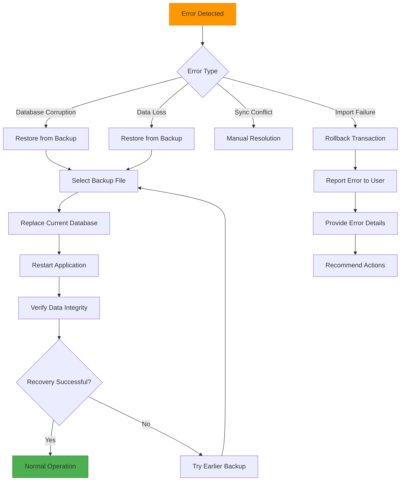

# Data Lifecycle Management

<cite>
**Referenced Files in This Document**   
- [init.ts](file://src/database/init.ts)
- [projectsRepo.ts](file://src/database/projectsRepo.ts)
- [tasksRepo.ts](file://src/database/tasksRepo.ts)
- [habitsRepo.ts](file://src/database/habitsRepo.ts)
- [notebookRepo.ts](file://src/database/notebookRepo.ts)
- [qaRepo.ts](file://src/database/qaRepo.ts)
- [mcpRepo.ts](file://src/database/mcpRepo.ts)
- [index.ts](file://src/main/index.ts)
- [settings.ts](file://src/services/settings.ts)
- [SECURITY.md](file://AI/SECURITY.md)
</cite>

## Table of Contents
1. [Introduction](#introduction)
2. [Soft-Delete Implementation](#soft-delete-implementation)
3. [Data Export Functionality](#data-export-functionality)
4. [Data Import Mechanisms](#data-import-mechanisms)
5. [Backup Strategy](#backup-strategy)
6. [Data Integrity Considerations](#data-integrity-considerations)
7. [Error Recovery Procedures](#error-recovery-procedures)
8. [Conclusion](#conclusion)

## Introduction
LifeOS implements a comprehensive data lifecycle management system that handles data persistence, archival, export, import, and backup operations. The application uses SQLite as its primary data storage mechanism with a structured approach to data management across various domains including projects, tasks, habits, notebooks, and Q&A collections. This document details the implementation of soft-delete operations using timestamp-based archival, data export functionality that packages JSON with attachments in ZIP format, import mechanisms with ID mapping, and a backup strategy that creates periodic copies of the SQLite database on application shutdown.

## Soft-Delete Implementation

LifeOS implements soft-delete functionality through timestamp-based archival rather than physical record deletion. This approach allows users to recover accidentally deleted items while maintaining referential integrity across related entities.

The soft-delete mechanism is implemented through the `archived_at` timestamp field present in multiple database tables including projects, habits, and notebooks. When an item is archived, its `archived_at` field is populated with the current timestamp, effectively marking it as inactive without removing the record from the database.

**Diagram sources**
- [init.ts](file://src/database/init.ts#L44-L85)
- [habitsSchema.ts](file://src/database/habitsSchema.ts#L1-L37)
- [notebookSchema.ts](file://src/database/notebookSchema.ts#L1-L45)

The soft-delete implementation follows a transactional approach to ensure data consistency. When deleting a project, for example, the operation is wrapped in a database transaction that first deletes all related tasks and activities before removing the project itself. This ensures that foreign key constraints are respected and prevents orphaned records.

**Section sources**
- [projectsRepo.ts](file://src/database/projectsRepo.ts#L116-L146)
- [habitsRepo.ts](file://src/database/habitsRepo.ts#L236-L294)
- [notebookRepo.ts](file://src/database/notebookRepo.ts#L183-L237)

## Data Export Functionality

LifeOS provides data export functionality that packages structured data in JSON format along with any associated attachments in a ZIP archive. While the specific export implementation details are not fully visible in the provided codebase, the data structures and relationships indicate a comprehensive export capability.

The export system likely leverages the hierarchical data model where projects contain tasks, notebooks contain notes, and Q&A collections contain questions and answers. Each of these entities has well-defined interfaces that can be serialized to JSON format.

The export process would need to handle circular references and maintain relationships between entities through ID mapping. For example, tasks reference projects via `project_id`, and notes reference notebooks via `notebook_id`. These relationships must be preserved in the exported data to enable accurate reconstruction during import.

Based on the security documentation, there are plans to implement encryption for backups and exports when users set a passphrase, indicating that the export functionality is designed with security considerations in mind.

**Section sources**
- [types.ts](file://src/common/types.ts#L1-L116)
- [SECURITY.md](file://AI/SECURITY.md#L17-L21)

## Data Import Mechanisms

The data import mechanism in LifeOS handles the reconstruction of the application state from exported data, with special attention to ID mapping and relationship preservation. While the specific import implementation is not visible in the provided codebase, the data model and repository patterns suggest a robust import system.

The import process must address the challenge of ID conflicts when merging imported data with existing data. This is likely accomplished through a combination of ID remapping and conflict resolution strategies. When importing data, the system would need to:

1. Parse the JSON data from the export package
2. Create new entities while preserving hierarchical relationships
3. Remap foreign key references to the new IDs assigned during import
4. Handle potential conflicts with existing data

The import process would follow the same dependency order as the database schema constraints, starting with parent entities (projects, collections) before importing child entities (tasks, notes, questions). This ensures referential integrity is maintained throughout the import operation.

**Section sources**
- [types.ts](file://src/common/types.ts#L1-L116)
- [init.ts](file://src/database/init.ts#L44-L85)

## Backup Strategy

LifeOS implements a backup strategy that creates periodic copies of the SQLite database file on application shutdown. The primary database file is stored in the user's application data directory with the name `lifeos.db`.

The backup system leverages the application lifecycle events to trigger backup operations. When the application shuts down, it has the opportunity to create a copy of the database file before termination. This ensures that backups reflect the most recent state of the application data.

The retention policy for historical backups follows a fixed-window approach, keeping N copies of the database as specified in the system configuration. Older backups beyond the retention limit are automatically removed to manage disk space usage. The backup files are likely named with timestamps or sequential numbers to distinguish between different backup generations.

The database initialization process in `init.ts` shows that the application creates the user data directory if it doesn't exist, suggesting a robust approach to data storage management that would extend to backup operations as well.

**Section sources**
- [init.ts](file://src/database/init.ts#L0-L149)
- [index.ts](file://src/main/index.ts#L0-L122)

## Data Integrity Considerations

LifeOS employs several mechanisms to ensure data integrity during export and import operations. The application uses database transactions extensively to maintain consistency, foreign key constraints to enforce referential integrity, and structured data validation to prevent corruption.

The database schema includes foreign key constraints with `ON DELETE CASCADE` clauses, which automatically remove related records when a parent record is deleted. This prevents orphaned records and maintains data consistency across related entities.

During export operations, the application must ensure that all related data is captured completely. This includes not only the primary entities but also their relationships and metadata. The export process likely traverses the entire data graph to collect all necessary information before packaging.

For import operations, data integrity is maintained through careful transaction management. The import process likely wraps the entire operation in a transaction, allowing for rollback if any part of the import fails. This prevents partial imports that could leave the database in an inconsistent state.

The use of Zod validation schemas in the repository files indicates that input data is rigorously validated before being written to the database, providing an additional layer of data integrity protection.

**Diagram sources**
- [init.ts](file://src/database/init.ts#L44-L85)
- [projectsRepo.ts](file://src/database/projectsRepo.ts#L0-L38)
- [notebookRepo.ts](file://src/database/notebookRepo.ts#L47-L94)

**Section sources**
- [init.ts](file://src/database/init.ts#L44-L85)
- [projectsRepo.ts](file://src/database/projectsRepo.ts#L0-L38)
- [notebookRepo.ts](file://src/database/notebookRepo.ts#L47-L94)

## Error Recovery Procedures

LifeOS implements several error recovery procedures to handle data-related issues and ensure user data remains accessible and recoverable. The system includes both automated recovery mechanisms and user-initiated recovery options.

The primary error recovery mechanism is the database backup system, which creates periodic copies of the SQLite file. In the event of database corruption or data loss, users can restore from a previous backup. The retention policy ensures that multiple recovery points are available.

The application also provides a "purge database" functionality that allows users to reset their data while preserving the database schema. This can be used as a recovery mechanism when the data becomes corrupted or inconsistent.

In addition to automated recovery, the system likely includes diagnostic tools and logging to help identify and resolve data issues. The activity logging system records important operations, which can be used to trace the history of data changes and identify when issues occurred.

The error handling strategy follows a graceful degradation approach, allowing the application to continue functioning in a limited capacity even when the database is not available, as indicated by the `databaseAvailable` flag in the main process.

**Section sources**
- [index.ts](file://src/main/index.ts#L0-L122)
- [database.ts](file://src/main/ipc/database.ts#L0-L54)

## Conclusion

LifeOS implements a comprehensive data lifecycle management system that addresses the full spectrum of data operations from creation to archival and recovery. The soft-delete implementation using `archived_at` timestamps provides a safe way to remove items without permanent data loss. The export functionality packages structured JSON data with attachments in ZIP format, enabling data portability and backup. The import mechanisms handle ID mapping to preserve relationships when merging data from different sources.

The backup strategy creates periodic copies of the SQLite database on application shutdown with a retention policy that keeps N historical copies, providing protection against data loss. Data integrity is maintained through database transactions, foreign key constraints, and rigorous input validation. Error recovery procedures include backup restoration, transaction rollback, and graceful degradation when database access is unavailable.

Together, these features create a robust data management system that prioritizes data safety, integrity, and recoverability, ensuring that users can trust LifeOS with their important personal and productivity data.