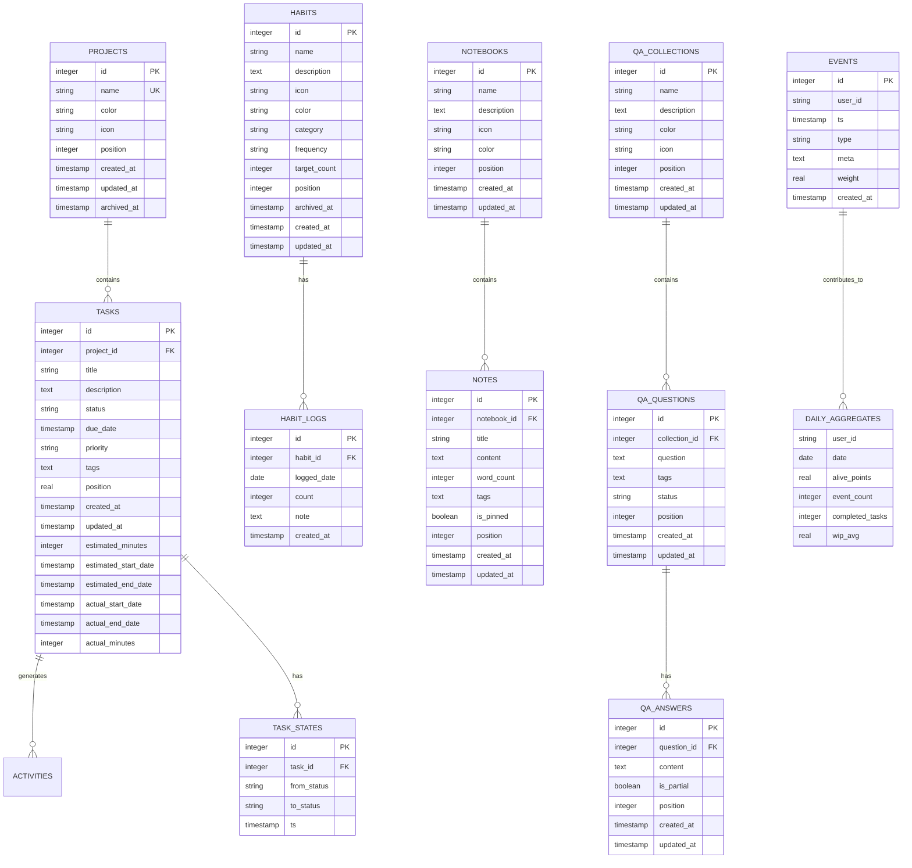

# Database Design

<cite>
**Referenced Files in This Document**   
- [init.ts](file://src/database/init.ts)
- [types.ts](file://src/database/types.ts)
- [mappers.ts](file://src/database/mappers.ts)
- [habitsSchema.ts](file://src/database/habitsSchema.ts)
- [notebookSchema.ts](file://src/database/notebookSchema.ts)
- [qaSchema.ts](file://src/database/qaSchema.ts)
- [metricsSchema.ts](file://src/database/metricsSchema.ts)
- [projectsRepo.ts](file://src/database/projectsRepo.ts)
- [tasksRepo.ts](file://src/database/tasksRepo.ts)
- [activitiesRepo.ts](file://src/database/activitiesRepo.ts)
- [habitsRepo.ts](file://src/database/habitsRepo.ts)
- [notebookRepo.ts](file://src/database/notebookRepo.ts)
- [qaRepo.ts](file://src/database/qaRepo.ts)
- [common/types.ts](file://src/common/types.ts)
</cite>

## Table of Contents
1. [Introduction](#introduction)
2. [Entity Relationship Model](#entity-relationship-model)
3. [Core Data Models](#core-data-models)
4. [Repository Pattern Implementation](#repository-pattern-implementation)
5. [Schema Migration Strategy](#schema-migration-strategy)
6. [Data Validation Rules](#data-validation-rules)
7. [Access Patterns and Performance](#access-patterns-and-performance)
8. [Sample Queries](#sample-queries)
9. [Conclusion](#conclusion)

## Introduction

The LifeOS application implements a comprehensive SQLite-based database schema to manage personal productivity data across multiple domains including projects, tasks, habits, notebook entries, Q&A collections, and activities. The database design follows a normalized relational model with proper foreign key constraints and indexing strategies to ensure data integrity and query performance. This documentation provides a detailed analysis of the database schema, entity relationships, repository pattern implementation, and performance considerations for the LifeOS application.

**Section sources**
- [init.ts](file://src/database/init.ts#L1-L143)
- [types.ts](file://src/database/types.ts#L1-L30)

## Entity Relationship Model

The LifeOS database schema consists of multiple interconnected entities that represent different aspects of personal productivity management. The core entities include projects, tasks, habits, notebooks, Q&A collections, and various supporting tables for metrics and events tracking.



**Diagram sources**
- [init.ts](file://src/database/init.ts#L45-L143)
- [habitsSchema.ts](file://src/database/habitsSchema.ts#L5-L38)
- [notebookSchema.ts](file://src/database/notebookSchema.ts#L15-L51)
- [qaSchema.ts](file://src/database/qaSchema.ts#L15-L71)
- [metricsSchema.ts](file://src/database/metricsSchema.ts#L15-L103)

## Core Data Models

### Projects and Tasks

The Projects and Tasks entities form the core of the task management system in LifeOS. Projects serve as containers for related tasks, enabling organization and prioritization of work.

#### Projects Table
- **id**: INTEGER PRIMARY KEY AUTOINCREMENT - Unique identifier for the project
- **name**: TEXT NOT NULL UNIQUE - Project name with uniqueness constraint
- **color**: TEXT - Optional color code for visual identification
- **icon**: TEXT - Optional icon identifier for visual representation
- **position**: INTEGER NOT NULL DEFAULT 0 - Sort order for display
- **created_at**: TEXT NOT NULL DEFAULT CURRENT_TIMESTAMP - Creation timestamp
- **updated_at**: TEXT NOT NULL DEFAULT CURRENT_TIMESTAMP - Last update timestamp
- **archived_at**: TEXT - Timestamp when project was archived (null if active)

#### Tasks Table
- **id**: INTEGER PRIMARY KEY AUTOINCREMENT - Unique identifier for the task
- **project_id**: INTEGER NOT NULL REFERENCES projects(id) ON DELETE CASCADE - Foreign key to parent project
- **title**: TEXT NOT NULL - Task title
- **description**: TEXT - Optional detailed description
- **status**: TEXT NOT NULL DEFAULT 'To-Do' - Current status (e.g., 'To-Do', 'In Progress', 'Done')
- **due_date**: TEXT - Optional due date in ISO format
- **priority**: TEXT - Optional priority level
- **tags**: TEXT - JSON-encoded array of tags
- **position**: REAL NOT NULL DEFAULT 0 - Position within project and status column
- **created_at**: TEXT NOT NULL DEFAULT CURRENT_TIMESTAMP - Creation timestamp
- **updated_at**: TEXT NOT NULL DEFAULT CURRENT_TIMESTAMP - Last update timestamp
- **estimated_minutes**: INTEGER - Estimated time to complete in minutes
- **estimated_start_date**: TEXT - Estimated start date
- **estimated_end_date**: TEXT - Estimated completion date
- **actual_start_date**: TEXT - Actual start date
- **actual_end_date**: TEXT - Actual completion date
- **actual_minutes**: INTEGER - Actual time spent in minutes

**Section sources**
- [init.ts](file://src/database/init.ts#L50-L88)
- [types.ts](file://src/database/types.ts#L1-L15)
- [mappers.ts](file://src/database/mappers.ts#L15-L25)
- [projectsRepo.ts](file://src/database/projectsRepo.ts#L1-L147)
- [tasksRepo.ts](file://src/database/tasksRepo.ts#L1-L210)

### Habits Tracking

The Habits module enables users to track recurring behaviors with detailed statistics and streak tracking.

#### Habits Table
- **id**: INTEGER PRIMARY KEY AUTOINCREMENT - Unique identifier
- **name**: TEXT NOT NULL - Habit name
- **description**: TEXT - Optional description
- **icon**: TEXT - Optional icon identifier
- **color**: TEXT - Optional color for visual identification
- **category**: TEXT - Optional categorization
- **frequency**: TEXT NOT NULL DEFAULT 'daily' - Recurrence pattern ('daily', 'weekly', 'monthly')
- **target_count**: INTEGER NOT NULL DEFAULT 1 - Target completions per period
- **position**: INTEGER NOT NULL DEFAULT 0 - Sort order
- **archived_at**: TEXT - Archive timestamp (null if active)
- **created_at**: TEXT NOT NULL DEFAULT CURRENT_TIMESTAMP - Creation timestamp
- **updated_at**: TEXT NOT NULL DEFAULT CURRENT_TIMESTAMP - Last update timestamp

#### Habit Logs Table
- **id**: INTEGER PRIMARY KEY AUTOINCREMENT - Unique identifier
- **habit_id**: INTEGER NOT NULL - Foreign key to habit
- **logged_date**: TEXT NOT NULL - Date when habit was performed (YYYY-MM-DD)
- **count**: INTEGER NOT NULL DEFAULT 1 - Number of completions on this date
- **note**: TEXT - Optional note about the log entry
- **created_at**: TEXT NOT NULL DEFAULT CURRENT_TIMESTAMP - Creation timestamp
- **UNIQUE(habit_id, logged_date)**: Prevents duplicate entries for the same habit on the same date

**Section sources**
- [habitsSchema.ts](file://src/database/habitsSchema.ts#L5-L38)
- [habitsRepo.ts](file://src/database/habitsRepo.ts#L1-L394)

### Notebook System

The Notebook module provides a flexible system for journaling and note-taking with organizational hierarchy.

#### Notebooks Table
- **id**: INTEGER PRIMARY KEY AUTOINCREMENT - Unique identifier
- **name**: TEXT NOT NULL - Notebook name
- **description**: TEXT - Optional description
- **icon**: TEXT - Optional icon identifier
- **color**: TEXT - Optional color for visual identification
- **position**: INTEGER NOT NULL DEFAULT 0 - Sort order
- **created_at**: TEXT NOT NULL DEFAULT CURRENT_TIMESTAMP - Creation timestamp
- **updated_at**: TEXT NOT NULL DEFAULT CURRENT_TIMESTAMP - Last update timestamp

#### Notes Table
- **id**: INTEGER PRIMARY KEY AUTOINCREMENT - Unique identifier
- **notebook_id**: INTEGER NOT NULL REFERENCES notebooks(id) ON DELETE CASCADE - Foreign key to parent notebook
- **title**: TEXT NOT NULL - Note title
- **content**: TEXT NOT NULL DEFAULT '' - Note content in Markdown format
- **word_count**: INTEGER NOT NULL DEFAULT 0 - Cached word count for performance
- **tags**: TEXT - JSON-encoded array of tags
- **is_pinned**: BOOLEAN NOT NULL DEFAULT 0 - Pin status for sorting
- **position**: INTEGER NOT NULL DEFAULT 0 - Sort order within notebook
- **created_at**: TEXT NOT NULL DEFAULT CURRENT_TIMESTAMP - Creation timestamp
- **updated_at**: TEXT NOT NULL DEFAULT CURRENT_TIMESTAMP - Last update timestamp

**Section sources**
- [notebookSchema.ts](file://src/database/notebookSchema.ts#L15-L51)
- [notebookRepo.ts](file://src/database/notebookRepo.ts#L1-L399)

### Q&A Collections

The Q&A module enables users to create question collections for knowledge management and learning.

#### QA Collections Table
- **id**: INTEGER PRIMARY KEY AUTOINCREMENT - Unique identifier
- **name**: TEXT NOT NULL - Collection name
- **description**: TEXT - Optional description
- **color**: TEXT - Optional color for visual identification
- **icon**: TEXT - Optional icon identifier
- **position**: INTEGER NOT NULL DEFAULT 0 - Sort order
- **created_at**: TEXT NOT NULL DEFAULT CURRENT_TIMESTAMP - Creation timestamp
- **updated_at**: TEXT NOT NULL DEFAULT CURRENT_TIMESTAMP - Last update timestamp

#### QA Questions Table
- **id**: INTEGER PRIMARY KEY AUTOINCREMENT - Unique identifier
- **collection_id**: INTEGER NOT NULL REFERENCES qa_collections(id) ON DELETE CASCADE - Foreign key to parent collection
- **question**: TEXT NOT NULL - The question text
- **tags**: TEXT - JSON-encoded array of tags
- **status**: TEXT NOT NULL DEFAULT 'unanswered' - Current status ('unanswered', 'in_progress', 'answered')
- **position**: INTEGER NOT NULL DEFAULT 0 - Sort order within collection
- **created_at**: TEXT NOT NULL DEFAULT CURRENT_TIMESTAMP - Creation timestamp
- **updated_at**: TEXT NOT NULL DEFAULT CURRENT_TIMESTAMP - Last update timestamp

#### QA Answers Table
- **id**: INTEGER PRIMARY KEY AUTOINCREMENT - Unique identifier
- **question_id**: INTEGER NOT NULL REFERENCES qa_questions(id) ON DELETE CASCADE - Foreign key to parent question
- **content**: TEXT NOT NULL - Answer content in Markdown format
- **is_partial**: BOOLEAN NOT NULL DEFAULT 1 - Whether the answer is complete (0) or partial (1)
- **position**: INTEGER NOT NULL DEFAULT 0 - Sort order within question
- **created_at**: TEXT NOT NULL DEFAULT CURRENT_TIMESTAMP - Creation timestamp
- **updated_at**: TEXT NOT NULL DEFAULT CURRENT_TIMESTAMP - Last update timestamp

**Section sources**
- [qaSchema.ts](file://src/database/qaSchema.ts#L15-L71)
- [qaRepo.ts](file://src/database/qaRepo.ts#L1-L539)

### Metrics and Events

The Metrics system tracks user engagement and productivity through event logging and daily aggregations.

#### Events Table
- **id**: INTEGER PRIMARY KEY AUTOINCREMENT - Unique identifier
- **user_id**: TEXT NOT NULL DEFAULT 'default' - User identifier (supports multi-user in future)
- **ts**: TEXT NOT NULL - Event timestamp
- **type**: TEXT NOT NULL - Event type (e.g., 'task_started', 'habit_logged')
- **meta**: TEXT - JSON-encoded metadata
- **weight**: REAL NOT NULL DEFAULT 1.0 - Involvement weight
- **created_at**: TEXT NOT NULL DEFAULT CURRENT_TIMESTAMP - Creation timestamp

#### Task States Table
- **id**: INTEGER PRIMARY KEY AUTOINCREMENT - Unique identifier
- **task_id**: INTEGER NOT NULL REFERENCES tasks(id) ON DELETE CASCADE - Foreign key to task
- **from_status**: TEXT - Previous status (null for creation)
- **to_status**: TEXT NOT NULL - New status
- **ts**: TEXT NOT NULL DEFAULT CURRENT_TIMESTAMP - Timestamp of state change

#### Metrics Config Table
- **user_id**: TEXT PRIMARY KEY DEFAULT 'default' - User identifier
- **k_a**: REAL NOT NULL DEFAULT 50.0 - Aliveness coefficient
- **t_target**: REAL NOT NULL DEFAULT 1.0 - Target time coefficient
- **ct_target_days**: REAL NOT NULL DEFAULT 2.0 - Cycle time target in days
- **wip_limit**: INTEGER NOT NULL DEFAULT 3 - Work-in-progress limit
- **h_a_days**: REAL NOT NULL DEFAULT 7.0 - Aliveness half-life in days
- **h_e_days**: REAL NOT NULL DEFAULT 14.0 - Efficiency half-life in days
- **window_days**: INTEGER NOT NULL DEFAULT 14 - Analysis window in days
- **updated_at**: TEXT NOT NULL DEFAULT CURRENT_TIMESTAMP - Last update timestamp

#### Daily Aggregates Table
- **user_id**: TEXT NOT NULL DEFAULT 'default' - User identifier
- **date**: TEXT NOT NULL - Date in YYYY-MM-DD format
- **alive_points**: REAL NOT NULL DEFAULT 0.0 - Daily aliveness score
- **event_count**: INTEGER NOT NULL DEFAULT 0 - Count of events
- **completed_tasks**: INTEGER NOT NULL DEFAULT 0 - Count of completed tasks
- **wip_avg**: REAL NOT NULL DEFAULT 0.0 - Average work-in-progress
- **PRIMARY KEY (user_id, date)**: Unique constraint on user and date

**Section sources**
- [metricsSchema.ts](file://src/database/metricsSchema.ts#L15-L103)
- [eventsRepo.ts](file://src/database/eventsRepo.ts#L1-L139)

## Repository Pattern Implementation

The LifeOS application implements the Repository pattern to abstract database operations and provide a clean API for data access. Each entity has a corresponding repository that encapsulates CRUD operations and business logic.

### Repository Structure

The repository pattern in LifeOS follows these principles:
- **Separation of Concerns**: Database operations are separated from business logic and UI components
- **Type Safety**: Repositories use TypeScript interfaces to ensure type safety
- **Validation**: Input validation is performed using Zod schemas
- **Transaction Safety**: Operations that affect multiple tables use database transactions
- **Error Handling**: Comprehensive error handling with meaningful error messages

```mermaid
classDiagram
class Repository {
<<interface>>
+list() : T[]
+get(id : number) : T | null
+create(input : CreateInput) : T
+update(input : UpdateInput) : T
+delete(id : number) : void
}
class ProjectsRepository {
+listProjects(options : { includeArchived? : boolean }) : Project[]
+createProject(input : CreateProjectInput) : Project
+updateProject(input : UpdateProjectInput) : Project
+reorderProjects(order : Array<{ id : number; position : number }>) : void
+deleteProject(id : number) : void
}
class TasksRepository {
+listTasksByProject(projectId : number) : Task[]
+createTask(input : CreateTaskInput) : Task
+updateTask(input : UpdateTaskInput) : Task
+moveTask(input : MoveTaskInput) : Task
}
class HabitsRepository {
+listHabits(options : { includeArchived? : boolean }) : HabitWithStats[]
+createHabit(input : CreateHabitInput) : Habit
+updateHabit(input : UpdateHabitInput) : Habit
+logHabit(input : LogHabitInput) : HabitLog
+unlogHabit(habitId : number, loggedDate : string) : void
}
class NotebookRepository {
+listNotebooks() : Notebook[]
+createNotebook(input : CreateNotebookInput) : Notebook
+updateNotebook(input : UpdateNotebookInput) : Notebook
+listNotesByNotebook(notebookId : number) : Note[]
+createNote(input : CreateNoteInput) : Note
+updateNote(input : UpdateNoteInput) : Note
+searchNotes(query : string) : Note[]
}
class QARepository {
+listCollections() : QACollection[]
+createCollection(input : CreateCollectionInput) : QACollection
+updateCollection(input : UpdateCollectionInput) : QACollection
+listQuestionsByCollection(collectionId : number) : QAQuestion[]
+createQuestion(input : CreateQuestionInput) : QAQuestion
+updateQuestion(input : UpdateQuestionInput) : QAQuestion
+listAnswersByQuestion(questionId : number) : QAAnswer[]
+createAnswer(input : CreateAnswerInput) : QAAnswer
+updateAnswer(input : UpdateAnswerInput) : QAAnswer
}
Repository <|.. ProjectsRepository
Repository <|.. TasksRepository
Repository <|.. HabitsRepository
Repository <|.. NotebookRepository
Repository <|.. QARepository
```

**Diagram sources**
- [projectsRepo.ts](file://src/database/projectsRepo.ts#L1-L147)
- [tasksRepo.ts](file://src/database/tasksRepo.ts#L1-L210)
- [habitsRepo.ts](file://src/database/habitsRepo.ts#L1-L394)
- [notebookRepo.ts](file://src/database/notebookRepo.ts#L1-L399)
- [qaRepo.ts](file://src/database/qaRepo.ts#L1-L539)

### Key Implementation Features

#### Input Validation
All repository methods use Zod schemas to validate input parameters, ensuring data integrity:

```typescript
const createProjectSchema = z.object({
  name: z.string().min(1).max(120),
  color: z.string().max(20).optional().nullable(),
  icon: z.string().max(30).optional().nullable()
});
```

This approach provides:
- **Runtime validation**: Ensures data conforms to expected formats
- **Type inference**: Automatically generates TypeScript types from schemas
- **Comprehensive error messages**: Detailed validation errors for debugging

#### Data Mapping
Repositories use mapper functions to transform database rows into domain objects:

```typescript
export function mapProject(row: ProjectRow): Project {
  return {
    id: row.id,
    name: row.name,
    color: row.color ?? undefined,
    icon: row.icon ?? undefined,
    position: row.position,
    createdAt: row.created_at,
    updatedAt: row.updated_at
  };
}
```

Benefits include:
- **Abstraction**: Hides database-specific details from the rest of the application
- **Flexibility**: Allows schema changes without affecting higher-level code
- **Consistency**: Ensures uniform data representation across the application

#### Transaction Management
Critical operations that affect multiple tables use database transactions to ensure atomicity:

```typescript
export function deleteProject(id: number): void {
  const transaction = db.transaction(() => {
    db.prepare('DELETE FROM tasks WHERE project_id = ?').run(id);
    db.prepare('DELETE FROM activities WHERE entity_type = ? AND entity_id = ?').run('project', id);
    db.prepare('DELETE FROM projects WHERE id = ?').run(id);
  });
  transaction();
}
```

This ensures:
- **Data consistency**: All related data is updated or none is updated
- **Error recovery**: Failed operations are rolled back automatically
- **Performance**: Multiple operations are executed as a single unit

**Section sources**
- [mappers.ts](file://src/database/mappers.ts#L1-L53)
- [projectsRepo.ts](file://src/database/projectsRepo.ts#L1-L147)
- [tasksRepo.ts](file://src/database/tasksRepo.ts#L1-L210)
- [habitsRepo.ts](file://src/database/habitsRepo.ts#L1-L394)

## Schema Migration Strategy

The LifeOS application implements a robust schema migration strategy to handle database schema changes across versions.

### Initial Schema Creation
The database schema is created and initialized in the `init.ts` file, which contains the core database initialization logic:

```typescript
function runMigrations(database: Database) {
  database.exec(`CREATE TABLE IF NOT EXISTS projects (...)`);
  database.exec(`CREATE TABLE IF NOT EXISTS tasks (...)`);
  // ... other table creations
}
```

Key features of the migration strategy:
- **Idempotent operations**: Uses `CREATE TABLE IF NOT EXISTS` to prevent errors on subsequent runs
- **Incremental changes**: Schema changes are applied incrementally through ALTER statements
- **Error tolerance**: Migration steps are wrapped in try-catch blocks to handle cases where changes have already been applied

### Field Addition Pattern
When new fields are added to existing tables, they are added using ALTER statements with error handling:

```typescript
try {
  database.exec('ALTER TABLE tasks ADD COLUMN estimated_minutes INTEGER;');
} catch (e) { /* Column already exists */ }
```

This pattern ensures:
- **Backward compatibility**: Older versions of the application can still read the database
- **Forward compatibility**: New versions can add fields without breaking existing data
- **Robustness**: The application can handle cases where migrations have already been applied

### Modular Schema Definition
Complex schema components are defined in separate modules and applied through dedicated functions:

```typescript
// Apply modular schemas
applyMetricsSchema(database);
applyQASchema(database);
applyNotebookSchema(database);
applyHabitsSchema(database);
```

Benefits include:
- **Organization**: Related schema elements are grouped together
- **Reusability**: Schema components can be tested and maintained independently
- **Clarity**: The main migration function remains readable and focused

### Foreign Key Enforcement
The application enables foreign key constraints to maintain referential integrity:

```typescript
function applyPragma(database: Database) {
  database.pragma('foreign_keys = ON');
}
```

This ensures:
- **Data consistency**: Prevents orphaned records and invalid references
- **Cascade deletion**: Related records are automatically cleaned up when parents are deleted
- **Integrity checks**: The database validates relationships on every operation

**Section sources**
- [init.ts](file://src/database/init.ts#L45-L143)
- [habitsSchema.ts](file://src/database/habitsSchema.ts#L5-L38)
- [notebookSchema.ts](file://src/database/notebookSchema.ts#L15-L51)

## Data Validation Rules

The LifeOS application implements comprehensive data validation at multiple levels to ensure data quality and integrity.

### Schema-Level Constraints
The database schema includes various constraints to enforce data rules:

- **Primary keys**: Every table has a primary key for unique identification
- **Foreign keys**: Relationships between tables are enforced with foreign key constraints
- **NOT NULL**: Critical fields are marked as NOT NULL to prevent missing data
- **UNIQUE**: Fields that must be unique (like project names) have unique constraints
- **DEFAULT values**: Fields have sensible default values to reduce input burden

### Application-Level Validation
Repositories use Zod schemas to validate input before database operations:

```typescript
const createTaskSchema = z.object({
  projectId: z.number().int().positive(),
  title: z.string().min(1).max(200),
  description: z.string().max(4000).optional(),
  status: z.string().min(1).max(50).default('To-Do'),
  dueDate: z.string().datetime().optional(),
  priority: z.string().max(50).optional(),
  tags: z.array(z.string().max(30)).optional(),
  position: z.number().optional()
});
```

Validation rules include:
- **Type checking**: Ensures correct data types
- **Length limits**: Prevents excessively long values
- **Range constraints**: Ensures numeric values are within acceptable ranges
- **Format validation**: Validates date formats and other structured data

### Business Logic Validation
Repositories implement business rules that go beyond simple data validation:

- **Position management**: Automatically assigns positions when not specified
- **Status transitions**: Validates task state changes and records transitions
- **Unique constraints**: Enforces application-level uniqueness beyond database constraints
- **Archival rules**: Handles soft deletion through archived_at timestamps

### Data Transformation
The application transforms data as needed for storage and retrieval:

- **JSON serialization**: Arrays (like tags) are stored as JSON strings
- **Null handling**: Database nulls are converted to undefined for TypeScript compatibility
- **Date formatting**: Dates are stored in ISO format for consistency
- **Case normalization**: Text is trimmed and normalized before storage

**Section sources**
- [projectsRepo.ts](file://src/database/projectsRepo.ts#L1-L147)
- [tasksRepo.ts](file://src/database/tasksRepo.ts#L1-L210)
- [habitsRepo.ts](file://src/database/habitsRepo.ts#L1-L394)
- [notebookRepo.ts](file://src/database/notebookRepo.ts#L1-L399)
- [qaRepo.ts](file://src/database/qaRepo.ts#L1-L539)

## Access Patterns and Performance

The LifeOS database is optimized for common access patterns with appropriate indexing and query strategies.

### Indexing Strategy
The database includes carefully selected indexes to optimize query performance:

```sql
-- Projects
CREATE INDEX IF NOT EXISTS idx_projects_position ON projects(position);

-- Tasks
CREATE INDEX IF NOT EXISTS idx_tasks_project_status ON tasks(project_id, status);
CREATE INDEX IF NOT EXISTS idx_tasks_due_date ON tasks(due_date);

-- Activities
CREATE INDEX IF NOT EXISTS idx_activities_created_at ON activities(created_at DESC);
CREATE INDEX IF NOT EXISTS idx_activities_type ON activities(type);

-- Habits
CREATE INDEX IF NOT EXISTS idx_habits_position ON habits(position);
CREATE INDEX IF NOT EXISTS idx_habit_logs_habit ON habit_logs(habit_id, logged_date DESC);

-- Notebook
CREATE INDEX IF NOT EXISTS idx_notebooks_position ON notebooks(position);
CREATE INDEX IF NOT EXISTS idx_notes_notebook ON notes(notebook_id, position DESC);

-- Q&A
CREATE INDEX IF NOT EXISTS idx_qa_collections_position ON qa_collections(position);
CREATE INDEX IF NOT EXISTS idx_qa_questions_collection ON qa_questions(collection_id, position);
```

Indexing decisions are based on:
- **Query patterns**: Indexes support the most common query filters and sorts
- **Composite indexes**: Multi-column indexes support queries with multiple conditions
- **Sort optimization**: Indexes are ordered to support common sort orders
- **Covering indexes**: Where possible, indexes include all columns needed for queries

### Query Optimization
Repositories implement optimized queries for common operations:

- **Batch operations**: Related data is fetched in single queries with JOINs
- **Pagination**: Large result sets are limited to prevent performance issues
- **Projection**: Only required fields are selected
- **Parameterized queries**: Prevents SQL injection and improves query plan caching

### Performance Considerations for SQLite
The application addresses SQLite-specific performance considerations:

- **Transaction batching**: Multiple operations are grouped in transactions
- **Connection management**: A single database connection is reused
- **Memory configuration**: SQLite pragmas are used to optimize memory usage
- **Query planning**: Indexes are designed to help SQLite choose optimal query plans

### Caching Strategies
The application implements caching at multiple levels:

- **Calculated fields**: Word counts are stored rather than calculated on read
- **Aggregated data**: Daily metrics are pre-computed and stored
- **In-memory caching**: Frequently accessed data may be cached in memory
- **Result caching**: Repository methods may cache results for repeated calls

**Section sources**
- [init.ts](file://src/database/init.ts#L90-L143)
- [habitsSchema.ts](file://src/database/habitsSchema.ts#L30-L38)
- [notebookSchema.ts](file://src/database/notebookSchema.ts#L40-L51)
- [qaSchema.ts](file://src/database/qaSchema.ts#L60-L71)
- [metricsSchema.ts](file://src/database/metricsSchema.ts#L90-L103)

## Sample Queries

The following sample queries demonstrate common operations in the LifeOS database:

### Project and Task Management

```sql
-- Get all active projects with their tasks
SELECT p.id, p.name, p.color, p.icon, 
       t.id as task_id, t.title, t.status, t.due_date
FROM projects p
LEFT JOIN tasks t ON t.project_id = p.id
WHERE p.archived_at IS NULL
ORDER BY p.position, t.status, t.position;

-- Get tasks due today or overdue
SELECT * FROM tasks 
WHERE due_date <= date('now') 
  AND status != 'Done'
ORDER BY due_date, priority DESC;

-- Get project statistics
SELECT 
  p.name,
  COUNT(t.id) as total_tasks,
  COUNT(CASE WHEN t.status = 'Done' THEN 1 END) as completed_tasks,
  AVG(julianday(t.actual_end_date) - julianday(t.actual_start_date)) as avg_completion_days
FROM projects p
LEFT JOIN tasks t ON t.project_id = p.id
GROUP BY p.id, p.name;
```

### Habits Tracking

```sql
-- Get all habits with their completion status for today
SELECT h.*, 
       CASE WHEN hl.logged_date = date('now') THEN 1 ELSE 0 END as completed_today,
       hl.count as today_count
FROM habits h
LEFT JOIN habit_logs hl ON hl.habit_id = h.id AND hl.logged_date = date('now')
WHERE h.archived_at IS NULL
ORDER BY h.position;

-- Get habit streak statistics
SELECT 
  h.name,
  h.frequency,
  h.target_count,
  COUNT(hl.id) as logs_count,
  MAX(hl.logged_date) as last_logged,
  -- Current streak calculation would be done in application code
  -- but this query provides the raw data needed
  GROUP_CONCAT(hl.logged_date) as all_dates
FROM habits h
LEFT JOIN habit_logs hl ON hl.habit_id = h.id
WHERE h.archived_at IS NULL
GROUP BY h.id, h.name, h.frequency, h.target_count
ORDER BY h.position;
```

### Notebook System

```sql
-- Get all notebooks with note counts
SELECT n.id, n.name, n.icon, n.color,
       COUNT(nt.id) as note_count,
       SUM(nt.word_count) as total_words
FROM notebooks n
LEFT JOIN notes nt ON nt.notebook_id = n.id
GROUP BY n.id, n.name, n.icon, n.color
ORDER BY n.position;

-- Search notes by content
SELECT n.id, n.title, n.content, n.created_at, n.updated_at,
       nb.name as notebook_name
FROM notes n
JOIN notebooks nb ON nb.id = n.notebook_id
WHERE n.title LIKE '%search term%' 
   OR n.content LIKE '%search term%'
ORDER BY n.updated_at DESC
LIMIT 50;
```

### Q&A Collections

```sql
-- Get all collections with question counts and completion status
SELECT c.id, c.name, c.icon, c.color,
       COUNT(q.id) as total_questions,
       COUNT(CASE WHEN q.status = 'answered' THEN 1 END) as answered_questions,
       COUNT(CASE WHEN q.status = 'in_progress' THEN 1 END) as in_progress_questions
FROM qa_collections c
LEFT JOIN qa_questions q ON q.collection_id = c.id
GROUP BY c.id, c.name, c.icon, c.color
ORDER BY c.position;

-- Get questions with their answers
SELECT 
  q.id, q.question, q.status,
  c.name as collection_name,
  GROUP_CONCAT(a.content, '\n---\n') as all_answers,
  COUNT(a.id) as answer_count
FROM qa_questions q
JOIN qa_collections c ON c.id = q.collection_id
LEFT JOIN qa_answers a ON a.question_id = q.id
GROUP BY q.id, q.question, q.status, c.name
ORDER BY q.position;
```

### Metrics and Analytics

```sql
-- Get daily activity summary
SELECT 
  date(created_at) as activity_date,
  COUNT(*) as total_activities,
  COUNT(CASE WHEN type = 'task_completed' THEN 1 END) as tasks_completed,
  COUNT(CASE WHEN type = 'habit_logged' THEN 1 END) as habits_logged
FROM activities
GROUP BY date(created_at)
ORDER BY activity_date DESC
LIMIT 30;

-- Get task cycle time statistics
SELECT 
  t.title,
  t.status,
  MIN(ts.ts) as first_started,
  MAX(ts.ts) as last_updated,
  julianday(MAX(ts.ts)) - julianday(MIN(ts.ts)) as total_cycle_days
FROM tasks t
JOIN task_states ts ON ts.task_id = t.id
WHERE t.status = 'Done'
GROUP BY t.id, t.title, t.status
ORDER BY total_cycle_days DESC;
```

**Section sources**
- [init.ts](file://src/database/init.ts#L45-L143)
- [projectsRepo.ts](file://src/database/projectsRepo.ts#L1-L147)
- [tasksRepo.ts](file://src/database/tasksRepo.ts#L1-L210)
- [habitsRepo.ts](file://src/database/habitsRepo.ts#L1-L394)
- [notebookRepo.ts](file://src/database/notebookRepo.ts#L1-L399)
- [qaRepo.ts](file://src/database/qaRepo.ts#L1-L539)

## Conclusion

The LifeOS database design demonstrates a well-structured approach to personal productivity data management. The schema effectively models the core entities of projects, tasks, habits, notebooks, and Q&A collections with appropriate relationships and constraints. The implementation of the repository pattern provides a clean abstraction layer that separates data access logic from business logic and UI components.

Key strengths of the design include:
- **Comprehensive entity modeling**: All major productivity domains are represented with appropriate fields and relationships
- **Robust data integrity**: Foreign key constraints, unique constraints, and validation rules ensure data quality
- **Performance optimization**: Strategic indexing and query optimization support efficient data access
- **Extensibility**: The modular schema design and migration strategy allow for future enhancements
- **Analytics readiness**: The metrics and events system provides a foundation for productivity insights

The database design successfully balances normalization for data integrity with denormalization for performance, particularly in areas like word count caching and daily aggregations. The use of SQLite as the underlying database engine is well-suited to the desktop application context, providing a lightweight, file-based solution that requires no external dependencies.

Future considerations might include:
- **Backup and recovery**: Implementing regular database backups
- **Data export**: Providing options to export data in standard formats
- **Synchronization**: Adding support for cloud synchronization across devices
- **Advanced analytics**: Building more sophisticated reporting and visualization tools

Overall, the LifeOS database design provides a solid foundation for a comprehensive personal productivity system.

**Section sources**
- [init.ts](file://src/database/init.ts#L1-L143)
- [types.ts](file://src/database/types.ts#L1-L30)
- [mappers.ts](file://src/database/mappers.ts#L1-L53)