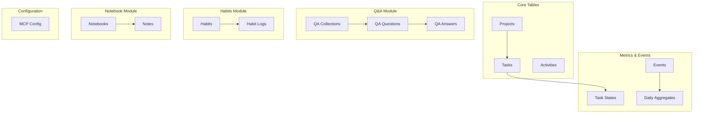
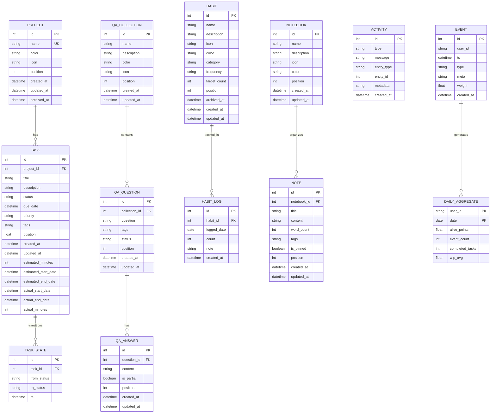

# Entity Relationships

<cite>
**Referenced Files in This Document**
- [mappers.ts](file://src/database/mappers.ts)
- [types.ts](file://src/database/types.ts)
- [init.ts](file://src/database/init.ts)
- [projectsRepo.ts](file://src/database/projectsRepo.ts)
- [tasksRepo.ts](file://src/database/tasksRepo.ts)
- [qaRepo.ts](file://src/database/qaRepo.ts)
- [qaSchema.ts](file://src/database/qaSchema.ts)
- [habitsRepo.ts](file://src/database/habitsRepo.ts)
- [habitsSchema.ts](file://src/database/habitsSchema.ts)
- [notebookRepo.ts](file://src/database/notebookRepo.ts)
- [notebookSchema.ts](file://src/database/notebookSchema.ts)
- [metricsSchema.ts](file://src/database/metricsSchema.ts)
- [eventsRepo.ts](file://src/database/eventsRepo.ts)
- [projectsController.ts](file://src/server/controllers/projectsController.ts)
- [qaController.ts](file://src/server/controllers/qaController.ts)
</cite>

## Table of Contents
1. [Introduction](#introduction)
2. [Database Schema Overview](#database-schema-overview)
3. [Core Entity Relationships](#core-entity-relationships)
4. [Foreign Key Constraints and Referential Integrity](#foreign-key-constraints-and-referential-integrity)
5. [Entity Relationship Diagram](#entity-relationship-diagram)
6. [JOIN Queries and Data Transformations](#join-queries-and-data-transformations)
7. [Mapper Functions and Domain Object Transformation](#mapper-functions-and-domain-object-transformation)
8. [Cascading Behaviors](#cascading-behaviors)
9. [Performance Considerations](#performance-considerations)
10. [Conclusion](#conclusion)

## Introduction

LifeOS implements a comprehensive relational database model built on SQLite that manages four primary domains: Projects and Tasks, Question-Answer (Q&A) collections, Habit tracking, and Notebook/Diary entries. The entity relationship model demonstrates sophisticated referential integrity with cascading behaviors, supporting complex queries through JOIN operations, and maintaining data consistency across multiple interconnected modules.

The database schema follows ACID principles with foreign key constraints, triggers for maintaining derived statistics, and careful indexing strategies for optimal query performance. Each module maintains its own specialized entities while sharing common infrastructure for events, metrics, and activities.

## Database Schema Overview

LifeOS uses a modular database schema approach where each functional domain defines its own tables and relationships. The schema initialization process applies migrations sequentially, ensuring proper table creation order and constraint establishment.



**Section sources**
- [init.ts](file://src/database/init.ts#L40-L143)
- [qaSchema.ts](file://src/database/qaSchema.ts#L10-L71)
- [habitsSchema.ts](file://src/database/habitsSchema.ts#L3-L38)
- [notebookSchema.ts](file://src/database/notebookSchema.ts#L15-L51)

## Core Entity Relationships

### Projects and Tasks Relationship

The Projects and Tasks relationship forms the foundation of LifeOS's task management system. Each project serves as a container for multiple tasks, with a one-to-many relationship established through the `project_id` foreign key.

**Key Relationship Properties:**
- **Cardinality**: One project can have zero or many tasks
- **Cascade Behavior**: Deleting a project automatically deletes all associated tasks
- **Position Management**: Both entities support ordered positioning for user interface organization
- **Archival Support**: Projects can be archived without losing task data

**Referential Integrity Rules:**
- `tasks.project_id` references `projects.id`
- `ON DELETE CASCADE` ensures automatic cleanup of orphaned tasks
- Position values are managed independently for each entity type

### Q&A Collection Structure

The Q&A module implements a hierarchical three-tier structure with cascading relationships:

**Entity Hierarchy:**
1. **Collections** (QA Collections) - Top-level containers for organizing questions
2. **Questions** - Individual questions within collections
3. **Answers** - Multiple answers per question, supporting partial and complete responses

**Relationship Specifications:**
- **Collections to Questions**: One-to-many relationship with cascade deletion
- **Questions to Answers**: One-to-many relationship with cascade deletion
- **Status Tracking**: Questions maintain status based on answer completeness
- **Tagging System**: Questions support tag-based categorization

### Habit Tracking System

The habits module implements a temporal tracking system with daily logging capabilities:

**Entity Structure:**
- **Habits**: Individual habit definitions with frequency and target configurations
- **Habit Logs**: Daily records of habit completions with counting support

**Temporal Relationship:**
- **Habit to Log**: One-to-many relationship with daily granularity
- **Uniqueness Constraint**: `(habit_id, logged_date)` ensures single daily entry
- **Streak Calculation**: Historical data enables current and longest streak tracking

### Notebook Organization

The notebook system provides hierarchical content organization:

**Content Structure:**
- **Notebooks**: Collections for organizing notes
- **Notes**: Individual entries within notebooks
- **Word Count Tracking**: Automatic content analysis for productivity metrics

**Relationship Characteristics:**
- **Notebook to Notes**: One-to-many relationship with cascade deletion
- **Position Ordering**: Supports drag-and-drop reordering
- **Pinning System**: Notes can be pinned for priority display

**Section sources**
- [projectsRepo.ts](file://src/database/projectsRepo.ts#L1-L147)
- [tasksRepo.ts](file://src/database/tasksRepo.ts#L1-L210)
- [qaRepo.ts](file://src/database/qaRepo.ts#L1-L539)
- [habitsRepo.ts](file://src/database/habitsRepo.ts#L1-L394)
- [notebookRepo.ts](file://src/database/notebookRepo.ts#L1-L399)

## Foreign Key Constraints and Referential Integrity

LifeOS implements comprehensive referential integrity through carefully designed foreign key constraints that maintain data consistency across all modules.

### Constraint Implementation Details

**Primary Constraints:**
```sql
-- Projects to Tasks relationship
FOREIGN KEY (project_id) REFERENCES projects(id) ON DELETE CASCADE

-- QA Questions to Collections relationship  
FOREIGN KEY (collection_id) REFERENCES qa_collections(id) ON DELETE CASCADE

-- QA Answers to Questions relationship
FOREIGN KEY (question_id) REFERENCES qa_questions(id) ON DELETE CASCADE

-- Habit Logs to Habits relationship
FOREIGN KEY (habit_id) REFERENCES habits(id) ON DELETE CASCADE

-- Notes to Notebooks relationship
FOREIGN KEY (notebook_id) REFERENCES notebooks(id) ON DELETE CASCADE
```

**Unique Constraints:**
- **Habit Logs**: `(habit_id, logged_date)` prevents duplicate daily entries
- **MCP Configuration**: Single record enforcement via `id = 1` constraint

### Referential Integrity Validation

The database enforces referential integrity through several mechanisms:

**Constraint Types:**
- **CASCADE**: Automatic deletion propagation
- **RESTRICT**: Prevention of orphaned records
- **SET NULL**: Nullification of foreign key references
- **NO ACTION**: Deferred constraint checking

**Validation Patterns:**
- **Pre-insertion**: Foreign key existence verification
- **Pre-update**: Reference validity maintenance
- **Pre-delete**: Orphan prevention and cascade triggering

**Section sources**
- [init.ts](file://src/database/init.ts#L40-L143)
- [qaSchema.ts](file://src/database/qaSchema.ts#L25-L45)
- [habitsSchema.ts](file://src/database/habitsSchema.ts#L20-L30)
- [notebookSchema.ts](file://src/database/notebookSchema.ts#L35-L45)

## Entity Relationship Diagram



**Diagram sources**
- [init.ts](file://src/database/init.ts#L40-L143)
- [qaSchema.ts](file://src/database/qaSchema.ts#L10-L71)
- [habitsSchema.ts](file://src/database/habitsSchema.ts#L3-L38)
- [notebookSchema.ts](file://src/database/notebookSchema.ts#L15-L51)

## JOIN Queries and Data Transformations

LifeOS employs sophisticated JOIN operations to provide rich, aggregated data views across multiple entities. These queries demonstrate the relational model's power in delivering comprehensive insights.

### Projects with Task Statistics

The projects controller implements complex aggregation queries to provide project-level analytics:

**Query Structure:**
```sql
SELECT
  COUNT(*) as task_count,
  SUM(CASE WHEN status = 'Completed' THEN 1 ELSE 0 END) as completed_count,
  SUM(COALESCE(estimated_minutes, 0)) as total_estimated_minutes,
  SUM(COALESCE(actual_minutes, 0)) as total_actual_minutes
FROM tasks
WHERE project_id = ?
```

**Aggregation Results:**
- **Task Completion Rate**: Calculated as `completed_count / task_count * 100`
- **Time Tracking**: Summarizes estimated vs. actual time investment
- **Performance Metrics**: Enables productivity analysis across projects

### Q&A Collection Statistics

The Q&A module uses LEFT JOIN operations to aggregate question and answer counts:

**Statistical Query:**
```sql
SELECT 
  q.*,
  COUNT(DISTINCT a.id) as answer_count,
  COUNT(DISTINCT CASE WHEN a.is_partial = 1 THEN a.id END) as partial_answer_count
FROM qa_questions q
LEFT JOIN qa_answers a ON a.question_id = q.id
WHERE q.collection_id = ?
GROUP BY q.id
```

**Status Calculation Logic:**
- **UNANSWERED**: No answers exist
- **IN_PROGRESS**: At least one partial answer
- **ANSWERED**: At least one complete answer

### Habit Streak Calculation

Habit tracking implements complex temporal analysis through self-joins and date calculations:

**Streak Analysis Query:**
```sql
SELECT logged_date 
FROM habit_logs 
WHERE habit_id = ? 
ORDER BY logged_date DESC
```

**Algorithm Implementation:**
- **Current Streak**: Consecutive days from most recent log
- **Longest Streak**: Maximum consecutive day sequence
- **Completion Rate**: Percentage of target completions over period

### Notebook Content Aggregation

Notebook operations combine filtering and ordering for content management:

**Note Listing Query:**
```sql
SELECT * FROM notes
WHERE notebook_id = ?
ORDER BY is_pinned DESC, created_at DESC
```

**Search Functionality:**
```sql
SELECT * FROM notes
WHERE title LIKE ? OR content LIKE ?
ORDER BY updated_at DESC
LIMIT 50
```

**Section sources**
- [projectsController.ts](file://src/server/controllers/projectsController.ts#L75-L105)
- [qaRepo.ts](file://src/database/qaRepo.ts#L200-L230)
- [habitsRepo.ts](file://src/database/habitsRepo.ts#L100-L150)
- [notebookRepo.ts](file://src/database/notebookRepo.ts#L150-L180)

## Mapper Functions and Domain Object Transformation

LifeOS implements a comprehensive mapping layer that transforms raw database rows into typed domain objects, providing type safety and business logic encapsulation.

### Mapping Architecture

The mapper system follows a functional approach where each entity type has dedicated transformation functions:

**Core Mapping Functions:**
- [`mapProject`](file://src/database/mappers.ts#L17-L28): Transforms `ProjectRow` to `Project`
- [`mapTask`](file://src/database/mappers.ts#L30-L53): Transforms `TaskRow` to `Task`

### Type Safety Implementation

The mapping system ensures type safety through strict typing:

**Type Definitions:**
```typescript
interface ProjectRow {
  id: number;
  name: string;
  color: string | null;
  icon: string | null;
  position: number;
  created_at: string;
  updated_at: string;
}

interface Project {
  id: number;
  name: string;
  color?: string;
  icon?: string;
  position: number;
  createdAt: string;
  updatedAt: string;
}
```

### Data Transformation Patterns

**Null Handling:**
- Database `NULL` values are preserved as `undefined` in domain objects
- Optional field mapping maintains nullable types
- Default value assignment for computed properties

**JSON Parsing:**
- Tags stored as JSON strings are parsed during mapping
- Error handling with fallback to `undefined`
- Safe parsing with try-catch blocks

**Date and Time Management:**
- ISO string timestamps are preserved
- No automatic conversion to Date objects
- Consistent serialization across the application

### Tag Processing Logic

The task mapper implements sophisticated tag processing:

**Tag Parsing Function:**
```typescript
function safeParseTags(raw: string | null): string[] | undefined {
  if (!raw) return undefined;
  try {
    const parsed = JSON.parse(raw);
    if (Array.isArray(parsed)) {
      return parsed.map((value) => String(value));
    }
  } catch (error) {
    console.warn('Failed to parse task tags', error);
  }
  return undefined;
}
```

**Processing Steps:**
1. **Input Validation**: Check for null/undefined values
2. **JSON Parsing**: Attempt structured data extraction
3. **Type Verification**: Ensure array structure
4. **Value Normalization**: Convert all values to strings
5. **Error Recovery**: Graceful degradation on parsing failure

**Section sources**
- [mappers.ts](file://src/database/mappers.ts#L1-L53)
- [types.ts](file://src/database/types.ts#L1-L30)

## Cascading Behaviors

LifeOS implements comprehensive cascading behaviors that maintain data integrity across related entities while providing flexible deletion and modification capabilities.

### Cascade Deletion Strategies

**Project and Task Cascade:**
When a project is deleted, all associated tasks are automatically removed:
- **Trigger**: `ON DELETE CASCADE` on `tasks.project_id`
- **Behavior**: Immediate and atomic deletion of all child records
- **Transaction Safety**: Wrapped in database transactions for consistency

**Q&A Cascade Operations:**
The Q&A module implements multi-level cascading:
- **Collection Deletion**: Deletes all questions and answers
- **Question Deletion**: Deletes all associated answers
- **Answer Deletion**: Updates parent question status automatically

### Status Synchronization

**Habit Status Updates:**
Answer deletion triggers automatic status recalculation:
```typescript
function updateQuestionStatus(questionId: number): void {
  const stats = db.prepare(`
    SELECT COUNT(*) as total,
           COUNT(CASE WHEN is_partial = 0 THEN 1 END) as complete
    FROM qa_answers
    WHERE question_id = ?
  `).get(questionId) as any;
  
  let status = QA_STATUS.UNANSWERED;
  if (stats.total > 0) {
    status = stats.complete > 0 ? QA_STATUS.ANSWERED : QA_STATUS.IN_PROGRESS;
  }
  
  db.prepare('UPDATE qa_questions SET status = ? WHERE id = ?')
    .run(status, questionId);
}
```

### Event Propagation

**Activity Generation:**
Various operations trigger activity events:
- **Task Creation**: Status change tracking
- **Habit Logging**: Completion recording
- **Notebook Operations**: Content modification events
- **Q&A Interactions**: Question and answer lifecycle events

### Transaction Management

**Atomic Operations:**
Critical operations use database transactions:
```typescript
const transaction = db.transaction(() => {
  // Multiple related operations
  db.prepare('DELETE FROM tasks WHERE project_id = ?').run(id);
  db.prepare('DELETE FROM activities WHERE entity_type = ? AND entity_id = ?')
    .run('project', id);
  db.prepare('DELETE FROM projects WHERE id = ?').run(id);
});
```

**Section sources**
- [projectsRepo.ts](file://src/database/projectsRepo.ts#L120-L147)
- [qaRepo.ts](file://src/database/qaRepo.ts#L500-L539)
- [eventsRepo.ts](file://src/database/eventsRepo.ts#L50-L135)

## Performance Considerations

LifeOS implements comprehensive indexing and query optimization strategies to ensure efficient operation across large datasets.

### Indexing Strategy

**Primary Indexes:**
- **Position Ordering**: `idx_projects_position`, `idx_qa_collections_position`
- **Hierarchical Navigation**: `idx_qa_questions_collection`, `idx_notes_notebook`
- **Temporal Queries**: `idx_activities_created_at`, `idx_habit_logs_date`
- **Status Filtering**: `idx_qa_questions_status`, `idx_habits_archived`

**Composite Indexes:**
- **Task Organization**: `idx_tasks_project_status` for project-based filtering
- **Event Analysis**: `idx_events_user_ts` for user-specific event queries
- **Daily Aggregation**: `idx_daily_agg_user_date` for time-series analysis

### Query Optimization Patterns

**Efficient Aggregation:**
```sql
-- Optimized task statistics query
SELECT COUNT(*), 
       SUM(CASE WHEN status = 'Completed' THEN 1 ELSE 0 END),
       SUM(COALESCE(estimated_minutes, 0))
FROM tasks 
WHERE project_id = ?
```

**Indexed Lookups:**
```sql
-- Fast collection question retrieval
SELECT * FROM qa_questions 
WHERE collection_id = ? 
ORDER BY position ASC, id ASC
```

**Pagination Support:**
```sql
-- Efficient activity listing
SELECT * FROM activities 
ORDER BY created_at DESC 
LIMIT ? OFFSET ?
```

### Memory Management

**Connection Pooling:**
- Single database connection per application lifecycle
- Lazy initialization with error handling
- Resource cleanup on application shutdown

**Query Result Optimization:**
- Streaming large result sets
- Selective column projection
- Prepared statement reuse

### Scalability Considerations

**Horizontal Scaling:**
- SQLite limitations acknowledged
- Modular schema supports future migration
- Event-driven architecture enables distributed processing

**Vertical Scaling:**
- Index optimization for large datasets
- Query result caching where appropriate
- Batch operation support for bulk updates

## Conclusion

LifeOS demonstrates a sophisticated entity relationship model that balances flexibility with performance. The modular schema design enables independent development of functional areas while maintaining strong referential integrity across the system.

**Key Architectural Strengths:**
- **Modular Design**: Clean separation of concerns across Q&A, habits, notebooks, and projects
- **Referential Integrity**: Comprehensive foreign key constraints with appropriate cascade behaviors
- **Performance Optimization**: Strategic indexing and query optimization for real-world usage
- **Type Safety**: Robust mapping layer with compile-time type checking
- **Extensibility**: Well-defined interfaces for adding new entity types and relationships

**Technical Achievements:**
- **Complex Aggregations**: Sophisticated JOIN operations for business intelligence
- **Temporal Analysis**: Advanced streak calculation and time-series tracking
- **Event-Driven Architecture**: Comprehensive activity and metrics tracking
- **Graceful Degradation**: Error handling and fallback mechanisms throughout

The entity relationship model serves as a solid foundation for LifeOS's productivity and personal development features, providing both immediate functionality and long-term extensibility for future enhancements.