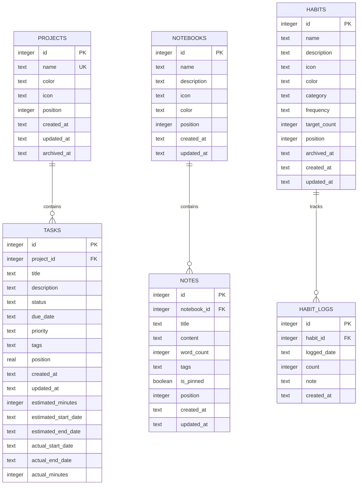

# Indexing Strategy

<cite>
**Referenced Files in This Document**
- [init.ts](file://src/database/init.ts)
- [tasksRepo.ts](file://src/database/tasksRepo.ts)
- [projectsRepo.ts](file://src/database/projectsRepo.ts)
- [notebookRepo.ts](file://src/database/notebookRepo.ts)
- [habitsRepo.ts](file://src/database/habitsRepo.ts)
- [notebookSchema.ts](file://src/database/notebookSchema.ts)
- [habitsSchema.ts](file://src/database/habitsSchema.ts)
- [metricsSchema.ts](file://src/database/metricsSchema.ts)
- [qaSchema.ts](file://src/database/qaSchema.ts)
- [types.ts](file://src/database/types.ts)
- [tasks.ts](file://src/main/ipc/tasks.ts)
- [projects.ts](file://src/main/ipc/projects.ts)
- [notebook.ts](file://src/main/ipc/notebook.ts)
- [habits.ts](file://src/main/ipc/habits.ts)
</cite>

## Table of Contents
1. [Introduction](#introduction)
2. [Database Architecture Overview](#database-architecture-overview)
3. [Core Indexing Strategy](#core-indexing-strategy)
4. [Task Management Indexes](#task-management-indexes)
5. [Project Management Indexes](#project-management-indexes)
6. [Notebook and Content Indexes](#notebook-and-content-indexes)
7. [Habit Tracking Indexes](#habit-tracking-indexes)
8. [Metrics and Analytics Indexes](#metrics-and-analytics-indexes)
9. [Q&A Module Indexes](#qa-module-indexes)
10. [Performance Optimization Guidelines](#performance-optimization-guidelines)
11. [Query Performance Analysis](#query-performance-analysis)
12. [Missing Index Identification](#missing-index-identification)
13. [Best Practices](#best-practices)

## Introduction

LifeOS employs a sophisticated SQLite-based indexing strategy designed to optimize query performance across multiple interconnected modules including task management, project organization, habit tracking, note-taking, and analytics. The indexing strategy balances query performance with storage efficiency while supporting the application's complex data access patterns.

This documentation provides comprehensive coverage of the indexing strategy, explaining the purpose and benefits of each index, common access patterns, and guidelines for identifying missing indexes and measuring query performance.

## Database Architecture Overview

LifeOS uses a relational database architecture with the following key tables and their relationships:



**Diagram sources**
- [init.ts](file://src/database/init.ts#L44-L85)
- [notebookSchema.ts](file://src/database/notebookSchema.ts#L15-L35)
- [habitsSchema.ts](file://src/database/habitsSchema.ts#L3-L25)

## Core Indexing Strategy

The LifeOS database implements a multi-layered indexing strategy that optimizes for different access patterns across modules. The strategy follows these principles:

### Index Naming Convention
Indexes follow a consistent naming convention: `idx_[table]_[column(s)]`. For example:
- `idx_tasks_project_status`: Composite index on tasks table
- `idx_notebooks_position`: Single-column index
- `idx_habit_logs_habit`: Composite index with descending sort

### Index Categories
1. **Primary Access Patterns**: Optimized for common CRUD operations
2. **Composite Indexes**: Multi-column indexes for complex queries
3. **Descending Sort Indexes**: Optimized for time-series data
4. **Unique Constraints**: Enforce data integrity
5. **Foreign Key Indexes**: Support referential integrity

**Section sources**
- [init.ts](file://src/database/init.ts#L75-L85)
- [notebookSchema.ts](file://src/database/notebookSchema.ts#L36-L40)
- [habitsSchema.ts](file://src/database/habitsSchema.ts#L26-L30)

## Task Management Indexes

### Composite Index on Tasks (project_id, status)

**Purpose**: Optimizes filtering tasks by project and status combination, which is a common access pattern in the task management system.

**Implementation**: `CREATE INDEX IF NOT EXISTS idx_tasks_project_status ON tasks(project_id, status);`

**Access Patterns**:
- Listing tasks by project: `SELECT * FROM tasks WHERE project_id = ? ORDER BY status ASC, position ASC, id ASC`
- Filtering tasks by status within a project
- Status-based task organization and kanban board rendering

**Performance Benefits**:
- Eliminates table scans for project-specific queries
- Enables efficient sorting by status and position
- Supports range queries for status filtering

### Single Column Index on Due Date

**Purpose**: Optimizes queries that filter or sort tasks by due date, particularly for overdue task identification and calendar views.

**Implementation**: `CREATE INDEX IF NOT EXISTS idx_tasks_due_date ON tasks(due_date);`

**Access Patterns**:
- Finding overdue tasks: `SELECT * FROM tasks WHERE due_date < ? AND status != 'Completed'`
- Upcoming task notifications
- Calendar and deadline-based filtering

**Performance Benefits**:
- Fast date comparison operations
- Efficient range queries for date-based filtering
- Supports ORDER BY operations on due_date

### Additional Task Indexes

The initialization script also creates several other task-related indexes:

**Activities Table Indexes**:
- `idx_activities_created_at`: Optimizes activity feed pagination
- `idx_activities_type`: Speeds up activity type filtering

**Time Tracking Columns**:
The migration process adds indexes for time tracking fields that were added later:
- `estimated_minutes`, `estimated_start_date`, `estimated_end_date`
- `actual_start_date`, `actual_end_date`, `actual_minutes`

**Section sources**
- [init.ts](file://src/database/init.ts#L75-L85)
- [tasksRepo.ts](file://src/database/tasksRepo.ts#L45-L50)

## Project Management Indexes

### Unique Position Index on Projects

**Purpose**: Ensures efficient project ordering and prevents duplicate positions, which is crucial for maintaining the project hierarchy and user interface consistency.

**Implementation**: `CREATE INDEX IF NOT EXISTS idx_projects_position ON projects(position);`

**Access Patterns**:
- Project reordering operations
- Listing projects in position order
- Maintaining project hierarchy in the UI

**Performance Benefits**:
- Fast position-based lookups
- Efficient project reordering transactions
- Prevents position conflicts during concurrent updates

### Project Archival Index

While not explicitly shown in the initialization script, the project management module supports archived projects with appropriate filtering patterns that would benefit from an index on `archived_at`.

**Section sources**
- [init.ts](file://src/database/init.ts#L75)
- [projectsRepo.ts](file://src/database/projectsRepo.ts#L25-L30)

## Notebook and Content Indexes

### Notebook Position Index

**Purpose**: Optimizes notebook ordering and navigation, ensuring fast access to notebooks in user-defined order.

**Implementation**: `CREATE INDEX IF NOT EXISTS idx_notebooks_position ON notebooks(position);`

**Access Patterns**:
- Listing notebooks in position order
- Notebook reordering operations
- Navigation and discovery features

### Composite Note Index

**Purpose**: Optimizes note retrieval within notebooks, supporting both pinned and regular notes efficiently.

**Implementation**: `CREATE INDEX IF NOT EXISTS idx_notes_notebook ON notes(notebook_id, position DESC);`

**Access Patterns**:
- Listing notes within a notebook: `SELECT * FROM notes WHERE notebook_id = ? ORDER BY is_pinned DESC, created_at DESC`
- Note creation with automatic positioning
- Note reordering within notebooks

**Performance Benefits**:
- Fast note lookup by notebook ID
- Automatic sorting by pin status and creation time
- Efficient pagination for large notebooks

### Note Creation and Pinning Indexes

**Created At Index**: `CREATE INDEX IF NOT EXISTS idx_notes_created ON notes(created_at DESC);`
- Optimizes chronological note browsing
- Supports note history and audit trails

**Pinned Notes Index**: `CREATE INDEX IF NOT EXISTS idx_notes_pinned ON notes(is_pinned DESC, created_at DESC);`
- Fast retrieval of pinned notes
- Optimizes note organization features

**Section sources**
- [notebookSchema.ts](file://src/database/notebookSchema.ts#L36-L40)
- [notebookRepo.ts](file://src/database/notebookRepo.ts#L180-L190)

## Habit Tracking Indexes

### Habit Position and Archival Indexes

**Position Index**: `CREATE INDEX IF NOT EXISTS idx_habits_position ON habits(position);`
- Optimizes habit ordering and display
- Supports habit reordering operations

**Archived Status Index**: `CREATE INDEX IF NOT EXISTS idx_habits_archived ON habits(archived_at);`
- Fast filtering of active vs. archived habits
- Supports habit lifecycle management

### Habit Logging Indexes

**Habit Log Composite Index**: `CREATE INDEX IF NOT EXISTS idx_habit_logs_habit ON habit_logs(habit_id, logged_date DESC);`
- Optimizes habit log retrieval by habit
- Supports recent activity tracking
- Enables efficient streak calculations

**Date-Based Log Index**: `CREATE INDEX IF NOT EXISTS idx_habit_logs_date ON habit_logs(logged_date DESC);`
- Fast date-range queries for habit analytics
- Supports weekly/monthly habit reports
- Enables efficient completion rate calculations

**Section sources**
- [habitsSchema.ts](file://src/database/habitsSchema.ts#L26-L30)
- [habitsRepo.ts](file://src/database/habitsRepo.ts#L150-L160)

## Metrics and Analytics Indexes

### Event Tracking Indexes

**User Event Index**: `CREATE INDEX IF NOT EXISTS idx_events_user_ts ON events(user_id, ts DESC);`
- Optimizes user activity feeds
- Supports real-time metrics updates
- Enables efficient time-series analytics

**Event Type Index**: `CREATE INDEX IF NOT EXISTS idx_events_type ON events(type);`
- Fast filtering by event type
- Supports analytics categorization
- Enables efficient event aggregation

### Task State Tracking Index

**Task States Index**: `CREATE INDEX IF NOT EXISTS idx_task_states_task ON task_states(task_id, ts);`
- Optimizes task progress tracking
- Supports cycle time calculations
- Enables efficient state change analysis

### Daily Aggregates Index

**Daily Metrics Index**: `CREATE INDEX IF NOT EXISTS idx_daily_agg_user_date ON daily_aggregates(user_id, date DESC);`
- Fast retrieval of daily metrics
- Supports trend analysis
- Enables efficient dashboard updates

**Section sources**
- [metricsSchema.ts](file://src/database/metricsSchema.ts#L65-L70)

## Q&A Module Indexes

### Collection and Question Indexes

**Collection Position Index**: `CREATE INDEX IF NOT EXISTS idx_qa_collections_position ON qa_collections(position);`
- Optimizes collection ordering
- Supports Q&A card organization
- Enables efficient collection browsing

**Question Collection Index**: `CREATE INDEX IF NOT EXISTS idx_qa_questions_collection ON qa_questions(collection_id, position);`
- Optimizes question retrieval by collection
- Supports Q&A module navigation
- Enables efficient question ordering

**Question Status Index**: `CREATE INDEX IF NOT EXISTS idx_qa_questions_status ON qa_questions(status);`
- Fast filtering by question status
- Supports Q&A workflow management
- Enables efficient status-based queries

### Answer Index

**Answer Question Index**: `CREATE INDEX IF NOT EXISTS idx_qa_answers_question ON qa_answers(question_id, position);`
- Optimizes answer retrieval by question
- Supports multiple answer management
- Enables efficient answer ordering

**Section sources**
- [qaSchema.ts](file://src/database/qaSchema.ts#L40-L45)

## Performance Optimization Guidelines

### Identifying Bottlenecks

To identify performance bottlenecks in the LifeOS database, follow these steps:

1. **Enable Query Logging**: Configure SQLite to log slow queries
2. **Use EXPLAIN QUERY PLAN**: Analyze query execution plans
3. **Monitor Index Usage**: Track which indexes are being utilized
4. **Measure Query Times**: Benchmark query performance under realistic loads

### EXPLAIN QUERY PLAN Analysis

To analyze query performance, use SQLite's EXPLAIN QUERY PLAN command:

```sql
EXPLAIN QUERY PLAN
SELECT * FROM tasks 
WHERE project_id = ? AND status = ? 
ORDER BY position ASC, id ASC;
```

**Expected Execution Plan**:
- Look for "SEARCH" operations on indexed columns
- Verify that composite indexes are used effectively
- Check for unnecessary table scans

### Performance Monitoring

Key metrics to monitor for index effectiveness:

1. **Query Execution Time**: Track average and 95th percentile query times
2. **Index Hit Rate**: Monitor cache hit rates for indexed data
3. **Lock Contention**: Track database locking during concurrent operations
4. **Storage Overhead**: Monitor index storage requirements

## Query Performance Analysis

### Common Query Patterns and Optimization

#### Task Management Queries

**Pattern**: Retrieve tasks by project with status filtering
```sql
-- Optimized with idx_tasks_project_status
SELECT * FROM tasks 
WHERE project_id = ? AND status = ? 
ORDER BY position ASC, id ASC;
```

**Optimization**: Ensure composite index usage by including both columns in the WHERE clause.

#### Habit Tracking Queries

**Pattern**: Retrieve recent habit logs
```sql
-- Optimized with idx_habit_logs_habit
SELECT * FROM habit_logs 
WHERE habit_id = ? 
ORDER BY logged_date DESC 
LIMIT 30;
```

**Optimization**: Leverage the composite index for both filtering and sorting.

#### Notebook Content Queries

**Pattern**: List notes within a notebook
```sql
-- Optimized with idx_notes_notebook
SELECT * FROM notes 
WHERE notebook_id = ? 
ORDER BY is_pinned DESC, created_at DESC;
```

**Optimization**: Use the composite index for both filtering and multi-criteria sorting.

### Query Performance Best Practices

1. **Index Order Matters**: Place equality predicates first in composite indexes
2. **Covering Indexes**: Design indexes to cover query result sets when possible
3. **Selectivity**: Place high-selectivity columns first in composite indexes
4. **Storage vs. Performance**: Balance index storage requirements with query performance gains

## Missing Index Identification

### Areas for Potential Index Enhancement

#### Task Management Enhancements

1. **Task Tags Index**: `CREATE INDEX idx_tasks_tags ON tasks(tags)`
   - Purpose: Enable tag-based task filtering
   - Benefit: Speeds up task search by tags
   - Use Case: Tag-based task discovery and filtering

2. **Task Priority Index**: `CREATE INDEX idx_tasks_priority_status ON tasks(priority, status)`
   - Purpose: Optimize priority-based task sorting
   - Benefit: Faster priority-based task lists
   - Use Case: Priority queue implementations

#### Project Management Enhancements

1. **Project Archive Index**: `CREATE INDEX idx_projects_archived ON projects(archived_at, position)`
   - Purpose: Optimize archived project filtering
   - Benefit: Faster archived project queries
   - Use Case: Project lifecycle management

#### Notebook Enhancement

1. **Note Tags Index**: `CREATE INDEX idx_notes_tags ON notes(tags)`
   - Purpose: Enable tag-based note filtering
   - Benefit: Faster note search by tags
   - Use Case: Note organization and discovery

#### Habit Enhancement

1. **Habit Category Index**: `CREATE INDEX idx_habits_category ON habits(category)`
   - Purpose: Enable category-based habit filtering
   - Benefit: Faster category-based habit queries
   - Use Case: Habit categorization and reporting

### Index Creation Guidelines

When adding new indexes, consider:

1. **Query Frequency**: Index columns used in frequent queries
2. **Selectivity**: Higher selectivity columns improve index effectiveness
3. **Storage Impact**: Balance performance gains against storage overhead
4. **Maintenance Cost**: Consider write operation impact on index maintenance

## Best Practices

### Index Design Principles

1. **Follow Access Patterns**: Design indexes based on actual query patterns
2. **Composite Index Ordering**: Place equality predicates first, then range predicates
3. **Covering Queries**: Design indexes to include all columns needed by queries
4. **Regular Review**: Periodically review index usage and effectiveness

### Maintenance and Monitoring

1. **Index Statistics**: Monitor index usage statistics
2. **Query Performance**: Regular performance testing of critical queries
3. **Storage Monitoring**: Track index storage growth
4. **Maintenance Scheduling**: Schedule index maintenance during low-usage periods

### Testing and Validation

1. **Load Testing**: Test indexes under realistic load conditions
2. **Benchmark Comparison**: Compare query performance before and after index additions
3. **Concurrent Access**: Test index performance under concurrent access scenarios
4. **Memory Usage**: Monitor memory usage impact of index additions

### Future Considerations

As LifeOS evolves, consider these potential enhancements:

1. **Full-Text Search**: Implement FTS for improved content search capabilities
2. **Partitioning**: Consider table partitioning for large datasets
3. **Materialized Views**: Create materialized views for complex analytics queries
4. **Index Compression**: Explore index compression techniques for large indexes

The current indexing strategy provides excellent foundation for LifeOS's data access patterns, with clear opportunities for targeted enhancements based on actual usage patterns and performance requirements.