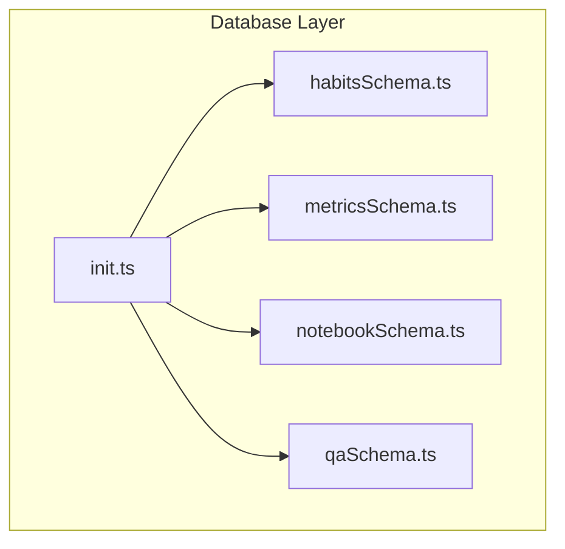
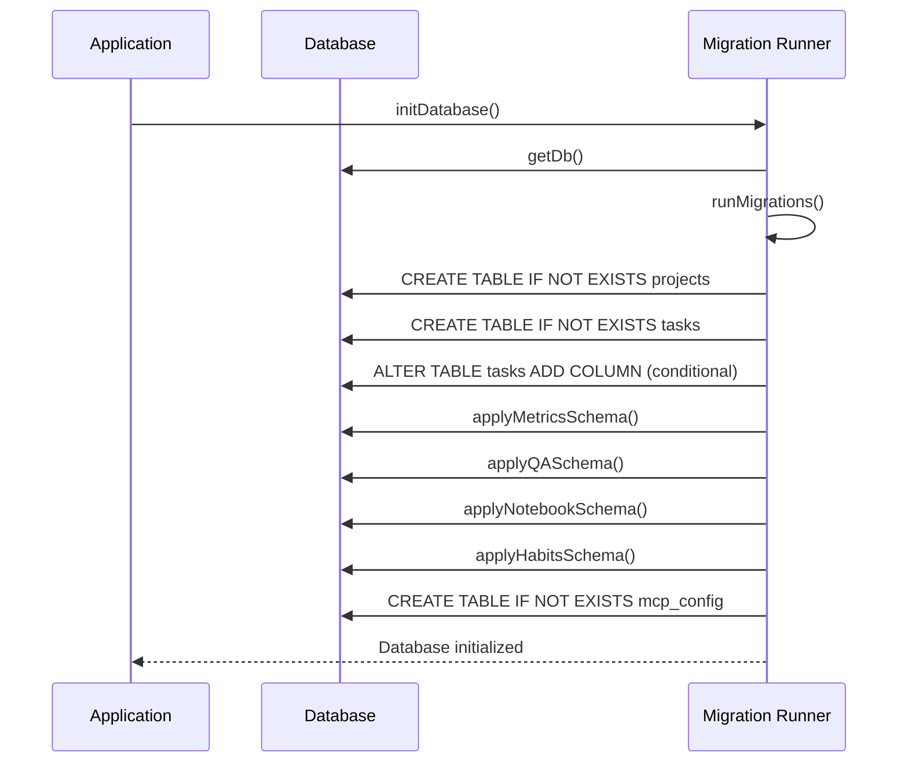
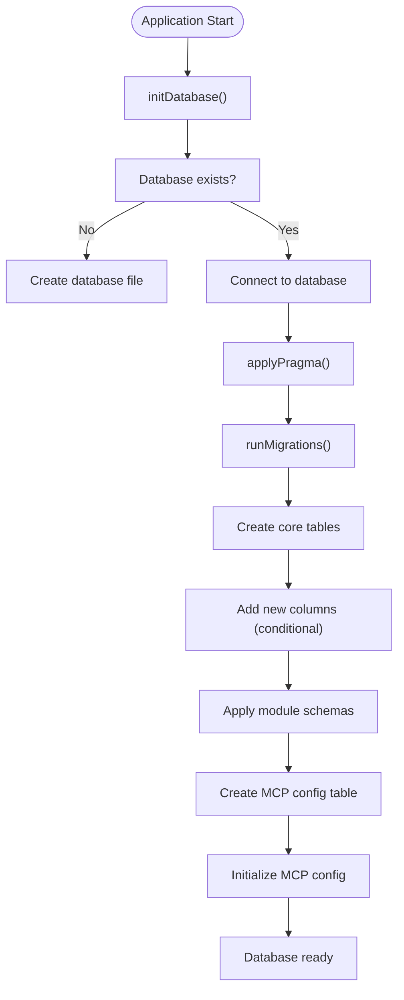
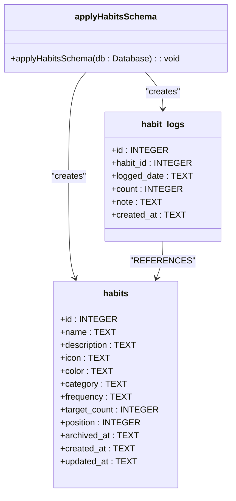
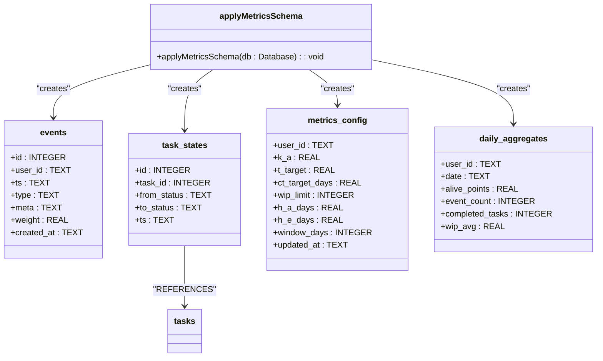
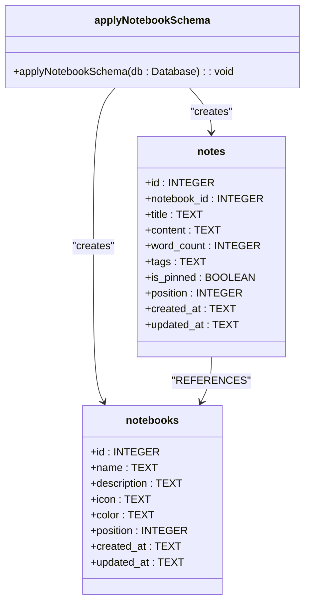
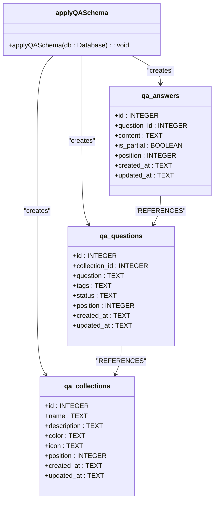
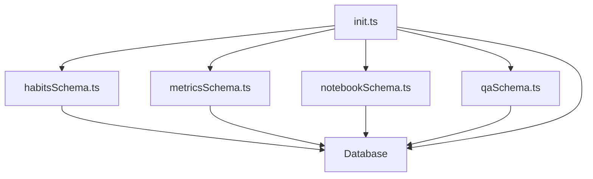

# Migration Strategy

<cite>
**Referenced Files in This Document**   
- [init.ts](file://src/database/init.ts)
- [habitsSchema.ts](file://src/database/habitsSchema.ts)
- [metricsSchema.ts](file://src/database/metricsSchema.ts)
- [notebookSchema.ts](file://src/database/notebookSchema.ts)
- [qaSchema.ts](file://src/database/qaSchema.ts)
- [DATABASE.md](file://AI/DATABASE.md)
</cite>

## Table of Contents
1. [Introduction](#introduction)
2. [Project Structure](#project-structure)
3. [Core Components](#core-components)
4. [Architecture Overview](#architecture-overview)
5. [Detailed Component Analysis](#detailed-component-analysis)
6. [Dependency Analysis](#dependency-analysis)
7. [Performance Considerations](#performance-considerations)
8. [Troubleshooting Guide](#troubleshooting-guide)
9. [Conclusion](#conclusion)

## Introduction
The LifeOS application implements a database migration system to manage schema changes over time. This documentation details how schema evolution is handled through a migration runner in the main process, tracking applied migrations, and ensuring data integrity during upgrades. The system uses SQLite as its database engine and applies migrations incrementally during application startup.

## Project Structure
The database migration system is organized within the `src/database` directory, where schema definitions are separated into dedicated files for different modules. The migration logic is implemented in the `init.ts` file, which serves as the entry point for database initialization and schema management.

**Diagram sources**
- [init.ts](file://src/database/init.ts#L1-L150)
- [habitsSchema.ts](file://src/database/habitsSchema.ts#L1-L37)
- [metricsSchema.ts](file://src/database/metricsSchema.ts#L1-L104)
- [notebookSchema.ts](file://src/database/notebookSchema.ts#L1-L52)
- [qaSchema.ts](file://src/database/qaSchema.ts#L1-L72)

**Section sources**
- [init.ts](file://src/database/init.ts#L1-L150)
- [AI/DATABASE.md](file://AI/DATABASE.md#L1-L31)

## Core Components
The database migration system consists of several key components that work together to ensure schema consistency across application updates. The core functionality is implemented in the `runMigrations` function within `init.ts`, which applies schema changes in a controlled manner during application startup.

**Section sources**
- [init.ts](file://src/database/init.ts#L44-L148)

## Architecture Overview
The migration architecture follows an incremental approach where schema changes are applied through dedicated schema functions that create or modify database tables. The system does not use a separate migrations directory with timestamped files as suggested in the documentation, but instead manages schema evolution through conditional SQL execution in the main initialization process.

**Diagram sources**
- [init.ts](file://src/database/init.ts#L44-L148)

## Detailed Component Analysis

### Migration Runner Implementation
The migration runner is implemented within the `runMigrations` function in `init.ts`. It executes a series of SQL statements to create tables and modify existing schemas. The implementation uses a defensive approach by wrapping ALTER TABLE statements in try-catch blocks to handle cases where columns may already exist.

**Diagram sources**
- [init.ts](file://src/database/init.ts#L44-L148)

**Section sources**
- [init.ts](file://src/database/init.ts#L44-L148)

### Schema Management Strategy
LifeOS manages schema changes through dedicated schema functions for each module. These functions are called sequentially during the migration process and contain idempotent SQL statements that can be safely executed multiple times.

#### Habits Schema

**Diagram sources**
- [habitsSchema.ts](file://src/database/habitsSchema.ts#L1-L37)

#### Metrics Schema

**Diagram sources**
- [metricsSchema.ts](file://src/database/metricsSchema.ts#L1-L104)

#### Notebook Schema

**Diagram sources**
- [notebookSchema.ts](file://src/database/notebookSchema.ts#L1-L52)

#### Q&A Schema

**Diagram sources**
- [qaSchema.ts](file://src/database/qaSchema.ts#L1-L72)

## Dependency Analysis
The migration system has a clear dependency hierarchy where the main initialization process depends on individual schema modules. This modular approach allows for independent evolution of different feature areas while maintaining a centralized migration control point.

**Diagram sources**
- [init.ts](file://src/database/init.ts#L1-L150)
- [habitsSchema.ts](file://src/database/habitsSchema.ts#L1-L37)
- [metricsSchema.ts](file://src/database/metricsSchema.ts#L1-L104)
- [notebookSchema.ts](file://src/database/notebookSchema.ts#L1-L52)
- [qaSchema.ts](file://src/database/qaSchema.ts#L1-L72)

**Section sources**
- [init.ts](file://src/database/init.ts#L1-L150)

## Performance Considerations
The migration system is designed to minimize performance impact during application startup. All schema operations use conditional statements (CREATE TABLE IF NOT EXISTS) and error handling to avoid unnecessary work. Indexes are created after table creation to optimize query performance for common access patterns.

## Troubleshooting Guide
When encountering migration-related issues, consider the following:

1. **Column already exists errors**: These are expected and safely handled by try-catch blocks around ALTER TABLE statements.
2. **Foreign key constraint violations**: Ensure foreign_keys pragma is enabled via applyPragma function.
3. **Missing tables**: Verify that all schema functions are called in runMigrations.
4. **Data loss risks**: The current system does not implement rollback functionality, so schema changes should be carefully tested.

**Section sources**
- [init.ts](file://src/database/init.ts#L44-L148)

## Conclusion
The LifeOS database migration system provides a robust mechanism for evolving the application schema over time. By implementing incremental, idempotent schema changes within the application code, it ensures that all users receive the latest database structure when upgrading. While the system does not use timestamped migration files as initially documented, it achieves the same goal through modular schema functions and defensive SQL execution patterns.