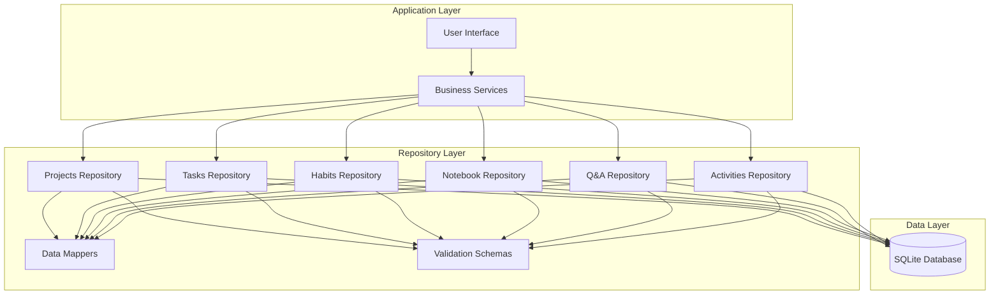
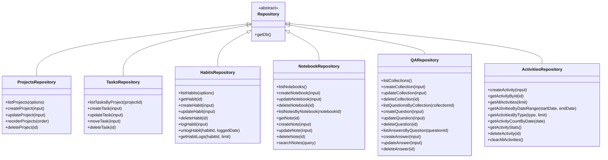
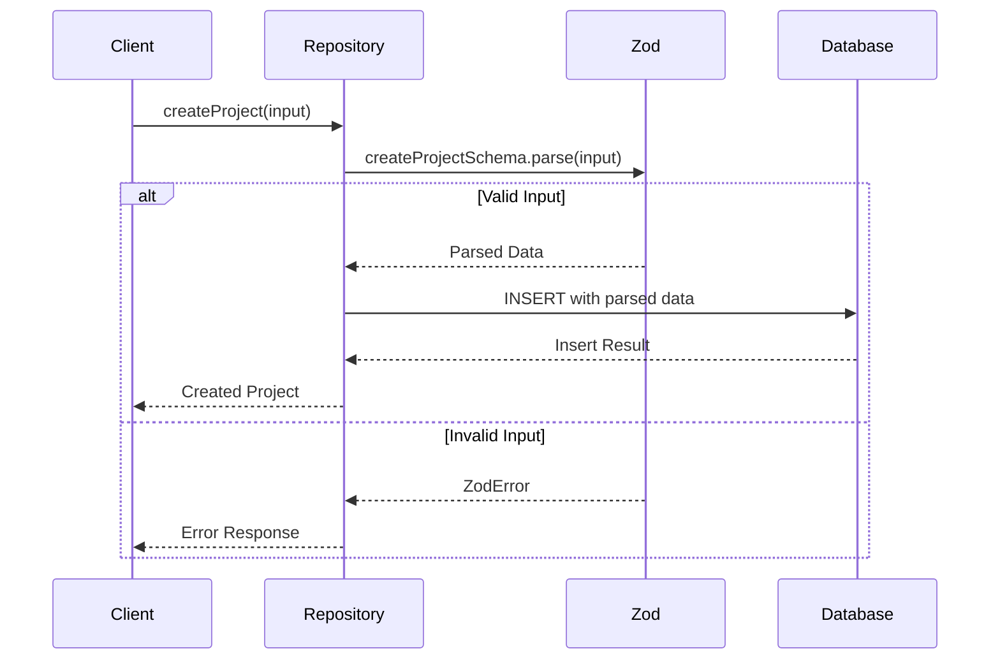
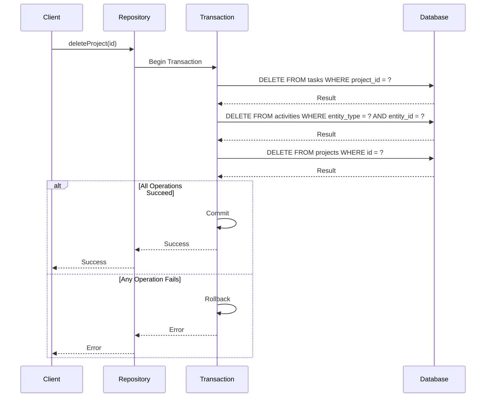
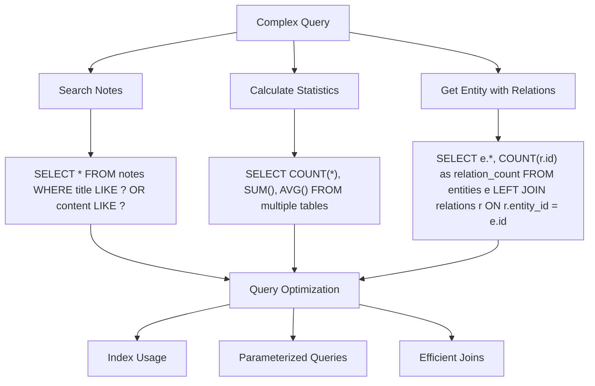
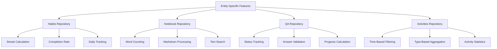

# Repository Pattern Implementation

<cite>
**Referenced Files in This Document**   
- [projectsRepo.ts](file://src/database/projectsRepo.ts)
- [tasksRepo.ts](file://src/database/tasksRepo.ts)
- [habitsRepo.ts](file://src/database/habitsRepo.ts)
- [notebookRepo.ts](file://src/database/notebookRepo.ts)
- [qaRepo.ts](file://src/database/qaRepo.ts)
- [activitiesRepo.ts](file://src/database/activitiesRepo.ts)
- [mcpRepo.ts](file://src/database/mcpRepo.ts)
- [init.ts](file://src/database/init.ts)
- [mappers.ts](file://src/database/mappers.ts)
- [types.ts](file://src/database/types.ts)
- [habitsSchema.ts](file://src/database/habitsSchema.ts)
- [notebookSchema.ts](file://src/database/notebookSchema.ts)
- [qaSchema.ts](file://src/database/qaSchema.ts)
</cite>

## Table of Contents
1. [Introduction](#introduction)
2. [Repository Pattern Overview](#repository-pattern-overview)
3. [Core Repository Structure](#core-repository-structure)
4. [Input Validation with Zod](#input-validation-with-zod)
5. [Data Normalization through Mappers](#data-normalization-through-mappers)
6. [Transaction Management](#transaction-management)
7. [Complex Query Implementation](#complex-query-implementation)
8. [Error Handling Patterns](#error-handling-patterns)
9. [Entity-Specific Repository Examples](#entity-specific-repository-examples)
10. [Conclusion](#conclusion)

## Introduction
The LifeOS application implements a robust repository pattern across its database layer to encapsulate data access logic for various entities. This documentation details how each repository provides a clean abstraction over the underlying SQLite database, offering CRUD operations, query helpers, and business logic specific to each entity type. The implementation follows consistent patterns across all repositories while adapting to the unique requirements of each entity.

**Section sources**
- [projectsRepo.ts](file://src/database/projectsRepo.ts)
- [tasksRepo.ts](file://src/database/tasksRepo.ts)
- [habitsRepo.ts](file://src/database/habitsRepo.ts)

## Repository Pattern Overview
The repository pattern in LifeOS serves as a mediator between the domain logic and data mapping layers, providing an in-memory collection-like interface for accessing domain objects. Each repository encapsulates the persistence logic for a specific entity, abstracting the database operations and providing a consistent API for the rest of the application.

The repositories are implemented as stateless modules containing pure functions that interact with the database through the Better SQLite3 library. They follow a consistent structure with standardized function signatures for common operations like list, create, update, and delete. This pattern enables separation of concerns, improves testability, and provides a single point of control for data access operations.



**Diagram sources**
- [projectsRepo.ts](file://src/database/projectsRepo.ts)
- [tasksRepo.ts](file://src/database/tasksRepo.ts)
- [habitsRepo.ts](file://src/database/habitsRepo.ts)
- [notebookRepo.ts](file://src/database/notebookRepo.ts)
- [qaRepo.ts](file://src/database/qaRepo.ts)
- [activitiesRepo.ts](file://src/database/activitiesRepo.ts)

**Section sources**
- [projectsRepo.ts](file://src/database/projectsRepo.ts)
- [tasksRepo.ts](file://src/database/tasksRepo.ts)
- [habitsRepo.ts](file://src/database/habitsRepo.ts)
- [notebookRepo.ts](file://src/database/notebookRepo.ts)
- [qaRepo.ts](file://src/database/qaRepo.ts)

## Core Repository Structure
Each repository in the LifeOS codebase follows a consistent structure that includes type definitions, validation schemas, and CRUD operations. The repositories are organized by entity type, with each entity having its own dedicated repository file in the `src/database` directory.

The core structure includes entity interfaces that define the shape of the data as it appears in the application, separate from the database row types. This separation allows for data transformation between the database representation and the application representation. The repositories export functions for all standard operations, with consistent naming conventions and error handling patterns.



**Diagram sources**
- [projectsRepo.ts](file://src/database/projectsRepo.ts)
- [tasksRepo.ts](file://src/database/tasksRepo.ts)
- [habitsRepo.ts](file://src/database/habitsRepo.ts)
- [notebookRepo.ts](file://src/database/notebookRepo.ts)
- [qaRepo.ts](file://src/database/qaRepo.ts)
- [activitiesRepo.ts](file://src/database/activitiesRepo.ts)

**Section sources**
- [projectsRepo.ts](file://src/database/projectsRepo.ts)
- [tasksRepo.ts](file://src/database/tasksRepo.ts)
- [habitsRepo.ts](file://src/database/habitsRepo.ts)
- [notebookRepo.ts](file://src/database/notebookRepo.ts)
- [qaRepo.ts](file://src/database/qaRepo.ts)
- [activitiesRepo.ts](file://src/database/activitiesRepo.ts)

## Input Validation with Zod
The LifeOS repositories implement comprehensive input validation using Zod schemas to ensure data integrity before database operations. Each repository defines Zod schemas for create and update operations, which are used to validate input parameters and provide type safety.

The validation approach follows a consistent pattern across all repositories: define a schema for each operation, parse the input against the schema, and use the parsed result in the database operation. This ensures that all data entering the system meets the required constraints and prevents invalid data from being stored in the database.



**Diagram sources**
- [projectsRepo.ts](file://src/database/projectsRepo.ts)
- [tasksRepo.ts](file://src/database/tasksRepo.ts)
- [habitsRepo.ts](file://src/database/habitsRepo.ts)

**Section sources**
- [projectsRepo.ts](file://src/database/projectsRepo.ts)
- [tasksRepo.ts](file://src/database/tasksRepo.ts)
- [habitsRepo.ts](file://src/database/habitsRepo.ts)
- [notebookRepo.ts](file://src/database/notebookRepo.ts)
- [qaRepo.ts](file://src/database/qaRepo.ts)

## Data Normalization through Mappers
The LifeOS application uses mappers to transform data between the database representation and the application representation. This separation allows for different data structures in the database and the application, providing flexibility in how data is stored and consumed.

The mappers handle various transformations such as converting database field names to camelCase, parsing JSON strings stored in database columns, and calculating derived properties. This approach ensures that the application code works with clean, well-structured data while the database can use optimized storage formats.

```mermaid
flowchart LR
A[Database Row] --> B{Mapper Function}
B --> C[Application Object]
D[Application Object] --> E{Mapper Function}
E --> F[Database Row]
subgraph "Transformation Examples"
G["created_at" -> "createdAt"]
H["project_id" -> "projectId"]
I["tags JSON string" -> "tags array"]
J["is_pinned" -> "isPinned"]
end
B --> G
B --> H
B --> I
B --> J
E --> G
E --> H
E --> I
E --> J
```

**Diagram sources**
- [mappers.ts](file://src/database/mappers.ts)
- [projectsRepo.ts](file://src/database/projectsRepo.ts)
- [tasksRepo.ts](file://src/database/tasksRepo.ts)

**Section sources**
- [mappers.ts](file://src/database/mappers.ts)
- [projectsRepo.ts](file://src/database/projectsRepo.ts)
- [tasksRepo.ts](file://src/database/tasksRepo.ts)

## Transaction Management
The LifeOS repositories implement transaction management for operations that involve multiple database operations. Transactions ensure data consistency by grouping related operations into atomic units that either complete entirely or roll back on failure.

The implementation uses Better SQLite3's transaction functionality to wrap multiple operations, ensuring that related changes are applied together. This is particularly important for operations like deleting a project, which requires removing the project itself along with all related tasks and activities.



**Diagram sources**
- [projectsRepo.ts](file://src/database/projectsRepo.ts)
- [init.ts](file://src/database/init.ts)

**Section sources**
- [projectsRepo.ts](file://src/database/projectsRepo.ts)

## Complex Query Implementation
The repositories implement various complex queries to support the application's functionality. These queries often involve joins, aggregations, and conditional logic to retrieve data in the format needed by the application.

For example, the notebook repository includes a search function that queries both title and content fields with a LIKE operator, while the QA repository includes functions that calculate statistics by joining multiple tables and using conditional aggregation. These complex queries are encapsulated within the repository, providing a simple interface to the rest of the application.



**Diagram sources**
- [notebookRepo.ts](file://src/database/notebookRepo.ts)
- [qaRepo.ts](file://src/database/qaRepo.ts)
- [projectsRepo.ts](file://src/database/projectsRepo.ts)

**Section sources**
- [notebookRepo.ts](file://src/database/notebookRepo.ts)
- [qaRepo.ts](file://src/database/qaRepo.ts)
- [projectsRepo.ts](file://src/database/projectsRepo.ts)

## Error Handling Patterns
The repositories implement consistent error handling patterns to provide meaningful feedback when operations fail. Errors are handled at the repository level, with specific error messages for different failure scenarios.

The pattern typically involves checking the result of database operations and throwing descriptive errors when expected changes don't occur (e.g., when a delete operation affects zero rows). This approach ensures that calling code can handle errors appropriately and provide useful feedback to users.

```mermaid
flowchart LR
A[Operation Start] --> B{Operation Successful?}
B --> |Yes| C[Return Result]
B --> |No| D{Error Type}
D --> E[Entity Not Found]
D --> F[Validation Error]
D --> G[Database Error]
D --> H[Constraint Violation]
E --> I[Throw "Entity not found" error]
F --> J[Throw validation error with details]
G --> K[Throw database connection error]
H --> L[Throw constraint violation error]
I --> M[Error Response]
J --> M
K --> M
L --> M
```

**Diagram sources**
- [projectsRepo.ts](file://src/database/projectsRepo.ts)
- [tasksRepo.ts](file://src/database/tasksRepo.ts)
- [habitsRepo.ts](file://src/database/habitsRepo.ts)

**Section sources**
- [projectsRepo.ts](file://src/database/projectsRepo.ts)
- [tasksRepo.ts](file://src/database/tasksRepo.ts)
- [habitsRepo.ts](file://src/database/habitsRepo.ts)

## Entity-Specific Repository Examples
The LifeOS codebase demonstrates how the repository pattern can be adapted to different entity types while maintaining consistency in the overall approach. Each repository implements the core CRUD operations but adds entity-specific functionality as needed.

For example, the habits repository includes specialized functions for logging habit completions and calculating streaks, while the notebook repository includes text processing functions for word counting. The QA repository implements status tracking based on answer completeness, and the activities repository provides various filtering and aggregation functions for analytics.



**Diagram sources**
- [habitsRepo.ts](file://src/database/habitsRepo.ts)
- [notebookRepo.ts](file://src/database/notebookRepo.ts)
- [qaRepo.ts](file://src/database/qaRepo.ts)
- [activitiesRepo.ts](file://src/database/activitiesRepo.ts)

**Section sources**
- [habitsRepo.ts](file://src/database/habitsRepo.ts)
- [notebookRepo.ts](file://src/database/notebookRepo.ts)
- [qaRepo.ts](file://src/database/qaRepo.ts)
- [activitiesRepo.ts](file://src/database/activitiesRepo.ts)

## Conclusion
The repository pattern implementation in LifeOS provides a robust and consistent approach to data access across the application. By encapsulating database operations within dedicated repositories, the codebase achieves separation of concerns, improves maintainability, and provides a clean API for data operations.

The implementation demonstrates best practices in input validation with Zod, data transformation with mappers, transaction management for data consistency, and comprehensive error handling. The pattern allows for both consistency across entities and flexibility to implement entity-specific functionality as needed.

This architecture supports the application's requirements for data integrity, performance, and extensibility, providing a solid foundation for future development and maintenance.