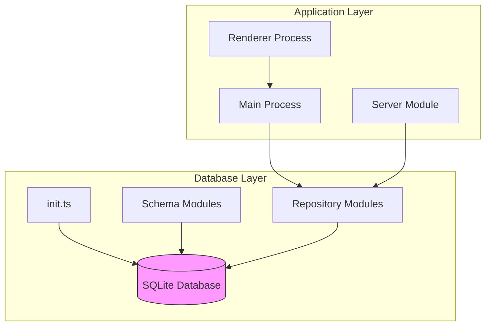
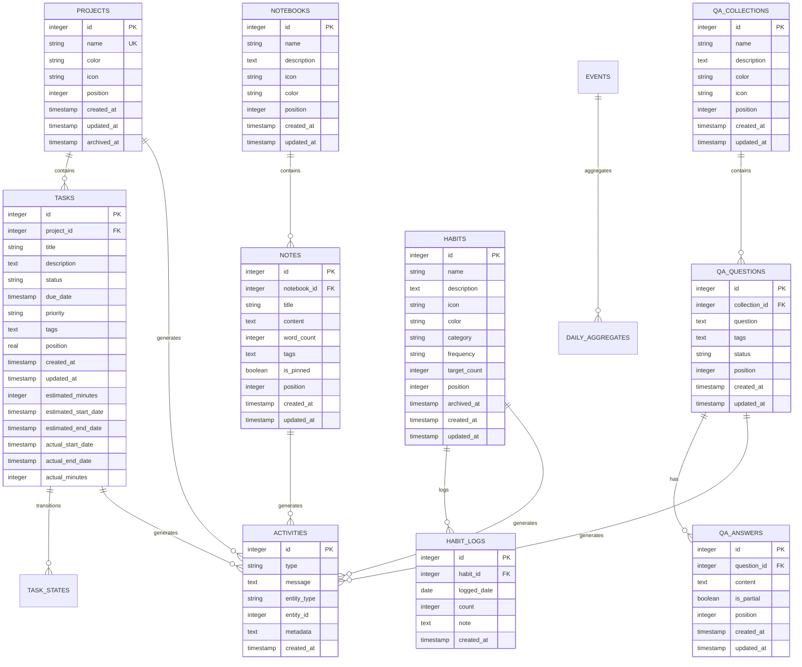
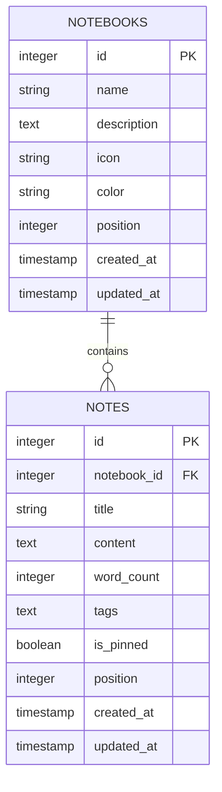
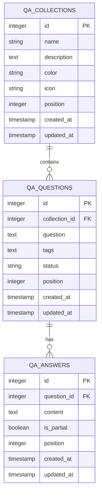
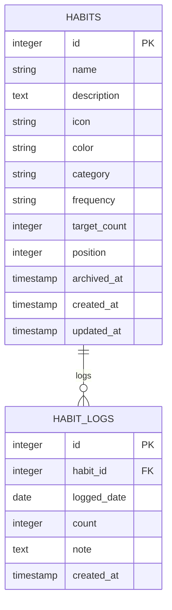
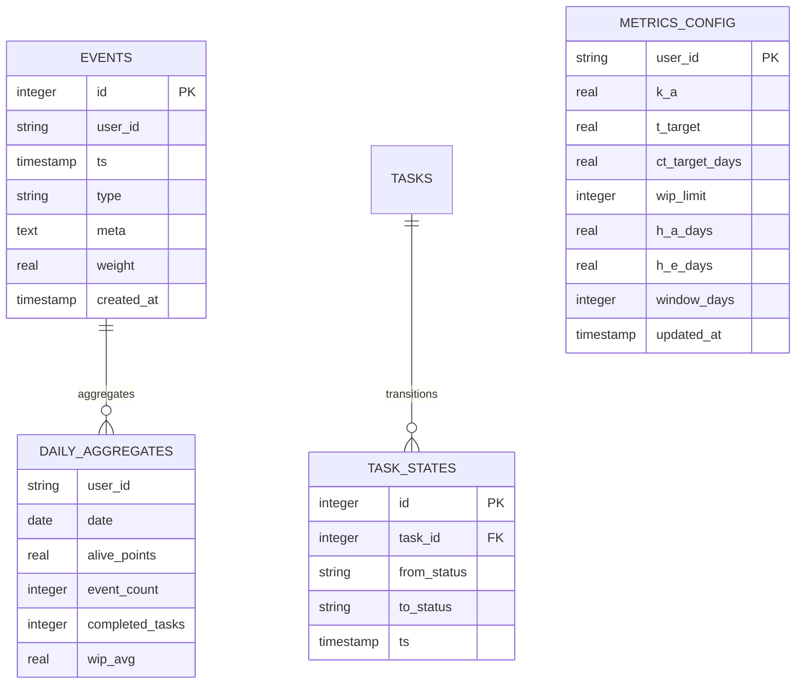
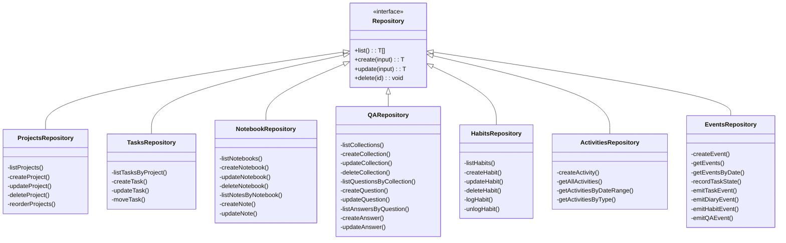
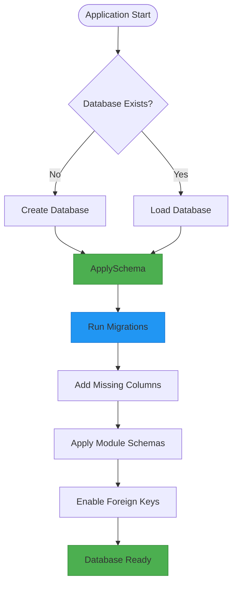

# Schema Overview

<cite>
**Referenced Files in This Document**   
- [init.ts](file://src/database/init.ts)
- [types.ts](file://src/database/types.ts)
- [mappers.ts](file://src/database/mappers.ts)
- [notebookSchema.ts](file://src/database/notebookSchema.ts)
- [qaSchema.ts](file://src/database/qaSchema.ts)
- [habitsSchema.ts](file://src/database/habitsSchema.ts)
- [metricsSchema.ts](file://src/database/metricsSchema.ts)
- [projectsRepo.ts](file://src/database/projectsRepo.ts)
- [tasksRepo.ts](file://src/database/tasksRepo.ts)
- [activitiesRepo.ts](file://src/database/activitiesRepo.ts)
- [eventsRepo.ts](file://src/database/eventsRepo.ts)
- [notebookRepo.ts](file://src/database/notebookRepo.ts)
- [qaRepo.ts](file://src/database/qaRepo.ts)
- [habitsRepo.ts](file://src/database/hambitsRepo.ts)
- [common/types.ts](file://src/common/types.ts)
</cite>

## Table of Contents
1. [Introduction](#introduction)
2. [Database Architecture](#database-architecture)
3. [Entity Relationship Model](#entity-relationship-model)
4. [Core Tables](#core-tables)
5. [Module-Specific Schemas](#module-specific-schemas)
6. [Repository Pattern Implementation](#repository-pattern-implementation)
7. [Migration Strategy](#migration-strategy)
8. [Data Validation Rules](#data-validation-rules)
9. [Access Patterns and Performance](#access-patterns-and-performance)
10. [Sample Queries](#sample-queries)
11. [Conclusion](#conclusion)

## Introduction

The LifeOS application implements a comprehensive personal productivity system with integrated modules for projects, tasks, habits, notebook entries, and Q&A collections. This document provides detailed documentation of the database schema, focusing on entity relationships, data structures, repository patterns, and performance considerations for the SQLite database implementation.

The database serves as the central data store for all application state, supporting features such as task management, habit tracking, journaling, knowledge management, and activity logging. The schema is designed to support efficient querying, data integrity, and extensibility while maintaining compatibility with the Electron desktop application architecture.

**Section sources**
- [init.ts](file://src/database/init.ts#L1-L143)
- [types.ts](file://src/database/types.ts#L1-L30)

## Database Architecture

The LifeOS database architecture follows a modular design pattern with separate schema definition files for each functional module. The system uses SQLite as the underlying database engine, accessed through the better-sqlite3 library, providing a lightweight, file-based storage solution suitable for desktop applications.



**Diagram sources**
- [init.ts](file://src/database/init.ts#L1-L143)
- [database directory structure](file://src/database/)

**Section sources**
- [init.ts](file://src/database/init.ts#L1-L143)

## Entity Relationship Model

The LifeOS data model consists of several interconnected entities that represent different aspects of personal productivity and knowledge management. The core entities include projects, tasks, habits, notebook entries, and Q&A collections, all connected through a centralized activity logging system.



**Diagram sources**
- [init.ts](file://src/database/init.ts#L1-L143)
- [notebookSchema.ts](file://src/database/notebookSchema.ts#L1-L51)
- [qaSchema.ts](file://src/database/qaSchema.ts#L1-L71)
- [habitsSchema.ts](file://src/database/habitsSchema.ts#L1-L38)
- [metricsSchema.ts](file://src/database/metricsSchema.ts#L1-L103)

**Section sources**
- [init.ts](file://src/database/init.ts#L1-L143)
- [notebookSchema.ts](file://src/database/notebookSchema.ts#L1-L51)
- [qaSchema.ts](file://src/database/qaSchema.ts#L1-L71)
- [habitsSchema.ts](file://src/database/habitsSchema.ts#L1-L38)

## Core Tables

### Projects Table
The projects table serves as the organizational container for tasks, enabling users to group related work items.

**Field Definitions**
| Field | Type | Constraints | Description |
|-------|------|-------------|-------------|
| id | INTEGER | PRIMARY KEY, AUTOINCREMENT | Unique identifier |
| name | TEXT | NOT NULL, UNIQUE | Project name |
| color | TEXT | | Color theme for UI |
| icon | TEXT | | Icon identifier for UI |
| position | INTEGER | NOT NULL, DEFAULT 0 | Sort order |
| created_at | TEXT | NOT NULL, DEFAULT CURRENT_TIMESTAMP | Creation timestamp |
| updated_at | TEXT | NOT NULL, DEFAULT CURRENT_TIMESTAMP | Last update timestamp |
| archived_at | TEXT | | Archive timestamp |

**Indexes**
- `idx_projects_position` on position for sorting
- Foreign key constraint on tasks.project_id with CASCADE delete

**Section sources**
- [init.ts](file://src/database/init.ts#L1-L143)
- [projectsRepo.ts](file://src/database/projectsRepo.ts#L1-L147)

### Tasks Table
The tasks table represents individual work items within projects, with support for time tracking and status management.

**Field Definitions**
| Field | Type | Constraints | Description |
|-------|------|-------------|-------------|
| id | INTEGER | PRIMARY KEY, AUTOINCREMENT | Unique identifier |
| project_id | INTEGER | NOT NULL, REFERENCES projects(id) | Parent project |
| title | TEXT | NOT NULL | Task title |
| description | TEXT | | Detailed description |
| status | TEXT | NOT NULL, DEFAULT 'To-Do' | Workflow status |
| due_date | TEXT | | Deadline |
| priority | TEXT | | Priority level |
| tags | TEXT | | JSON-encoded tag array |
| position | REAL | NOT NULL, DEFAULT 0 | Sort order within status |
| created_at | TEXT | NOT NULL, DEFAULT CURRENT_TIMESTAMP | Creation timestamp |
| updated_at | TEXT | NOT NULL, DEFAULT CURRENT_TIMESTAMP | Last update timestamp |
| estimated_minutes | INTEGER | | Estimated duration |
| estimated_start_date | TEXT | | Estimated start |
| estimated_end_date | TEXT | | Estimated completion |
| actual_start_date | TEXT | | Actual start |
| actual_end_date | TEXT | | Actual completion |
| actual_minutes | INTEGER | | Actual duration |

**Indexes**
- `idx_tasks_project_status` on (project_id, status) for filtering
- `idx_tasks_due_date` on due_date for deadline sorting
- Foreign key constraint with CASCADE delete

**Section sources**
- [init.ts](file://src/database/init.ts#L1-L143)
- [tasksRepo.ts](file://src/database/tasksRepo.ts#L1-L210)
- [types.ts](file://src/database/types.ts#L1-L30)

### Activities Table
The activities table provides a centralized event log for user actions across all modules.

**Field Definitions**
| Field | Type | Constraints | Description |
|-------|------|-------------|-------------|
| id | INTEGER | PRIMARY KEY, AUTOINCREMENT | Unique identifier |
| type | TEXT | NOT NULL | Activity type |
| message | TEXT | NOT NULL | Human-readable description |
| entity_type | TEXT | | Type of affected entity |
| entity_id | INTEGER | | ID of affected entity |
| metadata | TEXT | | JSON-encoded additional data |
| created_at | TEXT | NOT NULL, DEFAULT CURRENT_TIMESTAMP | Timestamp |

**Indexes**
- `idx_activities_created_at` on created_at DESC for recent activities
- `idx_activities_type` on type for filtering by activity type

**Section sources**
- [init.ts](file://src/database/init.ts#L1-L143)
- [activitiesRepo.ts](file://src/database/activitiesRepo.ts#L1-L139)

## Module-Specific Schemas

### Notebook Module
The notebook module implements a hierarchical system for journaling and note-taking with support for organization and search.



**Key Features**
- Notebooks can contain multiple notes
- Notes support markdown content and word counting
- Tags are stored as JSON arrays
- Pinned notes appear at the top in UI
- Position field enables custom sorting

**Indexes**
- `idx_notebooks_position` on position
- `idx_notes_notebook` on (notebook_id, position DESC)
- `idx_notes_created` on created_at DESC
- `idx_notes_pinned` on (is_pinned DESC, created_at DESC)

**Section sources**
- [notebookSchema.ts](file://src/database/notebookSchema.ts#L1-L51)
- [notebookRepo.ts](file://src/database/notebookRepo.ts#L1-L399)

### Q&A Module
The Q&A module provides a knowledge management system for questions and answers with status tracking.



**Status Types**
- `unanswered`: No answers exist
- `in_progress`: Has partial answers only
- `answered`: Has at least one complete answer

**Indexes**
- `idx_qa_collections_position` on position
- `idx_qa_questions_collection` on (collection_id, position)
- `idx_qa_questions_status` on status
- `idx_qa_answers_question` on (question_id, position)

**Section sources**
- [qaSchema.ts](file://src/database/qaSchema.ts#L1-L71)
- [qaRepo.ts](file://src/database/qaRepo.ts#L1-L539)

### Habits Module
The habits module tracks recurring behaviors with detailed statistics and streak calculations.



**Key Features**
- Supports daily, weekly, and monthly frequencies
- Target count for completion threshold
- Logs track completion date and count
- Unique constraint on (habit_id, logged_date)
- Streak calculations based on consecutive days

**Indexes**
- `idx_habits_position` on position
- `idx_habits_archived` on archived_at
- `idx_habit_logs_habit` on (habit_id, logged_date DESC)
- `idx_habit_logs_date` on logged_date DESC

**Section sources**
- [habitsSchema.ts](file://src/database/habitsSchema.ts#L1-L38)
- [habitsRepo.ts](file://src/database/habitsRepo.ts#L1-L394)

### Metrics Module
The metrics module supports scoring systems for efficiency and aliveness metrics.



**Event Types**
- `task_started`: Task begins
- `task_progressed`: Task state change
- `task_completed`: Task finished
- `habit_logged`: Habit completed
- `diary_saved`: Note saved
- `qa_asked`: Question created
- `qa_answered`: Answer provided

**Indexes**
- `idx_events_user_ts` on (user_id, ts DESC)
- `idx_events_type` on type
- `idx_task_states_task` on (task_id, ts)
- `idx_daily_agg_user_date` on (user_id, date DESC)

**Section sources**
- [metricsSchema.ts](file://src/database/metricsSchema.ts#L1-L103)
- [eventsRepo.ts](file://src/database/eventsRepo.ts#L1-L135)

## Repository Pattern Implementation

The LifeOS application implements a repository pattern for data access, providing an abstraction layer between the application logic and database operations.



**Key Implementation Details**
- Each repository module exports functions rather than classes
- Input validation using Zod schemas
- Transaction support for complex operations
- Error handling with meaningful messages
- Data mapping between database rows and domain objects
- Event emission for metrics tracking

**Data Mapping**
The mappers.ts file provides functions to convert between database row objects and application domain objects:

- `mapProject()`: Converts ProjectRow to Project interface
- `mapTask()`: Converts TaskRow to Task interface
- Tags are parsed from JSON strings to arrays
- Null values are converted to undefined for optional fields

**Section sources**
- [projectsRepo.ts](file://src/database/projectsRepo.ts#L1-L147)
- [tasksRepo.ts](file://src/database/tasksRepo.ts#L1-L210)
- [notebookRepo.ts](file://src/database/notebookRepo.ts#L1-L399)
- [qaRepo.ts](file://src/database/qaRepo.ts#L1-L539)
- [habitsRepo.ts](file://src/database/habitsRepo.ts#L1-L394)
- [activitiesRepo.ts](file://src/database/activitiesRepo.ts#L1-L139)
- [eventsRepo.ts](file://src/database/eventsRepo.ts#L1-L135)
- [mappers.ts](file://src/database/mappers.ts#L1-L53)

## Migration Strategy

The LifeOS application implements a programmatic migration strategy within the database initialization process, ensuring schema consistency across application updates.



**Migration Implementation**
The migration process is handled in the `runMigrations()` function in init.ts:

1. **Schema Creation**: CREATE TABLE IF NOT EXISTS statements ensure tables exist
2. **Column Addition**: ALTER TABLE statements add new columns with try/catch
3. **Module Schema Application**: External schema functions are called
4. **Index Creation**: Performance indexes are created
5. **Configuration Initialization**: Default values are inserted if needed

**Key Features**
- Idempotent operations using IF NOT EXISTS clauses
- Error tolerance for ALTER TABLE statements
- Foreign key enforcement enabled via PRAGMA
- Module-specific schema functions for extensibility
- Default configuration initialization

**Section sources**
- [init.ts](file://src/database/init.ts#L1-L143)

## Data Validation Rules

The LifeOS application implements comprehensive data validation at the repository level using Zod schemas.

### Validation Strategy
- Input validation using Zod schemas
- Type checking and transformation
- Error handling with descriptive messages
- Business logic validation in repository functions
- Database constraints for data integrity

### Schema Examples

**Project Validation**
```typescript
const createProjectSchema = z.object({
  name: z.string().min(1).max(120),
  color: z.string().max(20).optional().nullable(),
  icon: z.string().max(30).optional().nullable()
});
```

**Task Validation**
```typescript
const createTaskSchema = z.object({
  projectId: z.number().int().positive(),
  title: z.string().min(1).max(200),
  description: z.string().max(4000).optional(),
  status: z.string().min(1).max(50).default('To-Do'),
  tags: z.array(z.string().max(30)).optional()
});
```

**Habit Validation**
```typescript
const createHabitSchema = z.object({
  name: z.string().min(1).max(200),
  frequency: z.enum(['daily', 'weekly', 'monthly']).default('daily'),
  targetCount: z.number().int().positive().default(1),
});
```

**Key Validation Rules**
- String length limits (name: 120, title: 200, description: 1000)
- Numeric constraints (positive integers, non-negative positions)
- Enum validation for status and frequency fields
- Required fields with minimum length
- Nullable fields explicitly defined
- Array element constraints (tag length: 30)

**Section sources**
- [projectsRepo.ts](file://src/database/projectsRepo.ts#L1-L147)
- [tasksRepo.ts](file://src/database/tasksRepo.ts#L1-L210)
- [habitsRepo.ts](file://src/database/habitsRepo.ts#L1-L394)
- [notebookRepo.ts](file://src/database/notebookRepo.ts#L1-L399)
- [qaRepo.ts](file://src/database/qaRepo.ts#L1-L539)

## Access Patterns and Performance

The LifeOS database is optimized for common access patterns in a personal productivity application, with careful consideration of query performance and indexing strategies.

### Query Patterns
- List all items in a container (projects, notebooks, collections)
- Filter items by parent and status (tasks by project and status)
- Sort by position for custom ordering
- Search by date ranges (activities, events)
- Aggregate statistics (counts, sums, averages)

### Indexing Strategy
The database implements a comprehensive indexing strategy to support efficient querying:

**Projects**
- `idx_projects_position`: Fast sorting by position
- Foreign key index on tasks.project_id

**Tasks**
- `idx_tasks_project_status`: Filter by project and status
- `idx_tasks_due_date`: Sort by deadline
- Foreign key index on project_id

**Activities**
- `idx_activities_created_at`: Recent activities
- `idx_activities_type`: Filter by activity type

**Notebooks**
- `idx_notebooks_position`: Sort by position
- `idx_notes_notebook`: Notes by notebook
- `idx_notes_created`: Recent notes
- `idx_notes_pinned`: Pinned notes first

**Q&A**
- `idx_qa_collections_position`: Sort collections
- `idx_qa_questions_collection`: Questions by collection
- `idx_qa_questions_status`: Filter by status

**Habits**
- `idx_habits_position`: Sort habits
- `idx_habits_archived`: Filter archived
- `idx_habit_logs_habit`: Logs by habit
- `idx_habit_logs_date`: Logs by date

### Performance Considerations
- **Foreign Key Constraints**: Enabled via PRAGMA foreign_keys = ON
- **Transaction Usage**: Used for multi-statement operations
- **Prepared Statements**: Used for repeated queries
- **Batch Operations**: Supported through transaction wrappers
- **Memory Usage**: SQLite in-memory operations optimized
- **Query Optimization**: Indexes cover common filter/sort patterns

**Section sources**
- [init.ts](file://src/database/init.ts#L1-L143)
- [projectsRepo.ts](file://src/database/projectsRepo.ts#L1-L147)
- [tasksRepo.ts](file://src/database/tasksRepo.ts#L1-L210)
- [activitiesRepo.ts](file://src/database/activitiesRepo.ts#L1-L139)
- [notebookRepo.ts](file://src/database/notebookRepo.ts#L1-L399)
- [qaRepo.ts](file://src/database/qaRepo.ts#L1-L539)
- [habitsRepo.ts](file://src/database/habitsRepo.ts#L1-L394)

## Sample Queries

This section provides examples of common queries used in the LifeOS application.

### Project and Task Management
```sql
-- Get all active projects with their tasks
SELECT p.id, p.name, p.color, p.icon, 
       t.id, t.title, t.status, t.due_date, t.position
FROM projects p
LEFT JOIN tasks t ON t.project_id = p.id
WHERE p.archived_at IS NULL
ORDER BY p.position, t.status, t.position;

-- Get tasks due today or overdue
SELECT * FROM tasks 
WHERE due_date <= date('now') 
  AND status != 'Completed'
ORDER BY due_date, priority DESC;
```

### Activity and Event Tracking
```sql
-- Get recent activities (last 7 days)
SELECT * FROM activities 
WHERE created_at >= datetime('now', '-7 days')
ORDER BY created_at DESC
LIMIT 100;

-- Get event statistics by type
SELECT type, COUNT(*) as count 
FROM events 
WHERE user_id = 'default' 
  AND ts >= datetime('now', '-30 days')
GROUP BY type
ORDER BY count DESC;
```

### Notebook Operations
```sql
-- Search notes by content or title
SELECT n.id, n.title, n.content, n.word_count,
       nb.name as notebook_name, nb.color as notebook_color
FROM notes n
JOIN notebooks nb ON nb.id = n.notebook_id
WHERE n.title LIKE '%search term%' 
   OR n.content LIKE '%search term%'
ORDER BY n.updated_at DESC
LIMIT 50;

-- Get notebook statistics
SELECT 
  (SELECT COUNT(*) FROM notebooks) as total_notebooks,
  (SELECT COUNT(*) FROM notes) as total_notes,
  (SELECT COALESCE(SUM(word_count), 0) FROM notes) as total_words;
```

### Q&A Knowledge Management
```sql
-- Get unanswered questions
SELECT q.id, q.question, q.tags, 
       c.name as collection_name, c.color as collection_color
FROM qa_questions q
JOIN qa_collections c ON c.id = q.collection_id
WHERE q.status = 'unanswered'
ORDER BY q.created_at DESC;

-- Get complete Q&A statistics
SELECT 
  COUNT(*) as total_questions,
  SUM(CASE WHEN status = 'answered' THEN 1 ELSE 0 END) as answered,
  SUM(CASE WHEN status = 'in_progress' THEN 1 ELSE 0 END) as in_progress,
  SUM(CASE WHEN status = 'unanswered' THEN 1 ELSE 0 END) as unanswered
FROM qa_questions;
```

### Habit Tracking
```sql
-- Get today's habit completions
SELECT h.id, h.name, h.icon, h.color, h.target_count,
       COALESCE(l.count, 0) as today_count,
       l.note as today_note
FROM habits h
LEFT JOIN habit_logs l ON l.habit_id = h.id 
  AND l.logged_date = date('now')
WHERE h.archived_at IS NULL
ORDER BY h.position;

-- Get habit streak statistics
SELECT 
  COUNT(*) as total_habits,
  COUNT(CASE WHEN h.archived_at IS NULL THEN 1 END) as active_habits,
  COUNT(DISTINCT l.habit_id) as completed_today
FROM habits h
LEFT JOIN habit_logs l ON l.habit_id = h.id 
  AND l.logged_date = date('now');
```

**Section sources**
- [projectsRepo.ts](file://src/database/projectsRepo.ts#L1-L147)
- [tasksRepo.ts](file://src/database/tasksRepo.ts#L1-L210)
- [activitiesRepo.ts](file://src/database/activitiesRepo.ts#L1-L139)
- [eventsRepo.ts](file://src/database/eventsRepo.ts#L1-L135)
- [notebookRepo.ts](file://src/database/notebookRepo.ts#L1-L399)
- [qaRepo.ts](file://src/database/qaRepo.ts#L1-L539)
- [habitsRepo.ts](file://src/database/habitsRepo.ts#L1-L394)

## Conclusion

The LifeOS database schema provides a comprehensive foundation for personal productivity and knowledge management. The modular design separates concerns while maintaining data integrity through foreign key relationships and constraints. The repository pattern implementation provides a clean abstraction layer for data access, with comprehensive validation and error handling.

Key strengths of the schema include:
- **Extensibility**: Modular schema files allow for easy addition of new features
- **Performance**: Comprehensive indexing strategy supports efficient querying
- **Data Integrity**: Foreign key constraints and validation rules ensure consistency
- **Analytics Support**: Events and metrics tables enable sophisticated scoring
- **User Experience**: Position fields enable custom sorting in the UI

The migration strategy ensures schema consistency across application updates, while the repository pattern provides a maintainable interface between the application logic and database operations. This architecture supports the application's goals of helping users manage their projects, tasks, habits, knowledge, and personal growth effectively.

**Section sources**
- [init.ts](file://src/database/init.ts#L1-L143)
- [database directory](file://src/database/)