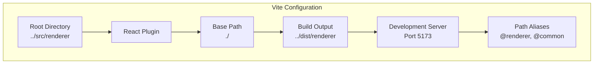
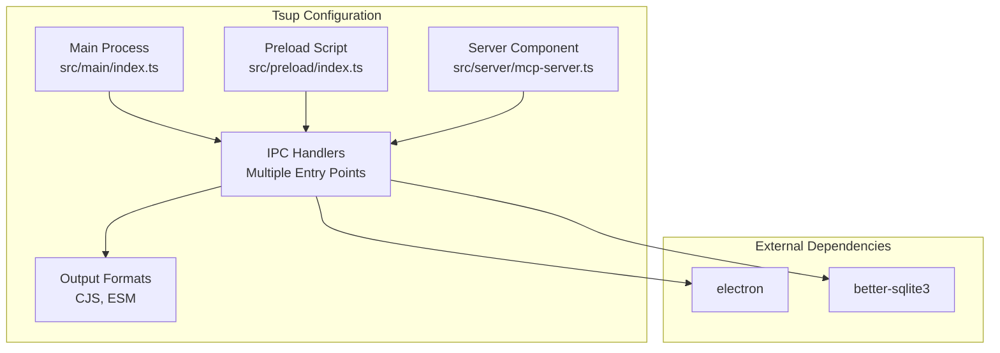
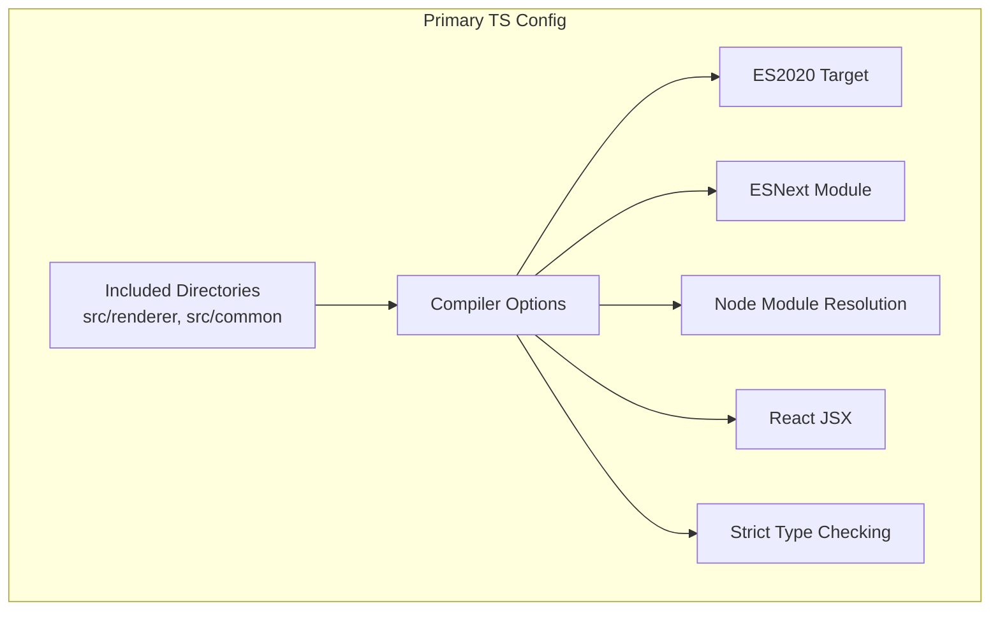
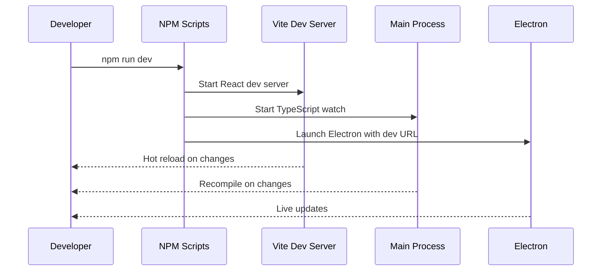

# Build Configuration

This document provides comprehensive coverage of the build configuration system for the LifeOS Electron application, focusing on Vite and tsup configuration files, TypeScript configuration files, and their roles in the development and production build processes.

## Table of Contents
1. [Introduction](#introduction)
2. [Vite Configuration](#vite-configuration)
3. [Tsup Configuration](#tsup-configuration)
4. [TypeScript Configuration Files](#typescript-configuration-files)
5. [Build Scripts and Workflow](#build-scripts-and-workflow)
6. [Configuration Analysis](#configuration-analysis)
7. [Customization Guidelines](#customization-guidelines)
8. [Common Build Issues and Solutions](#common-build-issues-and-solutions)
9. [Best Practices](#best-practices)

## Introduction

The LifeOS application employs a sophisticated multi-process architecture with separate build configurations for different components. The build system consists of:

- **Vite**: Frontend React application bundler and development server
- **Tsup**: TypeScript compiler for Electron main process, preload scripts, and server components
- **Multiple TypeScript Configurations**: Specialized TS configs for different build targets

This configuration enables efficient development workflows while maintaining production-ready builds with proper separation of concerns between the renderer, main process, and server components.

## Vite Configuration

The Vite configuration manages the React frontend development and build processes, providing hot module replacement, optimized production builds, and proper path resolution.

### Configuration Structure



**Diagram sources**
- [configs/vite.config.ts](file://configs/vite.config.ts#L1-L24)

### Key Configuration Details

| Setting | Value | Purpose |
|---------|-------|---------|
| **root** | `../src/renderer` | Specifies the source directory for the React application |
| **plugins** | `[@vitejs/plugin-react]` | Enables React JSX transformation and Fast Refresh |
| **base** | `'./'` | Ensures assets load correctly in both development and production |
| **outDir** | `../dist/renderer` | Output directory for production builds |
| **port** | `5173` | Development server port with strict port enforcement |
| **strictPort** | `true` | Prevents automatic port fallback |

### Path Resolution System

The Vite configuration implements a sophisticated alias system for improved developer experience:

- **`@renderer`**: Resolves to the React application source directory
- **`@common`**: Provides access to shared types and utilities across the application

This alias system eliminates the need for relative path imports and improves code maintainability.

**Section sources**
- [configs/vite.config.ts](file://configs/vite.config.ts#L1-L24)

## Tsup Configuration

The tsup configuration handles TypeScript compilation for all Electron process types, managing entry points, external dependencies, and output formats for the main process, preload scripts, and server components.

### Multi-Entry Point Architecture



**Diagram sources**
- [configs/tsup.config.ts](file://configs/tsup.config.ts#L1-L31)

### Entry Point Configuration

The tsup configuration defines multiple entry points for different components:

| Entry Point | Source File | Purpose |
|-------------|-------------|---------|
| **index** | `src/main/index.ts` | Main Electron process entry point |
| **ipc/projects** | `src/main/ipc/projects.ts` | Project management IPC handlers |
| **ipc/tasks** | `src/main/ipc/tasks.ts` | Task management IPC handlers |
| **ipc/window** | `src/main/ipc/window.ts` | Window management IPC handlers |
| **ipc/activities** | `src/main/ipc/activities.ts` | Activity tracking IPC handlers |
| **ipc/settings** | `src/main/ipc/settings.ts` | Application settings IPC handlers |
| **ipc/notification** | `src/main/ipc/notification.ts` | Notification system IPC handlers |
| **ipc/metrics** | `src/main/ipc/metrics.ts` | Metrics collection IPC handlers |
| **ipc/qa** | `src/main/ipc/qa.ts` | Question & Answer system IPC handlers |
| **ipc/notebook** | `src/main/ipc/notebook.ts` | Notebook system IPC handlers |

### Compilation Settings

| Setting | Value | Impact |
|---------|-------|--------|
| **splitting** | `false` | Single bundle per entry point for simplicity |
| **sourcemap** | `true` | Debug support in development |
| **clean** | `false` | Preserves existing build artifacts |
| **dts** | `false` | No separate declaration files generated |
| **minify** | `false` | Unminified code for debugging |
| **format** | `['cjs']` | CommonJS format for Node.js compatibility |
| **platform** | `'node'` | Target platform specification |
| **target** | `'node18'` | Node.js 18 runtime compatibility |
| **external** | `['electron', 'better-sqlite3']` | Excludes bundled dependencies |

### Output Extension Configuration

The configuration includes custom output extension logic that ensures `.js` extensions for all compiled files, maintaining consistency across different build environments.

**Section sources**
- [configs/tsup.config.ts](file://configs/tsup.config.ts#L1-L31)

## TypeScript Configuration Files

The project employs three specialized TypeScript configuration files, each tailored to specific build targets and compilation requirements.

### Primary TypeScript Configuration (`tsconfig.json`)

This serves as the foundation for React and shared component compilation.



**Diagram sources**
- [tsconfig.json](file://tsconfig.json#L1-L19)

#### Key Features

| Configuration | Value | Purpose |
|---------------|-------|---------|
| **target** | `ES2020` | Modern JavaScript features with broad compatibility |
| **module** | `ESNext` | Enables modern module syntax and tree shaking |
| **moduleResolution** | `Node` | Node.js-style module resolution |
| **jsx** | `react-jsx` | Optimized React JSX transformation |
| **strict** | `true` | Comprehensive type checking |
| **baseUrl** | `./src` | Root-relative path resolution |

### Main Process Configuration (`tsconfig.main.json`)

Extends the primary configuration with Node.js-specific settings for the Electron main process.

#### Extended Configuration

| Feature | Primary Config | Main Config | Purpose |
|---------|----------------|-------------|---------|
| **outDir** | Not specified | `dist` | Specific output directory |
| **module** | `ESNext` | `commonjs` | Node.js compatibility |
| **types** | Not specified | `["node"]` | Node.js type definitions |
| **allowJs** | Not specified | `true` | JavaScript file support |
| **sourceMap** | Not specified | `true` | Debugging support |

#### Included Directories

The main process configuration includes:
- `src/main` - Main process source
- `src/preload` - Preload script source  
- `src/common` - Shared types and utilities
- `src/database` - Database operations
- `src/services` - Application services

### Server Configuration (`tsconfig.server.json`)

Tailored for the Express server component with additional Node.js and ts-node support.

#### Enhanced Features

| Feature | Purpose |
|---------|---------|
| **outDir** | `dist/server` | Separate server output directory |
| **ts-node** | Configuration for development | Enables direct TypeScript execution |
| **included directories** | Server, common, database, services | Server-specific compilation scope |

**Section sources**
- [tsconfig.json](file://tsconfig.json#L1-L19)
- [tsconfig.main.json](file://tsconfig.main.json#L1-L29)
- [tsconfig.server.json](file://tsconfig.server.json#L1-L32)

## Build Scripts and Workflow

The build system orchestrates multiple compilation processes through npm scripts, enabling efficient development and production builds.

### Development Workflow



**Diagram sources**
- [package.json](file://package.json#L10-L13)

### Production Build Pipeline

The production build follows a specific order to ensure proper dependency resolution:

1. **Icon Generation**: SVG to PNG conversion
2. **Renderer Build**: React application compilation
3. **Main Process Build**: Electron main process compilation
4. **Preload Build**: Security-critical preload script compilation
5. **Server Build**: MCP server component compilation

### Build Script Analysis

| Script | Purpose | Order Dependency |
|--------|---------|------------------|
| **build:icons** | Convert SVG icons to PNG format | None |
| **build:renderer** | Compile React frontend | After icons |
| **build:main** | Compile main process | After renderer |
| **build:preload** | Compile preload scripts | After main |
| **build:server** | Compile server components | After preload |
| **build** | Complete production build | All previous |

**Section sources**
- [package.json](file://package.json#L14-L18)

## Configuration Analysis

### Development vs Production Differences

The configuration system adapts differently for development and production environments:

#### Development Environment
- **Hot Reload**: Vite provides instant feedback for React components
- **Source Maps**: Enabled for debugging across all components
- **Unminified Code**: Maintains readability and debugging capabilities
- **Development URLs**: Vite dev server integration

#### Production Environment
- **Optimized Builds**: Proper asset optimization and tree shaking
- **Minification**: Reduced bundle sizes for deployment
- **Clean Output**: Fresh builds without leftover artifacts
- **Platform-Specific**: Electron-specific optimizations

### Dependency Management

The configuration carefully manages external dependencies:

#### Bundled Dependencies
- **Application Code**: Fully bundled with Vite and tsup
- **React Components**: Compiled with modern JSX transformation
- **Shared Utilities**: TypeScript types and common functions

#### External Dependencies
- **Electron**: Excluded from bundling to prevent conflicts
- **Better SQLite**: Native module exclusion for cross-platform compatibility
- **Node.js APIs**: Runtime availability assumed

## Customization Guidelines

### Modifying Vite Configuration

For custom React application requirements:

#### Adding New Path Aliases
```typescript
// Add to resolve.alias in vite.config.ts
alias: {
  '@renderer': path.resolve(__dirname, '../src/renderer'),
  '@common': path.resolve(__dirname, '../src/common'),
  '@components': path.resolve(__dirname, '../src/renderer/components'),
  '@hooks': path.resolve(__dirname, '../src/renderer/hooks')
}
```

#### Customizing Build Output
```typescript
// Modify build.outDir for different output locations
outDir: path.resolve(__dirname, '../custom-dist/renderer')
```

### Extending Tsup Configuration

For additional main process entry points:

#### Adding New IPC Handlers
```typescript
// Extend entry object in tsup.config.ts
entry: {
  // ... existing entries
  'ipc/custom': 'src/main/ipc/custom.ts'
}
```

#### Custom Output Formats
```typescript
// Modify format array for different output types
format: ['cjs', 'esm']
```

### TypeScript Configuration Extensions

#### Adding New Source Directories
```json
{
  "include": [
    "src/renderer",
    "src/common",
    "src/custom-module"
  ]
}
```

#### Custom Compiler Options
```json
{
  "compilerOptions": {
    "experimentalDecorators": true,
    "emitDecoratorMetadata": true
  }
}
```

## Common Build Issues and Solutions

### Vite Configuration Issues

#### Problem: Path Alias Resolution Failures
**Symptoms**: Import errors with `@renderer` or `@common` paths
**Solution**: Verify path resolution in vite.config.ts and restart development server

#### Problem: Hot Reload Not Working
**Symptoms**: Changes not reflecting immediately in browser
**Solution**: Check Vite plugin configuration and ensure proper file watching

### Tsup Configuration Issues

#### Problem: External Dependency Bundling
**Symptoms**: Runtime errors related to missing Electron or SQLite modules
**Solution**: Verify external dependencies in tsup.config.ts and rebuild

#### Problem: Multiple Entry Point Conflicts
**Symptoms**: Build failures with duplicate exports or conflicting types
**Solution**: Review entry point definitions and ensure proper module isolation

### TypeScript Configuration Issues

#### Problem: Type Checking Failures
**Symptoms**: Compilation errors in shared types or React components
**Solution**: Check TypeScript configuration inheritance and included directories

#### Problem: Module Resolution Errors
**Symptoms**: Cannot resolve modules despite proper path configuration
**Solution**: Verify baseUrl and paths in TypeScript configurations

### Cross-Platform Build Issues

#### Problem: Native Module Compilation
**Symptoms**: Build failures on different operating systems
**Solution**: Ensure proper external dependency declarations and platform-specific builds

## Best Practices

### Configuration Organization
- Maintain separate TypeScript configurations for different build targets
- Use inheritance to avoid duplication across configurations
- Document custom modifications for team collaboration

### Development Workflow
- Leverage hot reload for rapid frontend development
- Use source maps for effective debugging across all components
- Maintain consistent path resolution for improved code navigation

### Production Deployment
- Test builds thoroughly across target platforms
- Verify external dependency exclusions work correctly
- Ensure proper asset bundling and optimization

### Maintenance and Updates
- Regularly update build tool versions for security and performance
- Monitor build performance and optimize configuration as needed
- Document configuration changes for future reference