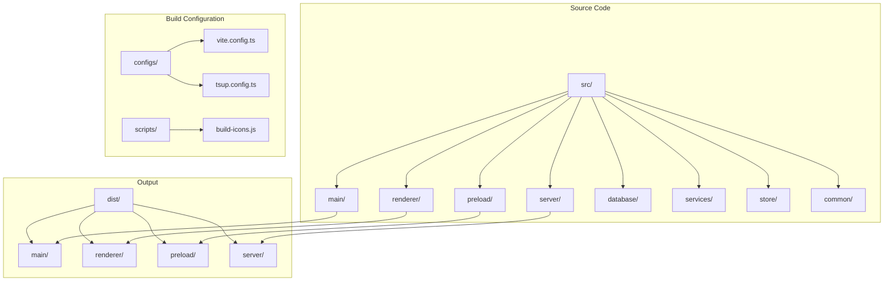
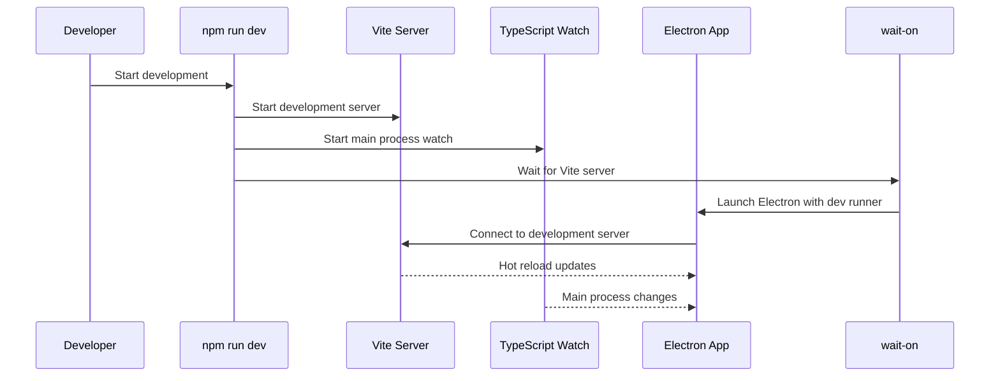
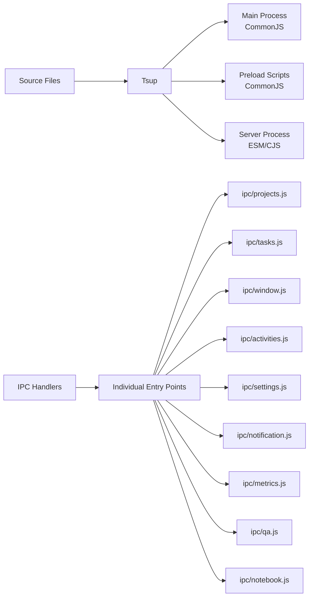
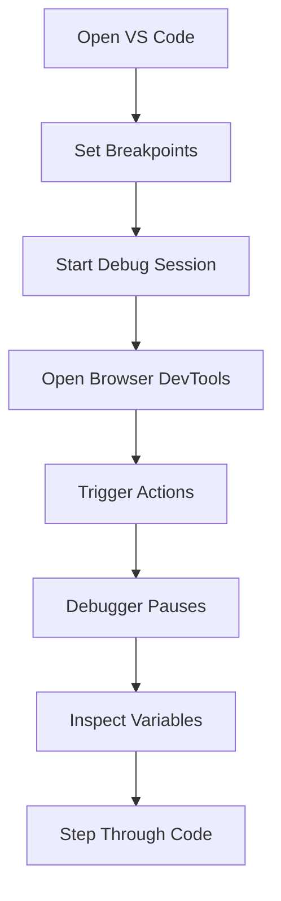
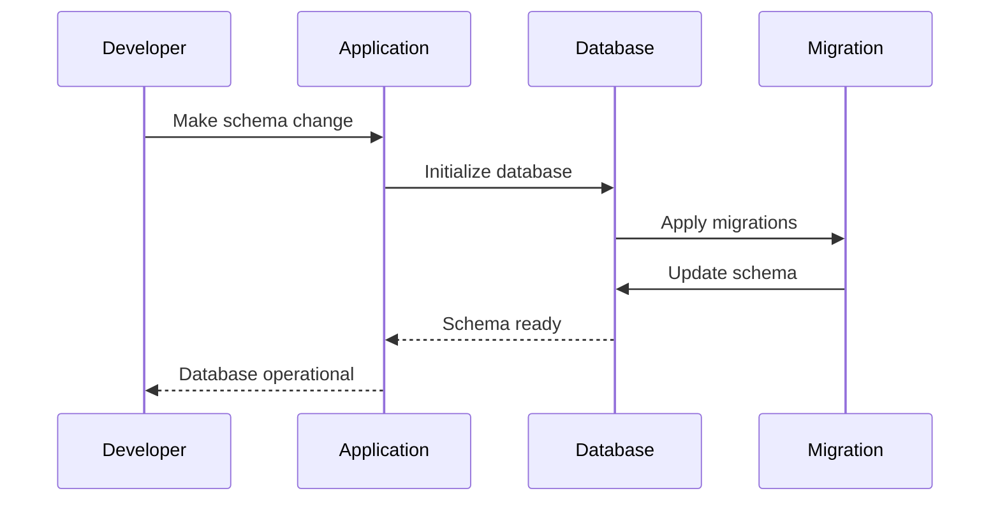

# Development Environment

<cite>
**Referenced Files in This Document**
- [package.json](file://package.json)
- [configs/vite.config.ts](file://configs/vite.config.ts)
- [configs/tsup.config.ts](file://configs/tsup.config.ts)
- [scripts/build-icons.js](file://scripts/build-icons.js)
- [src/main/devRunner.ts](file://src/main/devRunner.ts)
- [src/main/index.ts](file://src/main/index.ts)
- [src/renderer/main.tsx](file://src/renderer/main.tsx)
- [tsconfig.json](file://tsconfig.json)
- [tsconfig.main.json](file://tsconfig.main.json)
- [tsconfig.server.json](file://tsconfig.server.json)
- [src/preload/index.ts](file://src/preload/index.ts)
- [src/renderer/App.tsx](file://src/renderer/App.tsx)
- [src/renderer/index.html](file://src/renderer/index.html)
- [src/main/ipc/window.ts](file://src/main/ipc/window.ts)
</cite>

## Table of Contents
1. [Introduction](#introduction)
2. [Prerequisites](#prerequisites)
3. [Project Setup](#project-setup)
4. [Development Scripts](#development-scripts)
5. [Build Configuration](#build-configuration)
6. [Development Workflows](#development-workflows)
7. [Cross-Platform Development](#cross-platform-development)
8. [Debugging Guide](#debugging-guide)
9. [Troubleshooting](#troubleshooting)
10. [Best Practices](#best-practices)

## Introduction

LifeOS is a modern Electron application built with React, TypeScript, and modern development tools. The development environment is designed to provide efficient workflows for both frontend (renderer process) and backend (main process) development, with hot reloading capabilities and comprehensive build tooling.

The application follows a modular architecture with separate build processes for different components:
- **Renderer Process**: React-based UI built with Vite
- **Main Process**: Electron main process built with tsup
- **Preload Scripts**: Security bridge between main and renderer
- **Server Process**: MCP (Model Context Protocol) server
- **Icons**: Platform-specific icon generation

## Prerequisites

### System Requirements
- **Node.js**: Version 18 or higher
- **npm**: Version 8 or higher
- **Git**: For version control
- **Operating System**: Windows, macOS, or Linux

### Recommended Development Tools
- **Code Editor**: VS Code with recommended extensions
- **Node.js Debugger**: For debugging Electron applications
- **Browser Developer Tools**: For frontend debugging

## Project Setup

### Initial Setup

1. **Clone the Repository**
```bash
git clone https://github.com/yourusername/lifeos.git
cd lifeos
```

2. **Install Dependencies**
```bash
npm install
```

3. **Verify Installation**
```bash
npm run typecheck
npm run lint
```

### Directory Structure Overview



**Section sources**
- [package.json](file://package.json#L1-L109)
- [README.md](file://README.md#L1-L50)

## Development Scripts

### Available Scripts

The project provides comprehensive development scripts organized by functionality:

| Script | Purpose | Description |
|--------|---------|-------------|
| `npm run dev` | Development Mode | Starts both renderer and main processes with hot reloading |
| `npm run dev:vite` | Renderer Dev | Starts Vite development server only |
| `npm run dev:main` | Main Process Dev | Starts TypeScript compiler in watch mode |
| `npm run build` | Full Build | Builds all components for production |
| `npm run build:renderer` | Renderer Build | Builds React application |
| `npm run build:main` | Main Process Build | Builds Electron main process |
| `npm run build:preload` | Preload Build | Builds preload scripts |
| `npm run build:server` | Server Build | Builds MCP server |
| `npm run build:icons` | Icon Build | Generates platform-specific icons |
| `npm run start` | Production Start | Runs production build |
| `npm run pack` | Packaging | Creates development package |
| `npm run dist` | Distribution | Creates production distribution |

### Development Mode Workflow



**Diagram sources**
- [package.json](file://package.json#L8-L18)
- [src/main/devRunner.ts](file://src/main/devRunner.ts#L1-L40)

### Script Implementation Details

#### Development Runner
The development runner combines multiple processes using `concurrently` and `wait-on` to coordinate the development environment.

#### Main Process Development
The main process uses TypeScript's watch mode with persistent output to maintain clean terminal output during development.

#### Renderer Development
The renderer process uses Vite's development server with hot module replacement for rapid UI iteration.

**Section sources**
- [package.json](file://package.json#L8-L18)
- [src/main/devRunner.ts](file://src/main/devRunner.ts#L1-L40)

## Build Configuration

### Vite Configuration

Vite serves as the primary build tool for the React renderer process, providing fast development builds and optimized production bundles.

#### Key Configuration Features

| Feature | Configuration | Purpose |
|---------|---------------|---------|
| **Entry Point** | `src/renderer` | Root directory for React application |
| **Output Directory** | `dist/renderer` | Production build output |
| **Base URL** | `./` | Relative asset paths |
| **Development Port** | `5173` | Local development server port |
| **Aliases** | `@renderer`, `@common` | Path resolution shortcuts |

#### Vite Plugin Configuration
- **React Plugin**: Enables JSX transformation and Fast Refresh
- **Path Resolution**: Simplifies imports with alias configuration

### Tsup Configuration

Tsup handles the TypeScript compilation for all Node.js processes (main, preload, server) with optimized output formats.

#### Multi-Target Compilation



**Diagram sources**
- [configs/tsup.config.ts](file://configs/tsup.config.ts#L3-L15)

#### Build Targets and Output Paths

| Process | Entry Point | Output Format | Target Directory |
|---------|-------------|---------------|------------------|
| **Main Process** | `src/main/index.ts` | CommonJS | `dist/main` |
| **Preload Scripts** | `src/preload/index.ts` | CommonJS | `dist/preload` |
| **Server Process** | `src/server/mcp-server.ts` | ES Module + CommonJS | `dist/server` |
| **IPC Handlers** | Multiple files | CommonJS | `dist/main/` |

#### External Dependencies
The configuration excludes certain dependencies from bundling:
- **Electron**: Handled by Electron runtime
- **Better-SQLite3**: Native module requiring separate installation

**Section sources**
- [configs/vite.config.ts](file://configs/vite.config.ts#L1-L24)
- [configs/tsup.config.ts](file://configs/tsup.config.ts#L1-L31)

## Development Workflows

### Standard Development Workflow

1. **Start Development Environment**
```bash
npm run dev
```

2. **Make Changes**
   - Modify React components in `src/renderer/`
   - Update main process logic in `src/main/`
   - Add IPC handlers in `src/main/ipc/`
   - Update TypeScript types in `src/common/`

3. **Hot Reload**
   - React components update instantly
   - Main process requires restart for significant changes
   - Database schema changes need migration

### Debugging Workflows

#### Debugging Renderer Process


#### Debugging Main Process
The main process can be debugged using VS Code's Node.js debugger with the appropriate launch configuration.

#### Debugging IPC Communication
IPC communication can be monitored through:
- Console logs in main process
- Network tab in Electron DevTools
- Custom logging in IPC handlers

### Database Development Workflow



**Section sources**
- [src/main/index.ts](file://src/main/index.ts#L1-L110)
- [src/main/ipc/window.ts](file://src/main/ipc/window.ts#L1-L27)

## Cross-Platform Development

### Platform-Specific Considerations

#### Windows Development
- **Icon Format**: Requires `.ico` files for Windows installer
- **Path Separators**: Uses backslashes `\` in file paths
- **PowerShell Scripts**: Some build scripts use PowerShell commands

#### macOS Development
- **App Signing**: Requires code signing for distribution
- **DMG Creation**: Uses DMG format for macOS packages
- **Notarization**: Apple's notarization process for security

#### Linux Development
- **Package Formats**: Supports AppImage and DEB packages
- **Desktop Integration**: Requires proper desktop entry files
- **Permissions**: May need special permissions for certain features

### Cross-Platform Build Configuration

The project uses electron-builder for cross-platform packaging with platform-specific configurations:

| Platform | Package Types | Target Architecture |
|----------|---------------|-------------------|
| **Windows** | NSIS, Portable | x64 |
| **macOS** | DMG, ZIP | Universal (Intel + Apple Silicon) |
| **Linux** | AppImage, DEB | x64 |

### Development Environment Setup

#### Windows
```bash
# Install dependencies
npm install

# Start development
npm run dev

# Build for distribution
npm run dist
```

#### macOS
```bash
# Install dependencies
npm install

# Start development
npm run dev

# Build for distribution
npm run dist
```

#### Linux
```bash
# Install dependencies
npm install

# Start development
npm run dev

# Build for distribution
npm run dist
```

**Section sources**
- [package.json](file://package.json#L20-L50)

## Debugging Guide

### Common Debugging Scenarios

#### Hot Reload Issues
**Problem**: Changes in renderer process don't trigger hot reload
**Solution**:
1. Check Vite development server status
2. Verify file watchers are active
3. Restart development server if necessary
4. Clear Vite cache: `rm -rf node_modules/.vite`

#### Main Process Crashes
**Problem**: Application crashes immediately after starting
**Solution**:
1. Check main process console output
2. Verify database initialization
3. Review IPC handler registration
4. Check for missing dependencies

#### IPC Communication Failures
**Problem**: Renderer can't communicate with main process
**Solution**:
1. Verify preload script is loaded
2. Check context isolation settings
3. Review IPC handler registration
4. Monitor console for error messages

### Debugging Tools and Techniques

#### Browser DevTools
- **React DevTools**: Inspect component state and props
- **Network Tab**: Monitor API requests and IPC communication
- **Console**: View application logs and error messages

#### Electron DevTools
- **Main Process**: Access via `Ctrl+Shift+I` (Windows/Linux) or `Cmd+Opt+I` (macOS)
- **Renderer Process**: Right-click → Inspect Element
- **Performance**: Profile application performance

#### VS Code Debugging
Configure VS Code launch.json for:
- **Main Process**: Attach to Electron process
- **Renderer Process**: Chrome debugger
- **Preload Scripts**: Node.js debugger

### Logging Strategies

#### Application Logging
```typescript
// Main process logging
console.log('Application started');
console.error('Error occurred:', error);

// Renderer process logging
window.api.logger.info('Action performed', { data });
```

#### Database Logging
Enable SQL query logging for debugging database operations.

**Section sources**
- [src/main/devRunner.ts](file://src/main/devRunner.ts#L1-L40)
- [src/main/index.ts](file://src/main/index.ts#L50-L80)

## Troubleshooting

### Common Development Issues

#### Build Failures

**Issue**: TypeScript compilation errors
**Causes**:
- Missing type definitions
- Incorrect import paths
- Type mismatches

**Solutions**:
1. Run `npm run typecheck` to identify issues
2. Check import statements and path resolution
3. Verify type definitions are installed

**Issue**: Vite build errors
**Causes**:
- Missing dependencies
- Configuration issues
- File path problems

**Solutions**:
1. Clear Vite cache: `rm -rf node_modules/.vite`
2. Check Vite configuration in `configs/vite.config.ts`
3. Verify file permissions and paths

#### Development Server Issues

**Issue**: Vite development server fails to start
**Causes**:
- Port 5173 already in use
- Missing dependencies
- Configuration errors

**Solutions**:
1. Change port in Vite config or kill existing process
2. Reinstall dependencies: `npm install`
3. Check Vite configuration syntax

#### Electron Application Issues

**Issue**: Application won't start in development
**Causes**:
- Main process compilation errors
- Missing resources
- Incorrect environment variables

**Solutions**:
1. Check main process console output
2. Verify resource paths in development
3. Review environment variable configuration

### Performance Issues

#### Slow Development Builds
**Symptoms**: Long compilation times, slow hot reload
**Solutions**:
1. Increase memory allocation for Node.js
2. Use SSD storage for project files
3. Optimize TypeScript configuration
4. Enable incremental compilation

#### Memory Leaks
**Symptoms**: Increasing memory usage over time
**Solutions**:
1. Monitor memory usage with DevTools
2. Check for unclosed database connections
3. Review event listener cleanup
4. Use memory profiling tools

### Platform-Specific Issues

#### Windows Specific
- **Antivirus Interference**: Add project directory to antivirus exclusions
- **Path Length Limits**: Use shorter project paths or enable long path support
- **PowerShell Execution Policy**: Adjust execution policy for build scripts

#### macOS Specific
- **Gatekeeper Blocking**: Allow unsigned applications temporarily
- **Permission Issues**: Grant necessary permissions for file access
- **Code Signing**: Configure proper code signing certificates

#### Linux Specific
- **Missing Dependencies**: Install system dependencies for native modules
- **Desktop Integration**: Ensure proper desktop entry files
- **Permission Issues**: Fix file permissions for executable files

**Section sources**
- [scripts/build-icons.js](file://scripts/build-icons.js#L1-L52)
- [src/main/devRunner.ts](file://src/main/devRunner.ts#L35-L40)

## Best Practices

### Development Workflow Recommendations

#### Code Organization
1. **Separate Concerns**: Keep main process, renderer, and shared code separate
2. **Type Safety**: Use TypeScript consistently with strict mode enabled
3. **Import Management**: Use path aliases for cleaner imports
4. **Error Handling**: Implement comprehensive error handling and logging

#### Performance Optimization
1. **Bundle Size**: Monitor bundle sizes and optimize imports
2. **Lazy Loading**: Implement lazy loading for heavy components
3. **Database Queries**: Optimize database queries and indexing
4. **Memory Management**: Properly dispose of resources and event listeners

#### Testing and Quality
1. **Type Checking**: Regular type checking with `npm run typecheck`
2. **Linting**: Implement ESLint for code quality
3. **Unit Tests**: Write unit tests for critical functionality
4. **Integration Tests**: Test IPC communication and database operations

### Development Environment Setup

#### Recommended VS Code Extensions
- **TypeScript Hero**: Improve TypeScript development
- **ES7+ React/Redux/React-Native snippets**: Faster React development
- **Prettier**: Code formatting
- **ESLint**: Code quality enforcement

#### Environment Configuration
1. **EditorConfig**: Consistent code formatting
2. **Git Hooks**: Automated linting and testing
3. **VS Code Settings**: Configure for optimal development experience

### Deployment Preparation

#### Pre-Release Checklist
1. **Type Checking**: Ensure no TypeScript errors
2. **Testing**: Run all tests and manual verification
3. **Build Verification**: Test production builds
4. **Platform Testing**: Verify functionality on all target platforms

#### Release Process
1. **Version Bumping**: Update version numbers appropriately
2. **Changelog**: Maintain release notes
3. **Build Verification**: Test all build targets
4. **Distribution**: Prepare platform-specific distributions

**Section sources**
- [package.json](file://package.json#L1-L109)
- [tsconfig.json](file://tsconfig.json#L1-L19)