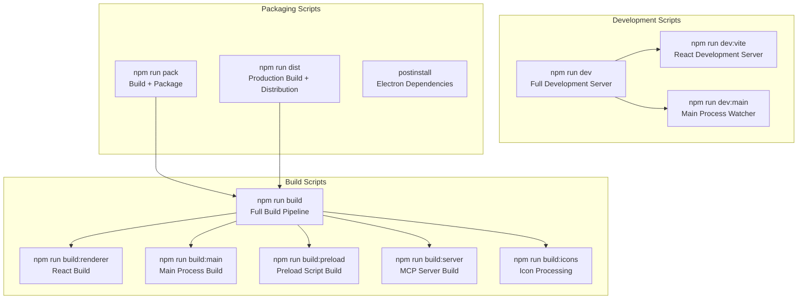
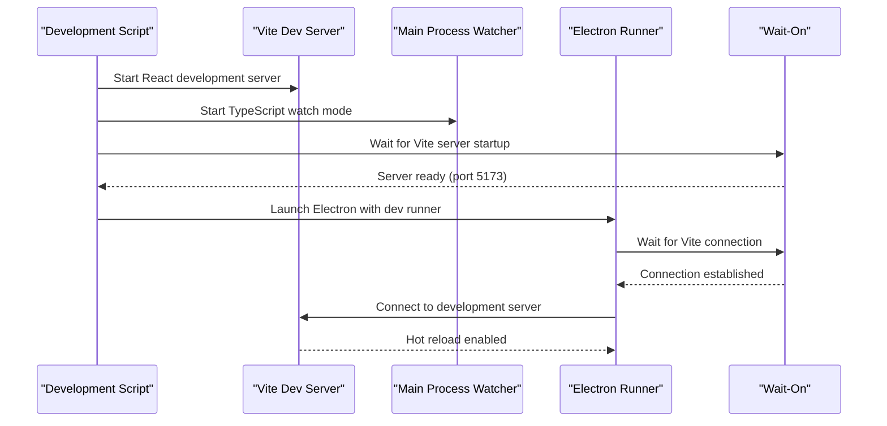
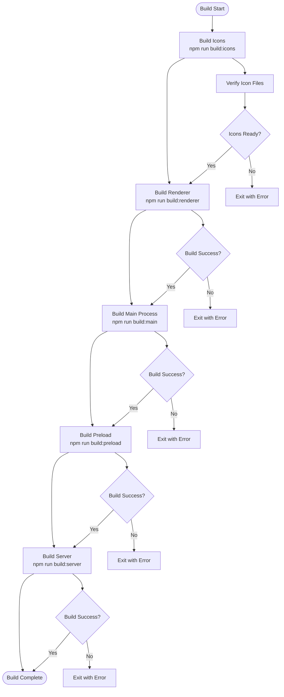
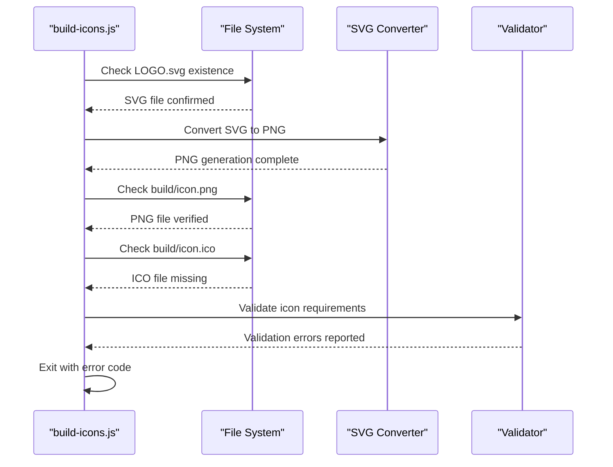
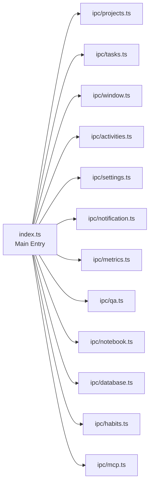
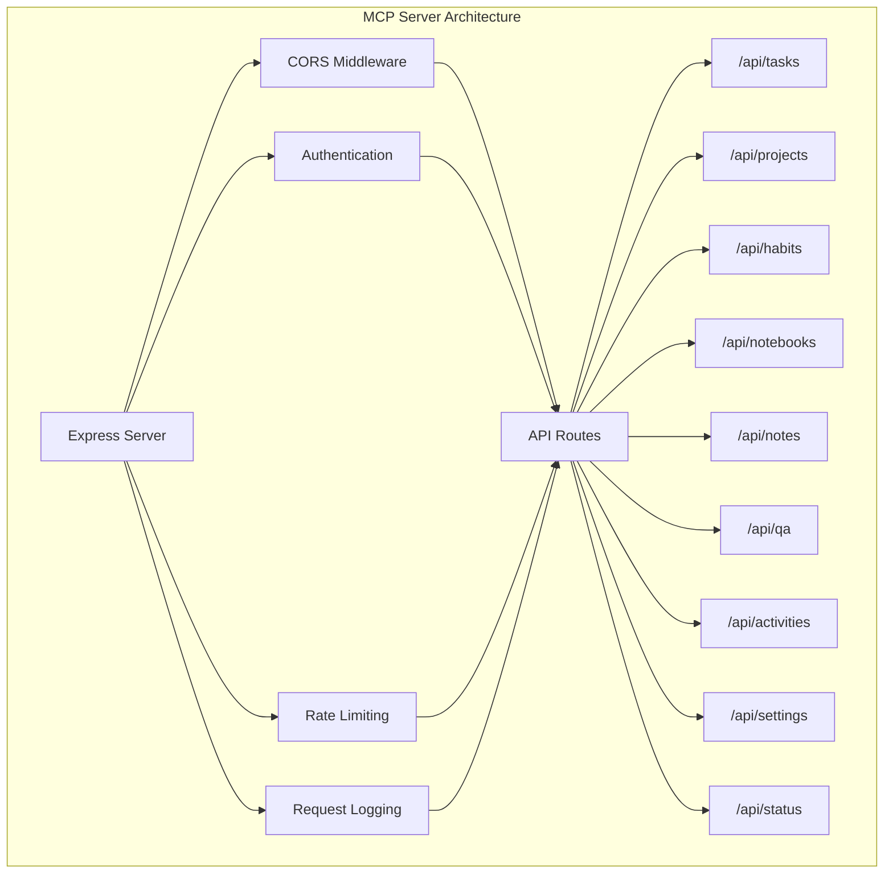

# Development Scripts

<cite>
**Referenced Files in This Document**
- [package.json](file://package.json)
- [scripts/build-icons.js](file://scripts/build-icons.js)
- [scripts/convert-svg-to-png.ps1](file://scripts/convert-svg-to-png.ps1)
- [configs/vite.config.ts](file://configs/vite.config.ts)
- [configs/tsup.config.ts](file://configs/tsup.config.ts)
- [src/main/devRunner.ts](file://src/main/devRunner.ts)
- [src/main/index.ts](file://src/main/index.ts)
- [src/server/mcp-server.ts](file://src/server/mcp-server.ts)
- [README.md](file://README.md)
</cite>

## Table of Contents
1. [Introduction](#introduction)
2. [Development Script Overview](#development-script-overview)
3. [Core Development Scripts](#core-development-scripts)
4. [Build System Architecture](#build-system-architecture)
5. [Platform-Specific Packaging](#platform-specific-packaging)
6. [Development Workflows](#development-workflows)
7. [Troubleshooting Guide](#troubleshooting-guide)
8. [Best Practices](#best-practices)
9. [Environment Configuration](#environment-configuration)

## Introduction

LifeOS employs a sophisticated multi-process architecture built with Electron, React, and TypeScript. The development scripts are designed to handle the complexity of this architecture while providing efficient development workflows. The build system orchestrates multiple processes including renderer compilation, main process building, preload script generation, server setup, and icon processing.

## Development Script Overview

The LifeOS project utilizes npm scripts to manage various development and build tasks. These scripts are organized into several categories: development servers, build processes, packaging, and utility functions. The architecture supports both individual component builds and comprehensive full-stack builds.



**Diagram sources**
- [package.json](file://package.json#L6-L25)

**Section sources**
- [package.json](file://package.json#L6-L25)

## Core Development Scripts

### Development Server (`npm run dev`)

The primary development command starts a comprehensive development environment with hot reloading capabilities across all application components.

#### Command Structure
```bash
npm run dev
```

#### Architecture and Components

The development script uses `concurrently` to orchestrate multiple development processes simultaneously:



**Diagram sources**
- [package.json](file://package.json#L9-L10)
- [src/main/devRunner.ts](file://src/main/devRunner.ts#L6-L20)

#### Development Environment Features

1. **Hot Reload Integration**: React components update instantly without full page refresh
2. **TypeScript Compilation**: Real-time type checking and compilation
3. **Cross-Process Communication**: Seamless integration between main and renderer processes
4. **Development Tools**: Browser developer tools accessible through Electron

#### Environment Variables

The development script sets up essential environment variables:
- `NODE_ENV=development`: Enables development-specific features
- `VITE_DEV_SERVER_URL=http://localhost:5173`: URL for renderer communication
- `cross-env`: Ensures cross-platform compatibility

**Section sources**
- [package.json](file://package.json#L9-L10)
- [src/main/devRunner.ts](file://src/main/devRunner.ts#L18-L25)

### Development Server Components

#### Vite Development Server (`npm run dev:vite`)

Separates the React development server for focused UI development:

```bash
npm run dev:vite
```

Features:
- Port 5173 with strict port binding
- React Fast Refresh for instant UI updates
- TypeScript support with JSX compilation
- Alias resolution for improved import paths

#### Main Process Development (`npm run dev:main`)

Monitors and compiles the Electron main process:

```bash
npm run dev:main
```

Key characteristics:
- TypeScript compilation with watch mode
- Preserves watch output for continuous monitoring
- Targets Node.js environment
- Handles IPC handler registration

**Section sources**
- [package.json](file://package.json#L7-L8)
- [configs/vite.config.ts](file://configs/vite.config.ts#L1-L24)
- [configs/tsup.config.ts](file://configs/tsup.config.ts#L1-L31)

## Build System Architecture

### Composite Build Process

The main build script orchestrates a sophisticated pipeline that processes multiple application components in the correct order.



**Diagram sources**
- [package.json](file://package.json#L15-L16)
- [scripts/build-icons.js](file://scripts/build-icons.js#L15-L51)

### Icon Processing System (`npm run build:icons`)

The icon processing pipeline ensures all required icon formats are available for cross-platform distribution.

#### Icon Requirements

| Platform | Icon Format | Size Requirements |
|----------|-------------|-------------------|
| Windows | `.ico` | Multi-size (16x16, 32x32, 48x48, 256x256) |
| macOS | `.png` | 1024x1024 |
| Linux | `.png` | 1024x1024 |

#### Icon Processing Workflow



**Diagram sources**
- [scripts/build-icons.js](file://scripts/build-icons.js#L15-L51)

#### Icon Validation Process

The script performs comprehensive validation of icon files:

1. **Source Verification**: Confirms `LOGO.svg` exists in project root
2. **PNG Generation**: Validates `build/icon.png` (1024x1024)
3. **ICO Format**: Ensures Windows installer compatibility
4. **Error Reporting**: Provides detailed troubleshooting guidance

**Section sources**
- [package.json](file://package.json#L14)
- [scripts/build-icons.js](file://scripts/build-icons.js#L15-L51)

### Renderer Build (`npm run build:renderer`)

Compiles the React application using Vite for optimal performance and modern JavaScript features.

#### Build Configuration

The Vite configuration optimizes for production deployment:

- **Output Directory**: `dist/renderer`
- **Base Path**: Relative (`./`) for flexible deployment
- **Empty Output Directory**: Clean slate for each build
- **React Plugin**: JSX transformation and Fast Refresh
- **Path Aliases**: Simplified import statements

#### Development vs Production Differences

| Aspect | Development | Production |
|--------|-------------|------------|
| Hot Reload | Enabled | Disabled |
| Source Maps | Included | Optional |
| Minification | Disabled | Enabled |
| Tree Shaking | Selective | Aggressive |
| Bundle Splitting | Dynamic | Static |

**Section sources**
- [package.json](file://package.json#L11)
- [configs/vite.config.ts](file://configs/vite.config.ts#L1-L24)

### Main Process Build (`npm run build:main`)

Uses TSUP to compile the Electron main process with optimized output.

#### TSUP Configuration Features

- **Entry Points**: Multiple IPC handler modules
- **Format**: CommonJS for Node.js compatibility
- **Platform**: Targeted for Node.js runtime
- **External Dependencies**: Excludes Electron and SQLite
- **Source Maps**: Enabled for debugging
- **Minification**: Disabled for development flexibility

#### Module Organization

The main process build includes separate modules for different IPC handlers:



**Diagram sources**
- [configs/tsup.config.ts](file://configs/tsup.config.ts#L4-L17)

**Section sources**
- [package.json](file://package.json#L12)
- [configs/tsup.config.ts](file://configs/tsup.config.ts#L1-L31)

### Preload Script Build (`npm run build:preload`)

Compiles the secure IPC bridge between main and renderer processes.

#### Security Features

- **Context Isolation**: Prevents renderer access to Node.js APIs
- **Preload Exposure**: Controlled API surface for renderer access
- **Type Safety**: Full TypeScript support for secure IPC
- **Minimal Attack Surface**: Only exposes necessary functionality

**Section sources**
- [package.json](file://package.json#L13)

### Server Build (`npm run build:server`)

Compiles the MCP (Model Context Protocol) server with dual format support.

#### Server Architecture

The MCP server provides RESTful APIs for external integrations:



**Diagram sources**
- [src/server/mcp-server.ts](file://src/server/mcp-server.ts#L18-L50)

#### Build Formats

- **ESM**: Modern module format for Node.js 18+
- **CommonJS**: Traditional Node.js format
- **Dual Output**: Ensures compatibility across environments

**Section sources**
- [package.json](file://package.json#L16)
- [src/server/mcp-server.ts](file://src/server/mcp-server.ts#L18-L50)

## Platform-Specific Packaging

### Packaging Commands

LifeOS supports cross-platform packaging with platform-specific optimizations.

#### Universal Packaging (`npm run pack`)

Combines building and packaging into a single command:

```bash
npm run pack
```

This creates development-ready packages for the current platform.

#### Distribution Packaging (`npm run dist`)

Creates production-ready distributions:

```bash
npm run dist
```

#### Platform-Specific Commands

| Command | Platform | Output Format |
|---------|----------|---------------|
| `npm run pack:win` | Windows | NSIS installer, Portable |
| `npm run pack:mac` | macOS | DMG, ZIP archive |
| `npm run pack:linux` | Linux | AppImage, DEB package |

### Electron Builder Configuration

The packaging system uses electron-builder with comprehensive platform support:

#### Windows Configuration
- **Formats**: NSIS installer, Portable
- **Architectures**: x64
- **Icons**: Multi-size ICO format
- **Install Directory**: User-selectable

#### macOS Configuration
- **Formats**: DMG, ZIP
- **Categories**: Productivity applications
- **Signing**: Code signing support
- **Notarization**: Apple notarization support

#### Linux Configuration
- **Formats**: AppImage, DEB
- **Categories**: Office applications
- **Dependencies**: Automatic dependency resolution

**Section sources**
- [package.json](file://package.json#L26-L58)

## Development Workflows

### UI-Only Development

For focused React development without main process changes:

```bash
# Start Vite development server only
npm run dev:vite

# Or for quick renderer testing
npm run build:renderer
```

#### Workflow Benefits
- **Faster Startup**: No main process compilation overhead
- **Instant Updates**: Hot reload for React components
- **Focused Testing**: Isolated UI development environment

### Main Process Development

For backend logic and IPC handler development:

```bash
# Start main process watcher
npm run dev:main

# Manual restart for significant changes
# Ctrl+C to stop, then restart
```

#### Best Practices
- **Incremental Changes**: Make small, testable modifications
- **Logging**: Use console.log for debugging
- **Error Handling**: Implement robust error catching

### Mixed Development

For simultaneous UI and backend development:

```bash
# Full development environment
npm run dev

# Alternative: Separate terminals
# Terminal 1: npm run dev:vite
# Terminal 2: npm run dev:main
# Terminal 3: npm run dev:electron
```

### Database Development

For database schema and repository development:

```bash
# Development with database
npm run dev

# Database-only testing
npm run typecheck
```

#### Database Workflow
1. **Schema Changes**: Modify TypeScript interfaces
2. **Repository Updates**: Update data access logic
3. **Testing**: Use development mode for validation
4. **Migration**: Plan schema migrations carefully

**Section sources**
- [package.json](file://package.json#L7-L10)
- [src/main/index.ts](file://src/main/index.ts#L40-L60)

## Troubleshooting Guide

### Common Script Execution Failures

#### 1. Icon Processing Failures

**Symptoms**: Build fails with icon-related errors
**Causes**: Missing or invalid icon files
**Solutions**:
- Verify `LOGO.svg` exists in project root
- Ensure `build/icon.png` is generated (1024x1024)
- Convert PNG to ICO format for Windows support
- Use online converters: convertio.co, icomoon.io

#### 2. TypeScript Compilation Errors

**Symptoms**: Build fails with TypeScript errors
**Causes**: Type mismatches, missing dependencies
**Solutions**:
```bash
# Run type checking
npm run typecheck

# Clear TypeScript cache
rm -rf node_modules/.cache

# Reinstall dependencies
npm install
```

#### 3. Development Server Issues

**Symptoms**: Vite server fails to start or hot reload
**Causes**: Port conflicts, dependency issues
**Solutions**:
```bash
# Check port availability
netstat -an | grep 5173

# Kill conflicting processes
kill $(lsof -t -i:5173)

# Clear Vite cache
rm -rf node_modules/.vite
```

#### 4. Main Process Compilation Problems

**Symptoms**: Electron fails to start or crashes
**Causes**: IPC handler errors, module loading issues
**Solutions**:
```bash
# Check main process logs
npm run dev:main

# Verify module exports
node -e "console.log(require('./dist/main'))"

# Clean build artifacts
rm -rf dist/main
```

### Environment-Specific Issues

#### Windows Development

**PowerShell Execution Policy**:
```powershell
Set-ExecutionPolicy -ExecutionPolicy Bypass -Scope Process
```

**Path Length Issues**:
- Use shorter project paths
- Enable long path support in Windows registry
- Consider moving project to C:\projects

#### macOS Development

**Code Signing Issues**:
```bash
# Generate self-signed certificate
security create-keychain -p "" build.keychain
security import cert.p12 -k build.keychain -P password

# Configure Xcode signing
xcode-select --install
```

#### Linux Development

**Missing Dependencies**:
```bash
# Ubuntu/Debian
sudo apt-get install libnss3 libatk-bridge2.0-0 libdrm2 libxkbcommon0 libxcomposite1 libxdamage1 libxrandr2 libgbm1 libxss1 libasound2

# CentOS/RHEL
sudo yum install nss atk at-spi2-atk libdrm libxkbcommon libxcomposite libxdamage libxrandr mesa-libgbm libXScrnSaver alsa-lib
```

### Debugging Strategies

#### 1. Incremental Build Testing

```bash
# Test individual components
npm run build:renderer
npm run build:main
npm run build:preload
npm run build:server

# Combine selectively
npm run build:icons && npm run build:renderer
```

#### 2. Environment Variable Debugging

```bash
# Enable verbose logging
DEBUG=* npm run dev

# Check environment setup
node -e "console.log(process.env)"
```

#### 3. Process Monitoring

```bash
# Monitor build processes
ps aux | grep npm
ps aux | grep electron

# Check port usage
lsof -i :5173
```

**Section sources**
- [scripts/build-icons.js](file://scripts/build-icons.js#L18-L51)
- [src/main/devRunner.ts](file://src/main/devRunner.ts#L35-L40)

## Best Practices

### Development Workflow Optimization

#### 1. Script Selection Strategy

Choose appropriate scripts based on development needs:

- **UI Development**: `npm run dev:vite` + `npm run dev:main`
- **Backend Development**: `npm run dev:main` + manual Electron restart
- **Full Stack**: `npm run dev` for comprehensive development
- **Testing**: `npm run build` for production-like validation

#### 2. Build Artifact Management

Maintain clean build environments:

```bash
# Clean all build artifacts
npm run clean

# Clean specific components
rm -rf dist/renderer
rm -rf dist/main
rm -rf dist/preload
rm -rf dist/server
```

#### 3. Dependency Management

Keep development dependencies current:

```bash
# Update development dependencies
npm update --save-dev

# Check for vulnerabilities
npm audit
npm audit fix
```

### Performance Optimization

#### 1. Development Server Performance

- **Memory Usage**: Monitor Vite server memory consumption
- **Disk I/O**: Use SSD storage for faster compilation
- **Network**: Ensure stable internet connection for dependencies

#### 2. Build Performance

- **Parallel Processing**: Utilize multiple CPU cores
- **Incremental Builds**: Leverage watch mode for faster iteration
- **Cache Management**: Clear caches periodically to prevent bloat

#### 3. Resource Monitoring

```bash
# Monitor system resources during development
htop
top
Activity Monitor (macOS)

# Check disk space
df -h
```

### Error Prevention

#### 1. Code Quality Checks

```bash
# Type checking before build
npm run typecheck

# Linting (when configured)
npm run lint
```

#### 2. Dependency Validation

```bash
# Verify dependency integrity
npm audit

# Check for outdated packages
npm outdated
```

#### 3. Environment Consistency

- **Version Control**: Include `package-lock.json`
- **Environment Files**: Use `.env` files for sensitive configuration
- **CI/CD Integration**: Automated testing and validation

**Section sources**
- [package.json](file://package.json#L6-L7)
- [configs/vite.config.ts](file://configs/vite.config.ts#L1-L24)

## Environment Configuration

### Development Environment Setup

#### Required Tools

| Tool | Version | Purpose |
|------|---------|---------|
| Node.js | 18+ | Runtime environment |
| npm | Latest | Package manager |
| Git | Latest | Version control |
| PowerShell | Latest (Windows) | Script execution |

#### Environment Variables

Key environment variables for development:

- **NODE_ENV**: `development` or `production`
- **VITE_DEV_SERVER_URL**: Development server URL
- **MCP_SERVER_PORT**: MCP server port (default: 3000)
- **MCP_SERVER_HOST**: MCP server host (default: localhost)

#### Platform-Specific Configuration

##### Windows
```powershell
# PowerShell execution policy
Set-ExecutionPolicy -ExecutionPolicy Bypass -Scope Process

# Environment variables
$env:NODE_ENV = "development"
$env:VITE_DEV_SERVER_URL = "http://localhost:5173"
```

##### macOS/Linux
```bash
# Shell configuration
export NODE_ENV=development
export VITE_DEV_SERVER_URL=http://localhost:5173

# Permission fixes
chmod +x scripts/*
```

### Production Environment

#### Build Environment Requirements

- **Node.js**: 18+ LTS version
- **Memory**: Minimum 4GB RAM
- **Storage**: 2GB free space
- **Network**: Stable internet connection

#### Deployment Configuration

```bash
# Production build
npm run build

# Start production application
npm run start

# Start MCP server
npm run mcp:start
```

### Development Tools Integration

#### IDE Configuration

Recommended VS Code extensions:
- **TypeScript Hero**: Enhanced TypeScript support
- **ES7+ React/Redux/React-Native snippets**
- **Prettier**: Code formatting
- **ESLint**: Code linting

#### Debugging Setup

```json
{
  "version": "0.2.0",
  "configurations": [
    {
      "name": "Debug Electron Main",
      "type": "node",
      "request": "launch",
      "program": "${workspaceFolder}/src/main/index.ts",
      "preLaunchTask": "npm: dev:main",
      "outFiles": ["${workspaceFolder}/dist/main/**/*.js"],
      "sourceMaps": true
    },
    {
      "name": "Debug React Renderer",
      "type": "chrome",
      "request": "attach",
      "port": 5173,
      "webRoot": "${workspaceFolder}/src/renderer"
    }
  ]
}
```

**Section sources**
- [package.json](file://package.json#L6-L25)
- [src/main/index.ts](file://src/main/index.ts#L40-L60)
- [src/server/mcp-server.ts](file://src/server/mcp-server.ts#L18-L25)