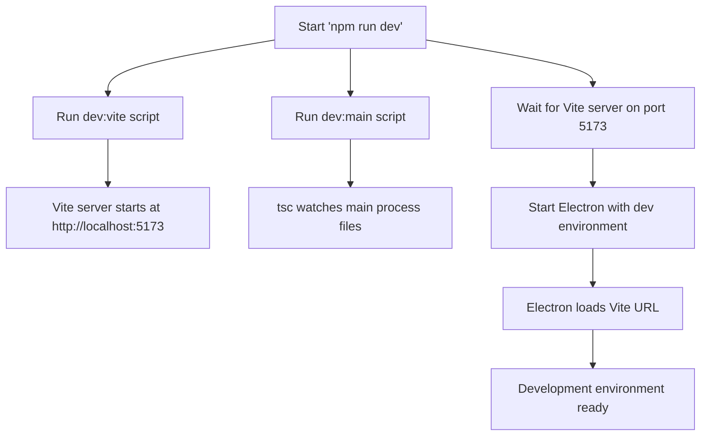
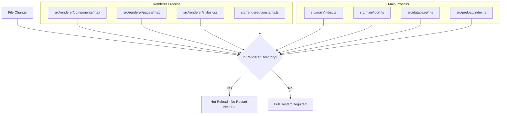
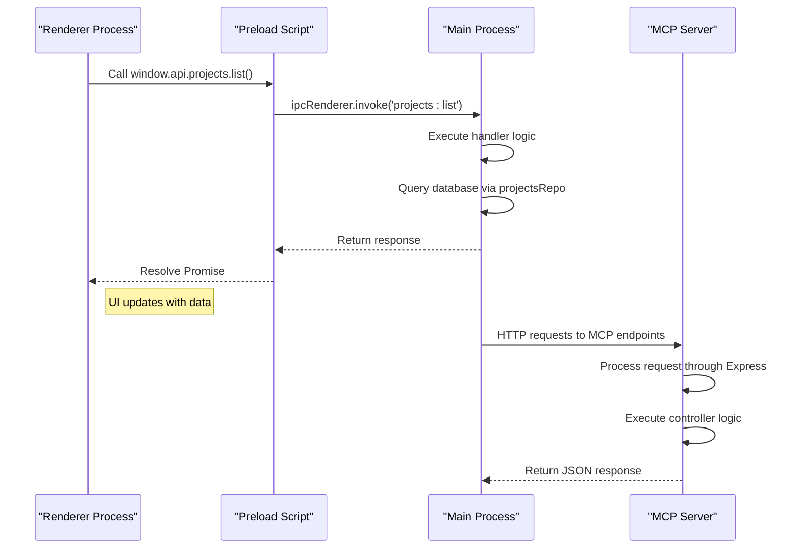
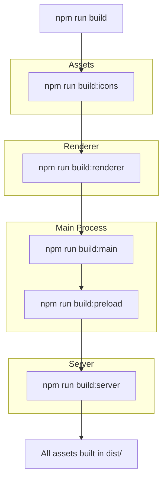

# Development Workflow

<cite>
**Referenced Files in This Document**   
- [package.json](file://package.json)
- [vite.config.ts](file://configs/vite.config.ts)
- [tsup.config.ts](file://configs/tsup.config.ts)
- [devRunner.ts](file://src/main/devRunner.ts)
- [index.ts](file://src/main/index.ts)
- [main.tsx](file://src/renderer/main.tsx)
- [index.ts](file://src/preload/index.ts)
- [mcp-server.ts](file://src/server/mcp-server.ts)
- [projects.ts](file://src/main/ipc/projects.ts)
- [init.ts](file://src/database/init.ts)
- [tsconfig.json](file://tsconfig.json)
- [tsconfig.main.json](file://tsconfig.main.json)
- [tsconfig.server.json](file://tsconfig.server.json)
</cite>

## Table of Contents
1. [Development Environment Setup](#development-environment-setup)
2. [Hot Reload and Development Scripts](#hot-reload-and-development-scripts)
3. [Renderer vs Main Process Changes](#renderer-vs-main-process-changes)
4. [Debugging Techniques](#debugging-techniques)
5. [Build and Compilation Process](#build-and-compilation-process)
6. [Best Practices for Efficient Development](#best-practices-for-efficient-development)
7. [Common Workflow Issues and Solutions](#common-workflow-issues-and-solutions)

## Development Environment Setup

The LifeOS project utilizes a modern Electron-based architecture with a React frontend (renderer process) and Node.js backend (main process). The development environment is configured through multiple configuration files that define TypeScript compilation, Vite-based frontend development server, and tsup-based bundling for the main process.

The project uses separate TypeScript configurations for different parts of the application:
- `tsconfig.json` - Base configuration for the renderer process
- `tsconfig.main.json` - Configuration for the main Electron process
- `tsconfig.server.json` - Configuration for the MCP (Microservice Control Plane) server

The Vite development server is configured in `vite.config.ts` to serve the renderer process from `src/renderer` with hot module replacement enabled. The server runs on port 5173 and uses aliases for cleaner imports (`@renderer` and `@common`).

**Section sources**
- [tsconfig.json](file://tsconfig.json#L1-L19)
- [tsconfig.main.json](file://tsconfig.main.json#L1-L29)
- [tsconfig.server.json](file://tsconfig.server.json#L1-L32)
- [vite.config.ts](file://configs/vite.config.ts#L1-L24)

## Hot Reload and Development Scripts

The development workflow is orchestrated through npm scripts defined in `package.json`. The primary development script is `dev`, which runs multiple processes in parallel using the `concurrently` package:

```json
"dev": "concurrently -k \"npm:dev:vite\" \"npm:dev:main\" \"wait-on tcp:5173 && cross-env NODE_ENV=development VITE_DEV_SERVER_URL=http://localhost:5173 electron .\""
```

This script runs three parallel processes:
1. `dev:vite` - Starts the Vite development server for the renderer process
2. `dev:main` - Watches and compiles the main process TypeScript files
3. Electron application - Launches the Electron app once the Vite server is available

The `wait-on` utility ensures that Electron only starts after the Vite server is ready on port 5173. The `devRunner.ts` file handles the Electron process spawning with proper environment variables and error handling.



**Diagram sources**
- [package.json](file://package.json#L10-L15)
- [devRunner.ts](file://src/main/devRunner.ts#L1-L40)

**Section sources**
- [package.json](file://package.json#L10-L15)
- [devRunner.ts](file://src/main/devRunner.ts#L1-L40)
- [vite.config.ts](file://configs/vite.config.ts#L1-L24)

## Renderer vs Main Process Changes

The LifeOS architecture follows Electron's multi-process model, which results in different development workflows for renderer and main process changes.

### Renderer Process Changes (Hot Reload)

Changes to files in the `src/renderer` directory benefit from Vite's hot module replacement (HMR) system. When a file is modified:

1. Vite detects the change through file system watchers
2. The affected module is recompiled
3. The updated module is pushed to the browser via WebSocket
4. The component is updated without full page reload

This enables rapid iteration on UI components, styles, and React logic. Files that trigger hot reload include:
- React components in `src/renderer/components/`
- Pages in `src/renderer/pages/`
- Styles in `src/renderer/styles.css`
- Configuration in `src/renderer/constants.ts`

### Main Process Changes (Require Restart)

Changes to the main Electron process require a full application restart because:

1. The main process runs Node.js code that manages Electron's lifecycle
2. This code cannot be easily hot-reloaded due to its stateful nature
3. Changes affect fundamental application behavior and IPC handlers

Files that require restart include:
- Main process entry point (`src/main/index.ts`)
- IPC handlers in `src/main/ipc/`
- Database initialization and repositories
- Preload script (`src/preload/index.ts`)

The `dev:main` script uses `tsc --watch` to automatically recompile main process files, but the Electron process must be restarted manually or through the development script orchestration.



**Diagram sources**
- [src/renderer](file://src/renderer)
- [src/main](file://src/main)
- [src/database](file://src/database)
- [src/preload](file://src/preload)

**Section sources**
- [index.ts](file://src/main/index.ts#L1-L123)
- [main.tsx](file://src/renderer/main.tsx#L1-L18)
- [index.ts](file://src/preload/index.ts#L1-L202)

## Debugging Techniques

The LifeOS project provides multiple debugging approaches for both frontend (renderer) and backend (main process, server) components.

### Frontend (Renderer) Debugging

The renderer process uses standard web development debugging tools:

1. **Browser DevTools**: Automatically opened in development mode via `mainWindow.webContents.openDevTools()` in `src/main/index.ts`
2. **React Developer Tools**: Available through the browser DevTools for inspecting component hierarchy and state
3. **Console Logging**: Browser console for debugging React components and hooks
4. **Error Boundaries**: React error boundaries to catch and handle UI errors

The preload script (`src/preload/index.ts`) exposes IPC methods to the renderer process through `contextBridge.exposeInMainWorld('api', api)`, allowing for debugging of IPC communications.

### Backend (Main Process) Debugging

Main process debugging requires different approaches:

1. **Node.js Console Output**: Logs from the main process appear in the terminal where Electron was launched
2. **IPC Message Logging**: Strategic console.log statements in IPC handlers (e.g., `src/main/ipc/projects.ts`)
3. **Electron Debugging**: Using `--inspect` or `--inspect-brk` flags for Node.js debugger attachment
4. **Error Handling**: Comprehensive error handling in main process lifecycle events

### Server (MCP) Debugging

The MCP server (`src/server/mcp-server.ts`) can be debugged independently:

```json
"mcp:dev": "ts-node -P tsconfig.server.json src/server/mcp-server.ts"
```

This script allows the MCP server to run independently of the Electron app, making it easier to debug API endpoints, middleware, and database interactions.



**Diagram sources**
- [index.ts](file://src/main/index.ts#L1-L123)
- [index.ts](file://src/preload/index.ts#L1-L202)
- [projects.ts](file://src/main/ipc/projects.ts#L1-L84)
- [mcp-server.ts](file://src/server/mcp-server.ts#L1-L80)

**Section sources**
- [index.ts](file://src/main/index.ts#L1-L123)
- [index.ts](file://src/preload/index.ts#L1-L202)
- [projects.ts](file://src/main/ipc/projects.ts#L1-L84)
- [mcp-server.ts](file://src/server/mcp-server.ts#L1-L80)

## Build and Compilation Process

The build process is configured through multiple tools and scripts that handle different parts of the application:

### Renderer Build Process

The renderer process is built using Vite with configuration in `vite.config.ts`:
- Entry point: `src/renderer/main.tsx`
- Output directory: `dist/renderer`
- Uses React plugin for JSX compilation
- Base path set to `./` for relative asset references

### Main Process Build Process

The main process is bundled using tsup (configured in `tsup.config.ts`):
- Entry points for main process and IPC handlers
- Target: Node.js 18
- Format: CommonJS
- External dependencies: electron, better-sqlite3
- Source maps enabled for debugging

### Complete Build Process

The complete build is orchestrated through npm scripts:
```json
"build": "npm run build:icons && npm run build:renderer && npm run build:main && npm run build:preload && npm run build:server"
```

This ensures all components are built in the correct order:
1. Icons are converted and optimized
2. Renderer process is built with Vite
3. Main process is bundled with tsup
4. Preload script is bundled
5. MCP server is bundled in both ESM and CJS formats



**Diagram sources**
- [package.json](file://package.json#L16-L25)
- [vite.config.ts](file://configs/vite.config.ts#L1-L24)
- [tsup.config.ts](file://configs/tsup.config.ts#L1-L31)

**Section sources**
- [package.json](file://package.json#L16-L25)
- [vite.config.ts](file://configs/vite.config.ts#L1-L24)
- [tsup.config.ts](file://configs/tsup.config.ts#L1-L31)

## Best Practices for Efficient Development

To maximize development efficiency in the LifeOS project, follow these best practices:

### Use Appropriate Development Scripts

- Use `npm run dev` for full development workflow with hot reload
- Use `npm run mcp:dev` when only developing server API endpoints
- Use `npm run typecheck` to check TypeScript types without building
- Use `npm run build:renderer` when only testing renderer changes

### Monitor Build Outputs

- Watch the terminal output for TypeScript compilation errors
- Check Vite server logs for frontend build issues
- Monitor main process console output for Electron and IPC errors
- Use the browser DevTools console for renderer process errors

### Leverage Development Tools

- Use React DevTools to inspect component state and props
- Use the Network tab to monitor IPC and API requests
- Use the Performance tab to identify rendering bottlenecks
- Use the Application tab to inspect Electron's file system and storage

### Organize Code Changes

- Make small, focused changes to minimize restarts
- Test renderer changes first, then main process changes
- Use feature branches for significant changes
- Commit frequently with descriptive messages

## Common Workflow Issues and Solutions

### Vite Server Not Starting

**Issue**: The Vite server fails to start or is not detected by the Electron process.

**Solution**: 
1. Check if port 5173 is available
2. Verify Vite configuration in `vite.config.ts`
3. Ensure Node.js version is compatible
4. Clear npm cache if dependencies are corrupted

### Hot Reload Not Working

**Issue**: Changes to renderer files are not reflected in the application.

**Solution**:
1. Verify the file is in the `src/renderer` directory
2. Check Vite server logs for compilation errors
3. Ensure the component is properly exported and imported
4. Restart the development server if HMR becomes unresponsive

### Main Process Changes Not Applied

**Issue**: After modifying main process files, changes are not reflected.

**Solution**:
1. Verify `dev:main` script is running and recompiling
2. Check TypeScript compilation errors in the terminal
3. Restart the entire development process (`npm run dev`)
4. Verify the file is included in `tsconfig.main.json`

### IPC Communication Errors

**Issue**: Renderer process cannot communicate with main process via IPC.

**Solution**:
1. Verify the IPC handler is properly registered in `src/main/index.ts`
2. Check that the channel name matches in both renderer and main process
3. Ensure the preload script exposes the API method
4. Verify the context isolation and nodeIntegration settings in `BrowserWindow`

### Database Initialization Failures

**Issue**: The application fails to initialize the database.

**Solution**:
1. Check if the user data directory is writable
2. Verify better-sqlite3 is properly installed and compiled
3. Check for database file corruption
4. Review migration scripts in `src/database/init.ts`

**Section sources**
- [package.json](file://package.json#L1-L109)
- [devRunner.ts](file://src/main/devRunner.ts#L1-L40)
- [index.ts](file://src/main/index.ts#L1-L123)
- [init.ts](file://src/database/init.ts#L1-L150)
- [tsup.config.ts](file://configs/tsup.config.ts#L1-L31)