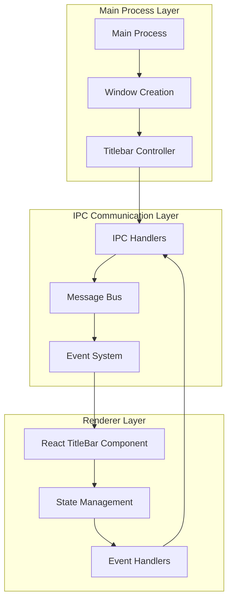
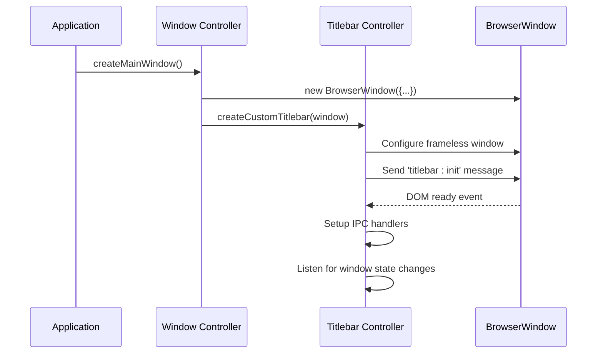
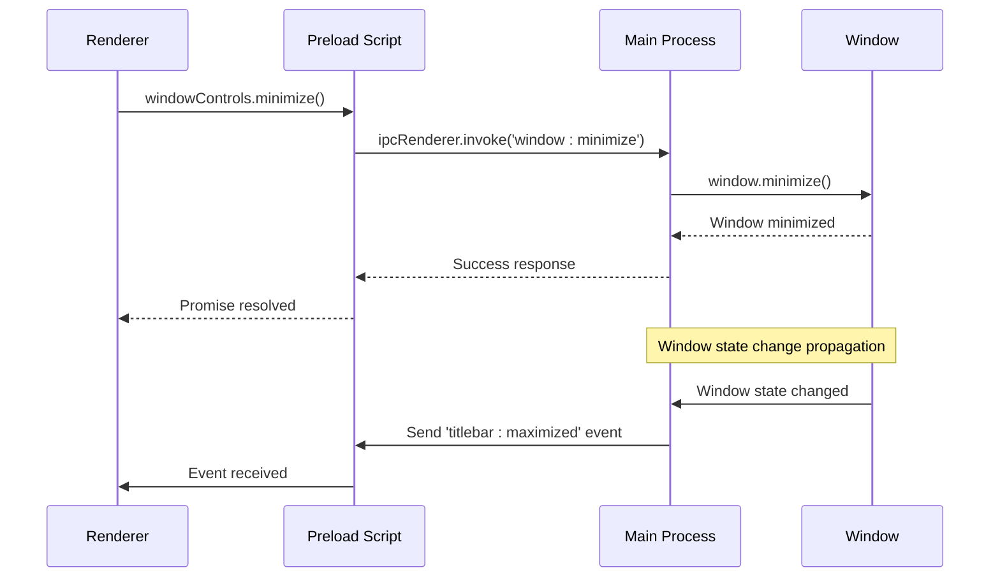
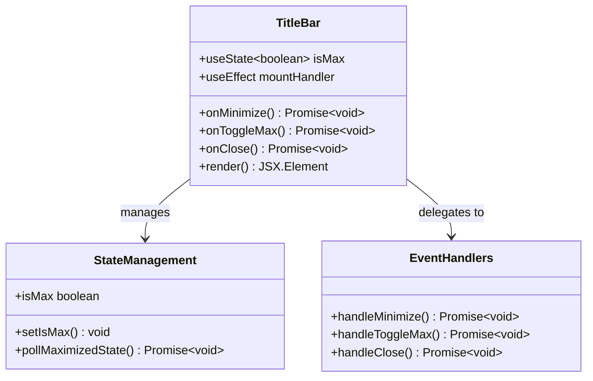
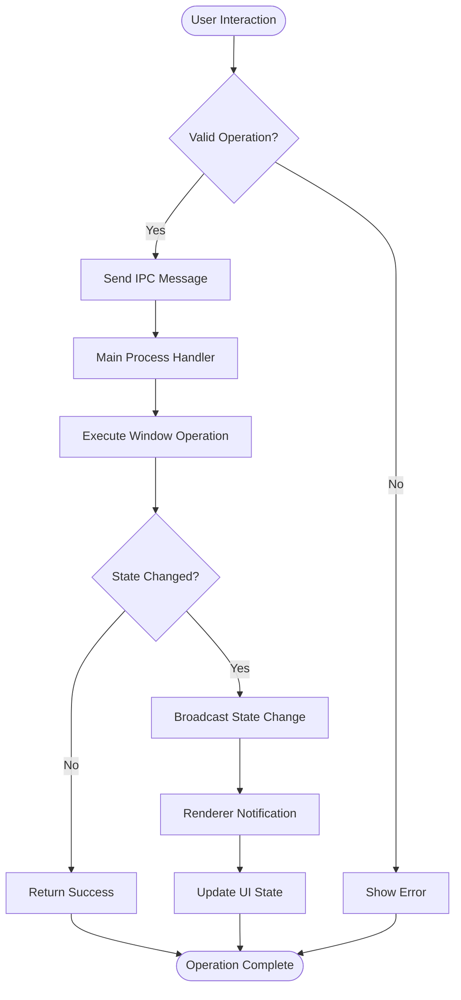
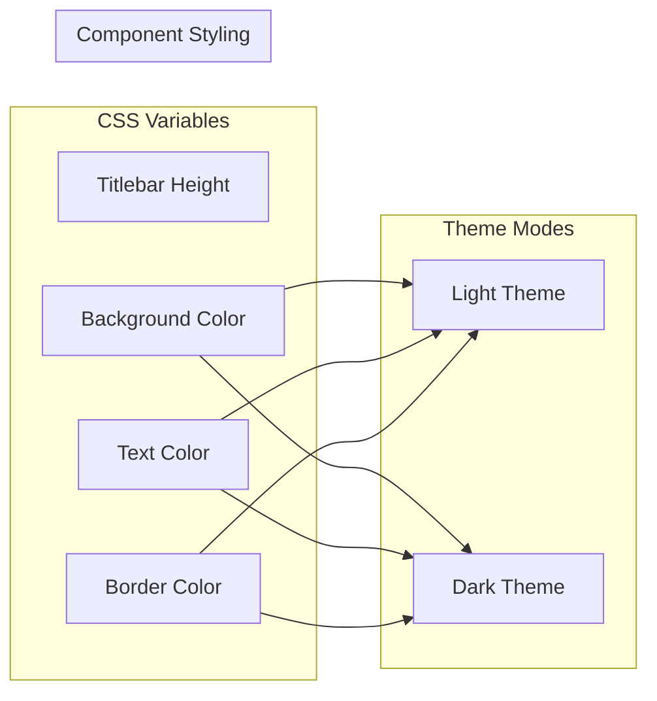

# Custom Titlebar Implementation

<cite>
**Referenced Files in This Document**
- [TitleBar.tsx](file://src/renderer/components/TitleBar.tsx)
- [App.tsx](file://src/renderer/App.tsx)
- [styles.css](file://src/renderer/styles.css)
- [global.d.ts](file://src/renderer/global.d.ts)
- [index.ts](file://src/preload/index.ts)
- [window.ts](file://src/main/window.ts)
- [index.ts](file://src/main/index.ts)
- [window.ts](file://src/main/ipc/window.ts)
- [CUSTOM-UI.md](file://AI/CUSTOM-UI.md)
</cite>

## Table of Contents
1. [Introduction](#introduction)
2. [Architecture Overview](#architecture-overview)
3. [Three-Part Architecture](#three-part-architecture)
4. [Platform-Specific Implementations](#platform-specific-implementations)
5. [React Component Implementation](#react-component-implementation)
6. [IPC Communication System](#ipc-communication-system)
7. [Styling and Theming](#styling-and-theming)
8. [Accessibility Features](#accessibility-features)
9. [Performance Considerations](#performance-considerations)
10. [Troubleshooting Guide](#troubleshooting-guide)
11. [Future Enhancements](#future-enhancements)

## Introduction

The Custom Titlebar Implementation is a sophisticated cross-platform solution that replaces Electron's default titlebar with a custom-designed, branded interface that maintains native platform aesthetics while providing enhanced functionality and accessibility. This implementation follows a three-tier architecture that separates concerns between the main process, IPC communication layer, and renderer components.

The system supports Windows, macOS, and Linux platforms with platform-appropriate styling, including macOS traffic light buttons and standard window controls for other operating systems. It incorporates advanced features like smooth animations, keyboard navigation, screen reader support, and real-time window state synchronization.

## Architecture Overview

The Custom Titlebar Implementation follows a clean separation of concerns with three distinct layers:

**Diagram sources**
- [index.ts](file://src/main/index.ts#L1-L123)
- [window.ts](file://src/main/window.ts#L1-L50)
- [TitleBar.tsx](file://src/renderer/components/TitleBar.tsx#L1-L63)

## Three-Part Architecture

### Main Process Setup

The main process handles window creation and titlebar initialization through a dedicated controller that manages platform-specific configurations and IPC communication setup.

**Diagram sources**
- [index.ts](file://src/main/index.ts#L25-L50)
- [window.ts](file://src/main/window.ts#L6-L35)

### IPC Communication

The Inter-Process Communication system facilitates bidirectional communication between the main process and renderer, enabling window control operations and state synchronization.

**Diagram sources**
- [index.ts](file://src/preload/index.ts#L190-L202)
- [window.ts](file://src/main/ipc/window.ts#L1-L25)

### Renderer Component Implementation

The React component manages the titlebar UI, state synchronization, and user interactions while maintaining platform-specific styling and accessibility features.

**Section sources**
- [TitleBar.tsx](file://src/renderer/components/TitleBar.tsx#L1-L63)
- [App.tsx](file://src/renderer/App.tsx#L1-L176)

## Platform-Specific Implementations

### Windows Implementation

Windows titlebars follow the standard native design with a height of 32px and system theme-aware coloring. The implementation uses traditional minimize, maximize, and close buttons.

**Platform-Specific Features:**
- Standard window controls (Minimize, Maximize, Close)
- 32px height matching Windows native titlebar
- System theme integration
- Traditional button icons and spacing

### macOS Implementation

macOS titlebars utilize the native traffic light pattern with red, yellow, and green buttons positioned on the left side of the titlebar.

**Platform-Specific Features:**
- Traffic light buttons (red, yellow, green)
- 28px height matching macOS native titlebar
- Native button positioning and spacing
- Platform-appropriate hover states

### Linux Implementation

Linux titlebars adapt to various desktop environments while maintaining consistency with the overall design language.

**Platform-Specific Features:**
- Adaptive to desktop environment themes
- Flexible window control positioning
- Consistent styling across distributions
- Responsive to system theme changes

**Section sources**
- [CUSTOM-UI.md](file://AI/CUSTOM-UI.md#L15-L45)

## React Component Implementation

### Component Structure

The TitleBar component is implemented as a functional React component with TypeScript for type safety and proper state management.

**Diagram sources**
- [TitleBar.tsx](file://src/renderer/components/TitleBar.tsx#L3-L63)

### State Management

The component implements a polling mechanism to synchronize the maximized state with the actual window state, ensuring consistency across platform-specific implementations.

**State Synchronization Process:**
1. Initial state polling on component mount
2. Local state updates for immediate feedback
3. Best-effort state synchronization
4. Error handling for state retrieval failures

### Event Handling

Window control operations are handled through asynchronous functions that communicate with the main process via the preload script interface.

**Event Handling Features:**
- Asynchronous operation support
- Error handling and graceful degradation
- Immediate UI feedback
- Platform-specific button labels

**Section sources**
- [TitleBar.tsx](file://src/renderer/components/TitleBar.tsx#L5-L35)

## IPC Communication System

### Message Flow Architecture

The IPC system implements a robust message bus that handles window control operations and state synchronization between processes.

**Diagram sources**
- [window.ts](file://src/main/ipc/window.ts#L1-L25)
- [index.ts](file://src/preload/index.ts#L190-L202)

### Initialization Sequence

The titlebar initialization follows a specific sequence to ensure proper setup and state synchronization.

**Initialization Steps:**
1. Window creation with frameless configuration
2. DOM readiness detection
3. Platform and state data transmission
4. IPC handler registration
5. Event listener setup
6. State synchronization polling

### Window Control Operations

The system supports comprehensive window control operations through standardized IPC messages.

**Supported Operations:**
- Minimize window
- Toggle maximize/restore
- Close window
- Check maximized state
- Fullscreen operations

**Section sources**
- [window.ts](file://src/main/ipc/window.ts#L1-L25)
- [index.ts](file://src/preload/index.ts#L190-L202)

## Styling and Theming

### CSS Variables System

The styling system utilizes CSS custom properties for comprehensive theming support across light and dark modes.

**Diagram sources**
- [styles.css](file://src/renderer/styles.css#L1-L70)

### Platform-Specific Styling

Each platform receives tailored styling that respects native design guidelines while maintaining brand consistency.

**Styling Features:**
- `-webkit-app-region: drag` for window movement
- `-webkit-app-region: no-drag` for interactive elements
- Platform-specific height adjustments
- Native button styling and hover effects
- Responsive design for different screen sizes

### Animation Performance

The system implements smooth animations with performance optimizations for fluid user experiences.

**Performance Optimizations:**
- Hardware-accelerated transitions
- `will-change` property usage
- Efficient CSS selectors
- Minimal reflow scenarios

**Section sources**
- [styles.css](file://src/renderer/styles.css#L19-L70)

## Accessibility Features

### Keyboard Navigation

The titlebar implements comprehensive keyboard navigation support for users who rely on keyboard-only interaction.

**Keyboard Support:**
- Alt+F4 for close operation
- Alt+F10 for focus activation
- Tab navigation through controls
- Arrow key navigation within controls

### Screen Reader Support

The implementation includes proper ARIA labels and roles for screen reader compatibility.

**Accessibility Features:**
- Semantic HTML structure
- Proper ARIA labels for all interactive elements
- Role attributes for navigation landmarks
- Screen reader announcements for state changes

### Focus Management

The system ensures proper focus management and visual indicators for accessibility compliance.

**Focus Management:**
- Clear focus indicators
- Logical tab order
- Focus trapping within modal contexts
- Screen reader announcements

**Section sources**
- [CUSTOM-UI.md](file://AI/CUSTOM-UI.md#L377-L390)

## Performance Considerations

### Memory Management

The implementation includes careful memory management to prevent leaks and optimize resource usage.

**Memory Optimization Strategies:**
- Event listener cleanup on component unmount
- Efficient state updates
- Debounced resize handling
- Lazy loading of non-critical components

### Animation Performance

Smooth animations are achieved through optimized CSS and JavaScript implementations.

**Animation Optimizations:**
- Hardware acceleration utilization
- Efficient transition properties
- Reduced repaint scenarios
- Optimized event handling

### Rendering Performance

The component architecture minimizes unnecessary re-renders and optimizes rendering performance.

**Rendering Optimizations:**
- Memoized component functions
- Efficient state updates
- Minimal DOM manipulation
- Batched operations

**Section sources**
- [CUSTOM-UI.md](file://AI/CUSTOM-UI.md#L400-L430)

## Troubleshooting Guide

### Common Issues and Solutions

#### Unresponsive Drag Regions

**Problem:** Titlebar area doesn't allow window dragging
**Solution:** Verify `-webkit-app-region: drag` CSS property is correctly applied to the titlebar container.

#### Incorrect Window State Synchronization

**Problem:** Maximization state doesn't match actual window state
**Solution:** Check the polling mechanism and ensure IPC handlers are properly registered.

#### Platform-Specific Styling Issues

**Problem:** Buttons appear incorrectly on specific platforms
**Solution:** Verify platform-specific CSS selectors and ensure proper theme application.

#### Accessibility Violations

**Problem:** Screen reader or keyboard navigation issues
**Solution:** Review ARIA labels, focus management, and keyboard event handlers.

### Debugging Techniques

**Debugging Steps:**
1. Check console logs for IPC communication errors
2. Verify CSS property application using browser developer tools
3. Test keyboard navigation functionality
4. Validate ARIA attributes and roles
5. Monitor memory usage for potential leaks

### Performance Monitoring

**Performance Indicators:**
- Animation frame rates
- Memory allocation patterns
- IPC message latency
- Render performance metrics

## Future Enhancements

### Advanced Features

The current implementation provides a solid foundation for future enhancements:

**Planned Features:**
- Custom drag regions for specific areas
- Window snapping to edges and corners
- Multi-window titlebar support
- User-defined theme customization
- Enhanced animation effects
- Touch and gesture support

### Scalability Considerations

The architecture is designed to accommodate future growth and feature additions while maintaining performance and accessibility standards.

**Scalability Features:**
- Modular component structure
- Extensible IPC system
- Configurable styling system
- Plugin-friendly architecture

**Section sources**
- [CUSTOM-UI.md](file://AI/CUSTOM-UI.md#L467-L475)