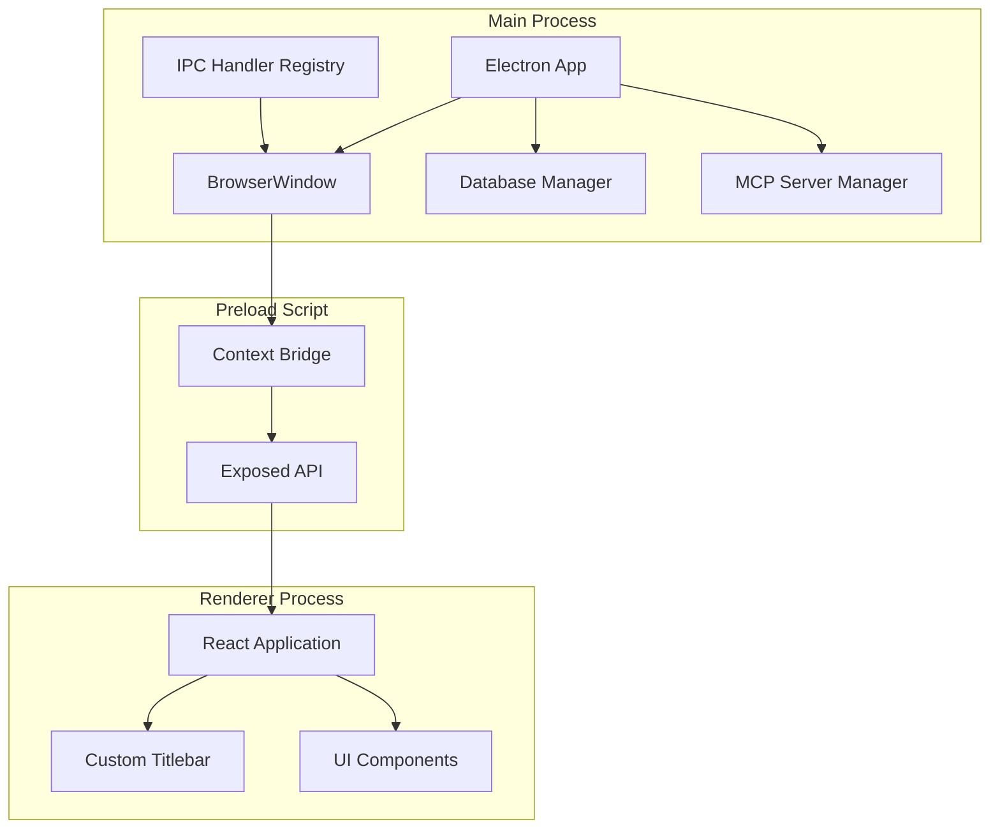
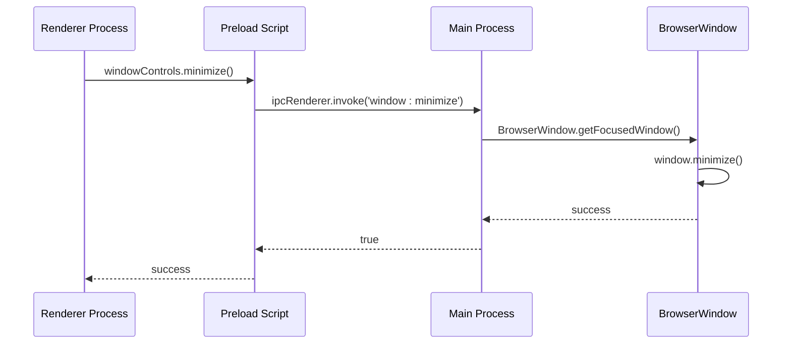
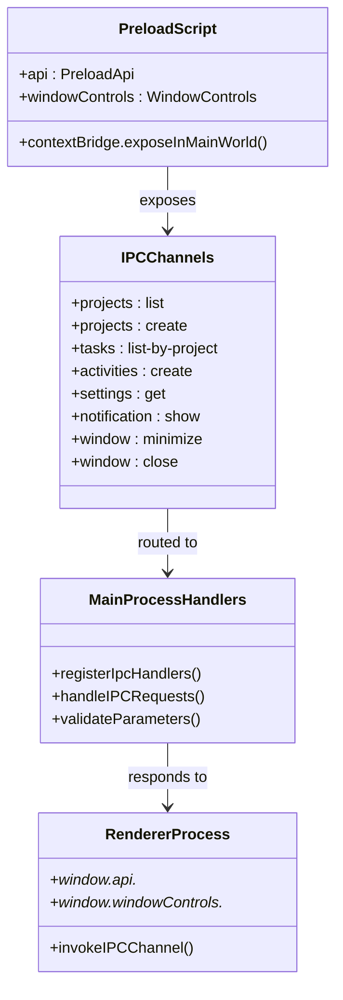
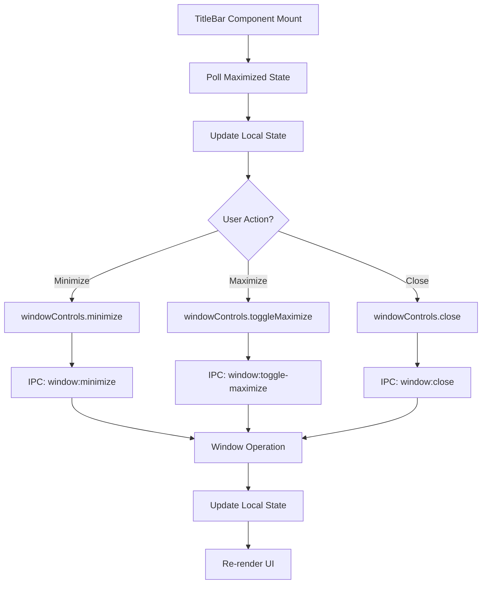
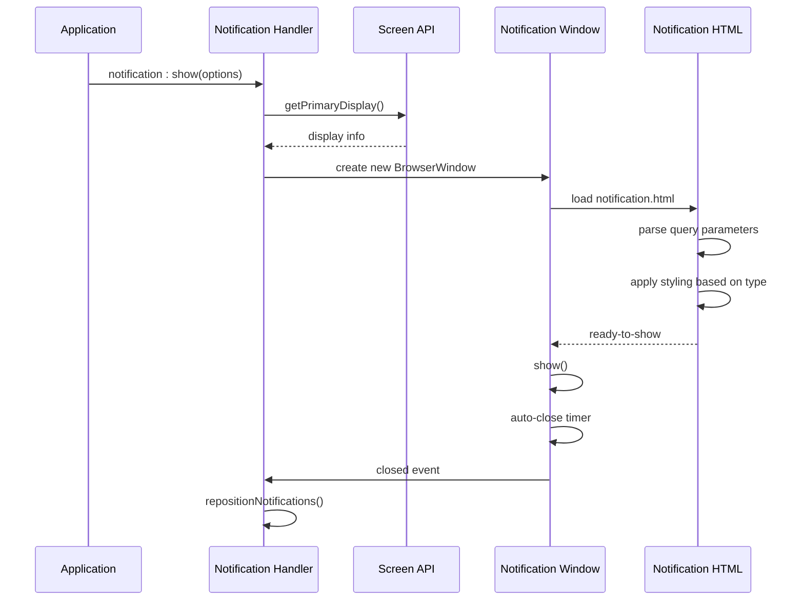
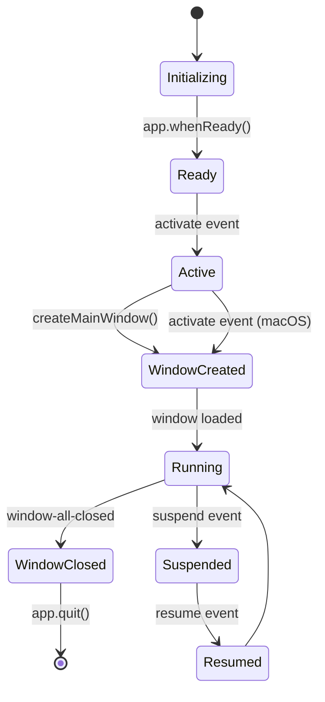
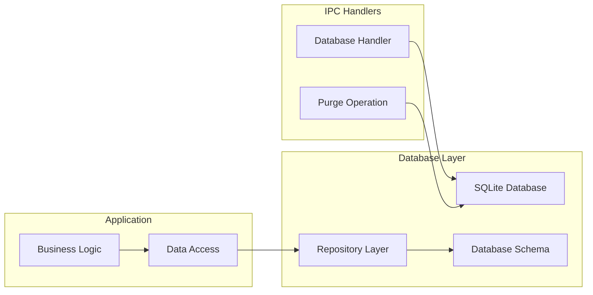
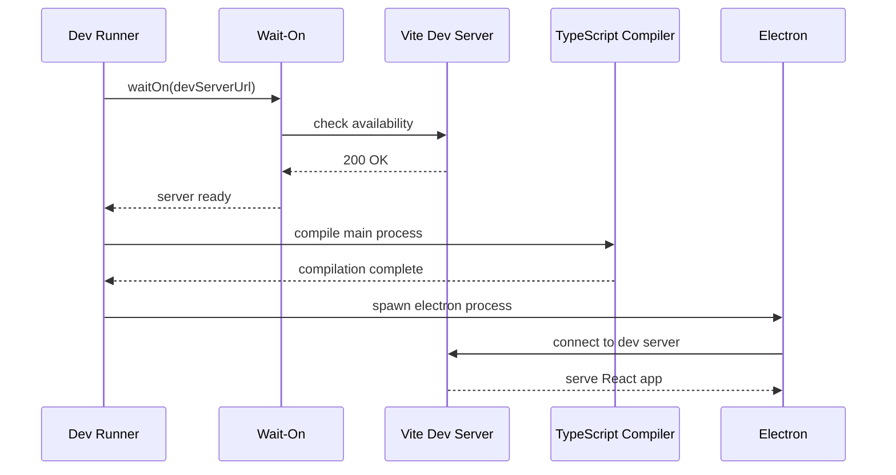
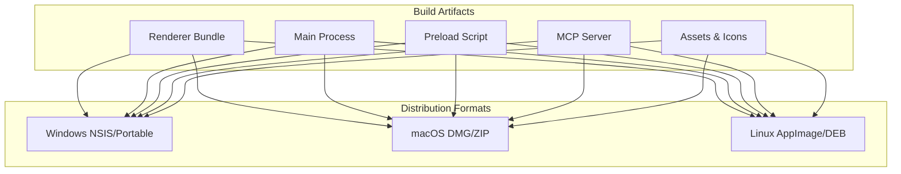

# Electron Integration

<cite>
**Referenced Files in This Document**
- [src/main/index.ts](file://src/main/index.ts)
- [src/preload/index.ts](file://src/preload/index.ts)
- [src/main/ipc/window.ts](file://src/main/ipc/window.ts)
- [src/main/ipc/notification.ts](file://src/main/ipc/notification.ts)
- [src/main/ipc/settings.ts](file://src/main/ipc/settings.ts)
- [src/main/ipc/database.ts](file://src/main/ipc/database.ts)
- [src/main/ipc/mcp.ts](file://src/main/ipc/mcp.ts)
- [src/main/devRunner.ts](file://src/main/devRunner.ts)
- [src/renderer/components/TitleBar.tsx](file://src/renderer/components/TitleBar.tsx)
- [notification.html](file://notification.html)
- [src/renderer/index.html](file://src/renderer/index.html)
- [package.json](file://package.json)
- [src/common/types.ts](file://src/common/types.ts)
</cite>

## Table of Contents
1. [Introduction](#introduction)
2. [Main Process Architecture](#main-process-architecture)
3. [Window Management System](#window-management-system)
4. [IPC Communication Pattern](#ipc-communication-pattern)
5. [Security Considerations](#security-considerations)
6. [Custom Titlebar Implementation](#custom-titlebar-implementation)
7. [System Integration Features](#system-integration-features)
8. [App Lifecycle Management](#app-lifecycle-management)
9. [Native Feature Integration](#native-feature-integration)
10. [Development Environment](#development-environment)
11. [Build and Distribution](#build-and-distribution)

## Introduction

LifeOS is a sophisticated desktop application built with Electron that combines modern web technologies with native system integration. The application features a custom titlebar implementation, robust IPC communication patterns, and comprehensive system integration capabilities including notifications, settings management, and database operations.

The Electron integration follows best practices for security, performance, and maintainability, utilizing a multi-process architecture with proper isolation between the main and renderer processes. The application supports cross-platform deployment with platform-specific optimizations for Windows, macOS, and Linux.

## Main Process Architecture

The main process serves as the foundation of the Electron application, managing window creation, system integration, and IPC communication registration.



**Diagram sources**
- [src/main/index.ts](file://src/main/index.ts#L1-L110)
- [src/preload/index.ts](file://src/preload/index.ts#L1-L202)

The main process initialization follows a structured approach:

1. **Environment Detection**: Determines development vs production mode
2. **IPC Handler Registration**: Loads all IPC handlers after Electron readiness
3. **Database Initialization**: Establishes SQLite database connection
4. **MCP Server Management**: Handles AI model communication server
5. **Window Creation**: Sets up the main application window with custom preferences

**Section sources**
- [src/main/index.ts](file://src/main/index.ts#L1-L110)

## Window Management System

The window management system provides comprehensive control over application windows, including custom titlebar functionality and cross-platform window operations.



**Diagram sources**
- [src/main/ipc/window.ts](file://src/main/ipc/window.ts#L1-L27)
- [src/preload/index.ts](file://src/preload/index.ts#L190-L202)

### Window Configuration

The main window is configured with specific preferences for optimal user experience:

- **Dimensions**: 1200x800 with minimum bounds of 800x600
- **Frame**: Custom titlebar implementation (frame: false)
- **Background**: Dark theme with #121212 background color
- **Icon**: Platform-specific icon resolution
- **Security**: Node.js integration disabled with context isolation

### Window Control Functions

The window management system provides four core operations:

1. **Minimize**: Reduces window to system tray or taskbar
2. **Close**: Terminates the window and triggers cleanup
3. **Maximize/Toggle**: Controls window size state
4. **State Monitoring**: Tracks window state changes

**Section sources**
- [src/main/index.ts](file://src/main/index.ts#L25-L60)
- [src/main/ipc/window.ts](file://src/main/ipc/window.ts#L1-L27)

## IPC Communication Pattern

The Inter-Process Communication (IPC) system enables secure communication between the main and renderer processes while maintaining proper isolation boundaries.



**Diagram sources**
- [src/preload/index.ts](file://src/preload/index.ts#L190-L202)
- [src/main/ipc/window.ts](file://src/main/ipc/window.ts#L1-L27)

### IPC Channel Categories

The application organizes IPC channels into functional categories:

| Category | Channels | Purpose |
|----------|----------|---------|
| **Data Operations** | `projects:*`, `tasks:*`, `activities:*` | CRUD operations for core application data |
| **System Services** | `settings:*`, `database:*`, `mcp:*` | Configuration and service management |
| **UI Controls** | `window:*`, `notification:*` | User interface and system integration |
| **Analytics** | `metrics:*` | Performance monitoring and analytics |

### Request/Response Pattern

All IPC communications follow a consistent request/response pattern:

1. **Renderer Initiates**: Calls `ipcRenderer.invoke()` with channel name and parameters
2. **Preload Validation**: Receives parameters and validates them
3. **Main Process Handling**: Processes request with appropriate business logic
4. **Response Formatting**: Returns standardized ApiResponse objects
5. **Renderer Reception**: Handles response with proper error checking

**Section sources**
- [src/preload/index.ts](file://src/preload/index.ts#L1-L202)

## Security Considerations

The application implements multiple layers of security to protect against common vulnerabilities and maintain process isolation.

### Context Isolation

Context isolation is enabled to prevent renderer processes from accessing Node.js APIs directly:

```typescript
webPreferences: {
  nodeIntegration: false,           // Prevents Node.js access
  contextIsolation: true,           // Isolates preload context
  preload: path.join(__dirname, '../preload/index.js')
}
```

### Preload Script Security

The preload script acts as a secure bridge between main and renderer processes:

1. **Selective Exposure**: Only exposes necessary APIs through contextBridge
2. **Type Safety**: Uses TypeScript interfaces for API contracts
3. **Parameter Validation**: Validates all incoming IPC parameters
4. **Error Handling**: Provides graceful error handling for failed operations

### API Surface Minimization

The exposed API surface is carefully controlled:

- **Granular Access**: Individual methods for specific operations
- **Typed Interfaces**: Strongly typed parameter and return values
- **Async Operations**: All IPC calls are asynchronous for better UX
- **Error Propagation**: Consistent error handling across all channels

**Section sources**
- [src/preload/index.ts](file://src/preload/index.ts#L190-L202)
- [src/main/index.ts](file://src/main/index.ts#L35-L45)

## Custom Titlebar Implementation

The custom titlebar provides a unified appearance across platforms while maintaining native functionality.



**Diagram sources**
- [src/renderer/components/TitleBar.tsx](file://src/renderer/components/TitleBar.tsx#L1-L63)
- [src/main/ipc/window.ts](file://src/main/ipc/window.ts#L1-L27)

### Titlebar Features

The custom titlebar includes:

1. **Application Identity**: LifeOS branding with MCP status indicator
2. **Window Controls**: Minimize, maximize/restore, and close buttons
3. **State Synchronization**: Real-time window state updates
4. **Cross-Platform Design**: Platform-appropriate button styling

### Platform Adaptations

The titlebar adapts to different operating systems:

- **Windows/Linux**: Standard minimize/maximize/close buttons
- **macOS**: Traffic light controls (red, yellow, green)
- **Responsive Design**: Adaptive layout for different window sizes

**Section sources**
- [src/renderer/components/TitleBar.tsx](file://src/renderer/components/TitleBar.tsx#L1-L63)

## System Integration Features

The application provides comprehensive system integration through various specialized IPC handlers.

### Notification System

The notification system creates temporary windows for displaying alerts and messages:



**Diagram sources**
- [src/main/ipc/notification.ts](file://src/main/ipc/notification.ts#L1-L115)
- [notification.html](file://notification.html#L1-L176)

### Notification Capabilities

The notification system supports:

- **Multiple Types**: Info, success, error, and warning notifications
- **Positioning**: Bottom-right corner with automatic stacking
- **Styling**: Type-specific visual indicators and animations
- **Duration Control**: Configurable display duration with progress bars
- **Auto-dismiss**: Automatic closure after timeout

### Settings Management

The settings system provides persistent configuration storage:

- **Type Safety**: Strongly typed settings interface
- **Partial Updates**: Allows updating individual settings
- **Validation**: Parameter validation before persistence
- **Real-time Sync**: Immediate application of setting changes

**Section sources**
- [src/main/ipc/notification.ts](file://src/main/ipc/notification.ts#L1-L115)
- [src/main/ipc/settings.ts](file://src/main/ipc/settings.ts#L1-L28)

## App Lifecycle Management

The application handles various lifecycle events to ensure proper resource management and user experience.

### Application Events



**Diagram sources**
- [src/main/index.ts](file://src/main/index.ts#L70-L110)

### Lifecycle Event Handling

The application responds to several key events:

1. **App Ready**: Initializes database and starts MCP server
2. **Window Activation**: Creates new window when all windows are closed (macOS)
3. **Window Closure**: Manages cleanup and resource release
4. **Platform Specific**: Handles platform differences (Windows vs macOS)

### Resource Management

Proper resource management ensures efficient memory usage:

- **Database Connections**: Lazy initialization and cleanup
- **MCP Server**: Conditional startup based on configuration
- **Window Instances**: Proper disposal and event listener removal
- **IPC Handlers**: Clean registration and deregistration

**Section sources**
- [src/main/index.ts](file://src/main/index.ts#L70-L110)

## Native Feature Integration

The application integrates with native system features to provide a seamless desktop experience.

### Database Operations

The database system provides comprehensive data management:



**Diagram sources**
- [src/main/ipc/database.ts](file://src/main/ipc/database.ts#L1-L55)

### MCP Server Integration

The Model Context Protocol (MCP) server integration enables AI-powered features:

- **Server Management**: Start, stop, and status monitoring
- **Configuration**: Port, host, and auto-start settings
- **Process Management**: Child process handling with error recovery
- **Communication**: JSON-RPC protocol for AI model interaction

### Cross-Platform Compatibility

The application handles platform differences:

- **File Paths**: Platform-specific path resolution
- **Window Behavior**: OS-specific window management
- **Icon Resources**: Multi-format icon support
- **Build Targets**: Platform-specific packaging

**Section sources**
- [src/main/ipc/database.ts](file://src/main/ipc/database.ts#L1-L55)
- [src/main/ipc/mcp.ts](file://src/main/ipc/mcp.ts#L1-L151)

## Development Environment

The development setup provides efficient workflow for Electron application development.

### Development Scripts

The project includes comprehensive development scripts:

- **Concurrent Development**: Simultaneous React/Vite and TypeScript compilation
- **Hot Reloading**: Live reload for both main and renderer processes
- **TypeScript Watching**: Automatic type checking and compilation
- **Wait-On**: Ensures development server availability before launching Electron

### Dev Runner Architecture



**Diagram sources**
- [src/main/devRunner.ts](file://src/main/devRunner.ts#L1-L40)

### Development Features

The development environment includes:

1. **Hot Module Replacement**: Instant updates during development
2. **Source Maps**: Debugging support with original source locations
3. **TypeScript Integration**: Full type safety and autocompletion
4. **Error Reporting**: Comprehensive error handling and reporting

**Section sources**
- [src/main/devRunner.ts](file://src/main/devRunner.ts#L1-L40)
- [package.json](file://package.json#L10-L15)

## Build and Distribution

The application supports multi-platform distribution with automated build processes.

### Build Configuration

The build system handles multiple targets:

- **Renderer**: Vite-based React application bundling
- **Main Process**: TypeScript compilation with watch mode
- **Preload**: Secure preload script compilation
- **Server**: MCP server compilation for AI features
- **Assets**: Icon conversion and resource optimization

### Packaging Targets



**Diagram sources**
- [package.json](file://package.json#L16-L45)

### Distribution Features

The build system provides:

- **Code Signing**: Platform-specific signing for security
- **Auto-Updates**: Built-in update mechanism
- **Installer Creation**: Professional installation packages
- **Portable Versions**: Self-contained application bundles
- **Asset Optimization**: Efficient resource compression

**Section sources**
- [package.json](file://package.json#L16-L45)