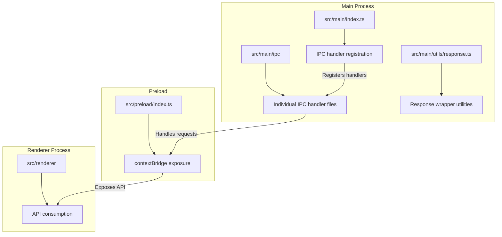
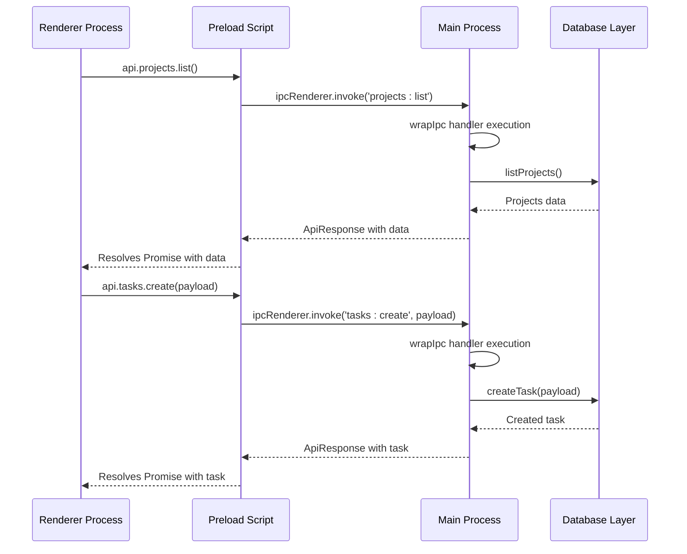
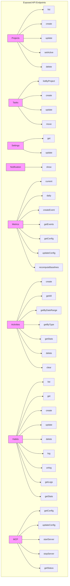
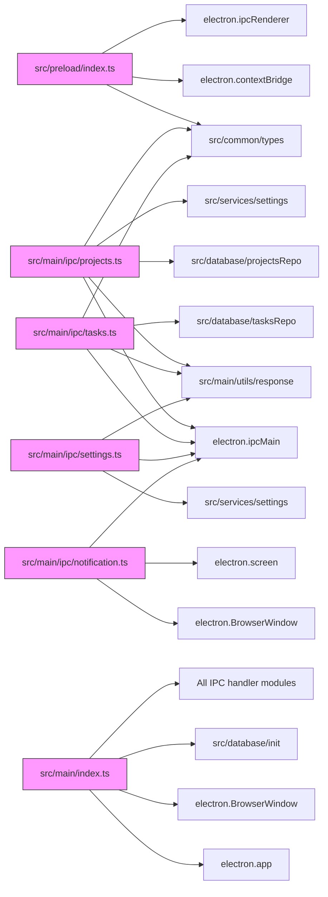

# IPC Communication

<cite>
**Referenced Files in This Document**   
- [src/preload/index.ts](file://src/preload/index.ts)
- [src/main/ipc/projects.ts](file://src/main/ipc/projects.ts)
- [src/main/ipc/tasks.ts](file://src/main/ipc/tasks.ts)
- [src/main/ipc/settings.ts](file://src/main/ipc/settings.ts)
- [src/main/ipc/notification.ts](file://src/main/ipc/notification.ts)
- [src/main/ipc/metrics.ts](file://src/main/ipc/metrics.ts)
- [src/main/ipc/activities.ts](file://src/main/ipc/activities.ts)
- [src/main/ipc/window.ts](file://src/main/ipc/window.ts)
- [src/main/ipc/database.ts](file://src/main/ipc/database.ts)
- [src/main/ipc/habits.ts](file://src/main/ipc/habits.ts)
- [src/main/ipc/mcp.ts](file://src/main/ipc/mcp.ts)
- [src/main/utils/response.ts](file://src/main/utils/response.ts)
- [src/main/index.ts](file://src/main/index.ts)
- [src/common/types.ts](file://src/common/types.ts)
- [src/renderer/pages/Dashboard.tsx](file://src/renderer/pages/Dashboard.tsx)
- [notification.html](file://notification.html)
</cite>

## Table of Contents
1. [Introduction](#introduction)
2. [Project Structure](#project-structure)
3. [Core Components](#core-components)
4. [Architecture Overview](#architecture-overview)
5. [Detailed Component Analysis](#detailed-component-analysis)
6. [Dependency Analysis](#dependency-analysis)
7. [Performance Considerations](#performance-considerations)
8. [Troubleshooting Guide](#troubleshooting-guide)
9. [Conclusion](#conclusion)

## Introduction
This document provides a comprehensive analysis of the IPC (Inter-Process Communication) system in the Electron-based LifeOS application. The system enables secure communication between the main and renderer processes through a well-structured API exposure mechanism. The implementation follows Electron's security best practices, utilizing context isolation and the contextBridge API to expose only necessary functionality to the renderer process. The request-response pattern using ipcRenderer.invoke and ipcMain.handle ensures type-safe, asynchronous communication with proper error handling. This documentation covers the architecture, security implications, implementation details, and best practices for the IPC communication system.

## Project Structure
The IPC communication system is organized across multiple directories in the application, with clear separation of concerns between the main process, preload scripts, and renderer process. The main IPC handlers are located in the src/main/ipc directory, while the API exposure to the renderer process is managed through the preload script.



**Diagram sources**
- [src/main/ipc](file://src/main/ipc)
- [src/preload/index.ts](file://src/preload/index.ts)
- [src/main/index.ts](file://src/main/index.ts)

**Section sources**
- [src/main/ipc](file://src/main/ipc)
- [src/preload/index.ts](file://src/preload/index.ts)
- [src/main/index.ts](file://src/main/index.ts)

## Core Components
The IPC communication system consists of several core components that work together to enable secure inter-process messaging. The system is built around Electron's contextBridge and IPC APIs, with a focus on security, type safety, and maintainability. The main components include the preload script that exposes a controlled API surface to the renderer process, the IPC handlers in the main process that process requests, and the response wrapper utilities that standardize error handling.

**Section sources**
- [src/preload/index.ts](file://src/preload/index.ts)
- [src/main/ipc](file://src/main/ipc)
- [src/main/utils/response.ts](file://src/main/utils/response.ts)

## Architecture Overview
The IPC architecture follows a request-response pattern with strict security boundaries between the main and renderer processes. The system uses Electron's context isolation feature to prevent direct access to Node.js APIs from the renderer process, exposing only a limited set of functionality through the contextBridge API.



**Diagram sources**
- [src/preload/index.ts](file://src/preload/index.ts)
- [src/main/ipc/projects.ts](file://src/main/ipc/projects.ts)
- [src/main/ipc/tasks.ts](file://src/main/ipc/tasks.ts)
- [src/main/utils/response.ts](file://src/main/utils/response.ts)

## Detailed Component Analysis

### Preload Script and Context Isolation
The preload script implements Electron's context isolation security model, exposing only a limited API surface to the renderer process through the contextBridge. This approach follows the principle of least privilege, preventing potential security vulnerabilities from malicious code execution in the renderer process.

```mermaid
classDiagram
class contextBridge {
+exposeInMainWorld(key, api)
}
class ipcRenderer {
+invoke(channel, ...args)
}
class api {
+projects : ProjectsAPI
+tasks : TasksAPI
+settings : SettingsAPI
+notification : NotificationAPI
+metrics : MetricsAPI
+activities : ActivitiesAPI
+windowControls : WindowControlsAPI
}
class ProjectsAPI {
+list() : Promise~ApiResponse~ProjectsListResult~~
+create(payload : CreateProjectInput) : Promise~ApiResponse~Project~~
+update(id : number, payload : UpdateProjectPayload) : Promise~ApiResponse~Project~~
+setActive(id : number) : Promise~ApiResponse~{id : number}~~
+delete(id : number) : Promise~ApiResponse~{success : boolean}~~
}
class TasksAPI {
+listByProject(projectId : number) : Promise~ApiResponse~Task[]~~
+create(payload : CreateTaskInput) : Promise~ApiResponse~Task~~
+update(id : number, payload : UpdateTaskPayload) : Promise~ApiResponse~Task~~
+move(payload : MoveArgs) : Promise~ApiResponse~Task~~
}
contextBridge --> api : exposes
api --> ProjectsAPI
api --> TasksAPI
ipcRenderer --> api : used by
note right of contextBridge
Exposes only the 'api' object
to renderer context
end note
note right of api
Contains typed methods for
all IPC communications
end note
```

**Diagram sources**
- [src/preload/index.ts](file://src/preload/index.ts)

**Section sources**
- [src/preload/index.ts](file://src/preload/index.ts)

### Request-Response Pattern Implementation
The IPC system implements a consistent request-response pattern using ipcRenderer.invoke in the renderer process and ipcMain.handle in the main process. This pattern ensures type safety through TypeScript interfaces and provides a clean, Promise-based API for asynchronous communication.

#### IPC Handler Architecture
```mermaid
flowchart TD
A[Renderer: api.projects.list()] --> B[ipcRenderer.invoke('projects:list')]
B --> C[Main: ipcMain.handle('projects:list')]
C --> D[wrapIpc wrapper]
D --> E[Handler function execution]
E --> F{Success?}
F --> |Yes| G[success(data) wrapper]
F --> |No| H[failure(error) wrapper]
G --> I[Return ApiResponse]
H --> I
I --> J[Resolve Promise in renderer]
J --> K[Handle response or error]
style D fill:#f9f,stroke:#333
style G fill:#bbf,stroke:#333
style H fill:#fbb,stroke:#333
click D "src/main/utils/response.ts#L20-L25" "wrapIpc implementation"
click G "src/main/utils/response.ts#L3-L5" "success function"
click H "src/main/utils/response.ts#L11-L13" "failure function"
```

**Diagram sources**
- [src/main/ipc/projects.ts](file://src/main/ipc/projects.ts)
- [src/main/utils/response.ts](file://src/main/utils/response.ts)

**Section sources**
- [src/main/ipc/projects.ts](file://src/main/ipc/projects.ts)
- [src/main/utils/response.ts](file://src/main/utils/response.ts)

### API Endpoint Exposure
The preload script exposes a comprehensive API surface for various application features, including projects, tasks, settings, notifications, metrics, activities, habits, and MCP (Main Control Program) functionality. Each API endpoint corresponds to a specific IPC channel in the main process.



**Diagram sources**
- [src/preload/index.ts](file://src/preload/index.ts)

**Section sources**
- [src/preload/index.ts](file://src/preload/index.ts)

## Dependency Analysis
The IPC communication system has a well-defined dependency structure, with clear boundaries between components. The main process IPC handlers depend on database repositories and service layers, while the preload script depends only on Electron's IPC APIs and shared type definitions.



**Diagram sources**
- [src/preload/index.ts](file://src/preload/index.ts)
- [src/main/ipc/projects.ts](file://src/main/ipc/projects.ts)
- [src/main/ipc/tasks.ts](file://src/main/ipc/tasks.ts)
- [src/main/ipc/settings.ts](file://src/main/ipc/settings.ts)
- [src/main/ipc/notification.ts](file://src/main/ipc/notification.ts)
- [src/main/index.ts](file://src/main/index.ts)

**Section sources**
- [src/preload/index.ts](file://src/preload/index.ts)
- [src/main/ipc](file://src/main/ipc)
- [src/main/index.ts](file://src/main/index.ts)

## Performance Considerations
The IPC communication system is designed with performance in mind, minimizing the number of IPC calls and optimizing data transfer between processes. The system uses batch operations where appropriate and implements efficient error handling to prevent performance degradation.

### Batch Operations and Optimization
```mermaid
flowchart TD
A[Dashboard Load] --> B[Multiple API calls]
B --> C[api.projects.list()]
B --> D[api.tasks.listByProject() for each project]
B --> E[api.activities.getAll()]
B --> F[api.metrics.current()]
B --> G[api.settings.get()]
H[Optimized Approach] --> I[Parallel API calls]
I --> J[Promise.all([projects, tasksPromises, activities, metrics, settings])]
J --> K[Single batch processing]
K --> L[Calculate statistics]
L --> M[Update UI]
style A fill:#fbb,stroke:#333
style H fill:#bbf,stroke:#333
click A "src/renderer/pages/Dashboard.tsx#L45-L150" "Current implementation"
click H "src/renderer/pages/Dashboard.tsx#L45-L150" "Optimization opportunity"
```

**Diagram sources**
- [src/renderer/pages/Dashboard.tsx](file://src/renderer/pages/Dashboard.tsx)

The current implementation in Dashboard.tsx demonstrates both the usage pattern and an optimization opportunity. While the code uses Promise.all to execute multiple IPC calls in parallel, there is potential for further optimization by implementing batch endpoints in the main process that return aggregated data for dashboard views, reducing the total number of IPC round trips.

Additional performance optimization tips:
- Use ipcRenderer.invoke with Promise.all for parallel requests
- Implement batch endpoints for frequently accessed related data
- Cache frequently accessed data in the renderer process
- Debounce rapid-fire IPC calls
- Use efficient data serialization (avoid circular references)
- Minimize payload size by requesting only needed fields

## Troubleshooting Guide
This section addresses common issues encountered when working with the IPC communication system and provides guidance for debugging and resolving them.

### Common Issues and Solutions

**Unhandled Promise Rejections in IPC Handlers**
When an IPC handler throws an unhandled exception, it can cause the renderer process to hang or display unexpected behavior. The system mitigates this through the wrapIpc utility function that wraps all handler functions with error handling.

**Section sources**
- [src/main/utils/response.ts](file://src/main/utils/response.ts)

**Type Mismatches Between Processes**
TypeScript interfaces in src/common/types.ts ensure type safety across the main and renderer processes. When type mismatches occur, they are typically due to:
- Out of sync interfaces between processes
- Incorrect type assertions in the preload script
- Missing fields in API responses

Ensure that all interfaces are defined in src/common/types.ts and imported by both processes.

**Debugging IPC Communication**
To debug IPC communication issues:
1. Check the main process console for error messages
2. Verify that IPC handlers are properly registered in src/main/index.ts
3. Use console.log statements in both the renderer and main process handlers
4. Check that contextBridge is properly exposing the API in the preload script
5. Verify that nodeIntegration is false and contextIsolation is true in the BrowserWindow configuration

**Section sources**
- [src/main/index.ts](file://src/main/index.ts)
- [src/preload/index.ts](file://src/preload/index.ts)

## Conclusion
The IPC communication system in the LifeOS application provides a secure, type-safe, and efficient mechanism for inter-process communication between the Electron main and renderer processes. By leveraging Electron's context isolation and the contextBridge API, the system adheres to security best practices while exposing a comprehensive API surface for application functionality. The request-response pattern using ipcRenderer.invoke and ipcMain.handle ensures reliable communication with proper error handling through the wrapIpc utility. The architecture promotes maintainability through modular IPC handlers and type safety via shared TypeScript interfaces. While the current implementation is robust, opportunities for performance optimization exist through batch operations and reduced IPC call frequency. The system effectively balances security, functionality, and performance, providing a solid foundation for the application's inter-process communication needs.