# Main Process Architecture

<cite>
**Referenced Files in This Document**
- [src/main/index.ts](file://src/main/index.ts)
- [src/main/devRunner.ts](file://src/main/devRunner.ts)
- [src/main/ipc/window.ts](file://src/main/ipc/window.ts)
- [src/main/ipc/mcp.ts](file://src/main/ipc/mcp.ts)
- [src/main/ipc/database.ts](file://src/main/ipc/database.ts)
- [src/main/ipc/projects.ts](file://src/main/ipc/projects.ts)
- [src/main/ipc/tasks.ts](file://src/main/ipc/tasks.ts)
- [src/main/preload/index.ts](file://src/preload/index.ts)
- [src/database/init.ts](file://src/database/init.ts)
- [src/database/mcpRepo.ts](file://src/database/mcpRepo.ts)
- [src/server/mcp-server.ts](file://src/server/mcp-server.ts)
- [src/common/types.ts](file://src/common/types.ts)
- [src/main/utils/response.ts](file://src/main/utils/response.ts)
- [package.json](file://package.json)
</cite>

## Table of Contents
1. [Introduction](#introduction)
2. [Electron Main Process Overview](#electron-main-process-overview)
3. [Application Lifecycle Management](#application-lifecycle-management)
4. [Database Initialization and Setup](#database-initialization-and-setup)
5. [IPC Handler Registration Pattern](#ipc-handler-registration-pattern)
6. [Window Creation and Management](#window-creation-and-management)
7. [MCP Server Integration](#mcp-server-integration)
8. [Development vs Production Environment](#development-vs-production-environment)
9. [Error Handling and Recovery](#error-handling-and-recovery)
10. [Performance Considerations](#performance-considerations)
11. [Common Issues and Solutions](#common-issues-and-solutions)
12. [Architecture Diagrams](#architecture-diagrams)

## Introduction

The LifeOS Electron application employs a sophisticated main process architecture designed to manage the desktop application's core lifecycle, database operations, and inter-process communication. The main process serves as the central coordinator for the entire application, handling initialization sequences, window management, database setup, and coordinating communication between the renderer processes and external systems.

This architecture demonstrates advanced Electron patterns including asynchronous initialization, IPC handler registration, database connection management, and seamless integration with a backend MCP (Model Context Protocol) server. The design emphasizes reliability, performance, and maintainability while providing a robust foundation for the desktop productivity application.

## Electron Main Process Overview

The Electron main process in LifeOS follows a structured initialization pattern that ensures proper resource allocation and system coordination. The main process acts as the orchestrator for all application components, managing the startup sequence, coordinating subsystems, and maintaining application state.

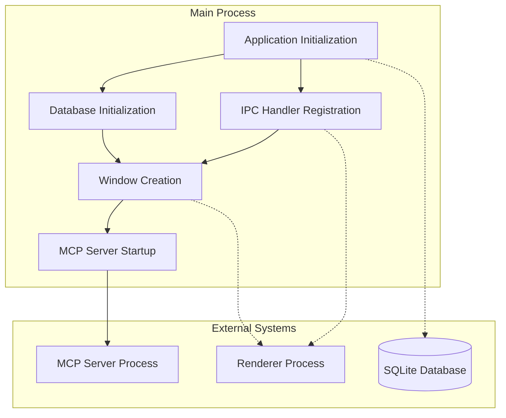

**Diagram sources**
- [src/main/index.ts](file://src/main/index.ts#L60-L109)
- [src/database/init.ts](file://src/database/init.ts#L15-L30)
- [src/main/ipc/mcp.ts](file://src/main/ipc/mcp.ts#L15-L50)

The main process architecture implements several key design principles:

- **Sequential Initialization**: Components are initialized in a specific order to ensure dependencies are met
- **Asynchronous Operations**: Long-running operations like database initialization are handled asynchronously
- **Error Isolation**: Each initialization phase has dedicated error handling to prevent cascade failures
- **Resource Management**: Proper cleanup and resource disposal are implemented throughout the lifecycle

**Section sources**
- [src/main/index.ts](file://src/main/index.ts#L1-L110)

## Application Lifecycle Management

The application lifecycle in LifeOS is managed through carefully orchestrated Electron app events, with special consideration for platform-specific behaviors and graceful shutdown procedures.

### Core Lifecycle Events

The main process handles three primary lifecycle events:

1. **whenReady Event**: The primary initialization trigger that ensures Electron is fully loaded
2. **activate Event**: Handles application activation, particularly for macOS-style window restoration
3. **window-all-closed Event**: Manages application termination across different platforms

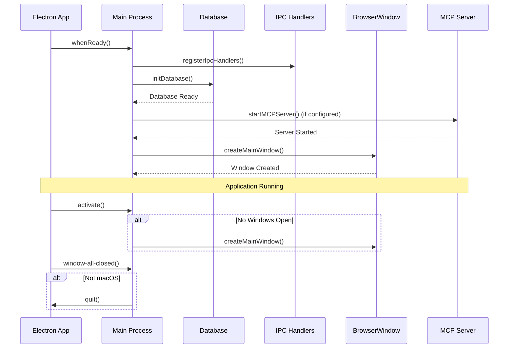

**Diagram sources**
- [src/main/index.ts](file://src/main/index.ts#L60-L109)

### Platform-Specific Behaviors

The application implements platform-aware lifecycle management:

- **macOS**: Maintains application in memory when windows are closed, restoring them on activate
- **Windows/Linux**: Terminates the application when all windows are closed
- **Graceful Shutdown**: Ensures proper cleanup of resources during application exit

**Section sources**
- [src/main/index.ts](file://src/main/index.ts#L100-L109)

## Database Initialization and Setup

The database initialization process in LifeOS demonstrates sophisticated schema management, migration handling, and error recovery mechanisms. The database setup occurs before window creation to ensure data availability for the application interface.

### Database Architecture

The database system uses SQLite with a comprehensive schema that supports all application features:

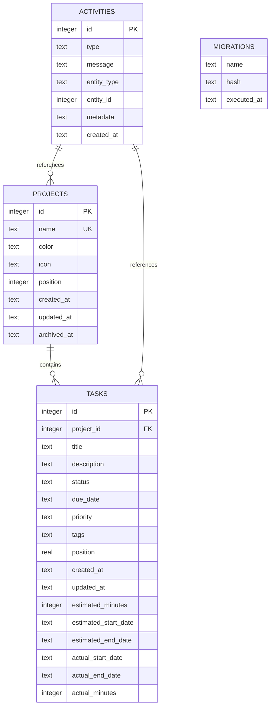

**Diagram sources**
- [src/database/init.ts](file://src/database/init.ts#L35-L85)

### Initialization Sequence

The database initialization follows a structured approach:

1. **Path Resolution**: Determines appropriate storage location based on development/production mode
2. **Schema Application**: Applies migrations and creates necessary tables
3. **Index Creation**: Optimizes query performance through strategic indexing
4. **Configuration Setup**: Initializes default configurations and settings

### Migration Management

The system implements automatic migration handling with backward compatibility:

- **Schema Evolution**: Adds new columns to existing tables when needed
- **Index Optimization**: Creates indexes for frequently queried columns
- **Configuration Defaults**: Sets up initial application settings

**Section sources**
- [src/database/init.ts](file://src/database/init.ts#L15-L144)

## IPC Handler Registration Pattern

The Inter-Process Communication (IPC) system in LifeOS follows a modular registration pattern that ensures handlers are only loaded after Electron is fully initialized. This approach prevents race conditions and ensures reliable communication between the main and renderer processes.

### Registration Architecture

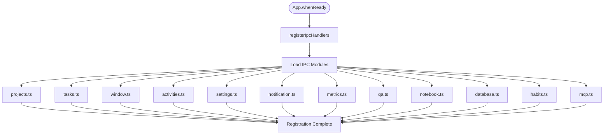

**Diagram sources**
- [src/main/index.ts](file://src/main/index.ts#L10-L25)

### Handler Implementation Pattern

Each IPC handler follows a consistent pattern for error handling and response formatting:

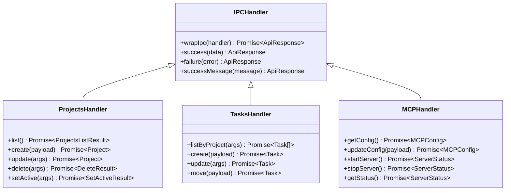

**Diagram sources**
- [src/main/utils/response.ts](file://src/main/utils/response.ts#L1-L26)
- [src/main/ipc/projects.ts](file://src/main/ipc/projects.ts#L1-L84)
- [src/main/ipc/tasks.ts](file://src/main/ipc/tasks.ts#L1-L37)

### Error Handling Strategy

The IPC system implements comprehensive error handling:

- **Try-Catch Wrapping**: All handlers are wrapped with automatic error catching
- **Consistent Response Format**: All responses follow the ApiResponse pattern
- **Logging Integration**: Errors are logged with context information
- **Graceful Degradation**: Individual handler failures don't crash the application

**Section sources**
- [src/main/index.ts](file://src/main/index.ts#L10-L25)
- [src/main/utils/response.ts](file://src/main/utils/response.ts#L18-L26)

## Window Creation and Management

The window creation process in LifeOS demonstrates advanced Electron window configuration with custom titlebar support, proper resource loading, and development/production environment handling.

### Window Configuration

The main window is configured with specific characteristics optimized for the application's needs:

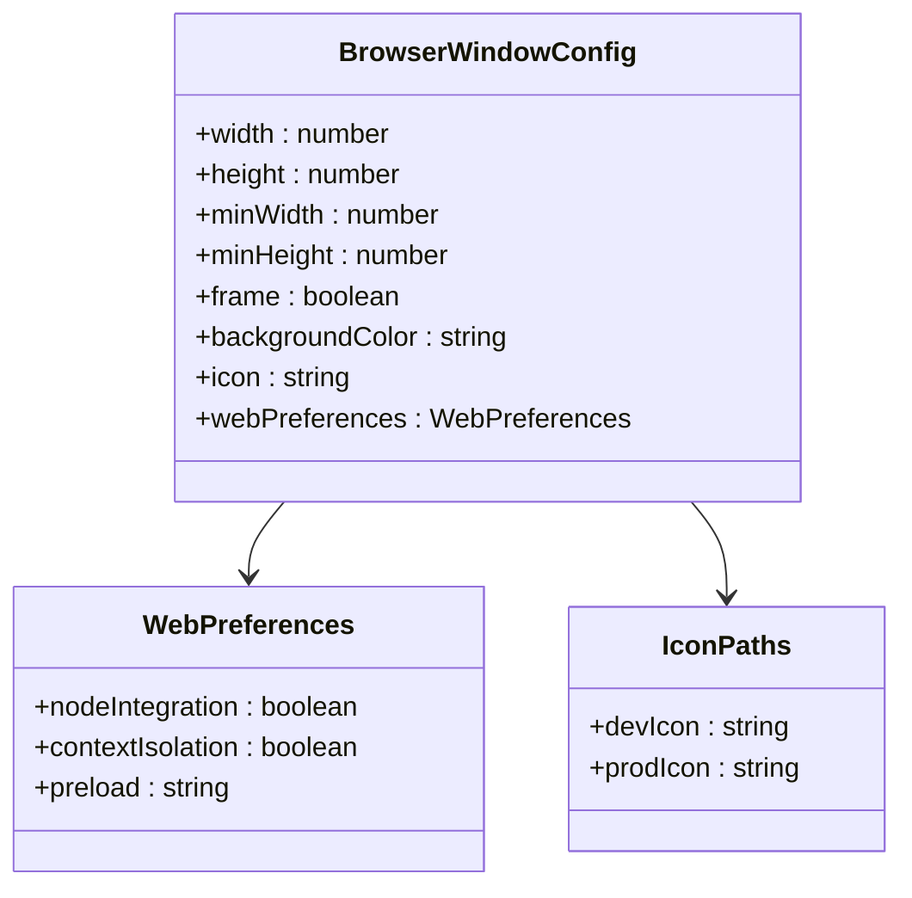

**Diagram sources**
- [src/main/index.ts](file://src/main/index.ts#L27-L50)

### Resource Loading Strategy

The window loading mechanism adapts to different environments:

- **Development Mode**: Loads from Vite development server with hot reloading
- **Production Mode**: Loads pre-built HTML with optimized assets
- **Asset Resolution**: Dynamic icon path resolution for different deployment scenarios

### Custom Titlebar Implementation

The application uses a custom titlebar approach by setting `frame: false`, allowing for:

- **Branding Consistency**: Custom-designed titlebar components
- **Platform Adaptation**: Consistent appearance across operating systems
- **Enhanced Functionality**: Additional controls beyond standard OS titlebars

**Section sources**
- [src/main/index.ts](file://src/main/index.ts#L27-L50)

## MCP Server Integration

The Model Context Protocol (MCP) server integration demonstrates advanced process management and inter-system communication. The MCP server operates as a separate Node.js process that provides AI capabilities to the main application.

### Server Architecture

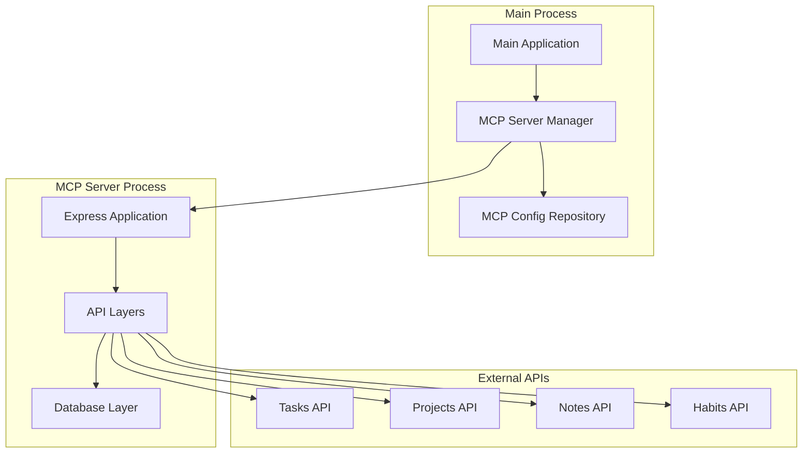

**Diagram sources**
- [src/main/ipc/mcp.ts](file://src/main/ipc/mcp.ts#L15-L50)
- [src/server/mcp-server.ts](file://src/server/mcp-server.ts#L15-L50)

### Process Management

The MCP server implementation includes sophisticated process management:

- **Automatic Startup**: Configurable auto-start based on user preferences
- **Process Monitoring**: Continuous monitoring of server health
- **Graceful Shutdown**: Proper cleanup of server resources
- **Error Recovery**: Automatic restart capabilities on failure

### Configuration Management

The MCP configuration system provides flexible server management:

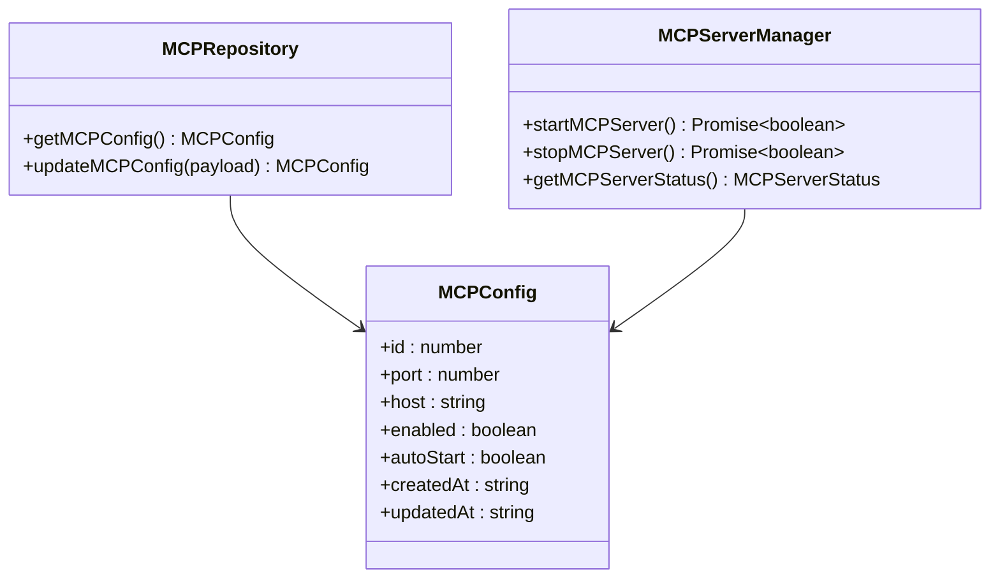

**Diagram sources**
- [src/database/mcpRepo.ts](file://src/database/mcpRepo.ts#L1-L59)
- [src/main/ipc/mcp.ts](file://src/main/ipc/mcp.ts#L15-L151)

**Section sources**
- [src/main/ipc/mcp.ts](file://src/main/ipc/mcp.ts#L15-L151)
- [src/server/mcp-server.ts](file://src/server/mcp-server.ts#L15-L80)

## Development vs Production Environment

The application implements sophisticated environment detection and configuration management to handle development and production scenarios seamlessly.

### Environment Detection

The system uses multiple indicators to determine the current environment:

- **NODE_ENV Variable**: Primary environment indicator
- **Development Server URL**: Presence of VITE_DEV_SERVER_URL
- **Resource Path Analysis**: Different resource loading strategies

### Development Workflow

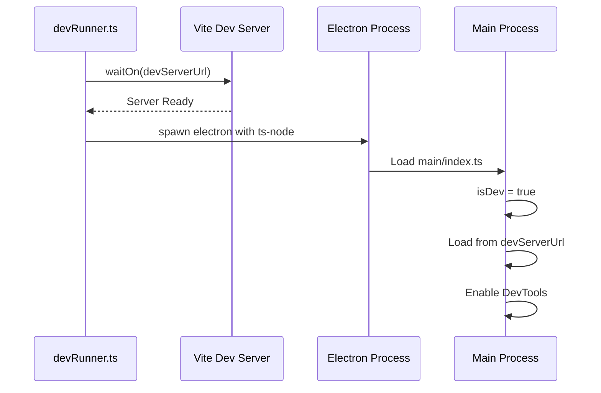

**Diagram sources**
- [src/main/devRunner.ts](file://src/main/devRunner.ts#L1-L40)

### Production Deployment

In production mode, the application:

- **Uses Pre-built Assets**: Loads from bundled HTML files
- **Optimized Resource Paths**: Uses packaged resource locations
- **Disabled DevTools**: Removes development debugging tools
- **Compiled JavaScript**: Executes TypeScript-compiled code

**Section sources**
- [src/main/devRunner.ts](file://src/main/devRunner.ts#L1-L40)
- [src/main/index.ts](file://src/main/index.ts#L27-L50)

## Error Handling and Recovery

The main process implements comprehensive error handling strategies designed to maintain application stability and provide meaningful feedback during initialization failures.

### Initialization Error Handling

The application implements layered error handling during the startup sequence:

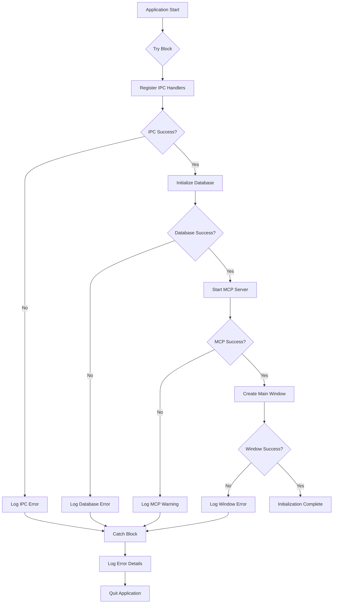

**Diagram sources**
- [src/main/index.ts](file://src/main/index.ts#L60-L109)

### IPC Error Recovery

The IPC system implements automatic error recovery:

- **Handler Wrapping**: All IPC handlers are automatically wrapped with error catching
- **Consistent Responses**: Errors return standardized ApiResponse objects
- **Logging Integration**: All errors are logged with context information
- **Graceful Degradation**: Individual handler failures don't affect other functionality

### Database Error Management

Database operations include specific error handling:

- **Connection Validation**: Verifies database connectivity before use
- **Migration Error Handling**: Gracefully handles migration failures
- **Transaction Safety**: Uses transactions for data consistency
- **Fallback Mechanisms**: Provides fallback options for critical operations

**Section sources**
- [src/main/index.ts](file://src/main/index.ts#L60-L109)
- [src/main/utils/response.ts](file://src/main/utils/response.ts#L18-L26)

## Performance Considerations

The main process architecture incorporates several performance optimization strategies to ensure fast application startup and responsive operation.

### Startup Optimization

Key performance optimizations include:

- **Parallel Initialization**: Non-blocking operations are performed concurrently
- **Lazy Loading**: IPC handlers are loaded only when needed
- **Resource Caching**: Database connections are maintained throughout the session
- **Efficient Schemas**: Strategic indexing improves query performance

### Memory Management

The application implements careful memory management:

- **Window Cleanup**: Proper disposal of BrowserWindow instances
- **Database Connections**: Efficient connection pooling and cleanup
- **Process Monitoring**: Monitoring of resource usage for long-running operations
- **Garbage Collection**: Strategic cleanup of unused objects

### Asynchronous Patterns

The architecture leverages modern JavaScript patterns:

- **Async/Await**: Consistent use of promises for asynchronous operations
- **Non-blocking I/O**: Database operations use non-blocking patterns
- **Event-driven Architecture**: Responsive to system events without blocking
- **Timeout Management**: Proper timeout handling for external operations

## Common Issues and Solutions

### Multiple Window Management

The application handles multiple window scenarios through:

- **Window Tracking**: Maintaining references to all open windows
- **Focus Management**: Proper focus handling across windows
- **Resource Sharing**: Efficient sharing of database connections
- **State Synchronization**: Coordinated state management across windows

### Memory Leak Prevention

Prevention strategies include:

- **Proper Cleanup**: Explicit cleanup of event listeners and resources
- **Reference Management**: Careful management of object references
- **Process Isolation**: Isolating potentially problematic operations
- **Monitoring**: Regular monitoring of memory usage patterns

### Asynchronous Initialization Challenges

The application addresses common async initialization issues:

- **Order Dependencies**: Careful sequencing of initialization steps
- **Timeout Handling**: Appropriate timeouts for external operations
- **Fallback Strategies**: Alternative approaches when operations fail
- **Progress Indication**: User feedback during lengthy initialization

### Cross-Platform Compatibility

Platform-specific considerations include:

- **Path Resolution**: Proper handling of file paths across operating systems
- **Resource Locations**: Different asset locations for development vs production
- **System Integration**: Platform-specific integration requirements
- **Permission Handling**: Appropriate permission management

## Architecture Diagrams

### Complete System Architecture

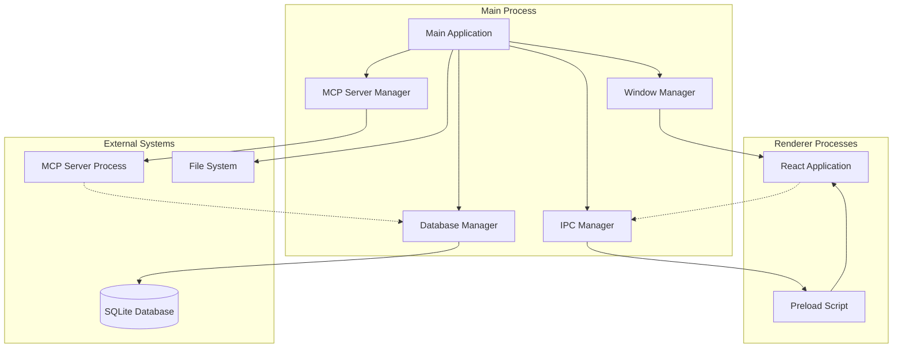

**Diagram sources**
- [src/main/index.ts](file://src/main/index.ts#L1-L110)
- [src/main/preload/index.ts](file://src/preload/index.ts#L1-L202)

### IPC Communication Flow

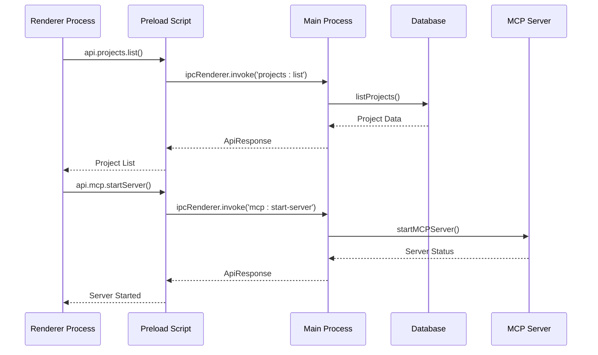

**Diagram sources**
- [src/main/preload/index.ts](file://src/main/preload/index.ts#L1-L202)
- [src/main/ipc/projects.ts](file://src/main/ipc/projects.ts#L1-L84)
- [src/main/ipc/mcp.ts](file://src/main/ipc/mcp.ts#L1-L151)

### Database Schema Evolution

```mermaid
erDiagram
subgraph "Core Features"
PROJECTS {
id PK
name UK
color
icon
position
created_at
updated_at
archived_at
}
TASKS {
id PK
project_id FK
title
description
status
due_date
priority
tags
position
created_at
updated_at
estimated_minutes
estimated_start_date
estimated_end_date
actual_start_date
actual_end_date
actual_minutes
}
ACTIVITIES {
id PK
type
message
entity_type
entity_id
metadata
created_at
}
end
subgraph "AI Features"
NOTEBOOKS {
id PK
name
description
icon
color
created_at
updated_at
}
QA_COLLECTIONS {
id PK
name
description
color
icon
created_at
updated_at
}
HABITS {
id PK
name
description
icon
color
category
frequency
target_count
created_at
updated_at
}
end
subgraph "Analytics"
METRICS_CONFIG {
id PK
user_id
config_data
created_at
updated_at
}
EVENTS {
id PK
type
user_id
meta
ts
}
end
PROJECTS ||--o{ TASKS : contains
ACTIVITIES ||--o{ PROJECTS : references
ACTIVITIES ||--o{ TASKS : references
NOTEBOOKS ||--o{ NOTES : contains
QA_COLLECTIONS ||--o{ QA_QUESTIONS : contains
QA_QUESTIONS ||--o{ QA_ANSWERS : contains
```

**Diagram sources**
- [src/database/init.ts](file://src/database/init.ts#L35-L144)

This comprehensive main process architecture demonstrates sophisticated desktop application design principles, focusing on reliability, performance, and maintainability while providing a robust foundation for the LifeOS productivity application.