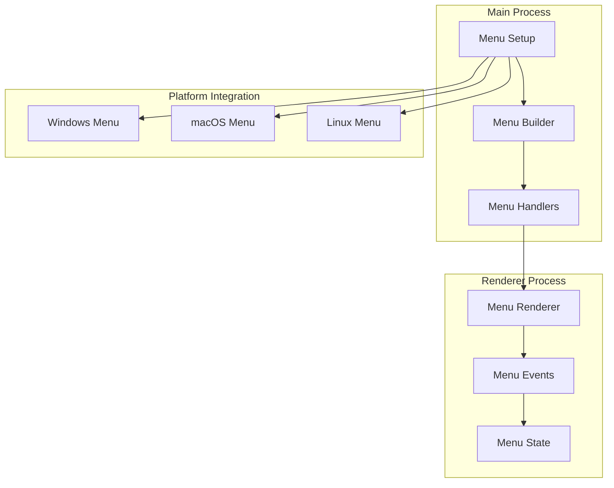
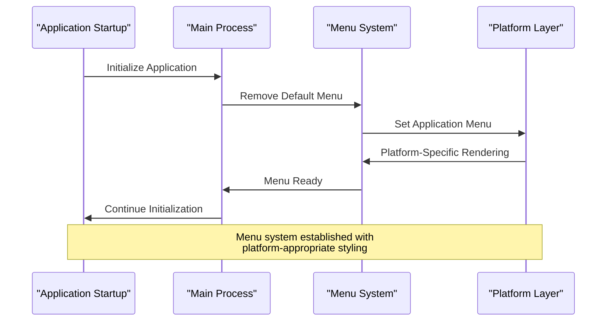
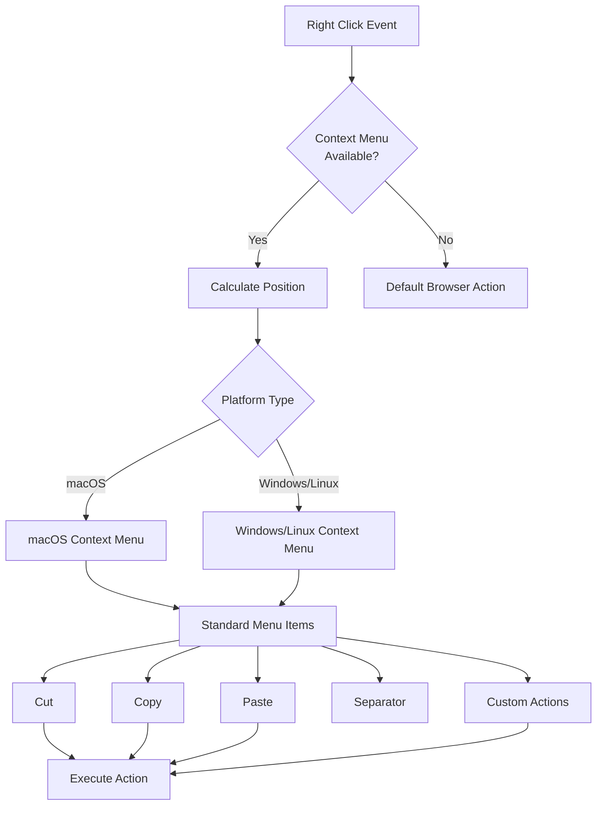
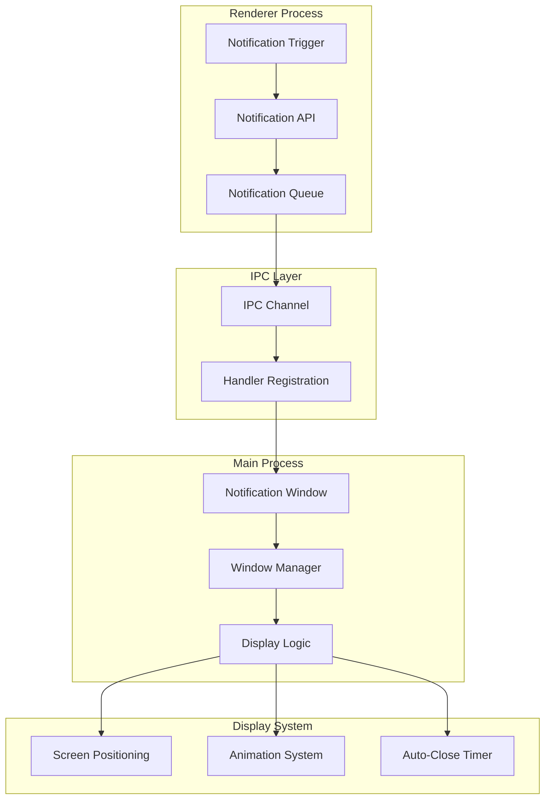

# System Integration

<cite>
**Referenced Files in This Document**
- [AI/CUSTOM-UI.md](file://AI/CUSTOM-UI.md)
- [src/main/ipc/notification.ts](file://src/main/ipc/notification.ts)
- [src/main/ipc/window.ts](file://src/main/ipc/window.ts)
- [src/main/index.ts](file://src/main/index.ts)
- [src/preload/index.ts](file://src/preload/index.ts)
- [src/renderer/components/TitleBar.tsx](file://src/renderer/components/TitleBar.tsx)
- [src/renderer/components/CustomTitlebar.tsx](file://src/renderer/components/CustomTitlebar.tsx)
- [notification.html](file://notification.html)
- [src/renderer/pages/SettingsPage.tsx](file://src/renderer/pages/SettingsPage.tsx)
- [src/database/mcpRepo.ts](file://src/database/mcpRepo.ts)
</cite>

## Table of Contents
1. [Introduction](#introduction)
2. [Custom Menu System](#custom-menu-system)
3. [Context Menu Implementation](#context-menu-implementation)
4. [Notification System](#notification-system)
5. [System Tray and Menu Bar Integration](#system-tray-and-menu-bar-integration)
6. [Platform-Specific Behaviors](#platform-specific-behaviors)
7. [Accessibility Considerations](#accessibility-considerations)
8. [Configuration Options](#configuration-options)
9. [Best Practices](#best-practices)
10. [Troubleshooting](#troubleshooting)

## Introduction

LifeOS implements comprehensive system integration features that provide native desktop experiences across Windows, macOS, and Linux platforms. The system integrates deeply with operating system capabilities while maintaining consistent branding and user experience. Key integration areas include custom menus, context menus, notifications, system tray functionality, and platform-specific window management.

The system follows Electron's IPC architecture with carefully designed custom implementations that replace default OS behaviors with branded alternatives while preserving native functionality and accessibility standards.

## Custom Menu System

### Menu Architecture Overview

LifeOS replaces the default Electron menu system with a custom implementation that provides platform-appropriate menu structures while maintaining brand consistency.



**Diagram sources**
- [AI/CUSTOM-UI.md](file://AI/CUSTOM-UI.md#L227-L290)
- [src/main/index.ts](file://src/main/index.ts#L1-L50)

### Menu Structure Implementation

The custom menu system implements three primary sections: File, Edit, and View, with platform-specific accelerators and behaviors.

#### File Menu
- **New Project**: Creates new project with CmdOrCtrl+N accelerator
- **Settings**: Opens application settings with CmdOrCtrl+, accelerator  
- **Quit**: Terminates application with platform-appropriate shortcut (Cmd+Q for macOS, Ctrl+Q for others)

#### Edit Menu
- **Undo/Redo**: Standard text editing commands
- **Cut/Copy/Paste**: Basic clipboard operations
- **Separator**: Visual grouping of standard edit operations

#### View Menu
- **Reload**: Refreshes current view
- **Force Reload**: Hard refresh bypassing cache
- **Toggle DevTools**: Developer tools access
- **Zoom Controls**: Zoom in, zoom out, reset zoom
- **Fullscreen Toggle**: Fullscreen mode switching

**Section sources**
- [AI/CUSTOM-UI.md](file://AI/CUSTOM-UI.md#L227-L290)

### Menu Customization Process

The menu customization process involves several steps to ensure proper integration with the Electron framework and platform-specific behaviors.



**Diagram sources**
- [src/main/index.ts](file://src/main/index.ts#L1-L50)
- [AI/CUSTOM-UI.md](file://AI/CUSTOM-UI.md#L227-L290)

## Context Menu Implementation

### Right-Click Interaction System

LifeOS implements a comprehensive context menu system that provides standard editing commands and custom application actions through right-click interactions.



**Diagram sources**
- [AI/CUSTOM-UI.md](file://AI/CUSTOM-UI.md#L291-L376)

### Context Menu Features

The context menu system provides essential editing capabilities and application-specific actions:

#### Standard Editing Commands
- **Cut**: Removes selected content and places it in clipboard
- **Copy**: Duplicates selected content to clipboard
- **Paste**: Inserts clipboard content at cursor position

#### Custom Application Actions
The context menu can be extended with application-specific actions that integrate seamlessly with the main menu system and provide quick access to frequently used features.

**Section sources**
- [AI/CUSTOM-UI.md](file://AI/CUSTOM-UI.md#L291-L376)

## Notification System

### Desktop Notification Architecture

LifeOS implements a sophisticated notification system that leverages Electron's native notification capabilities while providing rich, animated desktop alerts.



**Diagram sources**
- [src/main/ipc/notification.ts](file://src/main/ipc/notification.ts#L1-L115)
- [notification.html](file://notification.html#L1-L176)

### Notification Implementation Details

#### Window-Based Notifications
The notification system creates temporary browser windows positioned in the bottom-right corner of the screen, providing native-like desktop notifications.

#### Notification Types
- **Info**: General informational messages
- **Success**: Successful operation confirmations
- **Warning**: Cautionary messages and warnings
- **Error**: Error conditions and failures

#### Positioning and Stacking
Notifications automatically position themselves in the bottom-right corner with proper spacing and stacking behavior. Multiple notifications are stacked vertically with appropriate offsets.

#### Duration and Auto-Close
Each notification displays for a configurable duration (default 3 seconds) with smooth fade-out animations. The system automatically manages notification lifecycles and cleanup.

**Section sources**
- [src/main/ipc/notification.ts](file://src/main/ipc/notification.ts#L1-L115)
- [notification.html](file://notification.html#L1-L176)

### Notification API Usage

The notification system provides a simple API for triggering desktop notifications from the renderer process:

```typescript
// Example notification usage pattern
await window.api.notification.show({
  type: 'success',
  title: 'Operation Complete',
  message: 'Your task has been successfully completed.',
  duration: 3000
});
```

**Section sources**
- [src/renderer/pages/SettingsPage.tsx](file://src/renderer/pages/SettingsPage.tsx#L149-L190)

## System Tray and Menu Bar Integration

### Background Operation Support

While the current implementation focuses on window-based operation, the system architecture supports future enhancements for system tray and menu bar integration for background operation and quick access.

### Quick Access Features

The system provides several mechanisms for quick access to application features:

#### Titlebar Controls
- **Minimize**: Reduces application to system tray or taskbar
- **Maximize/Restore**: Toggles between windowed and fullscreen modes
- **Close**: Terminates application or hides to system tray

#### Keyboard Shortcuts
- **Alt+F4**: Immediate close operation
- **Alt+F10**: Focus titlebar for keyboard navigation
- **Platform Accelerators**: Native keyboard shortcuts for common operations

**Section sources**
- [src/renderer/components/CustomTitlebar.tsx](file://src/renderer/components/CustomTitlebar.tsx#L377-L433)
- [src/main/ipc/window.ts](file://src/main/ipc/window.ts#L1-L25)

## Platform-Specific Behaviors

### Windows Platform Integration

#### Window Controls
- **Standard Buttons**: Minimize, Maximize/Restore, Close buttons
- **Titlebar Height**: 32px standard Windows titlebar height
- **Theme Awareness**: Automatic adaptation to Windows theme colors
- **Taskbar Integration**: Proper taskbar grouping and thumbnail previews

#### Behavior Patterns
- **Minimize to Taskbar**: Standard Windows minimize behavior
- **Alt+Tab Navigation**: Seamless application switching
- **System Tray Support**: Future enhancement for background operation

### macOS Platform Integration

#### Native Appearance
- **Traffic Light Controls**: Red (close), Yellow (minimize), Green (maximize) buttons
- **Titlebar Height**: 28px standard macOS titlebar height
- **Glass Effect**: Optional translucency and blur effects
- **Mission Control**: Proper integration with macOS window management

#### Platform-Specific Features
- **Hide to Dock**: Option to hide application to macOS dock
- **Command+Q**: Global quit shortcut
- **Full-Screen Mode**: Native macOS full-screen experience

### Linux Platform Integration

#### Desktop Environment Compatibility
- **GNOME Integration**: Proper integration with GNOME shell
- **KDE Support**: Compatibility with KDE Plasma environments
- **Unity Support**: Ubuntu Unity desktop integration
- **Custom Themes**: Support for various Linux desktop themes

#### Window Management
- **Window Controls**: Platform-appropriate window controls
- **Taskbar Behavior**: Standard Linux taskbar integration
- **Compositor Support**: Proper rendering with compositors

**Section sources**
- [AI/CUSTOM-UI.md](file://AI/CUSTOM-UI.md#L0-L36)
- [src/renderer/components/CustomTitlebar.tsx](file://src/renderer/components/CustomTitlebar.tsx#L110-L226)

## Accessibility Considerations

### Keyboard Navigation Support

LifeOS implements comprehensive keyboard navigation support for all system integration features:

#### Titlebar Keyboard Navigation
- **Alt+F4**: Immediate application close
- **Alt+F10**: Focus titlebar for keyboard interaction
- **Arrow Keys**: Navigate between titlebar controls
- **Enter/Space**: Activate selected controls

#### Menu Keyboard Access
- **Alt+Letter**: Access menu items by letter
- **Arrow Keys**: Navigate menu hierarchies
- **Escape**: Close menus and return to previous state
- **Tab/Shift+Tab**: Move between interactive elements

#### Context Menu Navigation
- **Right Arrow**: Open submenus
- **Left Arrow**: Close submenus
- **Enter**: Select menu item
- **Space**: Alternative selection method

**Section sources**
- [AI/CUSTOM-UI.md](file://AI/CUSTOM-UI.md#L377-L433)

### Screen Reader Compatibility

#### Semantic Markup
The system uses proper ARIA roles and labels for screen reader compatibility:

```html
<!-- Example accessibility markup -->
<div 
  className="custom-titlebar"
  role="banner"
  aria-label="Application titlebar"
>
  <button
    aria-label="Minimize window"
    onClick={handleMinimize}
  >
    <!-- Icon content -->
  </button>
</div>
```

#### Dynamic Content Updates
- **Live Regions**: Announce window state changes
- **Status Updates**: Communicate application status changes
- **Focus Management**: Proper focus handling for screen readers

**Section sources**
- [AI/CUSTOM-UI.md](file://AI/CUSTOM-UI.md#L377-L433)

### High Contrast and Theme Support

#### Visual Accessibility
- **High Contrast Mode**: Support for Windows high contrast themes
- **Dark/Light Themes**: Automatic adaptation to system theme preferences
- **Color Independence**: Functionality available without color cues
- **Large Text Support**: Proper scaling with system text size settings

#### Motor Accessibility
- **Single-Button Operation**: Support for single-switch access
- **Predictable Navigation**: Consistent navigation patterns
- **Timeout Configuration**: Adjustable timeout for keyboard operations

## Configuration Options

### System Integration Settings

LifeOS provides configuration options for managing system integration features:

#### Menu System Configuration
- **Custom Menus**: Enable/disable custom menu system
- **Accelerators**: Configure keyboard shortcuts
- **Menu Visibility**: Control menu bar visibility

#### Notification Settings
- **Enable Notifications**: Toggle desktop notifications
- **Notification Duration**: Configure display duration
- **Position Preferences**: Set notification positioning
- **Sound Alerts**: Enable/disable notification sounds

#### Window Behavior
- **Minimize to Tray**: Enable system tray minimize
- **Startup Behavior**: Configure application startup
- **Window State**: Restore previous window state
- **Multi-Monitor Support**: Handle multiple displays

**Section sources**
- [src/renderer/pages/SettingsPage.tsx](file://src/renderer/pages/SettingsPage.tsx#L1-L330)

### Database Configuration Storage

System integration preferences are stored in the application database for persistence across sessions:

```typescript
// Example configuration storage pattern
export function updateMCPConfig(payload: UpdateMCPConfigPayload): MCPConfig {
  const db = getDb();
  
  // Build dynamic UPDATE statement
  const updates: string[] = [];
  const params: any[] = [];
  
  if (payload.enabled !== undefined) {
    updates.push('enabled = ?');
    params.push(payload.enabled ? 1 : 0);
  }
  
  // Additional configuration fields...
  
  // Execute update query
  const query = `
    UPDATE mcp_config
    SET ${updates.join(', ')}
    WHERE id = ?
  `;
  
  db.prepare(query).run(...params);
  return getMCPConfig();
}
```

**Section sources**
- [src/database/mcpRepo.ts](file://src/database/mcpRepo.ts#L25-L57)

## Best Practices

### Native User Experience Guidelines

#### Consistency Across Platforms
- **Platform Conventions**: Follow platform-specific UI conventions
- **Branding Integration**: Maintain LifeOS branding while respecting platform aesthetics
- **Behavior Expectations**: Meet user expectations for platform-specific behaviors

#### Performance Optimization
- **Lazy Loading**: Load system integration features on demand
- **Memory Management**: Proper cleanup of event listeners and resources
- **Event Debouncing**: Prevent excessive event firing in responsive systems

#### Security Considerations
- **IPC Validation**: Validate all IPC messages and parameters
- **Context Isolation**: Maintain proper security boundaries
- **Resource Access**: Limit system resource access to necessary operations

### Maintenance and Updates

#### Version Compatibility
- **Electron Updates**: Test system integration with new Electron versions
- **Platform Changes**: Monitor platform API changes and deprecations
- **Backward Compatibility**: Maintain compatibility with older platform versions

#### Testing Strategies
- **Cross-Platform Testing**: Verify functionality across all supported platforms
- **Accessibility Testing**: Regular accessibility audits and testing
- **Performance Monitoring**: Track system integration performance impact

## Troubleshooting

### Common Issues and Solutions

#### Menu System Problems
- **Menus Not Appearing**: Verify Menu.setApplicationMenu() calls are executed after app ready
- **Accelerator Conflicts**: Check for conflicting keyboard shortcuts
- **Platform Rendering Issues**: Ensure platform-specific menu templates are properly formatted

#### Notification System Issues
- **Notifications Not Displaying**: Verify notification permissions and system capabilities
- **Positioning Problems**: Check screen resolution and multi-monitor configurations
- **Performance Issues**: Monitor notification queue size and cleanup processes

#### Window Management Problems
- **Titlebar Not Working**: Verify frame: false and proper preload script configuration
- **Minimize/Maximize Issues**: Check window state event handlers and IPC communication
- **Platform-Specific Bugs**: Test on target platform versions and report platform-specific issues

### Debugging Tools

#### Development Tools
- **Electron DevTools**: Use built-in developer tools for IPC debugging
- **Console Logging**: Implement comprehensive logging for system integration events
- **Performance Profiling**: Monitor system integration performance impact

#### Platform-Specific Debugging
- **macOS Console**: Check system logs for macOS-specific issues
- **Windows Event Viewer**: Monitor Windows application logs
- **Linux Journal**: Use systemd journal for Linux debugging

**Section sources**
- [src/main/index.ts](file://src/main/index.ts#L70-L122)