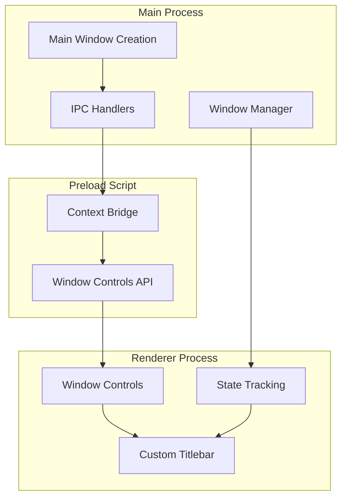
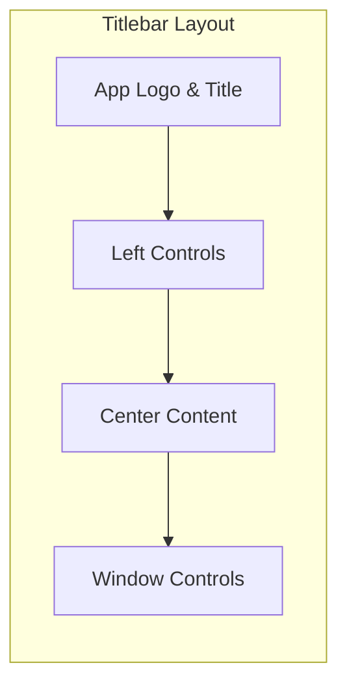
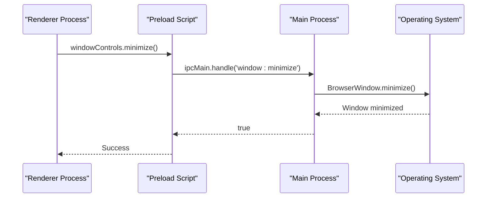
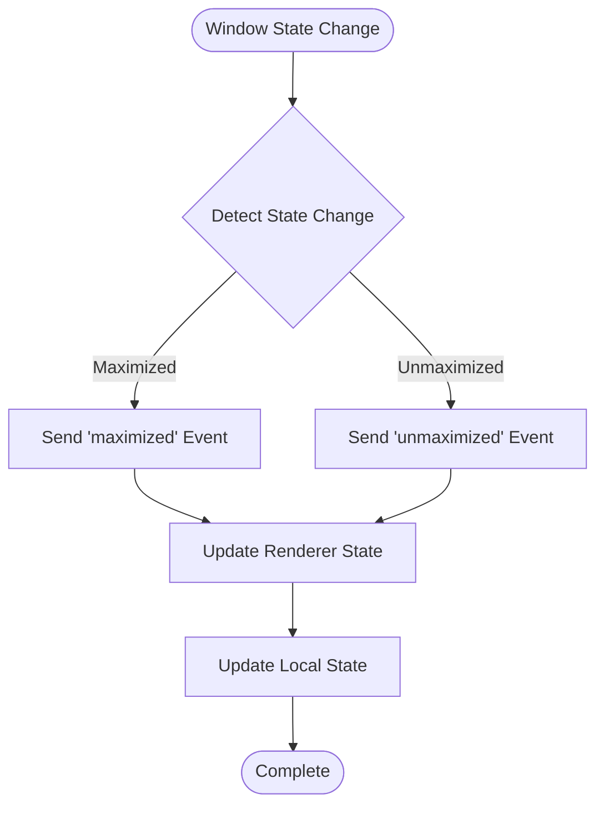
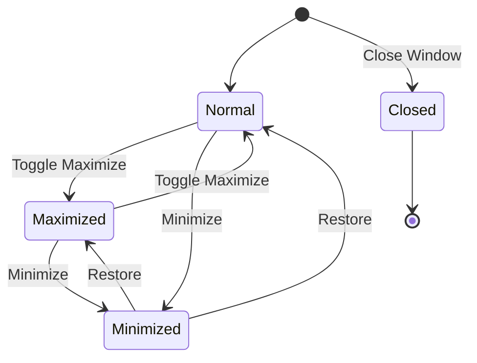

# Window Management

<cite>
**Referenced Files in This Document**
- [src/main/index.ts](file://src/main/index.ts)
- [src/main/ipc/window.ts](file://src/main/ipc/window.ts)
- [src/preload/index.ts](file://src/preload/index.ts)
- [src/renderer/components/TitleBar.tsx](file://src/renderer/components/TitleBar.tsx)
- [src/renderer/styles.css](file://src/renderer/styles.css)
- [src/renderer/global.d.ts](file://src/renderer/global.d.ts)
- [AI/CUSTOM-UI.md](file://AI/CUSTOM-UI.md)
</cite>

## Table of Contents
1. [Introduction](#introduction)
2. [Architecture Overview](#architecture-overview)
3. [Frameless Window Configuration](#frameless-window-configuration)
4. [Custom Titlebar Implementation](#custom-titlebar-implementation)
5. [Window Control Functions](#window-control-functions)
6. [Platform-Specific Considerations](#platform-specific-considerations)
7. [Window State Management](#window-state-management)
8. [Performance Optimization](#performance-optimization)
9. [Accessibility Features](#accessibility-features)
10. [Common Issues and Solutions](#common-issues-and-solutions)
11. [Best Practices](#best-practices)

## Introduction

The LifeOS Window Management system provides a sophisticated framework for creating custom window behavior and controls in Electron applications. This system enables developers to implement frameless windows with custom titlebars while maintaining native platform-specific functionality and accessibility standards.

The window management architecture consists of three main layers: the main process handles window creation and state management, the preload script exposes secure IPC channels, and the renderer process manages the custom UI components and user interactions.

## Architecture Overview

The window management system follows a layered architecture pattern that separates concerns between window creation, state management, and user interface rendering.



**Diagram sources**
- [src/main/index.ts](file://src/main/index.ts#L25-L50)
- [src/main/ipc/window.ts](file://src/main/ipc/window.ts#L1-L27)
- [src/preload/index.ts](file://src/preload/index.ts#L184-L192)

**Section sources**
- [src/main/index.ts](file://src/main/index.ts#L1-L123)
- [src/preload/index.ts](file://src/preload/index.ts#L1-L202)

## Frameless Window Configuration

The foundation of the custom window system begins with the BrowserWindow configuration in the main process. The window is created with specific properties that enable frameless operation and custom titlebar implementation.

### Core Configuration Properties

The window configuration includes several critical properties that define the custom window behavior:

| Property | Value | Purpose |
|----------|-------|---------|
| `frame` | `false` | Removes the default operating system frame |
| `width` | `1200` | Initial window width in pixels |
| `height` | `800` | Initial window height in pixels |
| `minWidth` | `800` | Minimum allowable width |
| `minHeight` | `600` | Minimum allowable height |
| `backgroundColor` | `'#121212'` | Dark theme background color |
| `icon` | Platform-specific | Application icon path |

### WebPreferences Configuration

The webPreferences object ensures security and proper isolation between the main process and renderer:

| Setting | Value | Security Benefit |
|---------|-------|------------------|
| `nodeIntegration` | `false` | Prevents Node.js access in renderer |
| `contextIsolation` | `true` | Isolates preload context |
| `preload` | Path to preload script | Provides controlled API access |

**Section sources**
- [src/main/index.ts](file://src/main/index.ts#L25-L50)

## Custom Titlebar Implementation

The custom titlebar system provides a unified interface across all platforms while respecting native design guidelines and user expectations.

### Titlebar Structure and Layout

The titlebar follows a consistent layout pattern across platforms:



**Diagram sources**
- [src/renderer/components/TitleBar.tsx](file://src/renderer/components/TitleBar.tsx#L35-L62)
- [AI/CUSTOM-UI.md](file://AI/CUSTOM-UI.md#L110-L226)

### Drag Region Management

The custom titlebar implements proper drag region handling using CSS properties:

| CSS Property | Value | Function |
|--------------|-------|----------|
| `-webkit-app-region` | `drag` | Enables window dragging |
| `-webkit-app-region` | `no-drag` | Disables dragging on controls |

This approach allows users to drag the window by clicking anywhere on the titlebar except for interactive elements like buttons.

**Section sources**
- [src/renderer/styles.css](file://src/renderer/styles.css#L18-L35)
- [src/renderer/components/TitleBar.tsx](file://src/renderer/components/TitleBar.tsx#L1-L63)

## Window Control Functions

The window control system provides four primary functions: minimize, maximize/restore, and close. These functions are implemented through secure IPC channels that communicate between the renderer and main process.

### IPC Channel Implementation

Each window control function is implemented as an IPC handler in the main process:



**Diagram sources**
- [src/main/ipc/window.ts](file://src/main/ipc/window.ts#L3-L10)
- [src/preload/index.ts](file://src/preload/index.ts#L184-L192)

### Control Function Specifications

| Function | IPC Handler | Description | Return Type |
|----------|-------------|-------------|-------------|
| Minimize | `window:minimize` | Reduces window to system tray/taskbar | `boolean` |
| Maximize | `window:toggle-maximize` | Toggles between maximized and normal state | `boolean` |
| Close | `window:close` | Terminates the window and application | `boolean` |
| Is Maximized | `window:is-maximized` | Checks current maximized state | `boolean` |

### State Synchronization

The window state synchronization mechanism ensures that the renderer maintains an accurate representation of the window's current state:



**Diagram sources**
- [src/main/ipc/window.ts](file://src/main/ipc/window.ts#L18-L26)
- [src/renderer/components/TitleBar.tsx](file://src/renderer/components/TitleBar.tsx#L8-L18)

**Section sources**
- [src/main/ipc/window.ts](file://src/main/ipc/window.ts#L1-L27)
- [src/preload/index.ts](file://src/preload/index.ts#L184-L192)

## Platform-Specific Considerations

The window management system implements platform-specific adaptations to ensure native-feel behavior across Windows, macOS, and Linux environments.

### Windows Platform

Windows implementation focuses on traditional window controls and system integration:

| Element | Implementation | Behavior |
|---------|---------------|----------|
| Traffic Lights | Standard minimize/maximize/close | Respects Windows window chrome |
| Height | 32px | Matches Windows titlebar height |
| Colors | System theme-aware | Adapts to Windows accent colors |
| Controls | Minimize, Maximize, Close | Standard Windows window buttons |

### macOS Platform

macOS implementation follows Apple's Human Interface Guidelines:

| Element | Implementation | Native Equivalent |
|---------|---------------|-------------------|
| Traffic Lights | Red, Yellow, Green circles | Native macOS traffic light buttons |
| Positioning | Center-aligned with title | Standard macOS titlebar layout |
| Height | 28px | Exact macOS titlebar height |
| Behavior | Window state management | Native macOS window management |

### Linux Platform

Linux implementation adapts to various desktop environments:

| Element | Implementation | Adaptation |
|---------|---------------|------------|
| Controls | Platform-dependent | Respects desktop environment |
| Height | 32px | Consistent across distributions |
| Appearance | GTK/Qt compatible | Adapts to desktop theme |
| Behavior | Standard window operations | Respects window manager |

**Section sources**
- [AI/CUSTOM-UI.md](file://AI/CUSTOM-UI.md#L20-L65)
- [src/renderer/components/TitleBar.tsx](file://src/renderer/components/TitleBar.tsx#L40-L62)

## Window State Management

The window state management system tracks and synchronizes the window's current state across all components of the application.

### State Tracking Mechanisms

The system employs multiple mechanisms to track window state:



### State Synchronization Flow

The state synchronization follows a reliable pattern:

1. **Initial State Polling**: On component mount, the renderer polls the current state
2. **Event-Driven Updates**: Window state changes trigger events to update the renderer
3. **Local State Management**: Components maintain local state for immediate feedback
4. **Fallback Mechanisms**: Error handling ensures graceful degradation

**Section sources**
- [src/renderer/components/TitleBar.tsx](file://src/renderer/components/TitleBar.tsx#L8-L18)

## Performance Optimization

The window management system implements several performance optimization strategies to ensure smooth operation and responsive user experience.

### Optimization Techniques

| Technique | Implementation | Benefit |
|-----------|---------------|---------|
| Event Delegation | Single event listener for titlebar | Reduced memory usage |
| Debounced Resize | Throttled resize event handling | Improved performance |
| Lazy Loading | Conditional component loading | Faster initial load |
| Memory Management | Proper event listener cleanup | Prevent memory leaks |

### Animation Performance

The system optimizes animations using CSS hardware acceleration:

```css
/* Performance-optimized transitions */
.titlebar-button {
  transition: background-color 150ms ease-out;
  will-change: background-color;
}

.titlebar-button:hover {
  background-color: var(--hover-bg);
}
```

### Startup Performance

The application implements several startup optimizations:

- **Parallel Initialization**: IPC handlers and database initialization occur concurrently
- **Early Rendering**: UI components render immediately while data loads
- **Progressive Enhancement**: Core functionality works without all features

**Section sources**
- [AI/CUSTOM-UI.md](file://AI/CUSTOM-UI.md#L400-L433)
- [src/renderer/styles.css](file://src/renderer/styles.css#L55-L71)

## Accessibility Features

The window management system incorporates comprehensive accessibility features to support users with diverse needs.

### Keyboard Navigation

The system provides extensive keyboard navigation support:

| Key Combination | Action | Platform Support |
|-----------------|--------|------------------|
| Alt+F4 | Close Window | All platforms |
| Alt+F10 | Focus Titlebar | All platforms |
| Tab | Navigate controls | All platforms |
| Enter/Space | Activate control | All platforms |

### Screen Reader Support

Accessibility features include:

- **ARIA Labels**: All interactive elements have descriptive labels
- **Role Attributes**: Proper semantic markup for assistive technologies
- **State Announcements**: Window state changes are announced
- **Focus Management**: Logical focus order and visual indicators

### Visual Accessibility

The system supports various visual accessibility needs:

- **High Contrast Mode**: Full support for high contrast themes
- **Color Blindness**: Color-independent state indication
- **Large Text**: Scalable interface elements
- **Reduced Motion**: Optional motion reduction support

**Section sources**
- [AI/CUSTOM-UI.md](file://AI/CUSTOM-UI.md#L377-L433)

## Common Issues and Solutions

This section addresses frequently encountered issues in window management and provides practical solutions.

### Window Positioning Issues

**Problem**: Window appears in unexpected position on startup
**Solution**: Configure window position in main process using screen bounds detection

**Problem**: Window moves unexpectedly during resize
**Solution**: Implement proper bounds checking and prevent invalid positions

### Maximize/Unmaximize State Issues

**Problem**: State synchronization delays between main and renderer
**Solution**: Implement immediate local state updates with eventual consistency

**Problem**: Inconsistent behavior across platforms
**Solution**: Use platform-specific state detection and normalization

### Window Flicker During Startup

**Problem**: Brief appearance of default window chrome
**Solution**: Set appropriate background color and ensure quick DOM rendering

**Problem**: Flash of unstyled content
**Solution**: Implement proper loading states and CSS-in-JS for dynamic styling

### Cross-Platform Compatibility

**Problem**: Different behavior on Windows vs. macOS
**Solution**: Use abstraction layers and platform-specific implementations

**Problem**: Inconsistent window control appearance
**Solution**: Implement platform-aware styling and behavior patterns

## Best Practices

### Development Guidelines

1. **Security First**: Always use context isolation and disable node integration
2. **Performance Priority**: Implement lazy loading and efficient event handling
3. **Accessibility Compliance**: Follow WCAG guidelines for all interactive elements
4. **Cross-Platform Testing**: Test on all target platforms regularly

### Code Organization

1. **Separation of Concerns**: Keep window logic separate from business logic
2. **Type Safety**: Use TypeScript interfaces for IPC communication
3. **Error Handling**: Implement robust error handling for all IPC calls
4. **Documentation**: Document platform-specific behaviors and limitations

### Maintenance Considerations

1. **Version Compatibility**: Test with different Electron versions
2. **Performance Monitoring**: Monitor window-related performance metrics
3. **User Feedback**: Collect and address user-reported window issues
4. **Regular Updates**: Keep platform-specific implementations current