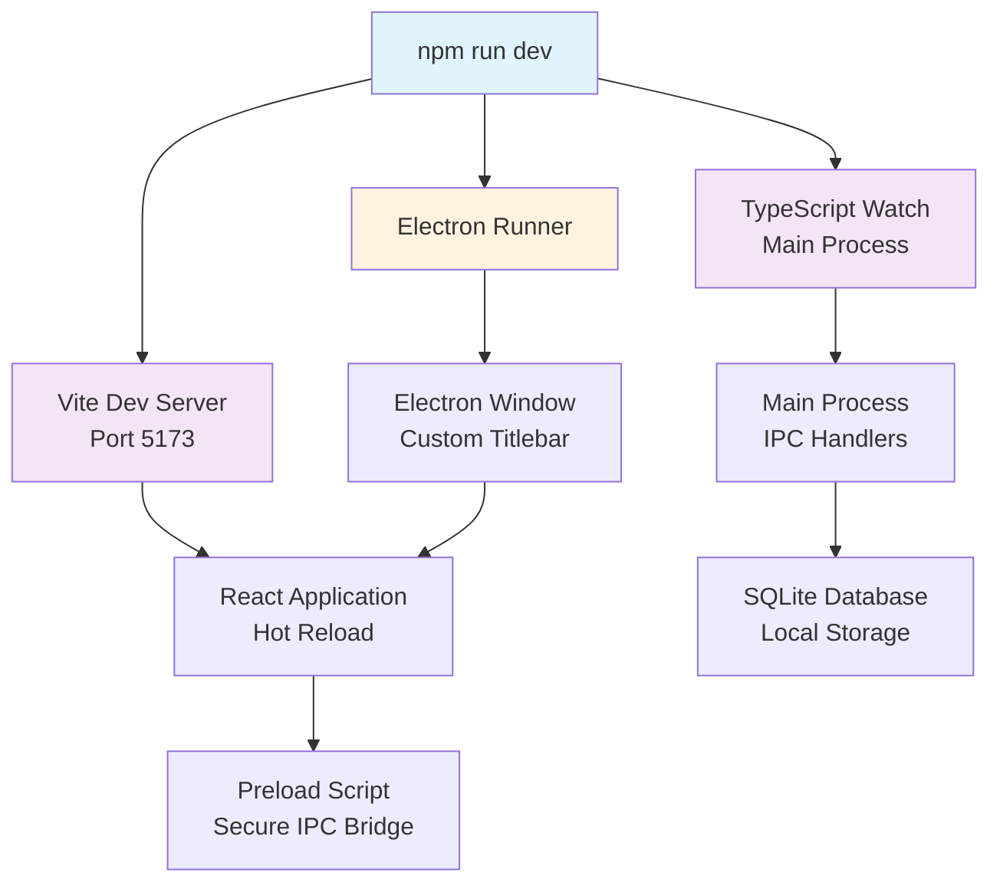
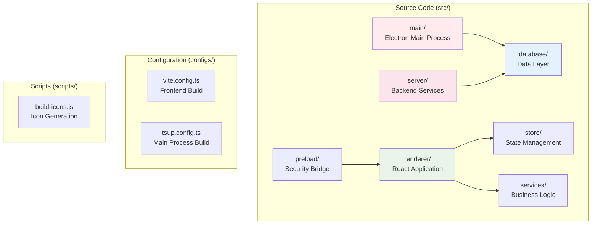
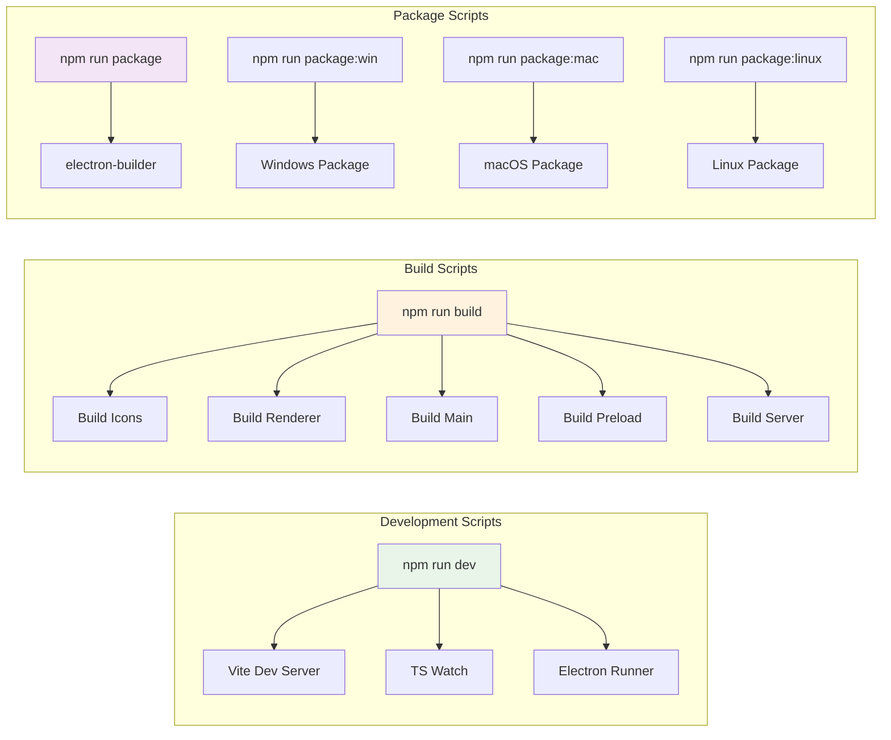
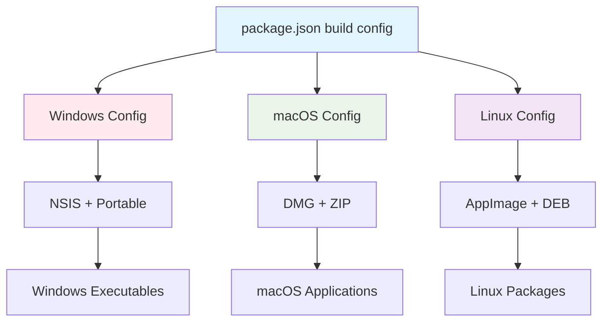

# Getting Started

<cite>
**Referenced Files in This Document**
- [README.md](file://README.md)
- [package.json](file://package.json)
- [configs/vite.config.ts](file://configs/vite.config.ts)
- [configs/tsup.config.ts](file://configs/tsup.config.ts)
- [src/main/index.ts](file://src/main/index.ts)
- [src/main/devRunner.ts](file://src/main/devRunner.ts)
- [src/preload/index.ts](file://src/preload/index.ts)
- [src/database/init.ts](file://src/database/init.ts)
- [scripts/build-icons.js](file://scripts/build-icons.js)
- [tsconfig.json](file://tsconfig.json)
</cite>

## Table of Contents
1. [Introduction](#introduction)
2. [Prerequisites](#prerequisites)
3. [Installation](#installation)
4. [Development Setup](#development-setup)
5. [Project Structure](#project-structure)
6. [Development Scripts](#development-scripts)
7. [Building for Production](#building-for-production)
8. [Platform-Specific Packaging](#platform-specific-packaging)
9. [Troubleshooting](#troubleshooting)
10. [First Launch](#first-launch)

## Introduction

LifeOS is a powerful, **local-first productivity operating system** designed to help you organize your life with integrated tools for task management, note-taking, habit tracking, and knowledge management. Built with modern web technologies including Electron, React, and TypeScript, LifeOS provides a seamless desktop experience for Windows, macOS, and Linux platforms.

### Key Features

- **Integrated Productivity Suite**: Combine task management, note-taking, habit tracking, and knowledge management in one application
- **Local-First Privacy**: Your data stays on your computer with no cloud dependencies
- **Modern Desktop Experience**: Custom title bar, dark theme, and responsive design
- **Rich Feature Set**: Drag-and-drop kanban boards, markdown support, analytics, and more
- **Cross-Platform Compatibility**: Native applications for Windows, macOS, and Linux

## Prerequisites

Before installing LifeOS, ensure your system meets the following requirements:

### Minimum System Requirements

| Component | Requirement | Notes |
|-----------|-------------|-------|
| **Operating System** | Windows 10+, macOS 10.13+, or Linux (Ubuntu 18.04+) | All major platforms supported |
| **Node.js** | Version 18 or higher | Required for development and building |
| **npm** | Latest stable version | Comes bundled with Node.js |
| **Git** | Latest stable version | For cloning the repository |

### Recommended Specifications

| Component | Recommendation | Purpose |
|-----------|----------------|---------|
| **RAM** | 8GB+ | For smooth development experience |
| **Storage** | 2GB+ free space | For dependencies and build artifacts |
| **CPU** | Multi-core processor | For faster compilation and builds |

### Verification Commands

Test your prerequisites by running these commands in your terminal:

```bash
# Check Node.js version
node --version  # Should show v18.x.x or higher

# Check npm version  
npm --version   # Should show v8.x.x or higher

# Check Git version
git --version   # Should show v2.x.x or higher
```

## Installation

### Step 1: Clone the Repository

```bash
# Clone the LifeOS repository
git clone https://github.com/yourusername/lifeos.git

# Navigate to the project directory
cd lifeos
```

### Step 2: Install Dependencies

```bash
# Install all project dependencies
npm install
```

The installation process will:
- Download and configure all required packages
- Set up TypeScript compilation
- Install Electron dependencies
- Configure development tools

### Step 3: Verify Installation

After installation completes, verify everything is set up correctly:

```bash
# Check if dependencies installed successfully
npm list --depth=0

# Run type checking to ensure TypeScript setup is working
npm run typecheck
```

**Section sources**
- [README.md](file://README.md#L118-L130)
- [package.json](file://package.json#L1-L109)

## Development Setup

### Starting the Development Environment

LifeOS uses a dual-process architecture with separate development servers for the main Electron process and the React renderer. The development setup includes:

```bash
# Start development mode (recommended)
npm run dev
```

This command launches:
- **Vite Development Server**: Hot-reload React application on port 5173
- **TypeScript Compiler**: Watches for main process changes
- **Electron**: Main process with automatic reloading
- **Database Initialization**: SQLite database setup

### Development Architecture



**Diagram sources**
- [src/main/devRunner.ts](file://src/main/devRunner.ts#L1-L40)
- [src/main/index.ts](file://src/main/index.ts#L1-L110)

### Development Workflow

1. **Start Development Server**: `npm run dev`
2. **Make Changes**: Edit files in `src/` directory
3. **Automatic Updates**: 
   - React components update with hot reload
   - Main process requires restart for changes
4. **Debugging**: Developer tools open automatically in development mode

### Development Scripts

| Script | Purpose | Command |
|--------|---------|---------|
| `dev` | Start development server | `npm run dev` |
| `dev:vite` | Start Vite dev server only | `npm run dev:vite` |
| `dev:main` | Start main process watcher | `npm run dev:main` |
| `typecheck` | Run TypeScript checks | `npm run typecheck` |
| `lint` | Run code linting | `npm run lint` |

**Section sources**
- [package.json](file://package.json#L6-L18)
- [src/main/devRunner.ts](file://src/main/devRunner.ts#L1-L40)

## Project Structure

LifeOS follows a modular architecture with clear separation of concerns:



**Diagram sources**
- [src/main/index.ts](file://src/main/index.ts#L1-L110)
- [src/preload/index.ts](file://src/preload/index.ts#L1-L202)
- [configs/vite.config.ts](file://configs/vite.config.ts#L1-L24)
- [configs/tsup.config.ts](file://configs/tsup.config.ts#L1-L31)

### Directory Breakdown

| Directory | Purpose | Key Files |
|-----------|---------|-----------|
| `src/main/` | Electron main process | `index.ts`, IPC handlers |
| `src/renderer/` | React frontend application | `App.tsx`, page components |
| `src/preload/` | Security bridge for IPC | `index.ts` |
| `src/database/` | Data persistence layer | Schemas, repositories |
| `src/server/` | Backend API services | Controllers, routes |
| `src/services/` | Business logic | Scoring, settings |
| `src/store/` | State management | Zustand stores |
| `configs/` | Build configurations | Vite, TSUP configs |
| `scripts/` | Build automation | Icon generation |

**Section sources**
- [README.md](file://README.md#L131-L170)

## Development Scripts

### Available Scripts

LifeOS provides a comprehensive set of scripts for development, building, and packaging:

#### Development Scripts

```bash
# Start development server with hot reload
npm run dev

# Build React application only
npm run build:renderer

# Build main process only
npm run build:main

# Build preload script only
npm run build:preload

# Build all components
npm run build
```

#### Production Scripts

```bash
# Build for production
npm run build

# Package for current platform
npm run package

# Package for specific platforms
npm run package:win    # Windows
npm run package:mac    # macOS
npm run package:linux  # Linux
```

#### Utility Scripts

```bash
# Run TypeScript type checking
npm run typecheck

# Start MCP server for development
npm run mcp:dev

# Start MCP server for production
npm run mcp:start
```

### Script Architecture



**Diagram sources**
- [package.json](file://package.json#L6-L25)

**Section sources**
- [package.json](file://package.json#L6-L25)

## Building for Production

### Production Build Process

LifeOS uses a multi-stage build process optimized for performance and security:

```bash
# Complete production build
npm run build
```

This command executes the following stages:

1. **Icon Generation**: Creates platform-specific icons
2. **Renderer Build**: Compiles React application with optimizations
3. **Main Process Build**: Transpiles TypeScript for Electron main process
4. **Preload Build**: Builds secure IPC bridge
5. **Server Build**: Compiles backend services

### Build Output Structure

After successful build, the output is organized as:

```
dist/
├── renderer/     # Compiled React application
├── main/         # Main process bundle
├── preload/      # Preload script
└── server/       # Backend services (ESM/CJS)

build/           # Platform icons
dist/           # Final packaged application
```

### Running Production Build

```bash
# Start the production application
npm run start
```

This launches the pre-built application from the `dist/` directory.

**Section sources**
- [package.json](file://package.json#L19-L25)
- [scripts/build-icons.js](file://scripts/build-icons.js#L1-L52)

## Platform-Specific Packaging

### Supported Platforms

LifeOS supports native packaging for all major desktop platforms:

| Platform | Package Types | Target Architectures |
|----------|---------------|---------------------|
| **Windows** | NSIS Installer, Portable | x64 |
| **macOS** | DMG, ZIP Archive | Universal (Intel + Apple Silicon) |
| **Linux** | AppImage, DEB Package | x64 |

### Platform-Specific Commands

```bash
# Windows packaging
npm run package:win

# macOS packaging  
npm run package:mac

# Linux packaging
npm run package:linux

# Cross-platform packaging
npm run package
```

### Packaging Configuration

The packaging process is configured through the `build` section in `package.json`:



**Diagram sources**
- [package.json](file://package.json#L26-L65)

### Icon Requirements

For successful packaging, ensure you have the required icon files:

| Platform | Required File | Size | Format |
|----------|---------------|------|--------|
| **Windows** | `build/icon.ico` | Multi-size | ICO |
| **macOS/Linux** | `build/icon.png` | 1024x1024px | PNG |

### Platform-Specific Considerations

#### Windows
- Requires `build/icon.ico` for installer
- Supports NSIS installer and portable distribution
- Code signing recommended for security

#### macOS
- Requires `build/icon.png` for DMG creation
- Supports universal binary for Intel + Apple Silicon
- Notarization process for Gatekeeper compliance

#### Linux
- Supports AppImage for universal distribution
- DEB package for Debian/Ubuntu distributions
- Icon scaling handled automatically

**Section sources**
- [package.json](file://package.json#L26-L65)
- [scripts/build-icons.js](file://scripts/build-icons.js#L1-L52)

## Troubleshooting

### Common Installation Issues

#### 1. Node.js Version Compatibility

**Problem**: Build fails with TypeScript or Electron errors
**Solution**: Ensure Node.js 18+ is installed

```bash
# Check Node.js version
node --version

# If version < 18, upgrade Node.js
# Using nvm (recommended):
nvm install 18
nvm use 18

# Or download from nodejs.org
```

#### 2. Missing Dependencies

**Problem**: `npm install` fails or throws dependency errors
**Solution**: Clear cache and reinstall

```bash
# Clear npm cache
npm cache clean --force

# Remove node_modules and reinstall
rm -rf node_modules package-lock.json
npm install
```

#### 3. Icon Generation Failures

**Problem**: Build fails with icon-related errors
**Solution**: Verify icon files exist

```bash
# Check if required icons exist
ls build/icon.png    # Should exist
ls build/icon.ico    # Windows only, should exist

# If missing, create from LOGO.svg
# Convert LOGO.svg to required formats
```

#### 4. Database Initialization Errors

**Problem**: Application fails to start with database errors
**Solution**: Check database permissions and path

```bash
# Verify database directory permissions
ls -la ~/.config/lifeos/

# Clear corrupted database (backup first if needed)
rm ~/.config/lifeos/lifeos.db
```

### Development Environment Issues

#### 5. Hot Reload Not Working

**Problem**: Changes don't reflect in development mode
**Solution**: Restart development server

```bash
# Stop current dev server (Ctrl+C)
# Restart with fresh process
npm run dev
```

#### 6. Port Conflicts

**Problem**: Vite dev server fails to start on port 5173
**Solution**: Change port or kill conflicting process

```bash
# Check if port 5173 is in use
netstat -ano | findstr :5173

# Kill process using port
taskkill /PID <process_id> /F

# Or change Vite port in vite.config.ts
```

#### 7. Electron Builder Issues

**Problem**: Packaging fails with electron-builder errors
**Solution**: Platform-specific troubleshooting

```bash
# Windows: Check Windows SDK and Visual Studio Build Tools
# macOS: Install Xcode Command Line Tools
# Linux: Install build essentials
sudo apt-get install build-essential
```

### Performance Issues

#### 8. Slow Build Times

**Problem**: Build process takes too long
**Solution**: Optimize build configuration

```bash
# Use incremental builds
# Ensure sufficient RAM allocated to Node.js
# Consider using SSD storage
```

#### 9. Memory Issues During Build

**Problem**: Build fails with out-of-memory errors
**Solution**: Increase Node.js memory limit

```bash
# Set memory limit (increase as needed)
export NODE_OPTIONS="--max-old-space-size=4096"
npm run build
```

### Platform-Specific Issues

#### Windows Troubleshooting

```bash
# PowerShell execution policy
Set-ExecutionPolicy -ExecutionPolicy Bypass -Scope Process

# Windows Defender exclusions
Add-MpPreference -ExclusionPath "C:\path\to\lifeos"
```

#### macOS Troubleshooting

```bash
# Xcode command line tools
xcode-select --install

# Gatekeeper bypass for development
spctl --master-disable
```

#### Linux Troubleshooting

```bash
# Missing dependencies
sudo apt-get install libgtk-3-dev libwebkit2gtk-4.0-dev libasound2-dev

# Desktop integration
sudo apt-get install desktop-file-utils
```

**Section sources**
- [src/database/init.ts](file://src/database/init.ts#L1-L144)
- [scripts/build-icons.js](file://scripts/build-icons.js#L1-L52)

## First Launch

### Initial Application Startup

After successful installation and build, launch LifeOS for the first time:

```bash
# Start in development mode
npm run dev

# Or start production build
npm run start
```

### Application Features on First Launch

Upon first startup, LifeOS initializes with:

1. **Database Creation**: SQLite database with default schemas
2. **Default Projects**: Sample projects to demonstrate functionality
3. **Sample Data**: Example tasks, notes, and habits
4. **Settings Initialization**: Default configuration loaded

### Exploring the Interface

LifeOS provides several key areas to explore:

#### Dashboard
- **Metrics Gauges**: Aliveness and Efficiency scores
- **Activity Charts**: Recent activity visualization
- **Quick Actions**: Create new tasks, notes, or projects

#### Kanban Board
- **Drag & Drop**: Move tasks between columns
- **Task Details**: Edit descriptions and metadata
- **Project Switcher**: Navigate between different projects

#### Notebook
- **Markdown Editor**: Rich text editing with live preview
- **Search Functionality**: Find notes quickly
- **Tag System**: Organize notes with custom tags

#### Q&A System
- **Question Collections**: Organize questions by topics
- **Multiple Answers**: Track partial and complete answers
- **Progress Tracking**: Monitor your learning progress

### Next Steps

After exploring the basic interface:

1. **Create Your First Project**: Set up a personal or work project
2. **Import Existing Data**: Consider importing from other productivity tools
3. **Explore Settings**: Customize themes, notifications, and preferences
4. **Join Community**: Connect with other LifeOS users for tips and support

### Getting Help

If you encounter issues or need assistance:

- **Documentation**: Refer to the comprehensive README
- **GitHub Issues**: Report bugs or request features
- **Community Forums**: Join discussions with other users
- **Developer Resources**: Explore the codebase for advanced customization

**Section sources**
- [src/main/index.ts](file://src/main/index.ts#L40-L110)
- [README.md](file://README.md#L1-L305)