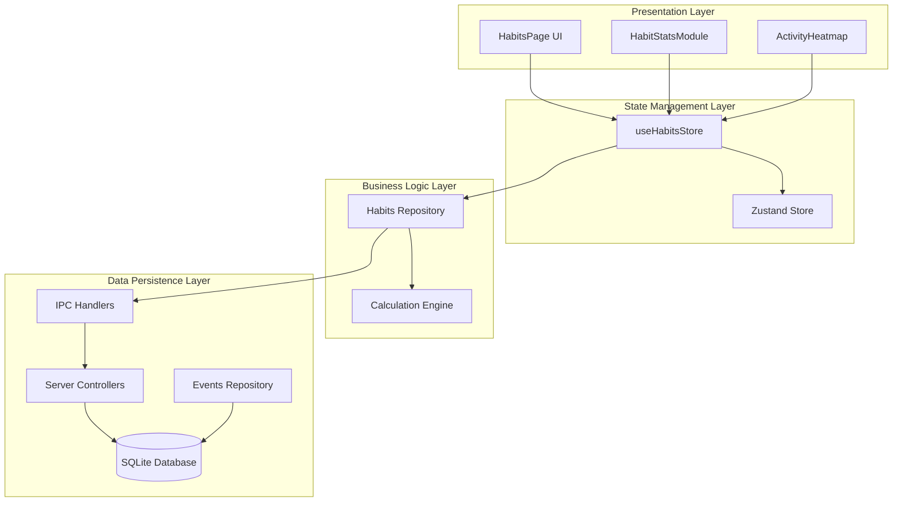
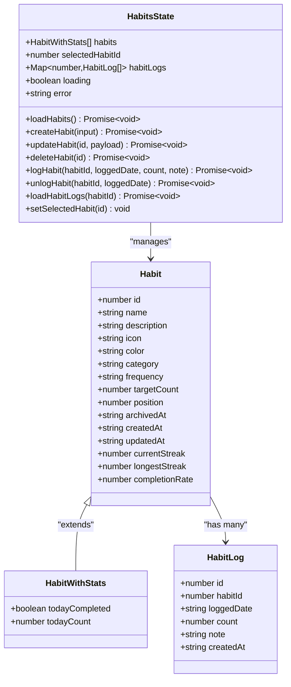
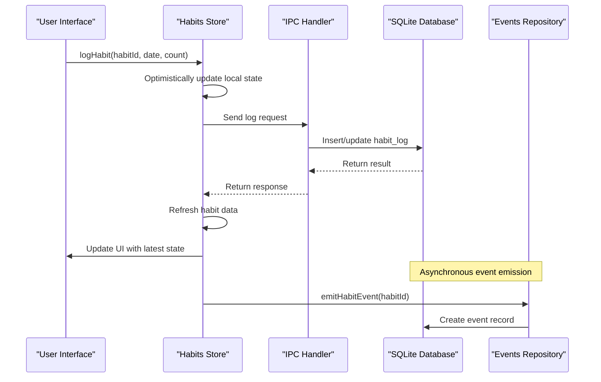
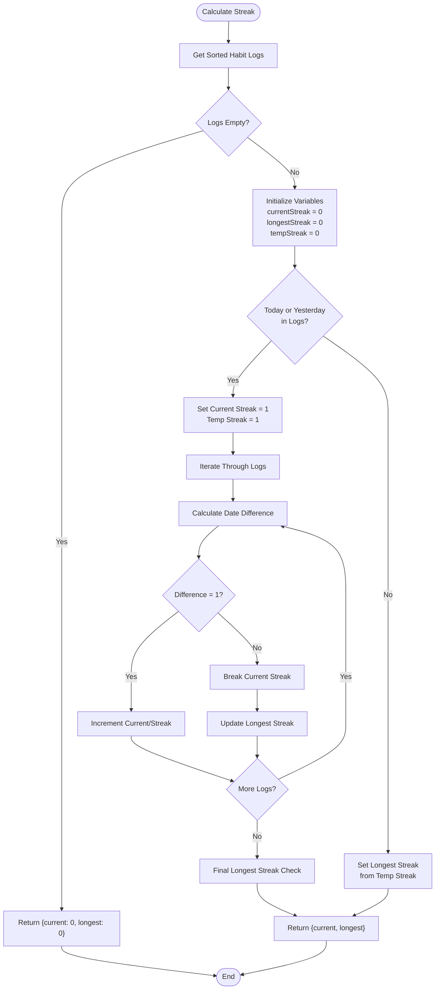
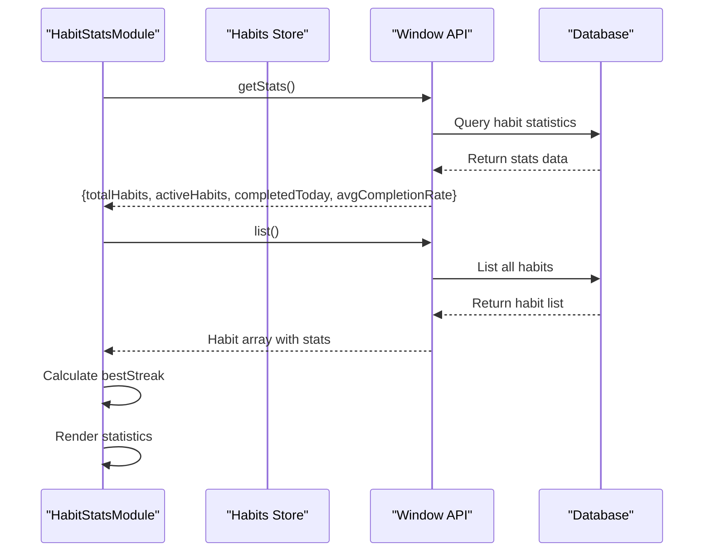
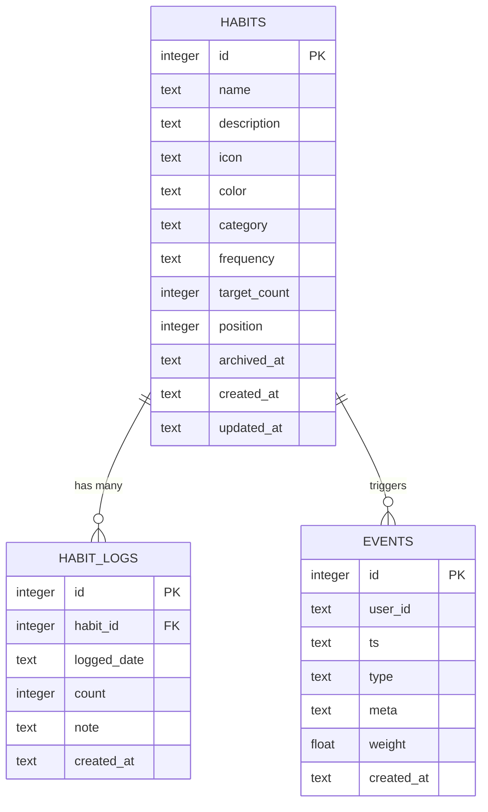
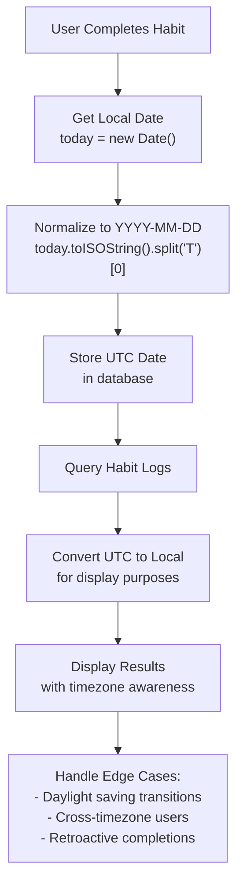

# Habits Store

<cite>
**Referenced Files in This Document**
- [src/store/habits.ts](file://src/store/habits.ts)
- [src/database/habitsRepo.ts](file://src/database/habitsRepo.ts)
- [src/renderer/components/HabitStatsModule.tsx](file://src/renderer/components/HabitStatsModule.tsx)
- [src/renderer/components/ActivityHeatmap.tsx](file://src/renderer/components/ActivityHeatmap.tsx)
- [src/renderer/pages/HabitsPage.tsx](file://src/renderer/pages/HabitsPage.tsx)
- [src/main/ipc/habits.ts](file://src/main/ipc/habits.ts)
- [src/server/controllers/habitsController.ts](file://src/server/controllers/habitsController.ts)
- [src/database/habitsSchema.ts](file://src/database/habitsSchema.ts)
- [src/database/eventsRepo.ts](file://src/database/eventsRepo.ts)
- [src/database/init.ts](file://src/database/init.ts)
</cite>

## Table of Contents
1. [Introduction](#introduction)
2. [Architecture Overview](#architecture-overview)
3. [Store State Management](#store-state-management)
4. [Core Actions and Operations](#core-actions-and-operations)
5. [Optimistic Updates and Synchronization](#optimistic-updates-and-synchronization)
6. [Derived Data Calculations](#derived-data-calculations)
7. [Component Integration](#component-integration)
8. [Persistence Mechanism](#persistence-mechanism)
9. [Timezone Considerations](#timezone-considerations)
10. [Edge Cases and Error Handling](#edge-cases-and-error-handling)
11. [Performance Optimizations](#performance-optimizations)
12. [Troubleshooting Guide](#troubleshooting-guide)

## Introduction

The Habits Store (`useHabitsStore`) is a centralized state management solution built with Zustand that orchestrates habit tracking functionality throughout the LifeOS application. It manages habit definitions, completion streaks, calendar tracking, and maintains synchronization between local state and persistent storage. The store provides a reactive interface for habit creation, modification, completion tracking, and statistical analysis while ensuring optimal user experience through optimistic updates and efficient data management.

## Architecture Overview

The habits store follows a layered architecture pattern that separates concerns between presentation, business logic, and data persistence:

**Diagram sources**
- [src/store/habits.ts](file://src/store/habits.ts#L1-L161)
- [src/database/habitsRepo.ts](file://src/database/habitsRepo.ts#L1-L395)
- [src/main/ipc/habits.ts](file://src/main/ipc/habits.ts#L1-L101)

## Store State Management

The habits store maintains several key state properties that enable comprehensive habit tracking functionality:

**Diagram sources**
- [src/store/habits.ts](file://src/store/habits.ts#L4-L22)
- [src/database/habitsRepo.ts](file://src/database/habitsRepo.ts#L6-L25)

**Section sources**
- [src/store/habits.ts](file://src/store/habits.ts#L4-L22)
- [src/database/habitsRepo.ts](file://src/database/habitsRepo.ts#L6-L25)

## Core Actions and Operations

### Habit Lifecycle Management

The store provides comprehensive CRUD operations for habit management:

#### Create Habit Action
The `createHabit` action handles habit creation with automatic positioning and immediate state updates. It validates input against Zod schemas and ensures proper database constraints.

#### Update Habit Action
The `updateHabit` action enables selective field updates with optimistic UI feedback. It supports partial updates and maintains referential integrity.

#### Delete Habit Action
The `deleteHabit` action removes habits with cascade deletion support and automatically clears selection if deleted habit was active.

#### Log Habit Action
The `logHabit` action records habit completions with support for custom counts and notes. It implements UPSERT semantics to handle multiple log entries for the same date.

#### Unlog Habit Action
The `unlogHabit` action removes habit completions with transaction safety and automatic state refresh.

**Section sources**
- [src/store/habits.ts](file://src/store/habits.ts#L34-L120)
- [src/database/habitsRepo.ts](file://src/database/habitsRepo.ts#L180-L294)

## Optimistic Updates and Synchronization

The habits store implements optimistic updates to provide immediate user feedback while maintaining eventual consistency with the database:

**Diagram sources**
- [src/store/habits.ts](file://src/store/habits.ts#L84-L100)
- [src/database/eventsRepo.ts](file://src/database/eventsRepo.ts#L120-L135)

### Optimistic Update Patterns

The store employs several optimistic update strategies:

1. **Immediate State Updates**: Local state reflects changes instantly while network requests process in the background
2. **Rollback Capability**: Failed operations trigger state restoration to previous values
3. **Conflict Resolution**: Concurrent modifications are handled through database constraints
4. **Progressive Enhancement**: UI components adapt gracefully to loading states

**Section sources**
- [src/store/habits.ts](file://src/store/habits.ts#L34-L120)
- [src/database/eventsRepo.ts](file://src/database/eventsRepo.ts#L120-L135)

## Derived Data Calculations

The habits store performs sophisticated calculations to provide meaningful insights into user behavior:

### Streak Calculation Algorithm

The streak calculation engine implements intelligent temporal analysis:

**Diagram sources**
- [src/database/habitsRepo.ts](file://src/database/habitsRepo.ts#L58-L103)

### Completion Rate Calculation

The completion rate calculation analyzes recent habit performance:

| Metric | Calculation Method | Time Window |
|--------|-------------------|-------------|
| Daily Completion | Habit logs per day vs target count | 30 days |
| Weekly Completion | Habit completions per week | 4 weeks |
| Monthly Completion | Habit completions per month | 3 months |

### Statistical Aggregations

The store provides real-time statistical summaries:

- **Total Habits**: Count of all configured habits
- **Active Habits**: Count of non-archived habits
- **Completed Today**: Count of habits completed today
- **Average Completion Rate**: Mean completion rate across all habits
- **Best Streak**: Maximum current streak among all habits

**Section sources**
- [src/database/habitsRepo.ts](file://src/database/habitsRepo.ts#L58-L103)
- [src/database/habitsRepo.ts](file://src/database/habitsRepo.ts#L105-L120)
- [src/renderer/components/HabitStatsModule.tsx](file://src/renderer/components/HabitStatsModule.tsx#L10-L40)

## Component Integration

### HabitStatsModule Integration

The HabitStatsModule component consumes the habits store to display aggregated statistics:

**Diagram sources**
- [src/renderer/components/HabitStatsModule.tsx](file://src/renderer/components/HabitStatsModule.tsx#L10-L40)
- [src/database/habitsRepo.ts](file://src/database/habitsRepo.ts#L370-L394)

### ActivityHeatmap Integration

The ActivityHeatmap component visualizes habit tracking data:

| Feature | Implementation | Purpose |
|---------|---------------|---------|
| Date Range | 52 weeks (default) | Historical trend analysis |
| Color Intensity | Dynamic based on activity count | Visual pattern recognition |
| Hover Information | Detailed activity breakdown | Contextual insights |
| Scroll Navigation | Horizontal scrolling | Extended timeline access |

**Section sources**
- [src/renderer/components/HabitStatsModule.tsx](file://src/renderer/components/HabitStatsModule.tsx#L1-L170)
- [src/renderer/components/ActivityHeatmap.tsx](file://src/renderer/components/ActivityHeatmap.tsx#L1-L266)

## Persistence Mechanism

### Database Schema Design

The habits persistence layer utilizes a normalized SQLite schema:

**Diagram sources**
- [src/database/habitsSchema.ts](file://src/database/habitsSchema.ts#L1-L39)
- [src/database/eventsRepo.ts](file://src/database/eventsRepo.ts#L1-L136)

### Event-Driven Persistence

The system implements an event-driven persistence model where habit actions trigger corresponding events:

1. **Habit Creation**: Triggers `HABIT_CREATED` event
2. **Habit Logging**: Triggers `HABIT_LOGGED` event
3. **Habit Updates**: Triggers `HABIT_UPDATED` event
4. **Habit Deletion**: Triggers `HABIT_DELETED` event

### Transaction Safety

All database operations are wrapped in transaction contexts to ensure atomicity and consistency:

- **UPSERT Operations**: Handle concurrent insert/update scenarios
- **Cascade Deletions**: Maintain referential integrity
- **Constraint Validation**: Enforce business rules at the database level

**Section sources**
- [src/database/habitsSchema.ts](file://src/database/habitsSchema.ts#L1-L39)
- [src/database/eventsRepo.ts](file://src/database/eventsRepo.ts#L120-L135)
- [src/database/habitsRepo.ts](file://src/database/habitsRepo.ts#L295-L310)

## Timezone Considerations

### Daily Tracking Implementation

The habits system handles timezone complexities through strategic date management:

**Diagram sources**
- [src/database/habitsRepo.ts](file://src/database/habitsRepo.ts#L58-L103)
- [src/renderer/pages/HabitsPage.tsx](file://src/renderer/pages/HabitsPage.tsx#L80-L95)

### Edge Case Handling

#### Retroactive Completions
The system supports retroactive habit logging by:

- **Flexible Date Parsing**: Handles various date formats
- **Temporal Validation**: Ensures dates fall within reasonable ranges
- **Streak Recalculation**: Updates streak counters appropriately
- **Historical Accuracy**: Maintains accurate historical records

#### Streak Recalculations
When habit logs are modified, the system automatically recalculates:

- **Current Streak**: Continuity from today backward
- **Longest Streak**: Historical maximum streak
- **Completion Rates**: Updated percentage calculations

**Section sources**
- [src/database/habitsRepo.ts](file://src/database/habitsRepo.ts#L58-L103)
- [src/renderer/pages/HabitsPage.tsx](file://src/renderer/pages/HabitsPage.tsx#L80-L95)

## Edge Cases and Error Handling

### Comprehensive Error Management

The habits store implements robust error handling across all operations:

| Error Type | Handling Strategy | Recovery Method |
|------------|------------------|-----------------|
| Network Failures | Retry with exponential backoff | Local state rollback |
| Database Conflicts | Conflict resolution via UPSERT | Optimistic update rollback |
| Validation Errors | Client-side validation | Immediate user feedback |
| Concurrency Issues | Transaction isolation | State synchronization |
| Permission Denied | Access control enforcement | Graceful degradation |

### Data Integrity Measures

1. **Input Validation**: Zod schema validation for all inputs
2. **Constraint Enforcement**: Database-level constraint checking
3. **Atomic Operations**: Transaction boundaries for complex operations
4. **Consistency Checks**: Periodic data integrity verification

### Fallback Mechanisms

When primary operations fail, the system provides graceful fallbacks:

- **Offline Mode**: Local cache maintenance during connectivity issues
- **Degraded Functionality**: Core features remain operational
- **Error Boundaries**: Prevent cascading failures
- **User Feedback**: Clear error messages with suggested actions

**Section sources**
- [src/store/habits.ts](file://src/store/habits.ts#L34-L120)
- [src/database/habitsRepo.ts](file://src/database/habitsRepo.ts#L180-L294)

## Performance Optimizations

### Caching Strategies

The habits store implements multiple caching layers:

1. **Memory Cache**: Habit data stored in Zustand state
2. **Log Cache**: Habit logs cached in Map structures
3. **Computed Cache**: Pre-calculated statistics
4. **Network Cache**: Optimized API response caching

### Query Optimization

Database queries are optimized through:

- **Indexed Lookups**: Strategic index placement for frequent queries
- **Batch Operations**: Grouped database operations
- **Lazy Loading**: On-demand data fetching
- **Pagination**: Efficient large dataset handling

### UI Performance Enhancements

- **Virtual Scrolling**: Efficient rendering of large habit lists
- **Memoization**: React.memo for expensive computations
- **Debounced Updates**: Controlled state updates
- **Selective Re-rendering**: Minimal DOM updates

**Section sources**
- [src/store/habits.ts](file://src/store/habits.ts#L1-L161)
- [src/database/habitsRepo.ts](file://src/database/habitsRepo.ts#L122-L180)

## Troubleshooting Guide

### Common Issues and Solutions

#### Habit Not Saving
**Symptoms**: Changes not persisting to database
**Causes**: Network issues, validation errors, permission problems
**Solutions**: Check network connectivity, validate input data, review error logs

#### Streak Calculation Errors
**Symptoms**: Incorrect streak counts
**Causes**: Date normalization issues, timezone conflicts
**Solutions**: Verify date format consistency, check timezone settings

#### Performance Degradation
**Symptoms**: Slow habit loading, UI lag
**Causes**: Large dataset, inefficient queries, memory leaks
**Solutions**: Implement pagination, optimize queries, monitor memory usage

### Debugging Tools

1. **Console Logging**: Enable debug logs for state changes
2. **Database Inspection**: Direct database query examination
3. **Network Monitoring**: Track API request/response cycles
4. **Performance Profiling**: Measure component render times

### Maintenance Procedures

Regular maintenance tasks include:

- **Database Cleanup**: Remove old logs and optimize tables
- **Cache Management**: Clear stale cache entries
- **Schema Validation**: Verify database schema integrity
- **Performance Monitoring**: Track system performance metrics

**Section sources**
- [src/store/habits.ts](file://src/store/habits.ts#L34-L120)
- [src/database/habitsRepo.ts](file://src/database/habitsRepo.ts#L370-L394)