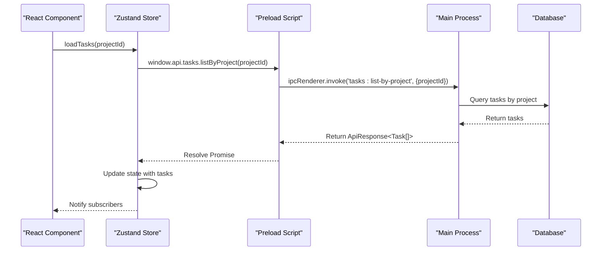
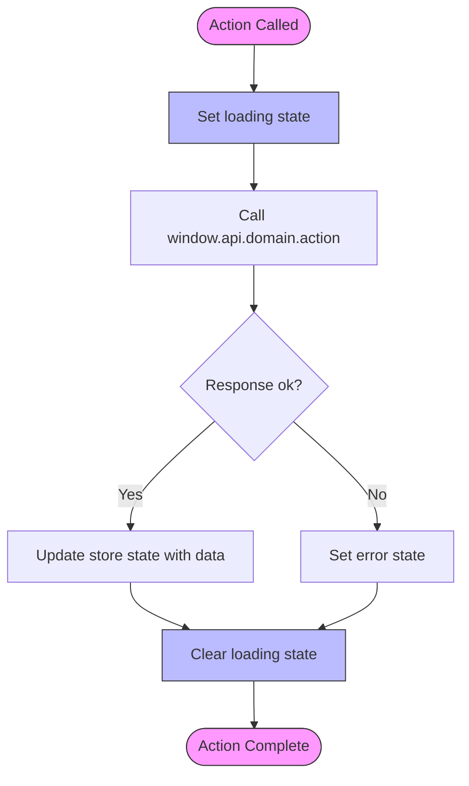
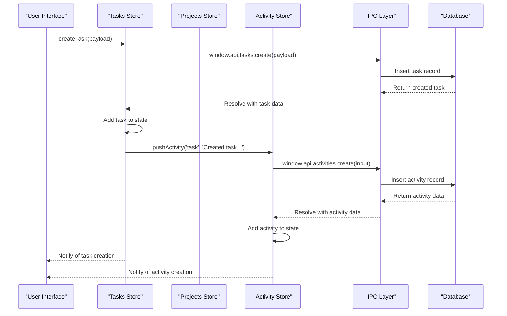
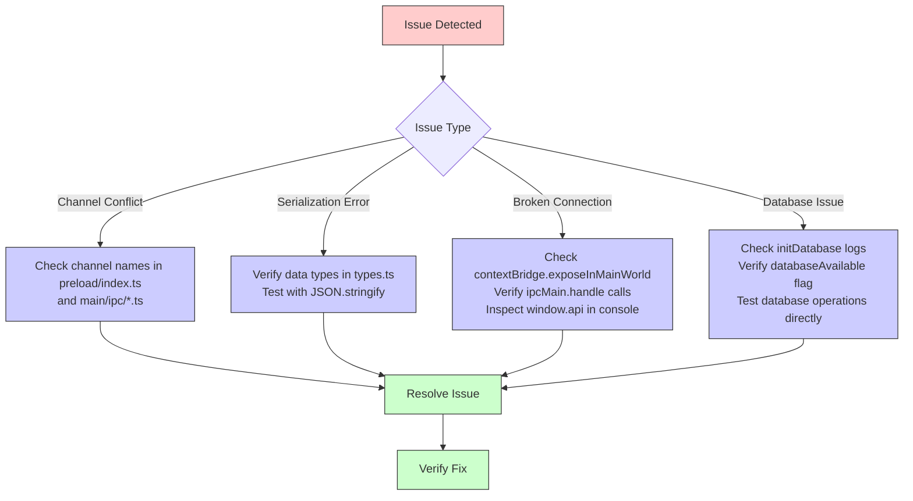

# IPC State Integration

<cite>
**Referenced Files in This Document**   
- [activity.ts](file://src/store/activity.ts)
- [tasks.ts](file://src/store/tasks.ts)
- [habits.ts](file://src/store/habits.ts)
- [projects.ts](file://src/store/projects.ts)
- [index.ts](file://src/preload/index.ts)
- [database.ts](file://src/main/ipc/database.ts)
- [projects.ts](file://src/main/ipc/projects.ts)
- [tasks.ts](file://src/main/ipc/tasks.ts)
- [activities.ts](file://src/main/ipc/activities.ts)
- [response.ts](file://src/main/utils/response.ts)
- [types.ts](file://src/common/types.ts)
- [projectsRepo.ts](file://src/database/projectsRepo.ts)
- [tasksRepo.ts](file://src/database/tasksRepo.ts)
- [init.ts](file://src/database/init.ts)
- [index.ts](file://src/main/index.ts)
</cite>

## Table of Contents
1. [Introduction](#introduction)
2. [Architecture Overview](#architecture-overview)
3. [Zustand Store and IPC Integration](#zustand-store-and-ipc-integration)
4. [Error Handling and State Management](#error-handling-and-state-management)
5. [Bi-directional Synchronization](#bi-directional-synchronization)
6. [Type Safety Mechanism](#type-safety-mechanism)
7. [Common Issues and Debugging Strategies](#common-issues-and-debugging-strategies)
8. [Conclusion](#conclusion)

## Introduction
This document details the integration between Zustand stores and Electron IPC in the LifeOS application. It explains how store actions trigger IPC calls through the preload script, how pending states are managed during asynchronous operations, and how error handling is implemented. The documentation also covers bi-directional synchronization, type safety mechanisms, and common issues with debugging strategies.

**Section sources**
- [activity.ts](file://src/store/activity.ts#L1-L68)
- [tasks.ts](file://src/store/tasks.ts#L1-L132)
- [habits.ts](file://src/store/habits.ts#L1-L160)

## Architecture Overview

```mermaid
graph TB
subgraph "Renderer Process"
A[Zustand Store] --> B[Store Action]
B --> C[window.api.domain.action]
C --> D[Preload Script]
D --> E[ipcRenderer.invoke]
E --> F[Main Process IPC Handler]
end
subgraph "Main Process"
F --> G[Database Repository]
G --> H[(SQLite Database)]
H --> G
G --> F
F --> I[wrapIpc Response]
I --> E
end
E --> J[Promise Resolution]
J --> K[Store State Update]
K --> A
style A fill:#4C3BCF,stroke:#333
style D fill:#222629,stroke:#333
style F fill:#404258,stroke:#333
style H fill:#757575,stroke:#333
```



**Diagram sources**
- [index.ts](file://src/preload/index.ts#L1-L201)
- [response.ts](file://src/main/utils/response.ts#L1-L36)
- [types.ts](file://src/common/types.ts#L1-L116)

## Zustand Store and IPC Integration

The integration between Zustand stores and Electron IPC follows a consistent pattern across the application. Store actions trigger IPC calls through the `window.api` interface exposed by the preload script, which uses Electron's `ipcRenderer.invoke` method to communicate with the main process.

Each store action follows this pattern:
1. The action is called from a React component
2. The action uses `window.api.<domain>.<action>` to make an IPC call
3. The preload script routes the call to the appropriate IPC channel
4. The main process handler processes the request and returns a response
5. The store updates its state based on the response

For example, in the tasks store, the `loadTasks` action calls `window.api.tasks.listByProject(projectId)` which triggers the corresponding IPC handler in the main process.



**Diagram sources**
- [tasks.ts](file://src/store/tasks.ts#L1-L132)
- [index.ts](file://src/preload/index.ts#L1-L201)
- [tasks.ts](file://src/main/ipc/tasks.ts#L1-L36)

**Section sources**
- [tasks.ts](file://src/store/tasks.ts#L1-L132)
- [index.ts](file://src/preload/index.ts#L1-L201)
- [tasks.ts](file://src/main/ipc/tasks.ts#L1-L36)

## Error Handling and State Management

The application implements a robust error handling pattern that updates store state with error information for UI display. All IPC responses follow the `ApiResponse<T>` interface defined in `types.ts`, which includes an `ok` boolean flag and optional `error` string.

When an IPC call fails, the store action catches the error and updates the store state with the error message, which can then be displayed in the UI. The `wrapIpc` utility function in the main process ensures consistent error handling by catching exceptions and returning standardized error responses.

Store actions manage pending states by updating loading flags before making IPC calls and clearing them after completion, whether successful or failed. For example, the tasks store sets `loading[projectId] = true` before calling `window.api.tasks.listByProject` and sets it to `false` in both the success and error cases.



**Diagram sources**
- [response.ts](file://src/main/utils/response.ts#L1-L36)
- [types.ts](file://src/common/types.ts#L1-L116)
- [tasks.ts](file://src/store/tasks.ts#L1-L132)

**Section sources**
- [response.ts](file://src/main/utils/response.ts#L1-L36)
- [types.ts](file://src/common/types.ts#L1-L116)
- [tasks.ts](file://src/store/tasks.ts#L1-L132)

## Bi-directional Synchronization

The application implements bi-directional synchronization between the UI state and the database through the IPC layer. Changes made in the UI update the database via IPC calls, and database changes are reflected in the UI through store state updates.

For example, when a user creates a new task:
1. The UI calls `useTasksStore.getState().createTask(payload)`
2. The store action calls `window.api.tasks.create(payload)`
3. The main process handler inserts the task into the database
4. The handler returns the created task with its database-generated ID
5. The store action adds the new task to the appropriate project's task list
6. The UI automatically updates due to Zustand's reactivity

Additionally, some actions trigger cascading updates. For instance, creating a project also sets it as the active project and logs an activity entry. This is achieved by calling other store actions from within the main action, creating a chain of IPC calls that maintain data consistency across domains.



**Diagram sources**
- [tasks.ts](file://src/store/tasks.ts#L1-L132)
- [projects.ts](file://src/store/projects.ts#L1-L86)
- [activity.ts](file://src/store/activity.ts#L1-L68)
- [index.ts](file://src/preload/index.ts#L1-L201)

**Section sources**
- [tasks.ts](file://src/store/tasks.ts#L1-L132)
- [projects.ts](file://src/store/projects.ts#L1-L86)
- [activity.ts](file://src/store/activity.ts#L1-L68)

## Type Safety Mechanism

The application ensures type safety across the IPC boundary using shared interfaces defined in `src/common/types.ts`. These interfaces are imported by both the renderer process (Zustand stores, preload script) and the main process (IPC handlers, database repositories).

The type safety mechanism works as follows:
1. Shared types are defined in `types.ts` and exported for use by both processes
2. The preload script uses these types to define the shape of the `api` object exposed to the renderer
3. IPC handlers in the main process use the same types to validate incoming data
4. Database repositories return data that conforms to these types
5. The `ApiResponse<T>` wrapper ensures type safety for all IPC responses

This approach eliminates type duplication and ensures consistency across the application. TypeScript's type checking catches mismatches at compile time, preventing runtime errors due to data shape inconsistencies.

```mermaid
classDiagram
class ApiResponse~T~ {
+ok : boolean
+data? : T
+error? : string
}
class Task {
+id : number
+projectId : number
+title : string
+description? : string
+status : string
+dueDate? : string
+priority? : string
+tags? : string[]
+position : number
+createdAt : string
+updatedAt : string
}
class Project {
+id : number
+name : string
+color? : string
+icon? : string
+position : number
+createdAt : string
+updatedAt : string
}
class CreateTaskInput {
+projectId : number
+title : string
+description? : string
+status? : string
+dueDate? : string
+priority? : string
+tags? : string[]
+position? : number
}
class UpdateTaskPayload {
+title? : string
+description? : string | null
+status? : string
+dueDate? : string | null
+priority? : string | null
+tags? : string[] | null
+position? : number
+projectId? : number
}
ApiResponse~T~ <|-- ApiResponse~Task~
ApiResponse~T~ <|-- ApiResponse~Project~
ApiResponse~T~ <|-- ApiResponse~Task[]~
CreateTaskInput --> Task : "creates"
UpdateTaskPayload --> Task : "updates"
style ApiResponse~T~ fill : #E1F5FE,stroke : #1E88E5
style Task fill : #E8F5E8,stroke : #43A047
style Project fill : #FFF3E0,stroke : #FB8C00
style CreateTaskInput fill : #F3E5F5,stroke : #8E24AA
style UpdateTaskPayload fill : #EDE7F6,stroke : #5E35B1
```

**Diagram sources**
- [types.ts](file://src/common/types.ts#L1-L116)
- [tasks.ts](file://src/store/tasks.ts#L1-L132)
- [index.ts](file://src/preload/index.ts#L1-L201)

**Section sources**
- [types.ts](file://src/common/types.ts#L1-L116)
- [tasks.ts](file://src/store/tasks.ts#L1-L132)
- [index.ts](file://src/preload/index.ts#L1-L201)

## Common Issues and Debugging Strategies

Several common issues can arise in the IPC state integration, along with corresponding debugging strategies:

### IPC Channel Naming Conflicts
When multiple IPC handlers use similar channel names, calls may be routed to the wrong handler. The application avoids this by using a consistent naming convention: `<domain>:<action>` (e.g., `tasks:list-by-project`, `projects:create`).

**Debugging strategy**: Use console logging in the main process to verify that IPC handlers are being called with the expected channel names. The `console.log` statements in the `wrapIpc` function help trace IPC calls.

### Message Serialization Errors
Complex objects may fail to serialize across the IPC boundary, especially those containing functions, symbols, or circular references. The application mitigates this by using simple data transfer objects defined in `types.ts`.

**Debugging strategy**: Check the console for serialization errors. Use `JSON.stringify` and `JSON.parse` to test if data can be serialized. The `wrapIpc` function catches serialization errors and returns meaningful error messages.

### Broken State-IPC Connections
When the connection between Zustand stores and IPC handlers breaks, state updates may not trigger IPC calls or vice versa. This can occur due to incorrect store action implementations or preload script configuration issues.

**Debugging strategy**: 
1. Verify that `contextBridge.exposeInMainWorld('api', api)` is called in the preload script
2. Check that the main process has registered IPC handlers via `ipcMain.handle`
3. Use browser developer tools to verify that `window.api` is available and has the expected methods
4. Add console logs in store actions to confirm they are being called

### Database Connection Issues
The application handles database unavailability gracefully by checking the `databaseAvailable` flag in the `wrapIpc` function. When the database is not available, handlers return empty responses instead of failing.

**Debugging strategy**: Check the application startup logs for database initialization errors. The `initDatabase` function in `src/database/init.ts` logs success or failure messages that can help diagnose connection issues.



**Diagram sources**
- [index.ts](file://src/preload/index.ts#L1-L201)
- [response.ts](file://src/main/utils/response.ts#L1-L36)
- [index.ts](file://src/main/index.ts#L1-L122)
- [init.ts](file://src/database/init.ts)

**Section sources**
- [index.ts](file://src/preload/index.ts#L1-L201)
- [response.ts](file://src/main/utils/response.ts#L1-L36)
- [index.ts](file://src/main/index.ts#L1-L122)

## Conclusion
The IPC state integration in LifeOS provides a robust mechanism for connecting Zustand stores with Electron's IPC system. By following a consistent pattern of store actions triggering IPC calls through the preload script, the application maintains a clean separation between UI state management and data persistence. The error handling system ensures that failures are communicated to the UI through store state updates, while the shared type system guarantees type safety across process boundaries. Bi-directional synchronization keeps the UI and database in sync, and comprehensive debugging strategies help resolve common issues that may arise in the IPC communication layer.