# Projects Store

<cite>
**Referenced Files in This Document**
- [src/store/projects.ts](file://src/store/projects.ts)
- [src/database/projectsRepo.ts](file://src/database/projectsRepo.ts)
- [src/main/ipc/projects.ts](file://src/main/ipc/projects.ts)
- [src/common/types.ts](file://src/common/types.ts)
- [src/renderer/components/ProjectSwitcher.tsx](file://src/renderer/components/ProjectSwitcher.tsx)
- [src/renderer/App.tsx](file://src/renderer/App.tsx)
- [src/renderer/pages/KanbanPage.tsx](file://src/renderer/pages/KanbanPage.tsx)
- [src/store/tasks.ts](file://src/store/tasks.ts)
</cite>

## Table of Contents
1. [Introduction](#introduction)
2. [Architecture Overview](#architecture-overview)
3. [Core State Management](#core-state-management)
4. [CRUD Operations](#crud-operations)
5. [Project Ordering System](#project-ordering-system)
6. [Active Project Management](#active-project-management)
7. [Selectors and Data Access](#selectors-and-data-access)
8. [IPC Communication Layer](#ipc-communication-layer)
9. [Subscription Pattern](#subscription-pattern)
10. [Error Handling and Synchronization](#error-handling-and-synchronization)
11. [Common Issues and Solutions](#common-issues-and-solutions)
12. [Best Practices](#best-practices)

## Introduction

The useProjectsStore module serves as the central state management system for project data in the LifeOS application. Built with Zustand, it manages the complete lifecycle of projects including creation, deletion, reordering, and active project state management. The store integrates seamlessly with the database through an IPC (Inter-Process Communication) layer and maintains synchronization with other stores like tasks.

The store provides a reactive interface for components to access project data, manage project ordering, and handle active project switching. It implements sophisticated error handling, optimistic updates, and maintains data consistency across the application.

## Architecture Overview

The projects store follows a layered architecture pattern that separates concerns between state management, data persistence, and user interface interactions.

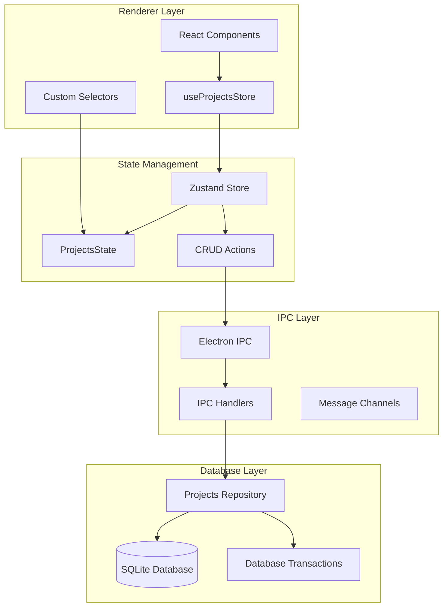

**Diagram sources**
- [src/store/projects.ts](file://src/store/projects.ts#L1-L87)
- [src/main/ipc/projects.ts](file://src/main/ipc/projects.ts#L1-L84)
- [src/database/projectsRepo.ts](file://src/database/projectsRepo.ts#L1-L148)

**Section sources**
- [src/store/projects.ts](file://src/store/projects.ts#L1-L87)
- [src/database/projectsRepo.ts](file://src/database/projectsRepo.ts#L1-L148)

## Core State Management

The projects store maintains a comprehensive state structure that tracks all project-related data and operational status.

### State Interface Definition

The store defines a clean interface with typed state properties and action methods:

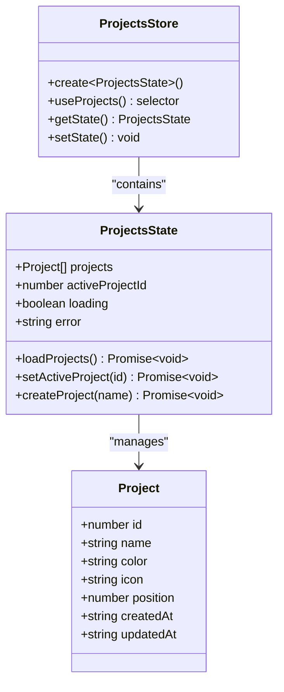

**Diagram sources**
- [src/store/projects.ts](file://src/store/projects.ts#L5-L15)
- [src/common/types.ts](file://src/common/types.ts#L1-L15)

### State Properties

The store maintains several key state properties:

| Property | Type | Description | Purpose |
|----------|------|-------------|---------|
| `projects` | `Project[]` | Array of all project objects | Complete project inventory |
| `activeProjectId` | `number \| undefined` | Currently active project identifier | Scope data operations |
| `loading` | `boolean` | Loading state indicator | UI feedback and concurrency control |
| `error` | `string \| undefined` | Error message storage | Error reporting and recovery |

**Section sources**
- [src/store/projects.ts](file://src/store/projects.ts#L5-L15)

## CRUD Operations

The store implements comprehensive CRUD (Create, Read, Update, Delete) operations with proper error handling and data synchronization.

### Create Project Operation

The create operation handles project creation with automatic positioning and active project assignment:

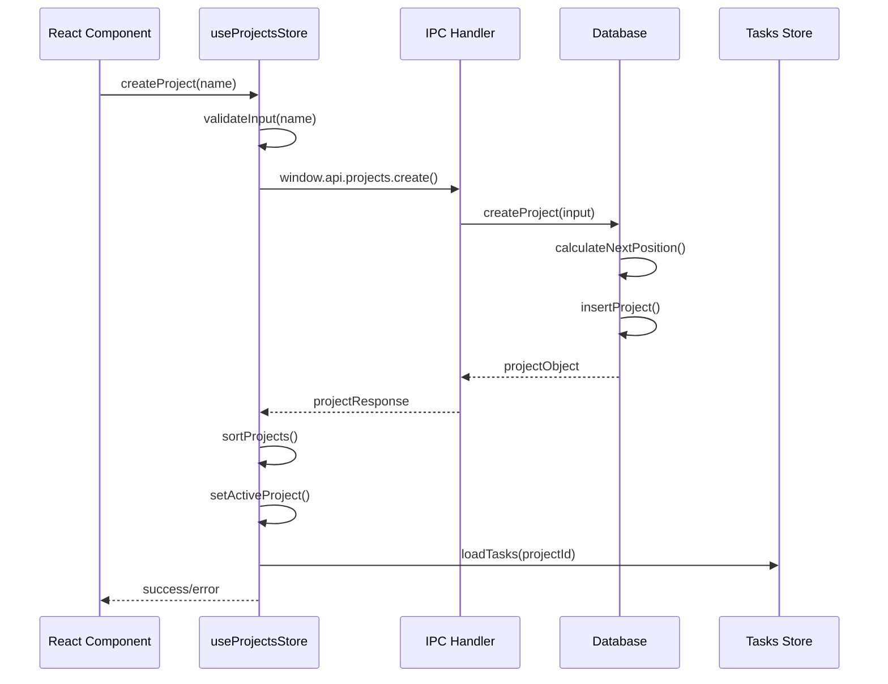

**Diagram sources**
- [src/store/projects.ts](file://src/store/projects.ts#L42-L68)
- [src/main/ipc/projects.ts](file://src/main/ipc/projects.ts#L25-L35)

### Update Project Operation

Project updates support partial field modifications with validation:

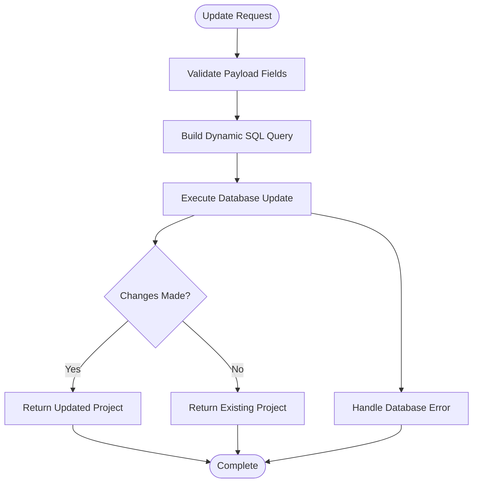

**Diagram sources**
- [src/database/projectsRepo.ts](file://src/database/projectsRepo.ts#L58-L95)

### Delete Project Operation

The delete operation implements cascading deletion with safety checks:

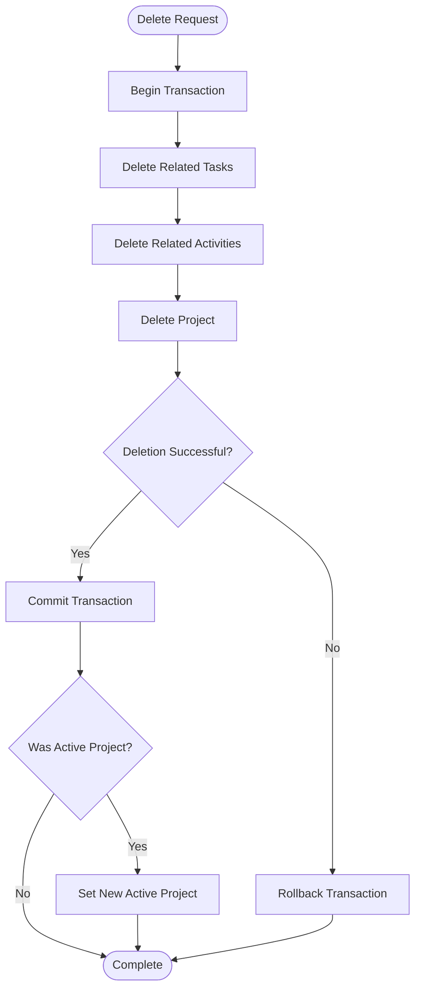

**Diagram sources**
- [src/database/projectsRepo.ts](file://src/database/projectsRepo.ts#L120-L146)

**Section sources**
- [src/store/projects.ts](file://src/store/projects.ts#L42-L68)
- [src/database/projectsRepo.ts](file://src/database/projectsRepo.ts#L39-L146)

## Project Ordering System

The project ordering system enables drag-and-drop reordering with atomic database transactions and immediate UI feedback.

### Position Management

Projects maintain a `position` field that determines their display order. The system automatically calculates next positions and handles gaps:

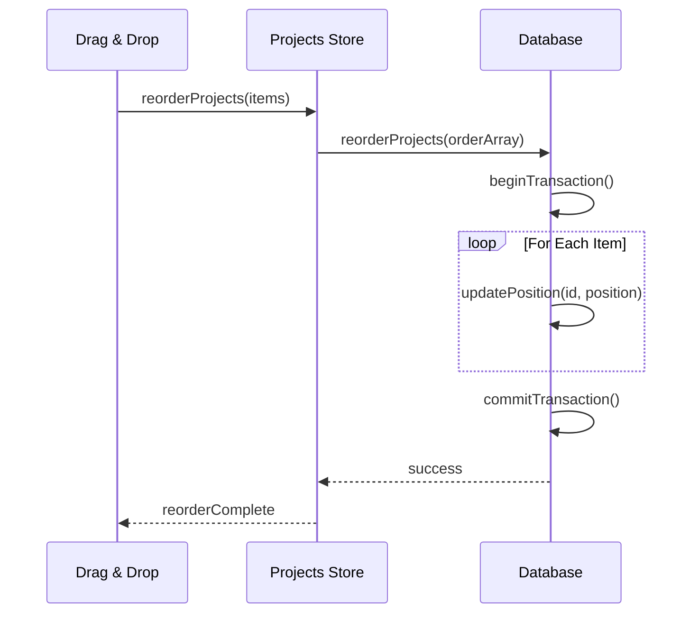

**Diagram sources**
- [src/database/projectsRepo.ts](file://src/database/projectsRepo.ts#L100-L117)
- [src/main/ipc/projects.ts](file://src/main/ipc/projects.ts#L42-L52)

### Ordering Algorithm

The ordering system uses a transaction-based approach for atomic updates:

| Step | Operation | Purpose |
|------|-----------|---------|
| 1 | Begin Transaction | Ensure atomicity |
| 2 | Update Positions | Apply new ordering |
| 3 | Set Timestamp | Track modification time |
| 4 | Commit Changes | Finalize updates |
| 5 | Notify Components | Trigger UI refresh |

**Section sources**
- [src/database/projectsRepo.ts](file://src/database/projectsRepo.ts#L100-L117)
- [src/main/ipc/projects.ts](file://src/main/ipc/projects.ts#L42-L52)

## Active Project Management

The active project system manages the currently selected project context and ensures proper data scoping across the application.

### setActive Mechanism

The setActive operation coordinates between local state and persistent storage:

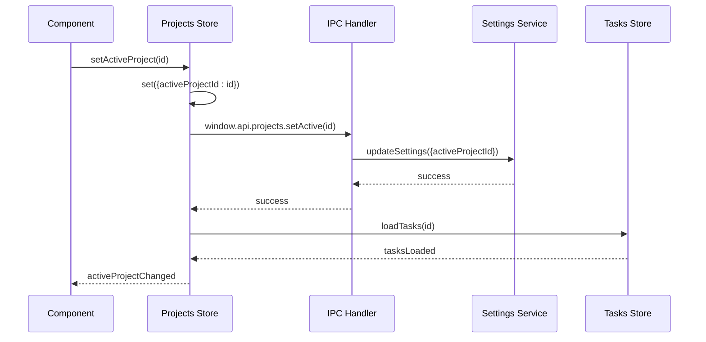

**Diagram sources**
- [src/store/projects.ts](file://src/store/projects.ts#L25-L41)
- [src/main/ipc/projects.ts](file://src/main/ipc/projects.ts#L64-L70)

### Active Project Persistence

The system maintains active project state across application sessions through settings persistence:

| Storage Layer | Responsibility | Fallback Behavior |
|---------------|----------------|-------------------|
| Memory Store | Current active state | Uses first project if missing |
| Settings Service | Persistent storage | Defaults to first project |
| Database | Project data | Maintains project list |

**Section sources**
- [src/store/projects.ts](file://src/store/projects.ts#L25-L41)
- [src/main/ipc/projects.ts](file://src/main/ipc/projects.ts#L64-L70)

## Selectors and Data Access

The store provides specialized selectors for efficient data access and component subscriptions.

### Custom Selector Implementation

The `useProjects` selector creates a focused interface for component consumption:

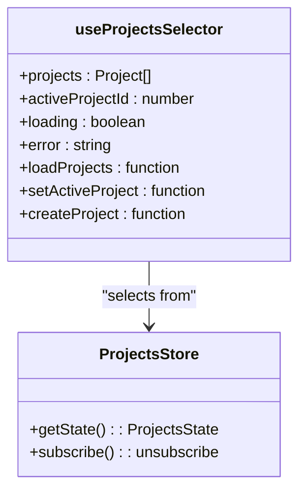

**Diagram sources**
- [src/store/projects.ts](file://src/store/projects.ts#L71-L85)

### Data Access Patterns

Components access project data through standardized patterns:

| Access Pattern | Use Case | Example |
|----------------|----------|---------|
| `useProjects()` | Full store access | Complete project management |
| `useProjectsStore(state => state.projects)` | Specific data | Project list rendering |
| `useProjectsStore(state => state.activeProjectId)` | Active project | Context-dependent operations |

**Section sources**
- [src/store/projects.ts](file://src/store/projects.ts#L71-L85)

## IPC Communication Layer

The IPC layer provides secure communication between the renderer and main processes with proper error handling and response formatting.

### IPC Handler Architecture

Each project operation has dedicated IPC handlers with consistent error handling:

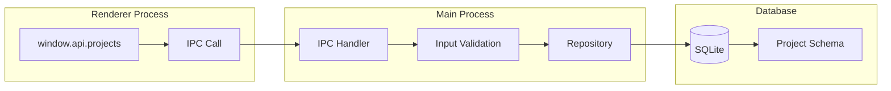

**Diagram sources**
- [src/main/ipc/projects.ts](file://src/main/ipc/projects.ts#L1-L84)

### Response Formatting

All IPC handlers return standardized response objects:

| Response Type | Structure | Purpose |
|---------------|-----------|---------|
| Success | `{ok: true, data: result}` | Normal operation completion |
| Error | `{ok: false, error: message}` | Operation failure |
| Validation | `{ok: false, error: validation}` | Input validation failure |

**Section sources**
- [src/main/ipc/projects.ts](file://src/main/ipc/projects.ts#L1-L84)

## Subscription Pattern

Other stores leverage the projects store's active project context to scope their data operations.

### Tasks Store Integration

The tasks store subscribes to active project changes for scoped data loading:

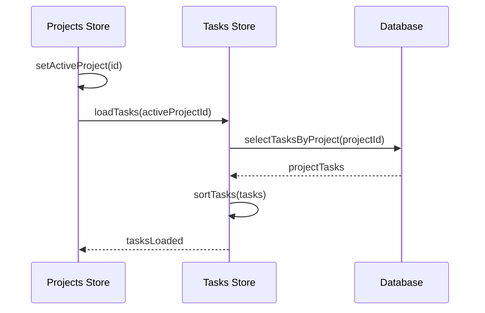

**Diagram sources**
- [src/store/projects.ts](file://src/store/projects.ts#L28-L30)
- [src/store/tasks.ts](file://src/store/tasks.ts#L35-L50)

### Data Scoping Strategy

Stores implement data scoping through active project filtering:

| Store | Scoping Method | Benefits |
|-------|----------------|----------|
| Tasks | `projectId` filter | Isolated task lists |
| Activities | Entity-based filtering | Context-aware logs |
| Notes | Project association | Organized note-taking |

**Section sources**
- [src/store/projects.ts](file://src/store/projects.ts#L28-L30)
- [src/store/tasks.ts](file://src/store/tasks.ts#L35-L50)

## Error Handling and Synchronization

The store implements comprehensive error handling with optimistic updates and rollback mechanisms.

### Error Handling Strategy

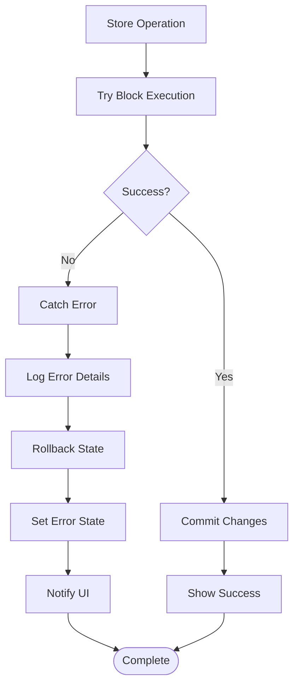

**Diagram sources**
- [src/store/projects.ts](file://src/store/projects.ts#L20-L30)

### Synchronization Patterns

The store maintains consistency through several synchronization mechanisms:

| Pattern | Implementation | Purpose |
|---------|----------------|---------|
| Optimistic Updates | Immediate UI changes | Responsive user experience |
| Rollback on Failure | State restoration | Data consistency |
| Database Transactions | Atomic operations | Integrity guarantees |
| Event-driven Updates | Reactive state updates | Real-time synchronization |

**Section sources**
- [src/store/projects.ts](file://src/store/projects.ts#L20-L30)

## Common Issues and Solutions

### Stale Project References

**Problem**: Components maintain outdated project references after database changes.

**Solution**: Implement proper subscription patterns and force refresh when needed:

```typescript
// Force refresh pattern
async function refreshProjects() {
  try {
    const response = await window.api.projects.list();
    if (response.ok && response.data) {
      const { projects, activeProjectId } = response.data;
      setProjects(projects);
      setActiveProjectId(activeProjectId);
    }
  } catch (error) {
    console.error('Failed to refresh projects:', error);
  }
}
```

### Race Conditions During Reordering

**Problem**: Concurrent reordering operations cause position conflicts.

**Solution**: Use database transactions and optimistic locking:

```typescript
// Transaction-based reordering
export function reorderProjects(order: Array<{ id: number; position: number }>) {
  const db = getDb();
  const update = db.prepare('UPDATE projects SET position = @position WHERE id = @id');
  
  // Atomic transaction prevents race conditions
  const transaction = db.transaction((items: Array<{ id: number; position: number }>) => {
    for (const item of items) {
      update.run(item);
    }
  });
  
  transaction(order);
}
```

### Active Project State Inconsistency

**Problem**: Active project state becomes inconsistent across components.

**Solution**: Centralize state management and use proper cleanup:

```typescript
// Proper cleanup pattern
useEffect(() => {
  // Subscribe to project changes
  const unsubscribe = useProjectsStore.subscribe(
    state => state.activeProjectId,
    newActiveId => {
      // Handle active project change
      if (newActiveId !== prevActiveId.current) {
        // Perform necessary updates
        prevActiveId.current = newActiveId;
      }
    }
  );
  
  return () => unsubscribe(); // Cleanup subscription
}, []);
```

**Section sources**
- [src/store/projects.ts](file://src/store/projects.ts#L25-L41)
- [src/database/projectsRepo.ts](file://src/database/projectsRepo.ts#L100-L117)

## Best Practices

### State Management Guidelines

1. **Immutable Updates**: Always use immutable state updates
2. **Optimistic UI**: Provide immediate feedback for user actions
3. **Error Boundaries**: Implement comprehensive error handling
4. **Loading States**: Manage loading indicators appropriately
5. **Cleanup**: Properly unsubscribe from store changes

### Performance Optimization

1. **Selective Subscriptions**: Use narrow selectors to minimize re-renders
2. **Batch Operations**: Group related operations when possible
3. **Lazy Loading**: Load data on-demand rather than eagerly
4. **Caching**: Implement appropriate caching strategies
5. **Memory Management**: Clean up unused subscriptions and references

### Data Integrity

1. **Validation**: Validate all inputs before database operations
2. **Transactions**: Use database transactions for multi-step operations
3. **Consistency Checks**: Verify data consistency after operations
4. **Backup Strategies**: Implement data backup and recovery
5. **Audit Trails**: Maintain logs of significant operations

The projects store demonstrates robust state management with comprehensive error handling, proper data synchronization, and efficient performance characteristics. Its modular design enables easy maintenance and extension while providing reliable project management capabilities for the LifeOS application.