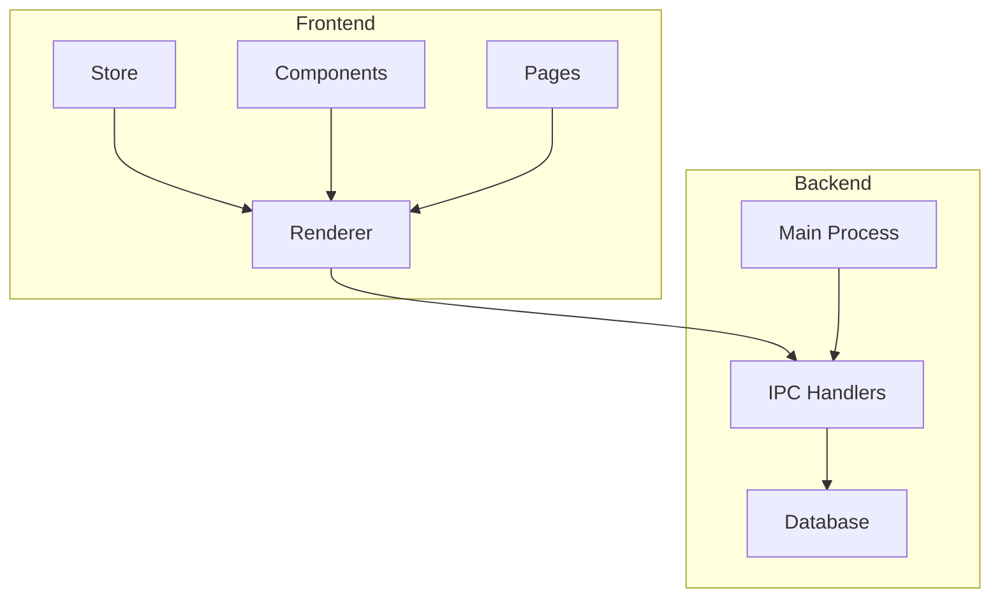
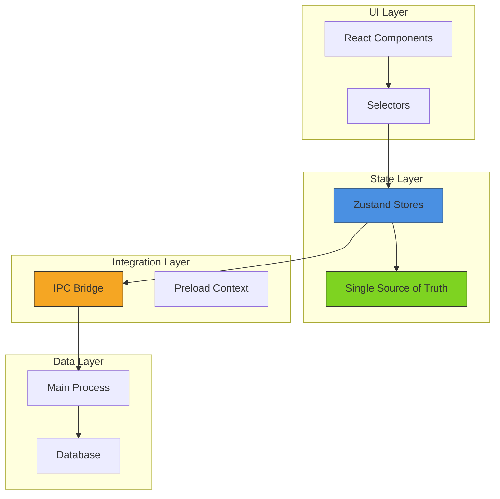
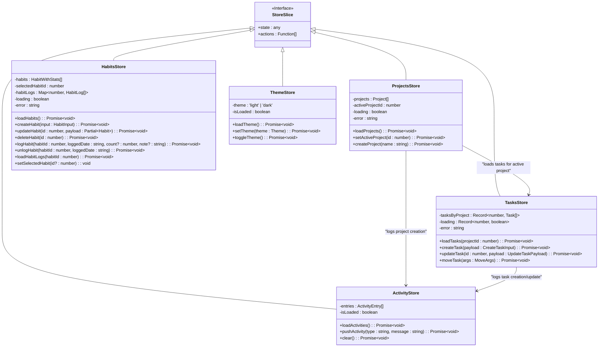
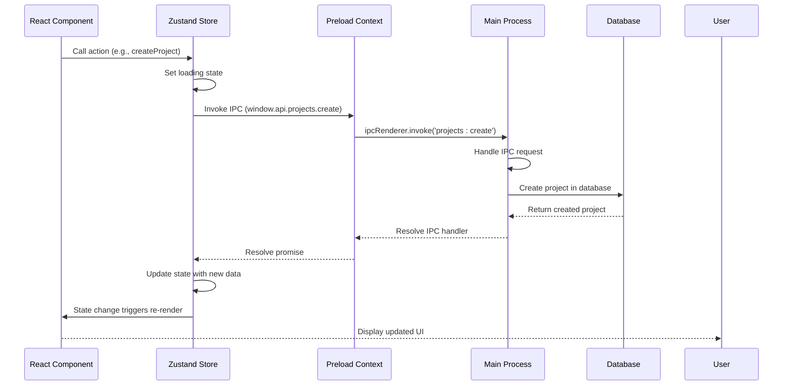
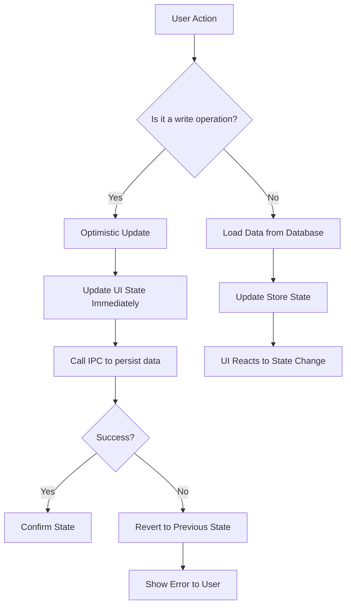

# State Management Architecture

<cite>
**Referenced Files in This Document**   
- [activity.ts](file://src/store/activity.ts)
- [habits.ts](file://src/store/habits.ts)
- [projects.ts](file://src/store/projects.ts)
- [tasks.ts](file://src/store/tasks.ts)
- [theme.ts](file://src/store/theme.ts)
- [index.ts](file://src/main/index.ts)
- [index.tsx](file://src/renderer/App.tsx)
- [preload/index.ts](file://src/preload/index.ts)
- [projects.ts](file://src/main/ipc/projects.ts)
- [tasks.ts](file://src/main/ipc/tasks.ts)
- [types.ts](file://src/common/types.ts)
- [init.ts](file://src/database/init.ts)
- [STATE-MANAGEMENT.md](file://AI/STATE-MANAGEMENT.md)
</cite>

## Table of Contents
1. [Introduction](#introduction)
2. [Project Structure](#project-structure)
3. [Core Components](#core-components)
4. [Architecture Overview](#architecture-overview)
5. [Detailed Component Analysis](#detailed-component-analysis)
6. [Dependency Analysis](#dependency-analysis)
7. [Performance Considerations](#performance-considerations)
8. [Troubleshooting Guide](#troubleshooting-guide)
9. [Conclusion](#conclusion)

## Introduction
The LifeOS application implements a Zustand-based state management system designed for Electron desktop applications with React frontend. This architecture follows domain-driven design principles with multiple store slices that maintain a single source of truth for different aspects of the application state. The system integrates with Electron's IPC mechanism to synchronize UI state with persistent data storage while maintaining optimal performance and reactivity.

## Project Structure



**Diagram sources**
- [store](file://src/store)
- [renderer](file://src/renderer)
- [main](file://src/main)

**Section sources**
- [project_structure](file://project_structure)

## Core Components

The state management system in LifeOS consists of multiple domain-specific store slices implemented using Zustand. Each store slice manages a specific domain of application state, including projects, tasks, habits, activities, and theme preferences. The stores follow a consistent pattern of maintaining both data state and loading/error states, with asynchronous actions that interact with the backend via IPC calls.

**Section sources**
- [activity.ts](file://src/store/activity.ts)
- [habits.ts](file://src/store/habits.ts)
- [projects.ts](file://src/store/projects.ts)
- [tasks.ts](file://src/store/tasks.ts)
- [theme.ts](file://src/store/theme.ts)

## Architecture Overview



**Diagram sources**
- [index.tsx](file://src/renderer/App.tsx)
- [preload/index.ts](file://src/preload/index.ts)
- [index.ts](file://src/main/index.ts)

## Detailed Component Analysis

### Store Slice Architecture



**Diagram sources**
- [projects.ts](file://src/store/projects.ts)
- [tasks.ts](file://src/store/tasks.ts)
- [habits.ts](file://src/store/habits.ts)
- [activity.ts](file://src/store/activity.ts)
- [theme.ts](file://src/store/theme.ts)

### IPC Integration Flow



**Diagram sources**
- [projects.ts](file://src/main/ipc/projects.ts)
- [preload/index.ts](file://src/preload/index.ts)
- [projects.ts](file://src/store/projects.ts)

### State Persistence and Optimistic Updates



**Diagram sources**
- [STATE-MANAGEMENT.md](file://AI/STATE-MANAGEMENT.md)
- [projects.ts](file://src/store/projects.ts)
- [tasks.ts](file://src/store/tasks.ts)

**Section sources**
- [projects.ts](file://src/store/projects.ts)
- [tasks.ts](file://src/store/tasks.ts)
- [STATE-MANAGEMENT.md](file://AI/STATE-MANAGEMENT.md)

## Dependency Analysis

```mermaid
graph LR
A[Zustand] --> B[Store Slices]
B --> C[Projects Store]
B --> D[Tasks Store]
B --> E[Habits Store]
B --> F[Activity Store]
B --> G[Theme Store]
C --> H[IPC Layer]
D --> H
E --> H
F --> H
G --> H
H --> I[Main Process]
I --> J[Database]
C --> D : "Active project drives task loading"
D --> F : "Task actions create activity logs"
C --> F : "Project actions create activity logs"
style A fill:#ff6b6b,stroke:#333
style B fill:#4ecdc4,stroke:#333
style H fill:#45b7d1,stroke:#333
style J fill:#96ceb4,stroke:#333
```

**Diagram sources**
- [package.json](file://package.json)
- [preload/index.ts](file://src/preload/index.ts)
- [index.ts](file://src/main/index.ts)
- [init.ts](file://src/database/init.ts)

**Section sources**
- [package.json](file://package.json)
- [preload/index.ts](file://src/preload/index.ts)
- [index.ts](file://src/main/index.ts)
- [init.ts](file://src/database/init.ts)

## Performance Considerations

The Zustand-based state management system in LifeOS is designed with performance as a key consideration. The architecture leverages several optimization techniques:

1. **Selector Optimization**: Components use memoized selectors to avoid unnecessary re-renders when only specific parts of the state change.

2. **Domain Separation**: By dividing the state into domain-specific slices, updates to one domain (e.g., tasks) do not trigger re-renders in components subscribed to other domains (e.g., habits).

3. **Efficient State Updates**: The use of immer-like patterns in state updates ensures that only changed parts of the state tree are updated, minimizing the impact on React's reconciliation process.

4. **Lazy Loading**: Data is loaded on-demand rather than all at once, reducing initial load time and memory usage.

5. **Batched Operations**: Related operations are batched where possible to minimize IPC calls and database transactions.

**Section sources**
- [tasks.ts](file://src/store/tasks.ts)
- [projects.ts](file://src/store/projects.ts)
- [habits.ts](file://src/store/habits.ts)

## Troubleshooting Guide

Common issues and their solutions in the state management system:

1. **State Not Updating**: Ensure that state updates are performed using the `set` function provided by Zustand, not by directly mutating the state object.

2. **Unnecessary Re-renders**: Use specific selectors to subscribe to only the state properties needed by a component, rather than subscribing to the entire store.

3. **IPC Call Failures**: Check that the preload script is properly exposing the API methods and that the main process IPC handlers are registered.

4. **Memory Leaks**: Ensure that components properly unsubscribe from store listeners when unmounted, which Zustand handles automatically when using the hook pattern.

5. **Race Conditions**: When multiple async operations might affect the same state, consider using loading states and proper error handling to maintain consistency.

**Section sources**
- [projects.ts](file://src/store/projects.ts)
- [tasks.ts](file://src/store/tasks.ts)
- [preload/index.ts](file://src/preload/index.ts)

## Conclusion

The Zustand-based state management system in LifeOS provides a robust, scalable solution for managing application state in an Electron desktop application. By implementing a multi-slice architecture with domain-specific stores, the system maintains a clear separation of concerns while ensuring a single source of truth for each domain. The integration with Electron's IPC mechanism allows for seamless communication between the frontend and backend, with optimistic updates providing a responsive user experience. The architecture balances performance considerations with maintainability, making it well-suited for the complex state management needs of a productivity application like LifeOS.