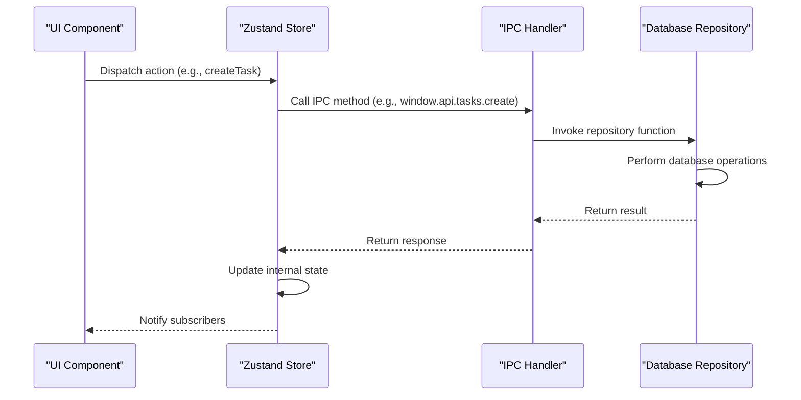
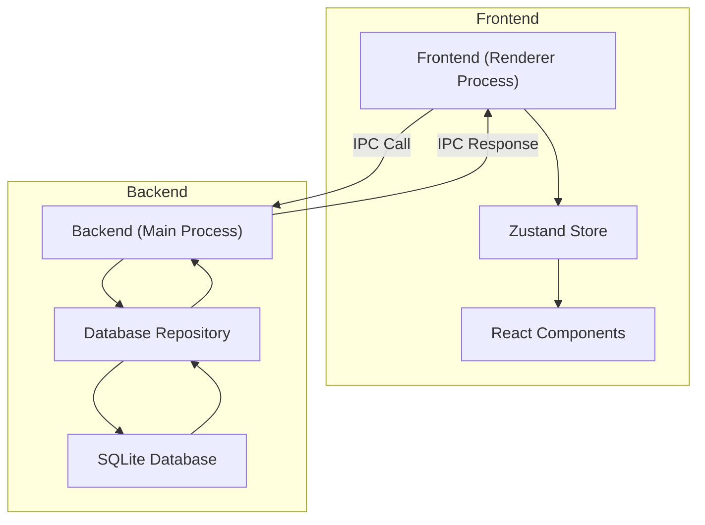
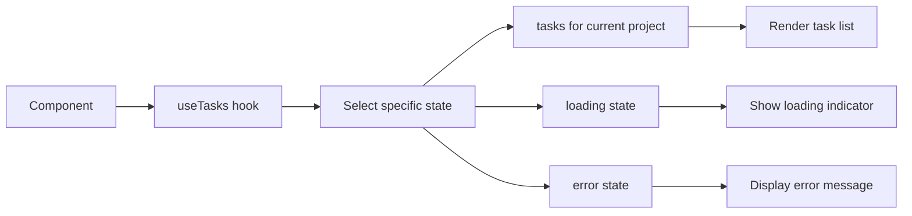
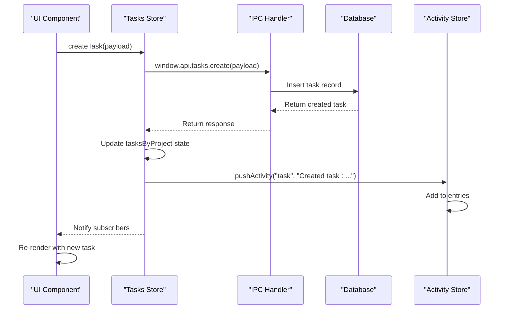
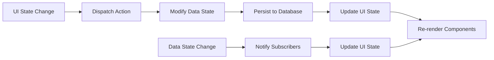
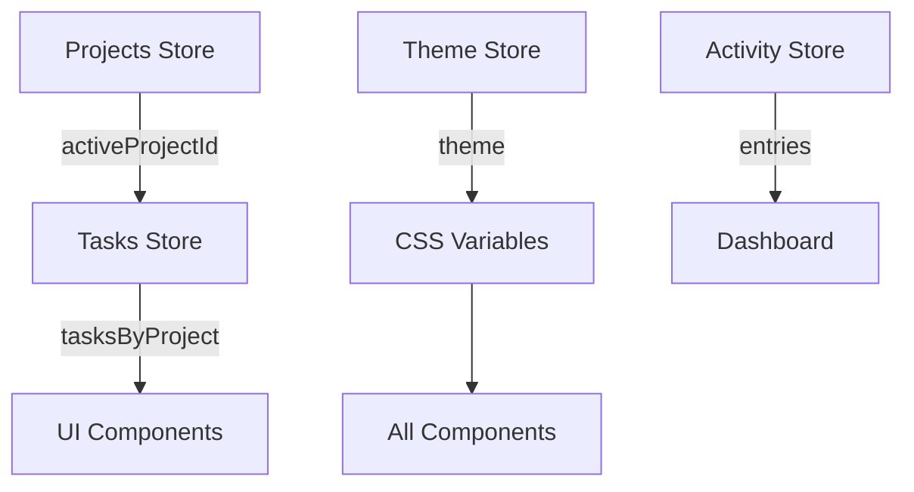
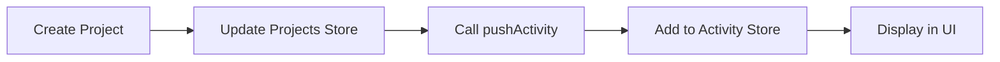

# State Management

<cite>
**Referenced Files in This Document**   
- [tasks.ts](file://src/store/tasks.ts)
- [habits.ts](file://src/store/habits.ts)
- [projects.ts](file://src/store/projects.ts)
- [theme.ts](file://src/store/theme.ts)
- [activity.ts](file://src/store/activity.ts)
- [tasksRepo.ts](file://src/database/tasksRepo.ts)
- [habitsRepo.ts](file://src/database/habitsRepo.ts)
- [projectsRepo.ts](file://src/database/projectsRepo.ts)
- [tasks.ts](file://src/main/ipc/tasks.ts)
- [habits.ts](file://src/main/ipc/habits.ts)
- [projects.ts](file://src/main/ipc/projects.ts)
- [settings.ts](file://src/main/ipc/settings.ts)
- [App.tsx](file://src/renderer/App.tsx)
- [Dashboard.tsx](file://src/renderer/pages/Dashboard.tsx)
- [ProjectSwitcher.tsx](file://src/renderer/components/ProjectSwitcher.tsx)
</cite>

## Table of Contents
1. [Introduction](#introduction)
2. [Store Architecture](#store-architecture)
3. [State Persistence and Synchronization](#state-persistence-and-synchronization)
4. [State Updates and Component Reactivity](#state-updates-and-component-reactivity)
5. [UI State and Data State Relationship](#ui-state-and-data-state-relationship)
6. [Adding New Stores](#adding-new-stores)
7. [Managing Complex State Interactions](#managing-complex-state-interactions)

## Introduction
The LifeOS application implements a robust state management system using Zustand, a lightweight and scalable state management solution for React applications. This system manages various aspects of the application including tasks, habits, projects, theme preferences, and activity tracking. The state management architecture is designed to provide a seamless user experience by maintaining consistent state across the application while ensuring data persistence through database synchronization.

**Section sources**
- [App.tsx](file://src/renderer/App.tsx#L1-L175)

## Store Architecture
LifeOS utilizes a modular store architecture with dedicated Zustand stores for different domains of the application. Each store encapsulates its own state, actions, and selectors, providing a clean separation of concerns.

```mermaid
classDiagram
class TasksState {
    +tasksByProject : Record<number, Task[]>
    +loading : Record<number, boolean>
    +error? : string
    +loadTasks(projectId : number) : Promise<void>
    +createTask(payload : CreateTaskInput) : Promise<void>
    +updateTask(id : number, payload : UpdateTaskPayload) : Promise<void>
    +moveTask(args : { id : number; projectId : number; status : string; position : number }) : Promise<void>
}
class HabitsState {
    +habits : HabitWithStats[]
    +selectedHabitId? : number
    +habitLogs : Map<number, HabitLog[]>
    +loading : boolean
    +error? : string
    +loadHabits() : Promise<void>
    +createHabit(input : { name : string; description? : string; icon? : string; color? : string; category? : string; frequency? : 'daily' | 'weekly' | 'monthly'; targetCount? : number }) : Promise<void>
    +updateHabit(id : number, payload : Partial<Habit>) : Promise<void>
    +deleteHabit(id : number) : Promise<void>
    +logHabit(habitId : number, loggedDate : string, count? : number, note? : string) : Promise<void>
    +unlogHabit(habitId : number, loggedDate : string) : Promise<void>
    +loadHabitLogs(habitId : number) : Promise<void>
    +setSelectedHabit(id? : number) : void
}
class ProjectsState {
    +projects : Project[]
    +activeProjectId? : number
    +loading : boolean
    +error? : string
    +loadProjects() : Promise<void>
    +setActiveProject(id : number) : Promise<void>
    +createProject(name : string) : Promise<void>
}
class ThemeState {
    +theme : Theme
    +isLoaded : boolean
    +loadTheme() : Promise<void>
    +setTheme(theme : Theme) : Promise<void>
    +toggleTheme() : Promise<void>
}
class ActivityState {
    +entries : ActivityEntry[]
    +isLoaded : boolean
    +loadActivities() : Promise<void>
    +pushActivity(type : string, message : string) : Promise<void>
    +clear() : Promise<void>
}
TasksState --> ProjectsState : "depends on"
TasksState --> ActivityState : "logs activities"
HabitsState --> ActivityState : "logs activities"
ProjectsState --> ActivityState : "logs activities"
ProjectsState --> TasksState : "loads tasks"
ThemeState --> CSS_variables : "applies theme"
```

**Diagram sources**
- [tasks.ts](file://src/store/tasks.ts#L1-L132)
- [habits.ts](file://src/store/habits.ts#L1-L160)
- [projects.ts](file://src/store/projects.ts#L1-L86)
- [theme.ts](file://src/store/theme.ts#L1-L88)
- [activity.ts](file://src/store/activity.ts#L1-L68)

### Tasks Store
The tasks store manages task-related state, organizing tasks by project ID. It provides methods for loading, creating, updating, and moving tasks. The store maintains loading states per project and handles error states.

**Section sources**
- [tasks.ts](file://src/store/tasks.ts#L1-L132)

### Habits Store
The habits store manages habit tracking functionality, including habit creation, updates, deletion, and logging. It maintains habit statistics and supports selecting a specific habit for detailed view. The store uses a Map to cache habit logs for performance optimization.

**Section sources**
- [habits.ts](file://src/store/habits.ts#L1-L160)

### Projects Store
The projects store manages project-related state, including the list of projects and the currently active project. It coordinates with the tasks store to load tasks when a project becomes active. The store also handles project creation and activation.

**Section sources**
- [projects.ts](file://src/store/projects.ts#L1-L86)

### Theme Store
The theme store manages the application's visual theme (light or dark mode). It persists the theme preference and applies the appropriate CSS variables to the document root. The store also handles theme loading from persistent storage.

**Section sources**
- [theme.ts](file://src/store/theme.ts#L1-L88)

### Activity Store
The activity store manages the application's activity log, which records user actions for auditing and display purposes. It provides methods for loading activities, pushing new activities, and clearing the activity log.

**Section sources**
- [activity.ts](file://src/store/activity.ts#L1-L68)

## State Persistence and Synchronization
The state management system in LifeOS ensures data persistence by synchronizing with a local database through IPC (Inter-Process Communication) calls. This architecture separates the frontend state management from the backend data persistence layer.



**Diagram sources**
- [tasks.ts](file://src/store/tasks.ts#L1-L132)
- [tasksRepo.ts](file://src/database/tasksRepo.ts#L1-L210)
- [tasks.ts](file://src/main/ipc/tasks.ts#L1-L36)

### Database Integration
Each store interacts with its corresponding database repository through IPC handlers. The database repositories implement the actual CRUD operations using SQL queries, while the stores manage the application state.

The synchronization process follows a consistent pattern:
1. The store dispatches an action
2. The action calls an IPC method
3. The IPC handler invokes the appropriate database repository function
4. The database operation is performed
5. The result is returned through the IPC layer
6. The store updates its internal state based on the result

**Section sources**
- [tasksRepo.ts](file://src/database/tasksRepo.ts#L1-L210)
- [habitsRepo.ts](file://src/database/habitsRepo.ts#L1-L394)
- [projectsRepo.ts](file://src/database/projectsRepo.ts#L1-L147)

### IPC Communication
The IPC layer serves as a bridge between the renderer process (frontend) and the main process (backend). Each store uses the `window.api` interface to communicate with the main process, where IPC handlers are registered to respond to specific events.



**Diagram sources**
- [tasks.ts](file://src/main/ipc/tasks.ts#L1-L36)
- [habits.ts](file://src/main/ipc/habits.ts#L1-L100)
- [projects.ts](file://src/main/ipc/projects.ts#L1-L83)
- [settings.ts](file://src/main/ipc/settings.ts#L1-L27)

## State Updates and Component Reactivity
The Zustand stores in LifeOS enable efficient state updates and component reactivity through a subscription model. Components subscribe to specific parts of the state and re-render only when the observed state changes.

### Selectors and Hooks
Each store exports custom hooks that use selectors to extract specific parts of the state. This pattern minimizes unnecessary re-renders by allowing components to subscribe only to the state they need.



**Diagram sources**
- [tasks.ts](file://src/store/tasks.ts#L125-L132)
- [habits.ts](file://src/store/habits.ts#L153-L160)
- [projects.ts](file://src/store/projects.ts#L79-L86)

### Example: Task Creation Flow
When a user creates a new task, the following sequence occurs:



**Diagram sources**
- [tasks.ts](file://src/store/tasks.ts#L75-L90)
- [tasksRepo.ts](file://src/database/tasksRepo.ts#L108-L145)
- [tasks.ts](file://src/main/ipc/tasks.ts#L18-L22)
- [activity.ts](file://src/store/activity.ts#L45-L55)

**Section sources**
- [tasks.ts](file://src/store/tasks.ts#L75-L90)

## UI State and Data State Relationship
In LifeOS, there is a clear distinction between UI state and data state, with well-defined interactions between them.

### UI State
UI state includes transient information about the user interface, such as:
- Active project selection
- Sidebar collapse state
- Modal dialog visibility
- Form input values
- Loading indicators

### Data State
Data state represents the persistent application data, including:
- Tasks and their properties
- Habits and their logs
- Projects and their configurations
- User preferences and settings

### Interaction Pattern
The relationship between UI state and data state follows a consistent pattern where UI state changes trigger actions that may modify data state, and data state changes update UI state.



**Diagram sources**
- [App.tsx](file://src/renderer/App.tsx#L1-L175)
- [ProjectSwitcher.tsx](file://src/renderer/components/ProjectSwitcher.tsx#L1-L325)

When a user selects a different project in the UI, the following occurs:
1. The UI state updates to reflect the new selection
2. An action is dispatched to set the active project
3. The data state is updated to reflect the new active project
4. The database is updated to persist the active project preference
5. The tasks store loads tasks for the newly active project
6. The UI re-renders to display the tasks for the selected project

**Section sources**
- [projects.ts](file://src/store/projects.ts#L55-L70)
- [projects.ts](file://src/main/ipc/projects.ts#L58-L65)
- [App.tsx](file://src/renderer/App.tsx#L145-L155)

## Adding New Stores
To add a new store to the LifeOS application, follow these steps:

### 1. Create the Store File
Create a new file in the `src/store` directory following the naming convention `[feature].ts`.

### 2. Define the State Interface
Define a TypeScript interface that describes the store's state, including properties and methods.

### 3. Implement the Store
Use Zustand's `create` function to implement the store with appropriate state management logic.

### 4. Add IPC Integration
Ensure the necessary IPC handlers are implemented in the main process to support the store's operations.

### 5. Create Custom Hook
Export a custom hook that provides a simplified interface to the store for components.

Example template for a new store:
```typescript
import { create } from 'zustand';

interface NewFeatureState {
  // State properties
  items: ItemType[];
  loading: boolean;
  error?: string;
  
  // Actions
  loadItems: () => Promise<void>;
  createItem: (input: CreateInput) => Promise<void>;
  updateItem: (id: number, payload: UpdatePayload) => Promise<void>;
  deleteItem: (id: number) => Promise<void>;
}

export const useNewFeatureStore = create<NewFeatureState>((set, get) => ({
  items: [],
  loading: false,
  error: undefined,
  
  async loadItems() {
    // Implementation
  },
  
  async createItem(input) {
    // Implementation
  },
  
  async updateItem(id, payload) {
    // Implementation
  },
  
  async deleteItem(id) {
    // Implementation
  }
}));

export const useNewFeature = () => useNewFeatureStore((state) => ({
  items: state.items,
  loading: state.loading,
  error: state.error,
  loadItems: state.loadItems,
  createItem: state.createItem,
  updateItem: state.updateItem,
  deleteItem: state.deleteItem
}));
```

**Section sources**
- [tasks.ts](file://src/store/tasks.ts#L1-L132)
- [habits.ts](file://src/store/habits.ts#L1-L160)

## Managing Complex State Interactions
LifeOS handles complex state interactions through several patterns that ensure consistency and prevent race conditions.

### Cross-Store Dependencies
Some stores depend on others for proper functionality. For example, the tasks store depends on the projects store to know which project's tasks to load.



**Diagram sources**
- [projects.ts](file://src/store/projects.ts#L55-L70)
- [tasks.ts](file://src/store/tasks.ts#L35-L50)
- [theme.ts](file://src/store/theme.ts#L45-L88)

### Error Handling
The stores implement consistent error handling patterns, capturing errors from IPC calls and database operations, logging them to the console, and updating the store's error state for display to users.

### Loading States
Each store manages loading states to provide feedback during asynchronous operations. Loading states are granular, allowing different parts of the UI to show loading indicators independently.

### Activity Logging
Significant state changes trigger activity logging, creating an audit trail of user actions. This is implemented by calling the activity store's `pushActivity` method from within other stores' actions.



**Diagram sources**
- [projects.ts](file://src/store/projects.ts#L70-L75)
- [tasks.ts](file://src/store/tasks.ts#L85-L90)
- [habits.ts](file://src/store/habits.ts#L105-L110)

**Section sources**
- [projects.ts](file://src/store/projects.ts#L70-L75)
- [tasks.ts](file://src/store/tasks.ts#L85-L90)
- [habits.ts](file://src/store/habits.ts#L105-L110)