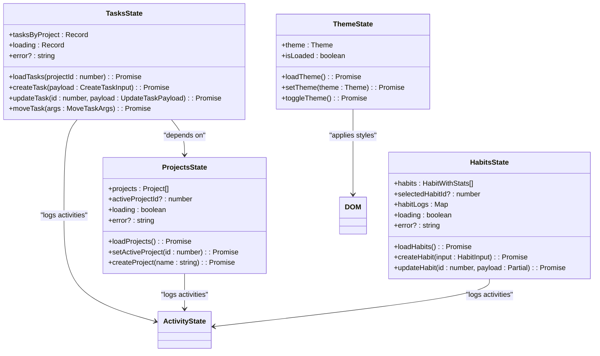
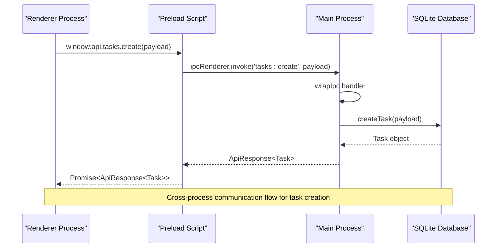
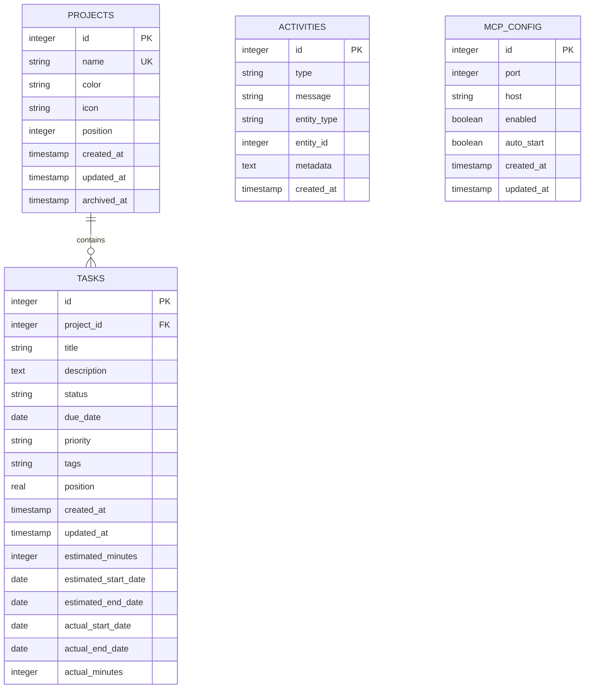
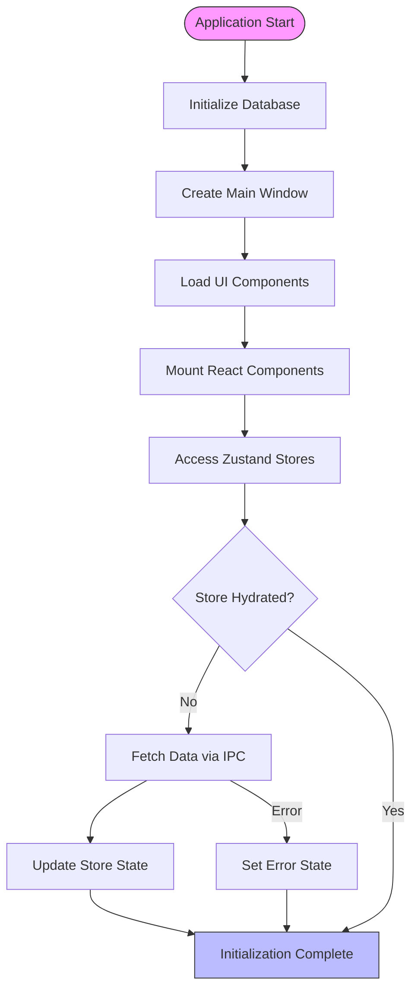
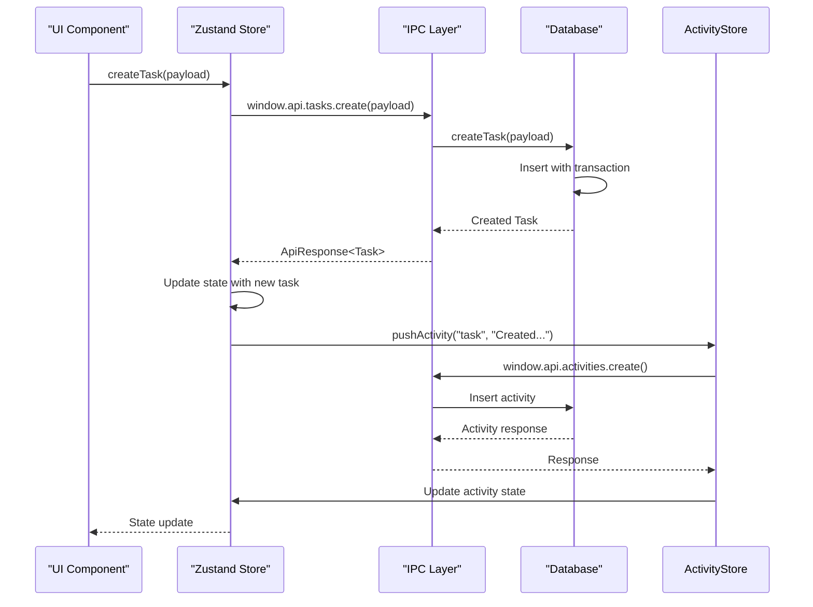

# State Persistence

<cite>
**Referenced Files in This Document**   
- [tasks.ts](file://src/store/tasks.ts)
- [projects.ts](file://src/store/projects.ts)
- [habits.ts](file://src/store/habits.ts)
- [activity.ts](file://src/store/activity.ts)
- [theme.ts](file://src/store/theme.ts)
- [init.ts](file://src/database/init.ts)
- [database.ts](file://src/main/ipc/database.ts)
- [index.ts](file://src/main/index.ts)
- [types.ts](file://src/common/types.ts)
- [tasks.ts](file://src/main/ipc/tasks.ts)
- [projects.ts](file://src/main/ipc/projects.ts)
- [index.ts](file://src/preload/index.ts)
- [tasksRepo.ts](file://src/database/tasksRepo.ts)
- [projectsRepo.ts](file://src/database/projectsRepo.ts)
- [mappers.ts](file://src/database/mappers.ts)
</cite>

## Table of Contents
1. [Introduction](#introduction)
2. [Dual Persistence Strategy](#dual-persistence-strategy)
3. [Zustand Store Architecture](#zustand-store-architecture)
4. [IPC Communication Layer](#ipc-communication-layer)
5. [Database Schema and Structure](#database-schema-and-structure)
6. [Store Hydration and Initialization](#store-hydration-and-initialization)
7. [Data Synchronization Process](#data-synchronization-process)
8. [Error Handling and Conflict Resolution](#error-handling-and-conflict-resolution)
9. [Serialization and Deserialization](#serialization-and-deserialization)
10. [Data Consistency and Race Conditions](#data-consistency-and-race-conditions)
11. [Schema Migration Strategy](#schema-migration-strategy)
12. [Conclusion](#conclusion)

## Introduction
LifeOS implements a comprehensive state persistence system that combines durable database storage with ephemeral UI state management. This document details the architecture and implementation of the state persistence mechanisms, focusing on the dual strategy of storing domain data in SQLite while maintaining UI state in memory with selective local persistence. The system leverages Zustand for state management, Electron's IPC for cross-process communication, and better-sqlite3 for persistent data storage.

## Dual Persistence Strategy

LifeOS employs a dual persistence strategy that separates domain data from UI state. Domain data such as tasks, habits, projects, and activities are stored in a SQLite database for durability and cross-session persistence. In contrast, UI state like theme preferences, active project selection, and component-specific state are managed through Zustand stores with selective persistence to local storage.

The database serves as the source of truth for all domain entities, ensuring data integrity and enabling features like data recovery, backup, and synchronization. UI state, being more transient and performance-sensitive, is primarily kept in memory but critical preferences are persisted to maintain user experience across sessions.

This separation allows for optimized performance—frequent UI updates don't require database writes—while ensuring that important user data is safely stored and recoverable. The strategy also enables graceful degradation when database access is unavailable, as the application can continue to function with in-memory state until database connectivity is restored.

**Section sources**
- [init.ts](file://src/database/init.ts#L1-L150)
- [theme.ts](file://src/store/theme.ts#L1-L89)
- [projects.ts](file://src/store/projects.ts#L1-L87)

## Zustand Store Architecture

The application utilizes Zustand for state management across various domains including tasks, projects, habits, activities, and theme preferences. Each store follows a consistent pattern of defining state shape, actions, and selectors while implementing error handling and loading states.

The `useTasksStore` manages task data organized by project, with methods for loading, creating, updating, and moving tasks. It maintains a `tasksByProject` object that maps project IDs to arrays of tasks, enabling efficient access patterns. Similarly, `useProjectsStore` manages project data including the active project selection, while `useHabitsStore` handles habit tracking with associated logging functionality.

All stores implement a consistent error handling pattern, capturing and exposing errors through an optional `error` property in the state. Loading states are tracked per-operation or per-entity, allowing granular UI feedback. The stores also implement sorting logic (e.g., tasks sorted by status and position) to ensure consistent presentation.

**Diagram sources**
- [tasks.ts](file://src/store/tasks.ts#L1-L133)
- [projects.ts](file://src/store/projects.ts#L1-L87)
- [habits.ts](file://src/store/habits.ts#L1-L161)
- [theme.ts](file://src/store/theme.ts#L1-L89)

**Section sources**
- [tasks.ts](file://src/store/tasks.ts#L1-L133)
- [projects.ts](file://src/store/projects.ts#L1-L87)
- [habits.ts](file://src/store/habits.ts#L1-L161)
- [activity.ts](file://src/store/activity.ts#L1-L69)
- [theme.ts](file://src/store/theme.ts#L1-L89)

## IPC Communication Layer

The IPC (Inter-Process Communication) layer facilitates communication between the renderer process (UI) and main process (Electron) for database operations. The system uses Electron's `ipcMain.handle` and `ipcRenderer.invoke` pattern to create a promise-based API for asynchronous operations.

Each domain has dedicated IPC handlers in the main process that wrap database operations. For example, `src/main/ipc/tasks.ts` exposes handlers for task operations like `tasks:list-by-project`, `tasks:create`, and `tasks:update`. These handlers use the `wrapIpc` utility to standardize response formatting, ensuring consistent success/error handling.

The preload script (`src/preload/index.ts`) bridges the gap between the isolated renderer context and Electron's API by exposing a sanitized API via `contextBridge.exposeInMainWorld('api', api)`. This creates a secure interface where the renderer can invoke IPC handlers through `window.api.tasks.listByProject()` while preventing direct access to Node.js and Electron APIs.

**Diagram sources**
- [tasks.ts](file://src/main/ipc/tasks.ts#L1-L37)
- [projects.ts](file://src/main/ipc/projects.ts#L1-L84)
- [index.ts](file://src/preload/index.ts#L1-L202)

**Section sources**
- [tasks.ts](file://src/main/ipc/tasks.ts#L1-L37)
- [projects.ts](file://src/main/ipc/projects.ts#L1-L84)
- [index.ts](file://src/preload/index.ts#L1-L202)

## Database Schema and Structure

The database schema is initialized in `src/database/init.ts` and defines tables for core entities including projects, tasks, activities, and configuration data. The schema employs proper normalization with foreign key relationships and includes comprehensive indexing for query performance.

Key tables include:
- **projects**: Stores project metadata with position-based ordering
- **tasks**: Contains task details with foreign key to projects and status-based organization
- **activities**: Tracks user activities and system events
- **mcp_config**: Stores MCP server configuration

The schema includes migration logic to handle schema evolution, such as adding time tracking columns to the tasks table if they don't exist. Indexes are strategically created on frequently queried fields like `tasks(project_id, status)` and `activities(created_at DESC)` to optimize common access patterns.

**Diagram sources**
- [init.ts](file://src/database/init.ts#L1-L150)
- [tasksRepo.ts](file://src/database/tasksRepo.ts#L1-L211)
- [projectsRepo.ts](file://src/database/projectsRepo.ts#L1-L148)

**Section sources**
- [init.ts](file://src/database/init.ts#L1-L150)
- [tasksRepo.ts](file://src/database/tasksRepo.ts#L1-L211)
- [projectsRepo.ts](file://src/database/projectsRepo.ts#L1-L148)

## Store Hydration and Initialization

The application initializes its state through a coordinated startup sequence that hydrates stores from persistent storage. During application launch in `src/main/index.ts`, the database is initialized before creating the main window, establishing the foundation for data access.

Store hydration occurs lazily when components mount and access the stores. For example, the `useProjectsStore` automatically calls `loadProjects()` when needed, which fetches data from the database via IPC. The `loadProjects` method not only retrieves projects but also ensures the active project is properly set, falling back to the first project if necessary.

Theme state is hydrated synchronously during initialization through `useThemeStore.loadTheme()`, which retrieves settings from the database and applies the appropriate CSS variables. This ensures the correct theme is applied immediately upon application startup.

The initialization sequence handles error conditions gracefully, setting appropriate error states in the stores when database operations fail. This allows the UI to display meaningful error messages while maintaining application functionality.

**Diagram sources**
- [index.ts](file://src/main/index.ts#L1-L123)
- [projects.ts](file://src/store/projects.ts#L1-L87)
- [theme.ts](file://src/store/theme.ts#L1-L89)

**Section sources**
- [index.ts](file://src/main/index.ts#L1-L123)
- [projects.ts](file://src/store/projects.ts#L1-L87)
- [theme.ts](file://src/store/theme.ts#L1-L89)

## Data Synchronization Process

Data synchronization in LifeOS follows a request-response pattern where UI actions trigger store methods that communicate with the database via IPC. When a user creates a task, the `useTasksStore.createTask` method sends the payload through the IPC layer to the main process, which persists it to the database and returns the created entity.

The synchronization process maintains data consistency through a "write-through" pattern: updates are first sent to the database, and upon successful response, the local store is updated with the returned data. This ensures the store state reflects the actual database state, including any server-generated values like IDs or timestamps.

For operations that affect multiple entities, such as moving a task between projects, the system uses database transactions to ensure atomicity. The `moveTask` operation in `tasksRepo.ts` updates the task's project ID and position within a single transaction, preventing partial updates.

The activity logging system demonstrates cross-store synchronization, where operations in one store (e.g., creating a task) trigger updates in another (activity log). This is achieved through direct store access using `get().getState()` methods, enabling coordinated state updates across related domains.

**Diagram sources**
- [tasks.ts](file://src/store/tasks.ts#L1-L133)
- [tasksRepo.ts](file://src/database/tasksRepo.ts#L1-L211)
- [activity.ts](file://src/store/activity.ts#L1-L69)

**Section sources**
- [tasks.ts](file://src/store/tasks.ts#L1-L133)
- [tasksRepo.ts](file://src/database/tasksRepo.ts#L1-L211)
- [activity.ts](file://src/store/activity.ts#L1-L69)

## Error Handling and Conflict Resolution

The state persistence system implements comprehensive error handling at multiple levels. At the database layer, operations are wrapped in try-catch blocks that provide meaningful error messages while preventing application crashes. The `wrapIpc` utility standardizes error responses across IPC handlers, ensuring consistent formatting.

Store-level error handling captures exceptions and updates the store's error state, which UI components can display to users. Each store maintains an `error` property that is set on operation failure and cleared on subsequent success. This enables transient error display without corrupting the overall application state.

Conflict resolution is primarily handled through the database's ACID properties and foreign key constraints. For example, deleting a project automatically removes all associated tasks due to the `ON DELETE CASCADE` constraint. The system also implements application-level conflict resolution, such as automatically setting the first available project as active when the current active project is deleted.

Network-style errors (e.g., database unavailable) are handled by maintaining in-memory state and queuing operations for when connectivity is restored, though this functionality is currently limited in the current implementation.

**Section sources**
- [tasks.ts](file://src/store/tasks.ts#L1-L133)
- [projects.ts](file://src/store/projects.ts#L1-L87)
- [database.ts](file://src/main/ipc/database.ts#L1-L55)
- [tasksRepo.ts](file://src/database/tasksRepo.ts#L1-L211)

## Serialization and Deserialization

Data serialization and deserialization occurs at multiple boundaries in the system. Complex data types like arrays are serialized to JSON strings for database storage, as seen in the `serialiseTags` function in `tasksRepo.ts` which converts tag arrays to JSON strings.

The `safeParseTags` function in `mappers.ts` handles deserialization with error resilience, attempting to parse JSON strings while gracefully handling malformed data by returning undefined. This prevents application crashes due to corrupted data while maintaining data integrity.

Circular references are avoided through careful data modeling—the domain entities are simple POJOs (Plain Old JavaScript Objects) without circular references. The serialization is limited to primitive types and arrays, eliminating the risk of circular reference issues during JSON serialization.

Date fields are stored as ISO strings in the database and converted to string properties in the TypeScript interfaces, avoiding issues with JavaScript Date object serialization. This approach ensures consistent behavior across serialization boundaries and prevents timezone-related issues.

**Section sources**
- [mappers.ts](file://src/database/mappers.ts#L1-L54)
- [tasksRepo.ts](file://src/database/tasksRepo.ts#L1-L211)
- [types.ts](file://src/common/types.ts#L1-L117)

## Data Consistency and Race Conditions

The system addresses data consistency and race conditions through several mechanisms. Database transactions ensure atomicity for multi-step operations, such as the `reorderProjects` function which updates multiple project positions in a single transaction.

The store architecture minimizes race conditions by using Zustand's atomic state updates and selector memoization. When multiple components access the same store, they receive consistent state snapshots, preventing race conditions from concurrent reads.

During initialization, the system handles potential race conditions by coordinating the loading sequence. The `useProjectsStore.loadProjects` method ensures the active project is properly set before loading tasks for that project, preventing attempts to load tasks for non-existent or invalid projects.

The event-driven architecture, where operations trigger activity logging, uses asynchronous calls that don't block the primary operation, preventing race conditions between the main operation and logging. Error handling in these secondary operations is non-critical, ensuring that logging failures don't affect primary functionality.

**Section sources**
- [projects.ts](file://src/store/projects.ts#L1-L87)
- [projectsRepo.ts](file://src/database/projectsRepo.ts#L1-L148)
- [tasks.ts](file://src/store/tasks.ts#L1-L133)

## Schema Migration Strategy

The schema migration strategy in LifeOS is implemented through incremental, conditional schema updates in the `runMigrations` function in `init.ts`. Rather than using a formal migration framework, the system applies schema changes through `ALTER TABLE` statements wrapped in try-catch blocks.

This approach allows the application to gracefully handle cases where columns already exist, enabling backward compatibility with databases created by previous versions. For example, time tracking columns are added to the tasks table only if they don't already exist, allowing smooth upgrades from older versions.

The migration process is idempotent and can be safely run on every application startup, ensuring the database schema is always up-to-date. This eliminates the need for complex version tracking while providing a simple mechanism for schema evolution.

Future enhancements could include a more formal migration system with version tracking and rollback capabilities, but the current approach effectively meets the application's needs for incremental schema evolution.

**Section sources**
- [init.ts](file://src/database/init.ts#L1-L150)

## Conclusion

LifeOS implements a robust state persistence system that effectively separates domain data from UI state while maintaining data consistency and integrity. The dual persistence strategy leverages SQLite for durable storage of domain entities and Zustand for efficient UI state management.

The architecture demonstrates several best practices: clear separation of concerns between store, IPC, and database layers; comprehensive error handling at multiple levels; and thoughtful data modeling that prevents common issues like circular references. The system balances performance needs with data safety, using asynchronous operations for responsiveness while ensuring critical data is properly persisted.

Key strengths include the consistent error handling pattern, the use of database transactions for data integrity, and the graceful handling of schema evolution. The system could be enhanced with features like operation queuing for offline scenarios and more sophisticated conflict resolution for collaborative editing, but currently provides a solid foundation for reliable state persistence.