# Tasks Store

<cite>
**Referenced Files in This Document**
- [src/store/tasks.ts](file://src/store/tasks.ts)
- [src/database/tasksRepo.ts](file://src/database/tasksRepo.ts)
- [src/main/ipc/tasks.ts](file://src/main/ipc/tasks.ts)
- [src/renderer/pages/KanbanPage.tsx](file://src/renderer/pages/KanbanPage.tsx)
- [src/renderer/components/KanbanColumn.tsx](file://src/renderer/components/KanbanColumn.tsx)
- [src/renderer/components/TaskCard.tsx](file://src/renderer/components/TaskCard.tsx)
- [src/renderer/components/TaskDetailPanel.tsx](file://src/renderer/components/TaskDetailPanel.tsx)
- [src/common/types.ts](file://src/common/types.ts)
- [src/database/types.ts](file://src/database/types.ts)
- [src/database/mappers.ts](file://src/database/mappers.ts)
- [src/store/projects.ts](file://src/store/projects.ts)
</cite>

## Table of Contents
1. [Introduction](#introduction)
2. [Architecture Overview](#architecture-overview)
3. [Core State Management](#core-state-management)
4. [Task CRUD Operations](#task-crud-operations)
5. [Kanban Column Reordering](#kanban-column-reordering)
6. [Optimistic Updates and Synchronization](#optimistic-updates-and-synchronization)
7. [Derived Selectors and Filtering](#derived-selectors-and-filtering)
8. [Integration with Projects Store](#integration-with-projects-store)
9. [Performance Considerations](#performance-considerations)
10. [UI Component Integration](#ui-component-integration)
11. [Error Handling and Recovery](#error-handling-and-recovery)
12. [Best Practices](#best-practices)

## Introduction

The Tasks Store is a sophisticated state management system built with Zustand that manages tasks organized by project, with support for Kanban-style column operations, real-time synchronization, and optimistic updates. It serves as the central hub for task management in the LifeOS application, providing seamless integration between the frontend React components and the Electron IPC layer.

The store implements a key-value architecture where tasks are indexed by project ID, enabling efficient filtering and rendering of task lists within specific project contexts. This design pattern ensures optimal performance when dealing with large task sets while maintaining responsive user interactions.

## Architecture Overview

The Tasks Store follows a layered architecture that separates concerns between state management, data persistence, and user interface interactions:

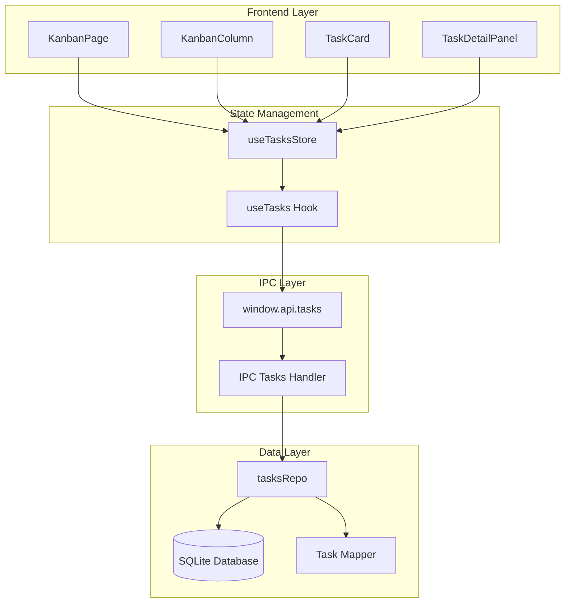

**Diagram sources**
- [src/store/tasks.ts](file://src/store/tasks.ts#L1-L133)
- [src/renderer/pages/KanbanPage.tsx](file://src/renderer/pages/KanbanPage.tsx#L1-L520)
- [src/database/tasksRepo.ts](file://src/database/tasksRepo.ts#L1-L211)

**Section sources**
- [src/store/tasks.ts](file://src/store/tasks.ts#L1-L133)
- [src/renderer/pages/KanbanPage.tsx](file://src/renderer/pages/KanbanPage.tsx#L1-L520)

## Core State Management

The Tasks Store maintains a structured state object that organizes tasks by project for efficient access and rendering:

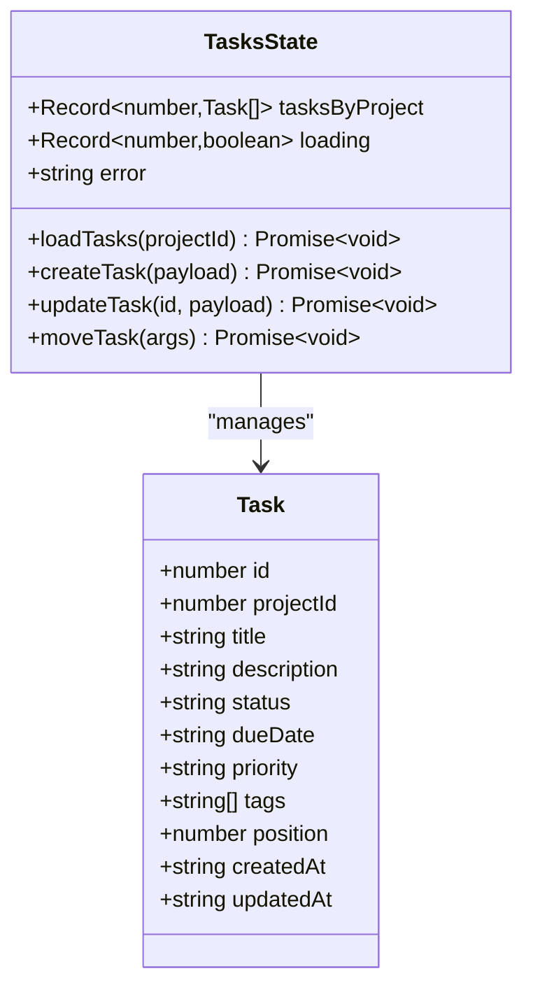

**Diagram sources**
- [src/store/tasks.ts](file://src/store/tasks.ts#L4-L14)
- [src/common/types.ts](file://src/common/types.ts#L8-L23)

The state structure employs several key design patterns:

### Project-Based Organization
Tasks are stored in a `tasksByProject` object where each key corresponds to a project ID and contains an array of tasks. This organization enables:
- **Efficient filtering**: Tasks can be quickly retrieved for specific projects
- **Isolated updates**: Changes to one project don't affect others
- **Memory optimization**: Only loaded projects consume memory

### Loading State Management
Each project maintains an individual loading state, allowing for granular progress indication during task operations.

### Error Propagation
Errors are centralized in the store state, enabling consistent error handling across all components.

**Section sources**
- [src/store/tasks.ts](file://src/store/tasks.ts#L4-L14)
- [src/common/types.ts](file://src/common/types.ts#L8-L23)

## Task CRUD Operations

The Tasks Store provides comprehensive CRUD operations with proper error handling and optimistic updates:

### Create Task Operation

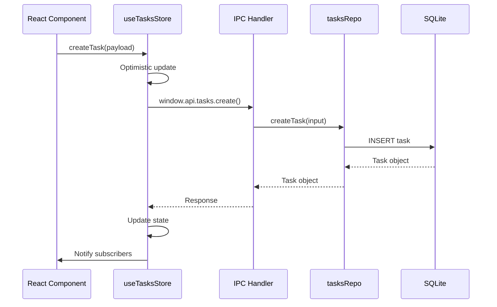

**Diagram sources**
- [src/store/tasks.ts](file://src/store/tasks.ts#L48-L65)
- [src/database/tasksRepo.ts](file://src/database/tasksRepo.ts#L58-L95)

### Update Task Operation

The update operation supports partial updates with field validation and change tracking:

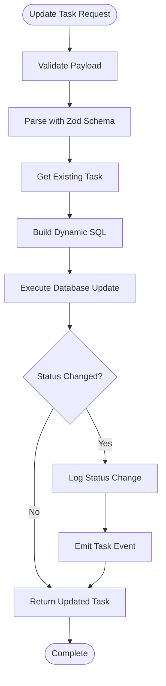

**Diagram sources**
- [src/database/tasksRepo.ts](file://src/database/tasksRepo.ts#L97-L210)

### Delete Task Operation

Tasks are soft-deleted by setting the status to 'Deleted', maintaining data integrity while removing them from active views.

**Section sources**
- [src/store/tasks.ts](file://src/store/tasks.ts#L48-L105)
- [src/database/tasksRepo.ts](file://src/database/tasksRepo.ts#L58-L210)

## Kanban Column Reordering

The Kanban reordering system implements sophisticated drag-and-drop functionality with optimistic updates and conflict resolution:

### Reordering Mechanics

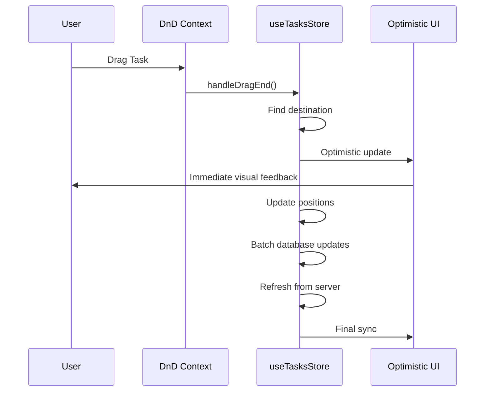

**Diagram sources**
- [src/renderer/pages/KanbanPage.tsx](file://src/renderer/pages/KanbanPage.tsx#L209-L320)

### Position Management

The system maintains task positions within each status column, ensuring consistent ordering:

| Operation | Position Calculation | Conflict Resolution |
|-----------|---------------------|-------------------|
| New Task | `MAX(position) + 1` | Automatic increment |
| Reorder Within Column | Direct array manipulation | Optimistic UI update |
| Move Between Columns | Insert at target position | Database constraint |
| Bulk Operations | Batch position updates | Transaction rollback |

**Section sources**
- [src/renderer/pages/KanbanPage.tsx](file://src/renderer/pages/KanbanPage.tsx#L209-L320)
- [src/database/tasksRepo.ts](file://src/database/tasksRepo.ts#L58-L75)

## Optimistic Updates and Synchronization

The Tasks Store implements a robust optimistic update pattern that enhances user experience while maintaining data consistency:

### Optimistic Update Pattern

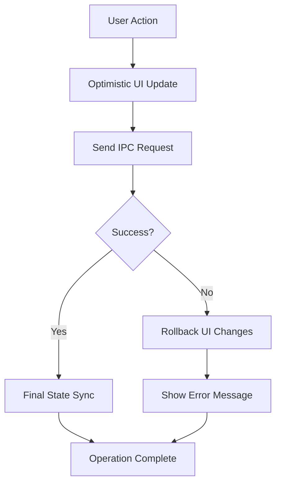

**Diagram sources**
- [src/store/tasks.ts](file://src/store/tasks.ts#L48-L105)

### Synchronization Mechanisms

The store employs multiple synchronization strategies:

1. **Immediate UI Updates**: Optimistic updates provide instant visual feedback
2. **Server Validation**: Backend validation ensures data integrity
3. **Conflict Resolution**: Automatic conflict detection and resolution
4. **State Recovery**: Error handling with state restoration

**Section sources**
- [src/store/tasks.ts](file://src/store/tasks.ts#L48-L105)
- [src/renderer/pages/KanbanPage.tsx](file://src/renderer/pages/KanbanPage.tsx#L209-L320)

## Derived Selectors and Filtering

The Tasks Store provides powerful filtering capabilities through derived selectors and computed properties:

### Task Filtering System

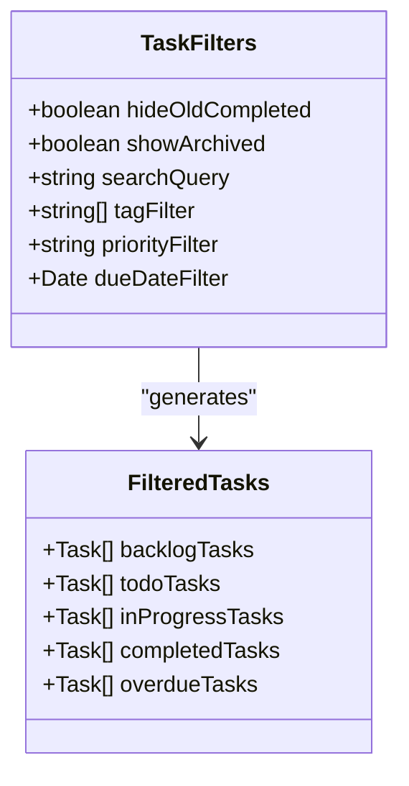

**Diagram sources**
- [src/renderer/pages/KanbanPage.tsx](file://src/renderer/pages/KanbanPage.tsx#L32-L65)

### Overdue Task Detection

The system automatically identifies overdue tasks based on due dates and current time:

| Status | Overdue Criteria | Display Behavior |
|--------|-----------------|------------------|
| To-Do | Due date < current date | Highlighted indicator |
| In Progress | Extended beyond due date | Warning badge |
| Completed | Late completion time | Completion note |

### Performance-Optimized Filtering

The filtering system uses React's `useMemo` for efficient computation caching, ensuring smooth performance even with large task sets.

**Section sources**
- [src/renderer/pages/KanbanPage.tsx](file://src/renderer/pages/KanbanPage.tsx#L32-L65)

## Integration with Projects Store

The Tasks Store seamlessly integrates with the Projects Store to maintain synchronized state across the application:

### Project Context Management

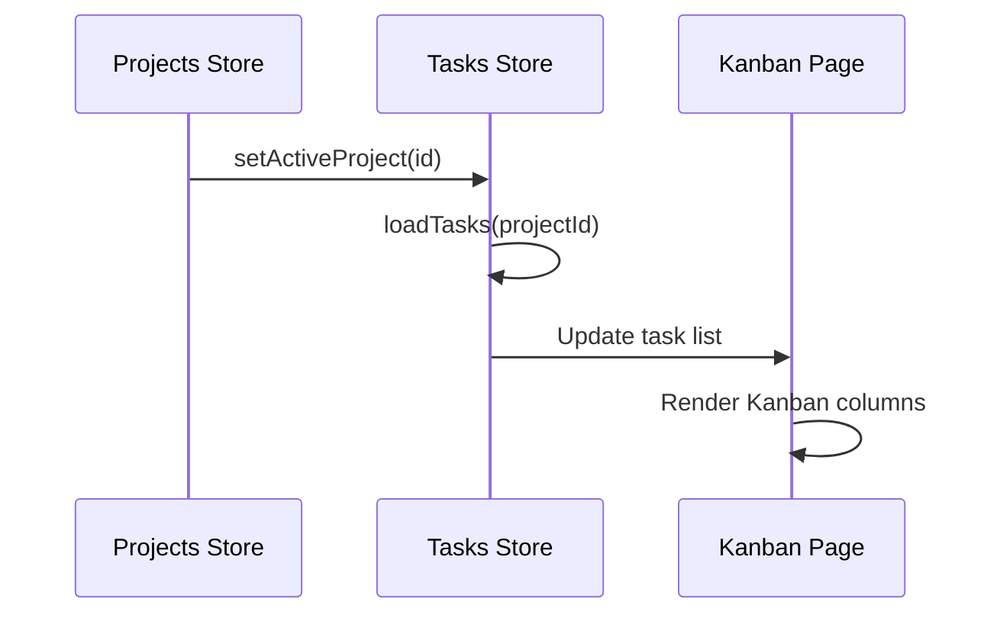

**Diagram sources**
- [src/store/projects.ts](file://src/store/projects.ts#L35-L45)
- [src/store/tasks.ts](file://src/store/tasks.ts#L25-L45)

### Cross-Store Communication

The integration maintains consistency through:
- **Active Project Tracking**: Tasks store responds to project changes
- **Lazy Loading**: Tasks are loaded only when needed
- **State Synchronization**: Both stores maintain consistent state

**Section sources**
- [src/store/projects.ts](file://src/store/projects.ts#L35-L45)
- [src/store/tasks.ts](file://src/store/tasks.ts#L25-L45)

## Performance Considerations

The Tasks Store implements several performance optimization strategies for handling large task sets efficiently:

### Memory Management

| Strategy | Implementation | Benefit |
|----------|---------------|---------|
| Lazy Loading | Load tasks only for active projects | Reduced memory footprint |
| Memoization | `useMemo` for computed values | Prevents unnecessary recalculations |
| Virtual Scrolling | Efficient rendering of large lists | Smooth scrolling performance |
| Debounced Updates | Throttled state updates | Reduced render cycles |

### Database Optimization

The underlying database implementation includes:
- **Indexed Queries**: Project ID and status indexing
- **Batch Operations**: Grouped database updates
- **Connection Pooling**: Efficient database resource management

### UI Rendering Optimization

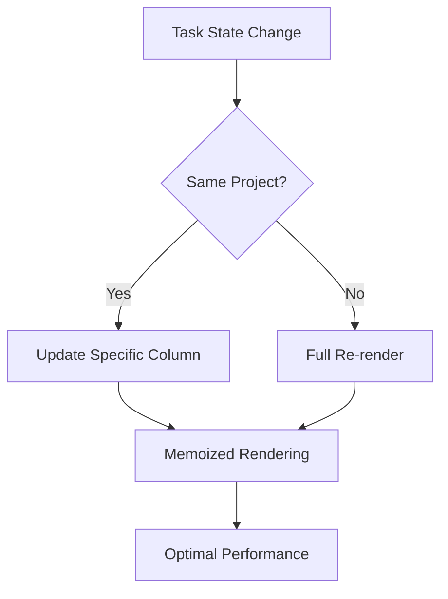

**Section sources**
- [src/renderer/pages/KanbanPage.tsx](file://src/renderer/pages/KanbanPage.tsx#L32-L65)
- [src/store/tasks.ts](file://src/store/tasks.ts#L25-L45)

## UI Component Integration

The Tasks Store integrates deeply with React components to provide responsive and interactive task management:

### Component Architecture

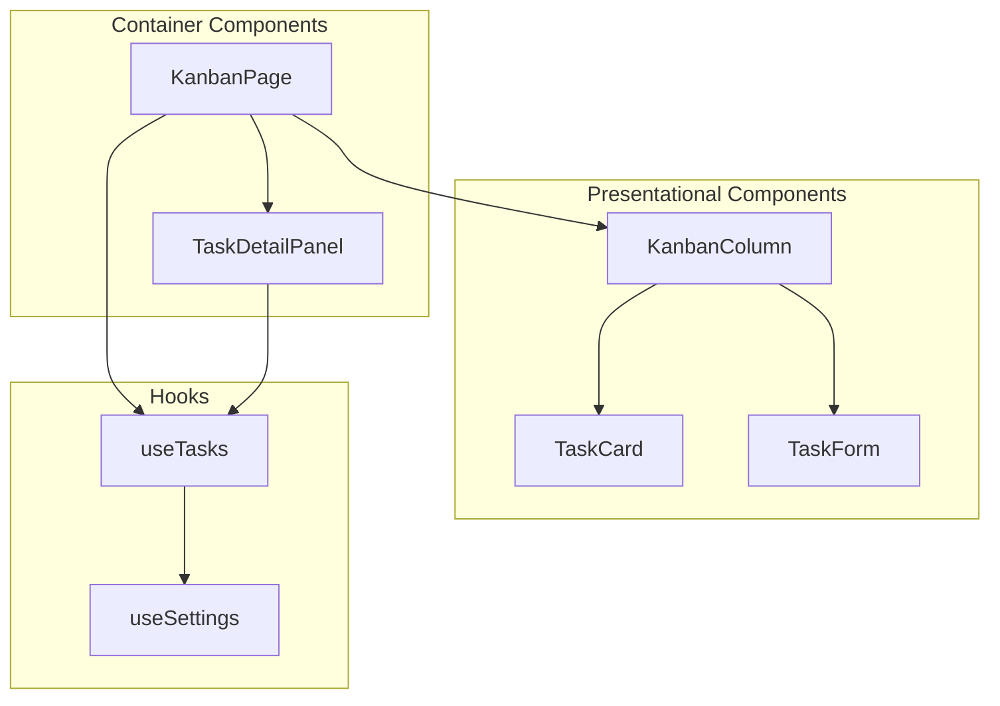

**Diagram sources**
- [src/renderer/pages/KanbanPage.tsx](file://src/renderer/pages/KanbanPage.tsx#L1-L520)
- [src/renderer/components/KanbanColumn.tsx](file://src/renderer/components/KanbanColumn.tsx#L1-L104)

### Event Handling Patterns

The integration follows established patterns for event handling:

1. **Declarative APIs**: Components receive callbacks for actions
2. **Error Boundaries**: Comprehensive error handling at component level
3. **Loading States**: Graceful handling of asynchronous operations
4. **User Feedback**: Immediate visual feedback for all operations

**Section sources**
- [src/renderer/pages/KanbanPage.tsx](file://src/renderer/pages/KanbanPage.tsx#L1-L520)
- [src/renderer/components/KanbanColumn.tsx](file://src/renderer/components/KanbanColumn.tsx#L1-L104)

## Error Handling and Recovery

The Tasks Store implements comprehensive error handling with automatic recovery mechanisms:

### Error Categories

| Error Type | Handling Strategy | Recovery Method |
|------------|------------------|-----------------|
| Network Errors | Retry with exponential backoff | Manual retry option |
| Validation Errors | Client-side validation | Immediate feedback |
| Database Errors | Transaction rollback | State restoration |
| Concurrency Conflicts | Optimistic update rollback | Server state sync |

### Recovery Mechanisms

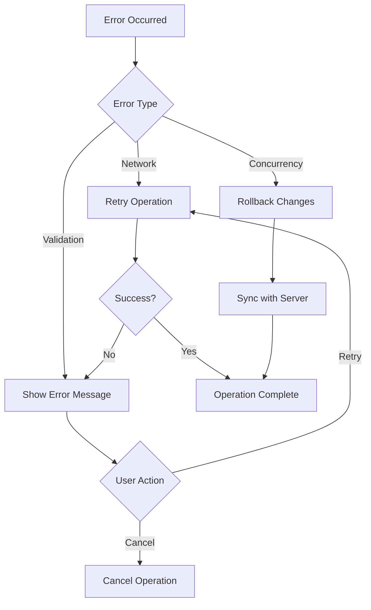

**Section sources**
- [src/store/tasks.ts](file://src/store/tasks.ts#L48-L105)

## Best Practices

### State Management Guidelines

1. **Immutable Updates**: Always use immutable update patterns
2. **Atomic Operations**: Group related updates in transactions
3. **Error Boundaries**: Wrap async operations with proper error handling
4. **Performance Monitoring**: Monitor state update frequencies

### Development Patterns

1. **Type Safety**: Leverage TypeScript for compile-time safety
2. **Testing**: Implement comprehensive unit and integration tests
3. **Documentation**: Maintain clear documentation for complex operations
4. **Performance Testing**: Regular performance benchmarking

### Security Considerations

1. **Input Validation**: Validate all user inputs
2. **Access Control**: Implement proper authorization checks
3. **Data Sanitization**: Clean user-generated content
4. **Audit Logging**: Track all state-changing operations

The Tasks Store represents a sophisticated state management solution that balances performance, usability, and reliability. Its modular architecture enables easy maintenance and extension while providing a robust foundation for task management functionality.