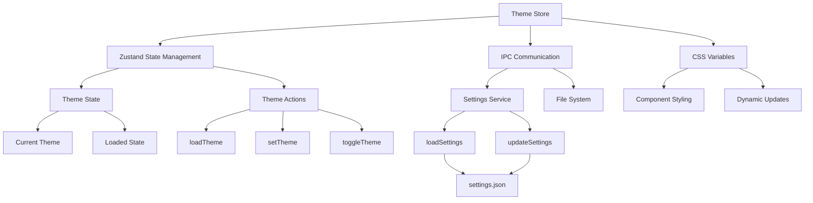
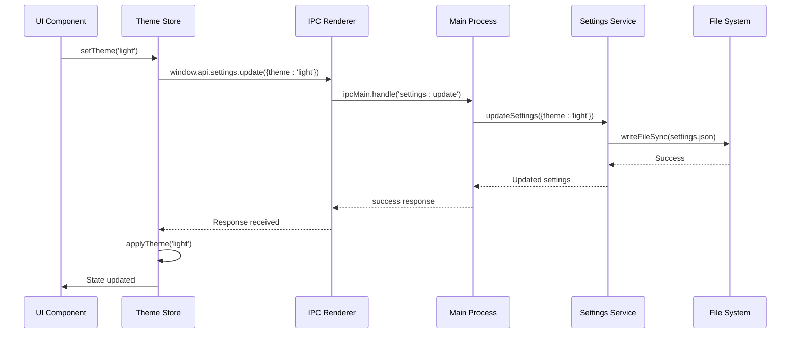
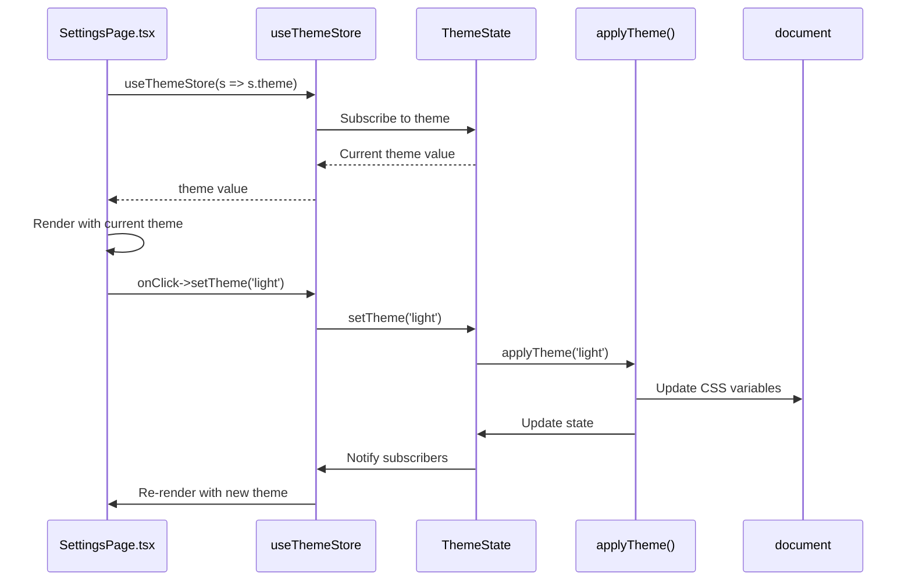
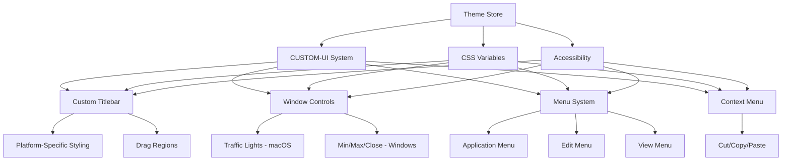
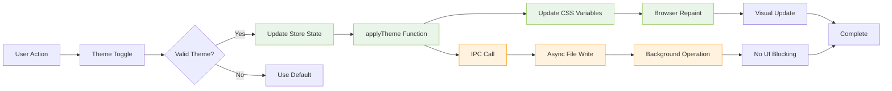
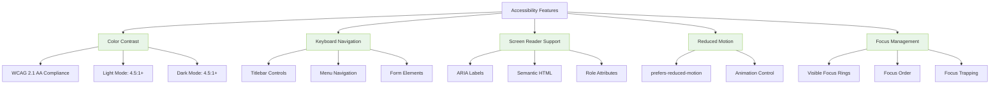

# Theme Store

<cite>
**Referenced Files in This Document**   
- [theme.ts](file://src/store/theme.ts)
- [settings.ts](file://src/services/settings.ts)
- [settings.ts](file://src/main/ipc/settings.ts)
- [App.tsx](file://src/renderer/App.tsx)
- [SettingsPage.tsx](file://src/renderer/pages/SettingsPage.tsx)
- [TaskCard.tsx](file://src/renderer/components/TaskCard.tsx)
- [styles.css](file://src/renderer/styles.css)
- [UI-CUSTOMIZATION.md](file://AI/UI-CUSTOMIZATION.md)
- [CUSTOM-UI.md](file://AI/CUSTOM-UI.md)
</cite>

## Table of Contents
1. [Introduction](#introduction)
2. [Theme Store Architecture](#theme-store-architecture)
3. [Theme State Management](#theme-state-management)
4. [Theme Persistence Mechanism](#theme-persistence-mechanism)
5. [CSS Variables Synchronization](#css-variables-synchronization)
6. [Component Subscription and Reactivity](#component-subscription-and-reactivity)
7. [Integration with CUSTOM-UI System](#integration-with-custom-ui-system)
8. [Dynamic Theme Switching Performance](#dynamic-theme-switching-performance)
9. [Accessibility Considerations](#accessibility-considerations)
10. [Conclusion](#conclusion)

## Introduction

The Theme Store implementation in LifeOS provides a comprehensive system for managing UI appearance preferences, including dark/light mode, color schemes, and custom styling options. This documentation details the architecture, functionality, and integration points of the theme management system, focusing on how it enables a consistent and accessible user experience across the application.

The theme system is designed with several key objectives: persistent theme state across application restarts, real-time synchronization with CSS variables, reactive component updates, and seamless integration with the broader UI customization framework. The implementation leverages Zustand for state management, Electron's IPC for cross-process communication, and CSS custom properties for dynamic styling.

**Section sources**
- [theme.ts](file://src/store/theme.ts#L1-L88)
- [UI-CUSTOMIZATION.md](file://AI/UI-CUSTOMIZATION.md#L1-L720)

## Theme Store Architecture

The Theme Store follows a layered architecture that separates concerns between state management, persistence, and UI presentation. At its core, the system uses Zustand, a lightweight state management solution, to create a centralized theme store that can be accessed by any component in the application.

The architecture consists of three main layers:
1. **State Management Layer**: Implemented in `theme.ts` using Zustand, this layer maintains the current theme state and provides methods for theme manipulation.
2. **Persistence Layer**: Handled through Electron's IPC mechanism, this layer ensures theme preferences are saved to and loaded from the user's file system.
3. **Presentation Layer**: Components throughout the application subscribe to theme changes and update their appearance accordingly.

The system is initialized in the application's main component (`App.tsx`), where the theme store is loaded during application startup. This ensures that the user's preferred theme is applied immediately upon launch, providing a seamless experience.



**Diagram sources**
- [theme.ts](file://src/store/theme.ts#L1-L88)
- [settings.ts](file://src/services/settings.ts#L1-L45)
- [App.tsx](file://src/renderer/App.tsx#L1-L175)

**Section sources**
- [theme.ts](file://src/store/theme.ts#L1-L88)
- [App.tsx](file://src/renderer/App.tsx#L1-L175)

## Theme State Management

The Theme Store implements a reactive state management pattern using Zustand, providing a simple yet powerful API for theme manipulation. The store exposes three primary methods for theme management: `loadTheme`, `setTheme`, and `toggleTheme`, each designed to handle specific user interactions and application requirements.

The state interface is defined with type safety in TypeScript, ensuring that only valid theme values ('light' or 'dark') can be set. The store maintains two key state properties: `theme`, which represents the current theme selection, and `isLoaded`, which indicates whether the theme has been successfully loaded from persistent storage.

The `loadTheme` method is responsible for initializing the theme state when the application starts. It communicates with the main process via Electron's IPC system to retrieve the user's saved theme preference. If no preference is found or an error occurs, the system defaults to dark mode, ensuring a consistent user experience.

```mermaid
classDiagram
class ThemeState {
+theme : Theme
+isLoaded : boolean
+loadTheme() : Promise~void~
+setTheme(theme : Theme) : Promise~void~
+toggleTheme() : Promise~void~
}
class ThemeStore {
-state : ThemeState
+useThemeStore : ZustandHook
+applyTheme(theme : Theme) : void
}
ThemeStore --> ThemeState : implements
ThemeStore --> "document.documentElement" : updates
ThemeStore --> "window.api.settings" : communicates with
```

**Diagram sources**
- [theme.ts](file://src/store/theme.ts#L7-L53)

**Section sources**
- [theme.ts](file://src/store/theme.ts#L7-L53)

## Theme Persistence Mechanism

The theme persistence mechanism ensures that user preferences are maintained across application restarts and system reboots. This is achieved through a combination of Electron's file system access and structured data storage in JSON format.

The persistence system is implemented in the `settings.ts` service, which handles reading and writing settings to a JSON file located in the user's application data directory. The file path is constructed using Electron's `app.getPath('userData')` method, ensuring platform-appropriate storage locations on Windows, macOS, and Linux systems.

When a user changes their theme preference, the `setTheme` method in the theme store triggers an IPC call to the main process, which then updates the settings file. The system creates a dedicated directory for LifeOS settings if it doesn't already exist, organizing user data in a structured manner.

The persistence mechanism includes error handling to manage scenarios such as file system access issues or corrupted settings files. In such cases, the system gracefully falls back to default values (dark theme) rather than failing completely, ensuring application stability.



**Diagram sources**
- [theme.ts](file://src/store/theme.ts#L30-L45)
- [settings.ts](file://src/services/settings.ts#L1-L45)
- [settings.ts](file://src/main/ipc/settings.ts#L1-L27)

**Section sources**
- [settings.ts](file://src/services/settings.ts#L1-L45)
- [settings.ts](file://src/main/ipc/settings.ts#L1-L27)

## CSS Variables Synchronization

The theme system synchronizes with CSS variables to enable dynamic styling across the application. When the theme changes, the `applyTheme` function updates a comprehensive set of CSS custom properties on the document's root element, which are then inherited by all components.

The CSS variables system is designed to provide a consistent visual language across the application, with variables defined for background colors, text colors, border colors, and interactive element states. This approach allows for comprehensive theme changes with minimal code, as components reference these variables rather than hard-coded color values.

The synchronization process is atomic and immediate, ensuring that all visual elements update simultaneously when the theme changes. This prevents visual inconsistencies that could occur if different components updated at different times.

The system uses RGBA color values with transparency to create subtle visual effects, such as semi-transparent card backgrounds and borders. This approach enhances the visual depth of the interface while maintaining readability and accessibility.

```mermaid
flowchart TD
A[Theme Change] --> B[applyTheme Function]
B --> C{Theme === 'light'?}
C --> |Yes| D[Set Light Mode Variables]
C --> |No| E[Set Dark Mode Variables]
D --> F[Update CSS Variables]
E --> F
F --> G[Document Root]
G --> H[Component 1]
G --> I[Component 2]
G --> J[Component N]
H --> K[Styling Applied]
I --> K
J --> K
K --> L[Visual Update]
style D fill:#f0f0f0,stroke:#ccc
style E fill:#333,stroke:#666
style F fill:#e0e0e0,stroke:#999
style G fill:#ddd,stroke:#bbb
style H fill:#f9f9f9,stroke:#ccc
style I fill:#f9f9f9,stroke:#ccc
style J fill:#f9f9f9,stroke:#ccc
style K fill:#e8f5e8,stroke:#8bc34a
```



**Diagram sources**
- [theme.ts](file://src/store/theme.ts#L50-L87)
- [styles.css](file://src/renderer/styles.css#L1-L71)

**Section sources**
- [theme.ts](file://src/store/theme.ts#L50-L87)

## Component Subscription and Reactivity

Components in the application subscribe to theme changes through the Zustand store, enabling reactive updates to their appearance. This subscription model follows the observer pattern, where components register their interest in theme state changes and automatically receive updates when the theme changes.

The reactivity system is implemented through Zustand's selector functionality, which allows components to extract specific pieces of state (in this case, the current theme) and automatically re-render when that state changes. This approach is more efficient than subscribing to the entire store state, as it minimizes unnecessary re-renders.

Components access the theme store using the `useThemeStore` hook, which provides a clean and consistent API for theme interaction. The hook returns the current theme value and action methods, allowing components to both read the current theme and initiate theme changes.

The SettingsPage component demonstrates a typical subscription pattern, where it both displays the current theme state and provides controls for changing the theme. When the user interacts with the theme toggle, the component calls the `setTheme` method on the store, which triggers the theme change process.



**Diagram sources**
- [SettingsPage.tsx](file://src/renderer/pages/SettingsPage.tsx#L220-L264)
- [App.tsx](file://src/renderer/App.tsx#L1-L175)
- [theme.ts](file://src/store/theme.ts#L1-L88)

**Section sources**
- [SettingsPage.tsx](file://src/renderer/pages/SettingsPage.tsx#L220-L264)
- [App.tsx](file://src/renderer/App.tsx#L1-L175)

## Integration with CUSTOM-UI System

The Theme Store is deeply integrated with the CUSTOM-UI system, which provides a comprehensive framework for customizing the application's user interface. This integration enables a cohesive user experience where theme preferences affect not only color schemes but also structural elements like the custom titlebar.

The CUSTOM-UI system extends beyond simple color changes, incorporating platform-specific styling for Windows, macOS, and Linux. The theme system works in concert with these platform adaptations, ensuring that the visual language remains consistent across different operating systems while respecting platform conventions.

The integration is particularly evident in the custom titlebar implementation, which uses the same CSS variables as the rest of the application. This ensures that the titlebar's appearance changes in sync with the overall theme, maintaining visual harmony throughout the interface.

The system also supports accessibility features that are coordinated between the theme system and CUSTOM-UI components. For example, keyboard navigation and screen reader support are maintained regardless of the current theme, ensuring that accessibility is not compromised by visual customization.



**Diagram sources**
- [theme.ts](file://src/store/theme.ts#L1-L88)
- [CUSTOM-UI.md](file://AI/CUSTOM-UI.md#L1-L475)

**Section sources**
- [CUSTOM-UI.md](file://AI/CUSTOM-UI.md#L1-L475)

## Dynamic Theme Switching Performance

The dynamic theme switching mechanism is optimized for performance, ensuring smooth transitions between themes without noticeable lag or visual artifacts. The system achieves this through several key optimizations:

1. **Atomic Updates**: All CSS variables are updated in a single operation, preventing intermediate visual states that could cause flickering.
2. **Efficient State Management**: Zustand's optimized reactivity system minimizes unnecessary component re-renders by only updating components that actually depend on theme state.
3. **Direct DOM Manipulation**: The `applyTheme` function directly updates CSS variables on the document root, bypassing React's rendering cycle for the styling changes.
4. **Asynchronous Operations**: Theme loading and saving operations are performed asynchronously, preventing the UI from becoming unresponsive during file I/O operations.

The performance characteristics of the theme switching system have been designed to provide an immediate visual response to user actions. When a user toggles the theme, the change is applied within milliseconds, creating a responsive and engaging user experience.

The system also includes error handling that prevents performance issues in edge cases, such as when the settings file is temporarily inaccessible. Rather than blocking the UI, the system applies the requested theme change immediately and logs any persistence errors for later resolution.



**Diagram sources**
- [theme.ts](file://src/store/theme.ts#L1-L88)
- [settings.ts](file://src/services/settings.ts#L1-L45)

**Section sources**
- [theme.ts](file://src/store/theme.ts#L1-L88)

## Accessibility Considerations

The theme system incorporates several accessibility features to ensure that the application remains usable for all users, regardless of their visual abilities or preferences. These considerations are integrated throughout the system, from color selection to interactive element design.

The color palette has been carefully chosen to maintain sufficient contrast ratios between text and background colors, meeting or exceeding WCAG 2.1 AA standards. In both light and dark modes, the system ensures that text remains readable against its background, with primary text elements having a contrast ratio of at least 4.5:1.

The system respects user preferences for reduced motion, which can be particularly important for users with vestibular disorders. While the theme system itself doesn't incorporate complex animations, it works in concert with other UI elements that may have motion effects, ensuring that these can be disabled when the user has indicated a preference for reduced motion.

Keyboard navigation is maintained across theme changes, with focus states remaining visible and consistent. The custom titlebar and other interactive elements are fully keyboard accessible, allowing users to navigate and control the application without relying on a mouse.



**Diagram sources**
- [UI-CUSTOMIZATION.md](file://AI/UI-CUSTOMIZATION.md#L1-L720)
- [ACCESSIBILITY.md](file://AI/ACCESSIBILITY.md#L1-L20)

**Section sources**
- [UI-CUSTOMIZATION.md](file://AI/UI-CUSTOMIZATION.md#L1-L720)

## Conclusion

The Theme Store implementation in LifeOS provides a robust and user-friendly system for managing UI appearance preferences. By combining Zustand for state management, Electron's IPC for cross-process communication, and CSS custom properties for dynamic styling, the system delivers a seamless experience for users who want to customize their interface.

The architecture effectively separates concerns between state management, persistence, and presentation, making the system maintainable and extensible. The integration with the CUSTOM-UI system ensures that theme changes affect not only colors but also structural elements like the custom titlebar, creating a cohesive visual experience.

Performance optimizations ensure that theme switching is immediate and smooth, while accessibility considerations guarantee that the application remains usable for all users. The persistence mechanism reliably saves user preferences across sessions, providing continuity in the user experience.

Future enhancements could include support for additional theme variants beyond light and dark modes, user-defined color schemes, and more sophisticated theme synchronization across multiple devices. The current architecture provides a solid foundation for these potential extensions.

**Section sources**
- [theme.ts](file://src/store/theme.ts#L1-L88)
- [UI-CUSTOMIZATION.md](file://AI/UI-CUSTOMIZATION.md#L1-L720)
- [CUSTOM-UI.md](file://AI/CUSTOM-UI.md#L1-L475)