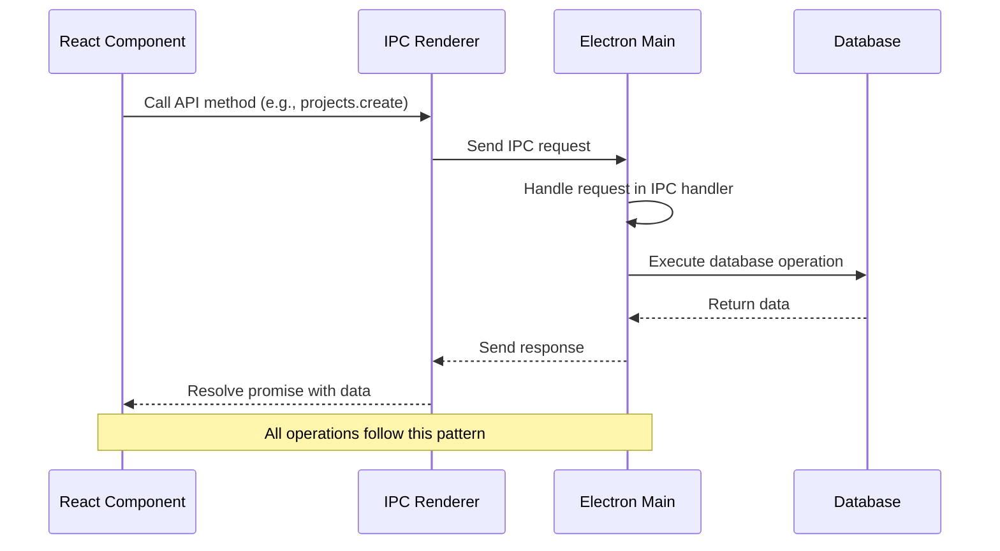

# Technology Stack

<cite>
**Referenced Files in This Document**   
- [package.json](file://package.json)
- [vite.config.ts](file://configs/vite.config.ts)
- [tsup.config.ts](file://configs/tsup.config.ts)
- [tsconfig.json](file://tsconfig.json)
- [src/main/index.ts](file://src/main/index.ts)
- [src/server/mcp-server.ts](file://src/server/mcp-server.ts)
- [src/renderer/App.tsx](file://src/renderer/App.tsx)
- [src/database/init.ts](file://src/database/init.ts)
- [src/main/ipc/projects.ts](file://src/main/ipc/projects.ts)
- [src/database/projectsRepo.ts](file://src/database/projectsRepo.ts)
- [src/store/tasks.ts](file://src/store/tasks.ts)
- [src/common/types.ts](file://src/common/types.ts)
- [src/database/habitsSchema.ts](file://src/database/habitsSchema.ts)
- [src/database/notebookSchema.ts](file://src/database/notebookSchema.ts)
- [src/database/qaSchema.ts](file://src/database/qaSchema.ts)
</cite>

## Table of Contents
1. [Core Frameworks and Libraries](#core-frameworks-and-libraries)
2. [Development and Build Tools](#development-and-build-tools)
3. [Technology Integration Workflow](#technology-integration-workflow)
4. [Version Compatibility and Dependency Management](#version-compatibility-and-dependency-management)
5. [Extending the Technology Stack](#extending-the-technology-stack)
6. [Architecture Overview](#architecture-overview)
7. [Data Flow Diagram](#data-flow-diagram)

## Core Frameworks and Libraries

The LifeOS application leverages a modern technology stack that combines desktop, frontend, backend, and database technologies to create a robust personal productivity platform. Each component serves a specific purpose in the overall architecture.

### Electron (Desktop Shell)
Electron provides the foundation for LifeOS as a cross-platform desktop application. It enables the application to run natively on Windows, macOS, and Linux while leveraging web technologies for the user interface. The main process, defined in `src/main/index.ts`, manages the application lifecycle, creates browser windows, handles system events, and bridges communication between the frontend and backend systems.

Electron's IPC (Inter-Process Communication) system is central to LifeOS's architecture, allowing secure communication between the renderer process (UI) and main process (application logic). This separation ensures security while enabling access to native operating system features.

**Section sources**
- [src/main/index.ts](file://src/main/index.ts#L1-L110)
- [package.json](file://package.json#L4-L7)

### React (UI Framework)
React serves as the UI framework for LifeOS, providing a component-based architecture for building the user interface. The application uses React 18 with React Router for navigation between different views such as Dashboard, Kanban, Notebook, and Settings. Components are organized in `src/renderer/components` and pages in `src/renderer/pages`, following a modular structure that promotes reusability and maintainability.

The application leverages React's state management capabilities through a combination of React's built-in hooks and Zustand for global state management, particularly for data that needs to be shared across multiple components.

**Section sources**
- [src/renderer/App.tsx](file://src/renderer/App.tsx#L1-L175)
- [package.json](file://package.json#L38-L39)

### TypeScript (Type Safety)
TypeScript is used throughout the LifeOS codebase to provide type safety and improve developer experience. The application uses TypeScript 5.4.5 with strict type checking enabled, as configured in `tsconfig.json`. This ensures that type errors are caught at compile time rather than runtime, reducing bugs and improving code quality.

Shared types are defined in `src/common/types.ts` and imported across both frontend and backend components, ensuring consistency in data structures. The use of Zod for runtime validation complements TypeScript's compile-time type checking, providing end-to-end type safety.

**Section sources**
- [tsconfig.json](file://tsconfig.json#L1-L18)
- [src/common/types.ts](file://src/common/types.ts#L1-L116)

### Express.js (MCP Server)
Express.js powers the MCP (Modular Control Plane) server, which provides a RESTful API interface for the application. Implemented in `src/server/mcp-server.ts`, the MCP server exposes endpoints for various modules including tasks, projects, habits, and notebooks. This architecture allows for potential integration with external tools and services in the future.

The server includes standard middleware for CORS, JSON parsing, error handling, logging, and rate limiting, ensuring robust and secure API operations. Authentication middleware is also implemented to protect endpoints, with the potential for extending security features.

**Section sources**
- [src/server/mcp-server.ts](file://src/server/mcp-server.ts#L1-L79)
- [package.json](file://package.json#L36-L37)

### better-sqlite3 (Database)
better-sqlite3 is used as the embedded database solution for LifeOS, providing a high-performance, reliable data storage system. Unlike traditional SQLite wrappers, better-sqlite3 is a native Node.js module that offers synchronous API calls, resulting in better performance and simpler code.

The database schema is initialized and managed in `src/database/init.ts`, with individual schema definitions for different modules (habits, notebook, QA) implemented as separate functions. The database stores all application data including projects, tasks, habits, notes, and configuration settings, with foreign key constraints and indexes optimized for query performance.

**Section sources**
- [src/database/init.ts](file://src/database/init.ts#L1-L143)
- [src/database/habitsSchema.ts](file://src/database/habitsSchema.ts#L1-L38)
- [src/database/notebookSchema.ts](file://src/database/notebookSchema.ts#L1-L51)
- [src/database/qaSchema.ts](file://src/database/qaSchema.ts#L1-L71)
- [package.json](file://package.json#L35)

## Development and Build Tools

### Vite (Frontend Bundler)
Vite is used as the frontend bundler for the LifeOS renderer process, providing a fast development experience with hot module replacement (HMR). Configured in `vite.config.ts`, Vite serves the React application during development and bundles it for production.

The configuration sets the root directory to `src/renderer`, uses the `@vitejs/plugin-react` plugin for React support, and defines aliases for `@renderer` and `@common` paths to simplify imports. The development server runs on port 5173, as specified in the Vite configuration.

**Section sources**
- [vite.config.ts](file://configs/vite.config.ts#L1-L23)
- [package.json](file://package.json#L22-L23)

### tsup (TypeScript Bundler)
tsup is used to bundle TypeScript files for the main process, preload scripts, and MCP server. Unlike traditional bundlers, tsup is designed specifically for TypeScript projects and provides a zero-configuration experience with sensible defaults.

The configuration in `tsup.config.ts` specifies multiple entry points for IPC handlers, sets the target to Node.js 18, and excludes Electron and better-sqlite3 from bundling since they are external dependencies. This approach ensures that the bundled code is optimized for the Node.js environment while maintaining compatibility with Electron.

**Section sources**
- [tsup.config.ts](file://configs/tsup.config.ts#L1-L30)
- [package.json](file://package.json#L55)

### electron-builder (Packaging)
electron-builder is responsible for packaging the LifeOS application into distributable formats for different platforms. Configured in the `build` section of `package.json`, it generates installers for Windows (NSIS and portable), macOS (DMG and zip), and Linux (AppImage and deb).

The configuration includes platform-specific settings such as app icons, categories, and installer options. The postinstall script ensures that native dependencies are properly installed, and the dist script orchestrates the complete build process before packaging.

**Section sources**
- [package.json](file://package.json#L10-L76)

## Technology Integration Workflow

The LifeOS technology stack components work together through a well-defined development and runtime workflow. During development, multiple processes run concurrently:

1. Vite serves the React frontend with hot reloading
2. TypeScript compiles the main process code in watch mode
3. Electron loads the application, connecting to the Vite development server

This workflow is orchestrated by the `dev` script in `package.json`, which uses `concurrently` to run multiple commands in parallel and `wait-on` to ensure the Vite server is ready before launching Electron.

In production, the build process follows a specific sequence:
1. Icons are converted and prepared
2. The renderer is built using Vite
3. The main process, preload scripts, and MCP server are bundled using tsup
4. electron-builder packages the complete application

This integration ensures that developers can work efficiently during development while producing optimized, production-ready builds.

**Section sources**
- [package.json](file://package.json#L19-L34)

## Version Compatibility and Dependency Management

LifeOS maintains careful version control of its dependencies to ensure stability and compatibility. The package.json file specifies exact versions for production dependencies and caret ranges for development dependencies, balancing stability with the ability to receive security updates.

Key version considerations include:
- Electron 28.2.0, which provides support for modern Chrome and Node.js versions
- React 18.3.1, leveraging concurrent rendering features
- TypeScript 5.4.5, using modern type system features
- Node.js 18, as specified in the tsup configuration, ensuring compatibility with Electron's Node.js version

The project uses npm for dependency management, with package-lock.json ensuring reproducible builds. Development dependencies are carefully selected to avoid bloat while providing necessary tooling.

**Section sources**
- [package.json](file://package.json#L35-L56)
- [tsup.config.ts](file://configs/tsup.config.ts#L20)

## Extending the Technology Stack

When extending the LifeOS technology stack with additional libraries, several guidelines should be followed to maintain performance and security:

1. **Performance Considerations**: New dependencies should be evaluated for their bundle size impact, especially for the renderer process. Libraries should be tree-shakable and not introduce unnecessary polyfills.

2. **Security Practices**: All external dependencies should be regularly audited for vulnerabilities using npm audit. Libraries with known security issues or abandoned maintenance should be avoided.

3. **Type Safety**: Preferred libraries should have TypeScript type definitions either built-in or available through @types packages to maintain the project's type safety standards.

4. **Electron Compatibility**: Libraries must be compatible with Electron's security model, particularly regarding context isolation and nodeIntegration settings.

5. **License Compliance**: All dependencies must have compatible open-source licenses, with MIT and similar permissive licenses preferred.

The current stack demonstrates extensibility through its modular design, with separate schema files for different features and clearly defined IPC handlers that can be extended without affecting existing functionality.

**Section sources**
- [package.json](file://package.json)
- [src/database/habitsSchema.ts](file://src/database/habitsSchema.ts)
- [src/main/ipc/projects.ts](file://src/main/ipc/projects.ts)

## Architecture Overview

The LifeOS application follows a multi-process architecture enabled by Electron, with clear separation of concerns between different components.

```mermaid
graph TB
subgraph "Renderer Process"
A[React UI] --> B[Vite]
B --> C[TypeScript]
C --> D[Zustand State]
D --> E[IPC Renderer API]
end
subgraph "Main Process"
F[Electron Main] --> G[IPC Handlers]
G --> H[Database]
G --> I[MCP Server]
H --> J[better-sqlite3]
I --> K[Express.js]
end
E < --> G
K --> L[External Clients]
style A fill:#4CAF50,stroke:#388E3C
style F fill:#2196F3,stroke:#1976D2
style J fill:#FF9800,stroke:#F57C00
style K fill:#9C27B0,stroke:#7B1FA2
```

**Diagram sources**
- [src/main/index.ts](file://src/main/index.ts)
- [src/renderer/App.tsx](file://src/renderer/App.tsx)
- [src/server/mcp-server.ts](file://src/server/mcp-server.ts)
- [src/database/init.ts](file://src/database/init.ts)

**Section sources**
- [src/main/index.ts](file://src/main/index.ts)
- [src/renderer/App.tsx](file://src/renderer/App.tsx)

## Data Flow Diagram

The data flow in LifeOS follows a consistent pattern across all modules, with standardized communication between the UI, IPC layer, and data storage.



**Diagram sources**
- [src/renderer/App.tsx](file://src/renderer/App.tsx#L100-L120)
- [src/main/ipc/projects.ts](file://src/main/ipc/projects.ts#L1-L83)
- [src/database/projectsRepo.ts](file://src/database/projectsRepo.ts#L1-L147)

**Section sources**
- [src/renderer/App.tsx](file://src/renderer/App.tsx)
- [src/main/ipc/projects.ts](file://src/main/ipc/projects.ts)
- [src/database/projectsRepo.ts](file://src/database/projectsRepo.ts)