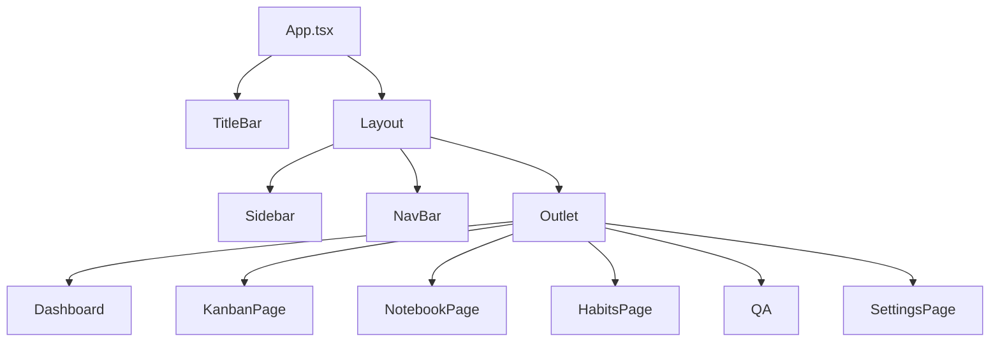
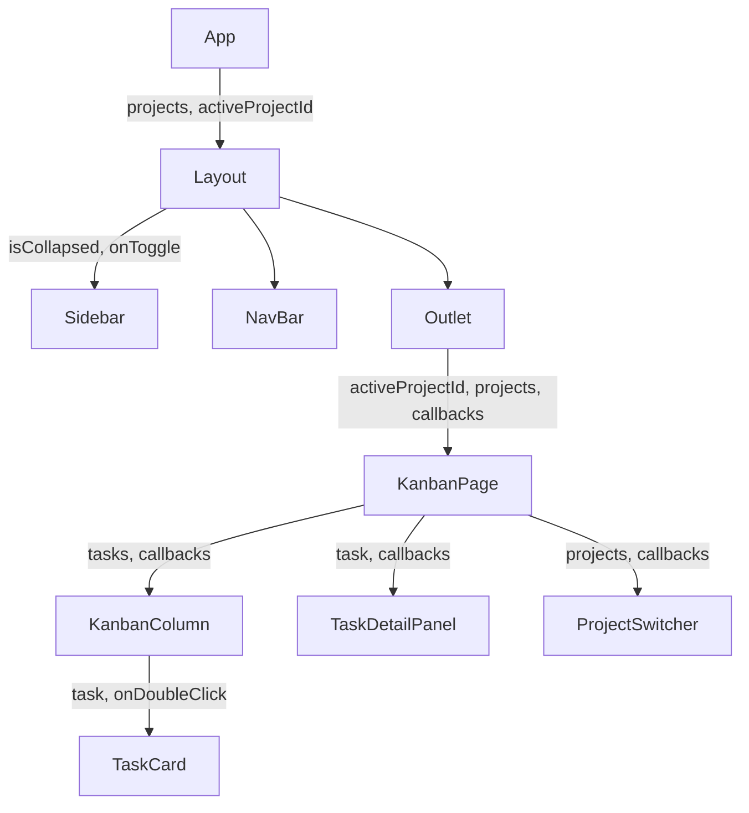
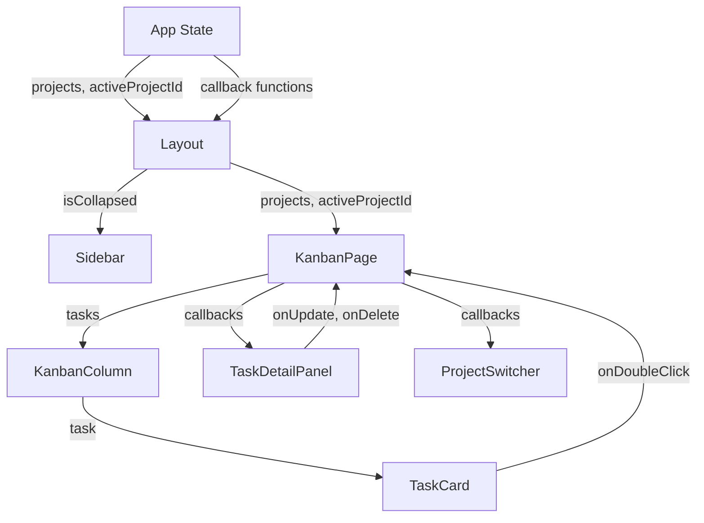
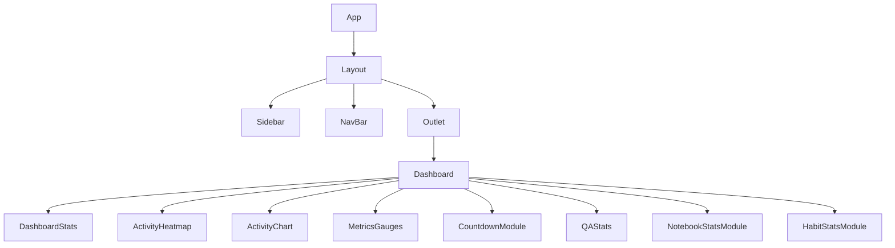
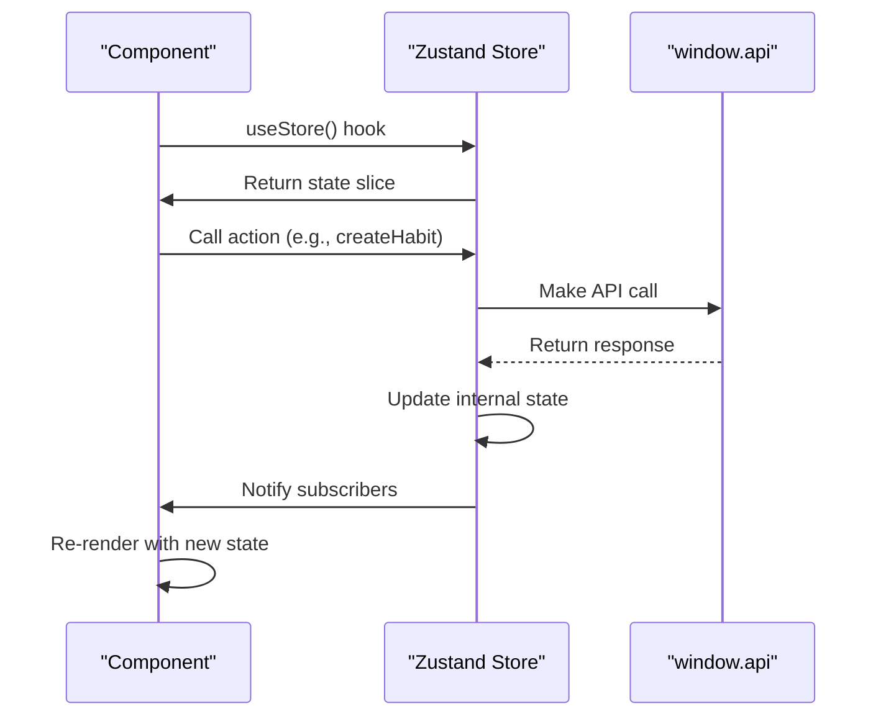
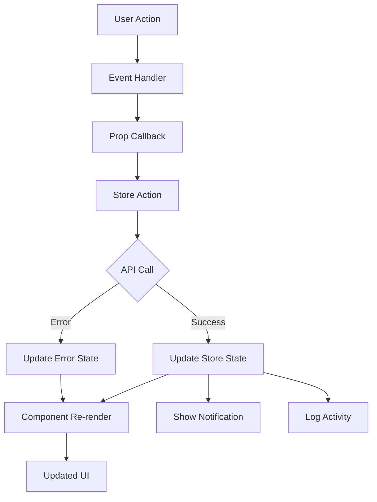
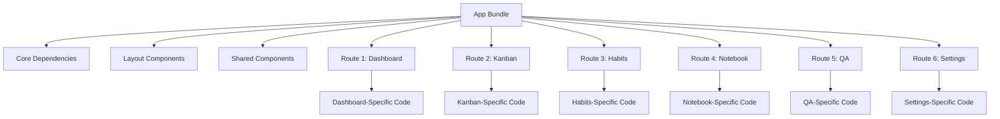

# Component Architecture

<cite>
**Referenced Files in This Document**   
- [App.tsx](file://src/renderer/App.tsx)
- [Dashboard.tsx](file://src/renderer/pages/Dashboard.tsx)
- [KanbanPage.tsx](file://src/renderer/pages/KanbanPage.tsx)
- [HabitsPage.tsx](file://src/renderer/pages/HabitsPage.tsx)
- [TaskCard.tsx](file://src/renderer/components/TaskCard.tsx)
- [KanbanColumn.tsx](file://src/renderer/components/KanbanColumn.tsx)
- [Sidebar.tsx](file://src/renderer/components/Sidebar.tsx)
- [NavBar.tsx](file://src/renderer/components/NavBar.tsx)
- [ProjectSwitcher.tsx](file://src/renderer/components/ProjectSwitcher.tsx)
- [TaskDetailPanel.tsx](file://src/renderer/components/TaskDetailPanel.tsx)
- [habits.ts](file://src/store/habits.ts)
- [tasks.ts](file://src/store/tasks.ts)
- [types.ts](file://src/common/types.ts)
</cite>

## Table of Contents
1. [Component Hierarchy Overview](#component-hierarchy-overview)
2. [Core Component Relationships](#core-component-relationships)
3. [Props System and State Management](#props-system-and-state-management)
4. [Component Composition Patterns](#component-composition-patterns)
5. [Data Flow from Zustand Stores](#data-flow-from-zustand-stores)
6. [User Action State Updates](#user-action-state-updates)
7. [Code Splitting and Lazy Loading](#code-splitting-and-lazy-loading)

## Component Hierarchy Overview

The LifeOS application follows a hierarchical component structure with App.tsx serving as the root component that orchestrates the entire application layout and routing. The component tree begins with App.tsx which contains the primary layout structure including the TitleBar, Sidebar, and NavBar components, while managing project state and theme configuration.

The application implements a clear parent-child relationship pattern where App.tsx acts as the container component that passes down essential state and callback functions to page-level components through props. The routing system using HashRouter establishes the main navigation structure, with each route corresponding to a specific page component: Dashboard, KanbanPage, NotebookPage, HabitsPage, QA, and SettingsPage.

Each page component serves as a specialized container for its respective functionality, composed of multiple reusable UI components that handle specific visual and interactive elements. This hierarchical approach enables separation of concerns, where higher-level components manage state and data flow while lower-level components focus on presentation and user interaction.

**Diagram sources**
- [App.tsx](file://src/renderer/App.tsx#L1-L175)

**Section sources**
- [App.tsx](file://src/renderer/App.tsx#L1-L175)

## Core Component Relationships

The LifeOS component architecture demonstrates a well-defined relationship between container components and presentational components. The App component serves as the top-level container that manages application-wide state including projects, active project selection, and theme configuration. It passes this state down to page components through props, establishing a clear data flow from parent to child.

Page components like Dashboard, KanbanPage, and HabitsPage act as intermediate containers that fetch and manage data specific to their domain while composing multiple reusable UI components. For example, the KanbanPage component manages task state for the active project and passes relevant data and callback functions to KanbanColumn and TaskCard components.

The Sidebar component illustrates the pattern of prop drilling, where navigation state and interaction handlers are passed from App.tsx through the Layout component to Sidebar. This component uses React Router's NavLink for navigation state management and receives the isCollapsed prop along with the onToggle callback function to manage its collapsed state.

Reusable UI components such as TaskCard, KanbanColumn, and ProjectSwitcher follow the presentational component pattern, focusing on rendering UI elements based on the props they receive without managing significant internal state. These components are designed to be composable and reusable across different parts of the application.

**Diagram sources**
- [App.tsx](file://src/renderer/App.tsx#L1-L175)
- [KanbanPage.tsx](file://src/renderer/pages/KanbanPage.tsx#L1-L520)
- [TaskCard.tsx](file://src/renderer/components/TaskCard.tsx#L1-L182)
- [KanbanColumn.tsx](file://src/renderer/components/KanbanColumn.tsx#L1-L104)
- [ProjectSwitcher.tsx](file://src/renderer/components/ProjectSwitcher.tsx#L1-L326)

**Section sources**
- [App.tsx](file://src/renderer/App.tsx#L1-L175)
- [KanbanPage.tsx](file://src/renderer/pages/KanbanPage.tsx#L1-L520)
- [TaskCard.tsx](file://src/renderer/components/TaskCard.tsx#L1-L182)
- [KanbanColumn.tsx](file://src/renderer/components/KanbanColumn.tsx#L1-L104)
- [ProjectSwitcher.tsx](file://src/renderer/components/ProjectSwitcher.tsx#L1-L326)

## Props System and State Lifting Patterns

The LifeOS application employs a comprehensive props system that facilitates data flow from parent to child components while implementing state lifting patterns to maintain a single source of truth. The App component exemplifies state lifting by managing project-related state (projects, activeProjectId) and lifting callback functions for project creation, deletion, and selection to the top level, where they can be passed down to multiple child components that need to interact with project data.

The props system follows a consistent pattern where container components pass down both data and action functions to presentational components. For example, the KanbanPage component receives project-related props (activeProjectId, projects, onSelectProject, onCreateProject, onDeleteProject) from App.tsx and then passes relevant subsets of these props to its child components like ProjectSwitcher and individual Kanban columns.

TypeScript interfaces are used extensively to define prop contracts, ensuring type safety throughout the component hierarchy. The LayoutProps interface in App.tsx clearly defines the expected props for the Layout component, while child components like ProjectSwitcher define their own specific prop interfaces that extend the application's core types from common/types.ts.

The application also demonstrates the render props pattern in components like TaskDetailPanel, which receives callback functions (onUpdate, onDelete) as props that are called when specific user actions occur. This pattern enables child components to communicate state changes back to their parents without maintaining their own state persistence logic.

**Diagram sources**
- [App.tsx](file://src/renderer/App.tsx#L1-L175)
- [KanbanPage.tsx](file://src/renderer/pages/KanbanPage.tsx#L1-L520)
- [TaskCard.tsx](file://src/renderer/components/TaskCard.tsx#L1-L182)
- [TaskDetailPanel.tsx](file://src/renderer/components/TaskDetailPanel.tsx#L1-L606)
- [ProjectSwitcher.tsx](file://src/renderer/components/ProjectSwitcher.tsx#L1-L326)

**Section sources**
- [App.tsx](file://src/renderer/App.tsx#L1-L175)
- [KanbanPage.tsx](file://src/renderer/pages/KanbanPage.tsx#L1-L520)
- [TaskCard.tsx](file://src/renderer/components/TaskCard.tsx#L1-L182)
- [TaskDetailPanel.tsx](file://src/renderer/components/TaskDetailPanel.tsx#L1-L606)
- [ProjectSwitcher.tsx](file://src/renderer/components/ProjectSwitcher.tsx#L1-L326)

## Component Composition Strategies

LifeOS employs several effective component composition strategies to create a maintainable and scalable UI architecture. The application follows the container/presentational pattern, where container components like App, Dashboard, and KanbanPage are responsible for data fetching and state management, while presentational components like TaskCard, KanbanColumn, and DashboardStats focus solely on rendering UI based on props.

The composition strategy emphasizes reusability and single responsibility. Components are designed to do one thing well and be composed together to create more complex interfaces. For example, the Dashboard component composes multiple specialized statistic components (DashboardStats, MetricsGauges, QAStats, etc.) that each handle a specific type of data visualization.

Higher-order component patterns are evident in the use of React Router components like HashRouter, Routes, and Route, which provide routing functionality through composition rather than inheritance. The Outlet component is used strategically to define where nested routes should be rendered, enabling nested layout structures.

The application also demonstrates effective use of component composition for complex interactive elements. The Kanban board is composed of KanbanColumn components, each of which contains multiple TaskCard components, creating a hierarchical structure that mirrors the data model. The drag-and-drop functionality is implemented through composition with @dnd-kit components, where DndContext, useDroppable, and useSortable are composed to create an interactive Kanban interface.

**Diagram sources**
- [App.tsx](file://src/renderer/App.tsx#L1-L175)
- [Dashboard.tsx](file://src/renderer/pages/Dashboard.tsx#L1-L237)

**Section sources**
- [App.tsx](file://src/renderer/App.tsx#L1-L175)
- [Dashboard.tsx](file://src/renderer/pages/Dashboard.tsx#L1-L237)

## Data Flow from Zustand Stores

The LifeOS application implements a robust state management system using Zustand stores that follow a unidirectional data flow pattern. The application has multiple specialized stores in the src/store directory, including habits.ts, tasks.ts, activity.ts, projects.ts, and theme.ts, each responsible for managing a specific domain of application state.

Data flows from these stores to components through custom hooks that subscribe to store state. Components use these hooks to access state and receive updates when the state changes. For example, the HabitsPage component uses the useHabits hook from src/store/habits.ts to access habit-related state and actions, while the Dashboard component uses useActivityStore to access activity data.

The store pattern follows the principle of separating state logic from component logic, with each store encapsulating both state and the actions that can modify that state. The stores use the window.api interface to communicate with the backend, handling API calls and updating state based on the responses. When an API call succeeds, the store updates its state, which automatically triggers re-renders in all subscribed components.

The data flow is optimized to minimize unnecessary re-renders by using Zustand's selector functionality. Components can subscribe to specific slices of state rather than the entire store, ensuring they only re-render when the specific data they depend on changes. This is evident in components like Dashboard which uses selectors to extract specific statistics from the activity store rather than consuming the entire state.

**Diagram sources**
- [habits.ts](file://src/store/habits.ts#L1-L161)
- [tasks.ts](file://src/store/tasks.ts#L1-L133)
- [HabitsPage.tsx](file://src/renderer/pages/HabitsPage.tsx#L1-L299)

**Section sources**
- [habits.ts](file://src/store/habits.ts#L1-L161)
- [tasks.ts](file://src/store/tasks.ts#L1-L133)
- [HabitsPage.tsx](file://src/renderer/pages/HabitsPage.tsx#L1-L299)

## User Action State Updates

The LifeOS application implements a consistent pattern for handling user actions and updating state across the component hierarchy. User interactions trigger a well-defined flow where event handlers in presentational components call action functions passed down as props, which in turn dispatch state updates through Zustand stores.

The state update flow follows a predictable pattern: user interaction → event handler → store action → API call → state update → component re-render. For example, when a user creates a new task in the Kanban board, the KanbanColumn component calls the handleCreateTask function passed as a prop, which then calls the createTask action in the tasks store. This action makes an API call to create the task on the backend and updates the local store state upon success.

Error handling is integrated into the state update process, with stores catching errors from API calls and updating error state that can be displayed by components. The application also implements optimistic updates in some cases, such as when reordering tasks in the Kanban board, where the UI is updated immediately and then synchronized with the backend.

The notification system is tightly integrated with state updates, with successful actions triggering notifications through window.api.notification.show(). This provides user feedback while keeping the notification logic separate from the core state management. The activity logging system also integrates with state updates, with store actions calling pushActivity on the activity store to record user actions in the activity log.

**Diagram sources**
- [KanbanPage.tsx](file://src/renderer/pages/KanbanPage.tsx#L1-L520)
- [tasks.ts](file://src/store/tasks.ts#L1-L133)
- [TaskCard.tsx](file://src/renderer/components/TaskCard.tsx#L1-L182)

**Section sources**
- [KanbanPage.tsx](file://src/renderer/pages/KanbanPage.tsx#L1-L520)
- [tasks.ts](file://src/store/tasks.ts#L1-L133)
- [TaskCard.tsx](file://src/renderer/components/TaskCard.tsx#L1-L182)

## Code Splitting and Lazy Loading

The LifeOS application implements code splitting and lazy loading strategies to optimize performance and reduce initial bundle size. While the current implementation does not explicitly use React.lazy() for route-based code splitting, the architecture is organized in a way that supports this optimization pattern.

The application's file structure separates components by feature and type, with distinct directories for pages, components, and stores, making it straightforward to implement route-based code splitting. Each page component (Dashboard, KanbanPage, HabitsPage, etc.) is self-contained and could be easily loaded on-demand when the user navigates to that route.

The use of Zustand stores contributes to efficient code splitting by separating state logic from component logic, allowing stores to be imported independently of the components that use them. This modular architecture enables tree-shaking, where unused code can be eliminated during the build process.

The build configuration in vite.config.ts and tsup.config.ts likely includes code splitting optimizations, though the specific configuration details are not available in the provided context. The application's dependency on React 18 suggests that it can leverage React's built-in support for Suspense and lazy loading for more advanced code splitting scenarios.

The component architecture also supports dynamic import patterns for heavy dependencies. For example, the MDEditor component used in TaskDetailPanel could be loaded dynamically when the panel is opened, rather than at application startup, further optimizing initial load performance.

**Diagram sources**
- [App.tsx](file://src/renderer/App.tsx#L1-L175)
- [Dashboard.tsx](file://src/renderer/pages/Dashboard.tsx#L1-L237)
- [KanbanPage.tsx](file://src/renderer/pages/KanbanPage.tsx#L1-L520)
- [HabitsPage.tsx](file://src/renderer/pages/HabitsPage.tsx#L1-L299)

**Section sources**
- [App.tsx](file://src/renderer/App.tsx#L1-L175)
- [Dashboard.tsx](file://src/renderer/pages/Dashboard.tsx#L1-L237)
- [KanbanPage.tsx](file://src/renderer/pages/KanbanPage.tsx#L1-L520)
- [HabitsPage.tsx](file://src/renderer/pages/HabitsPage.tsx#L1-L299)