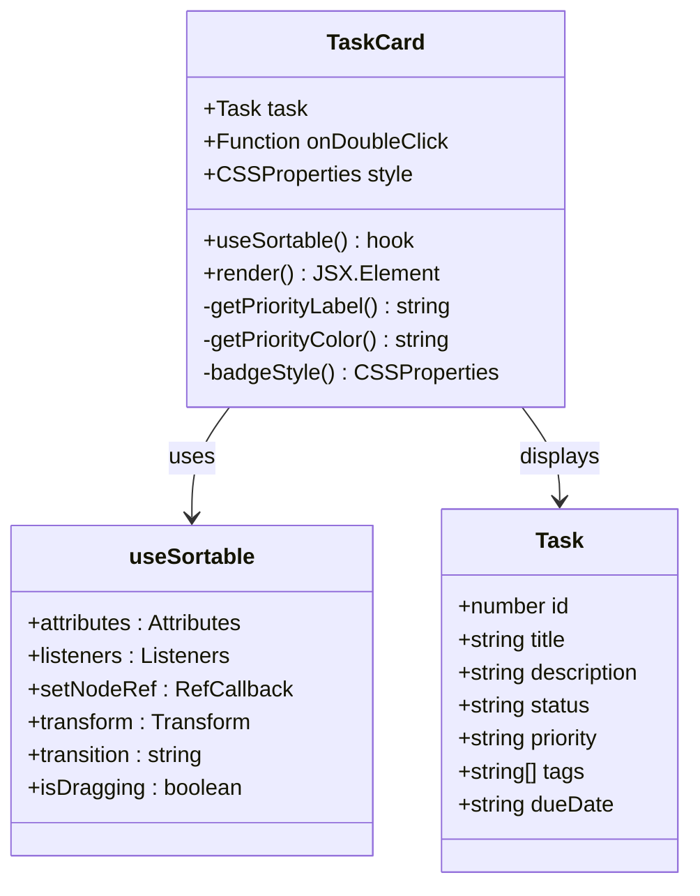
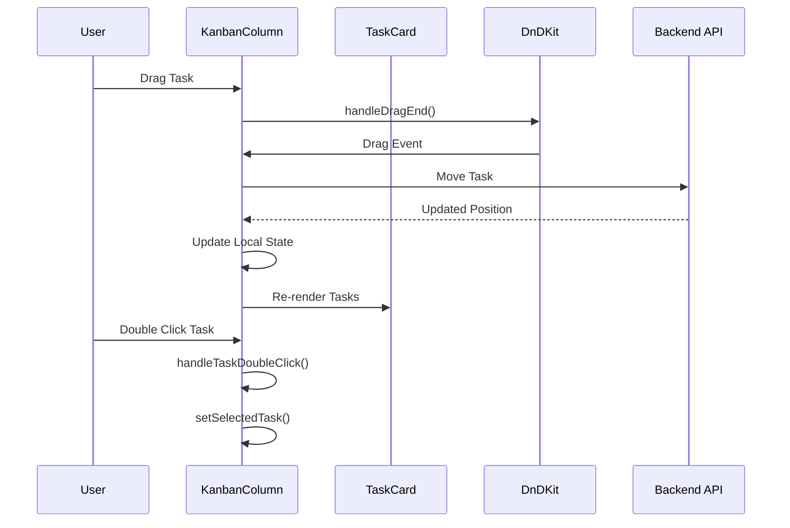
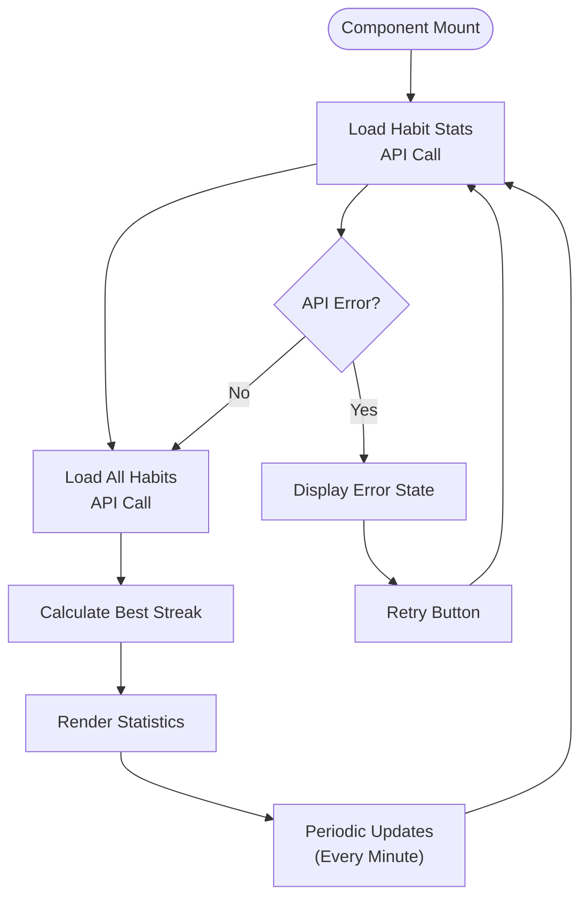
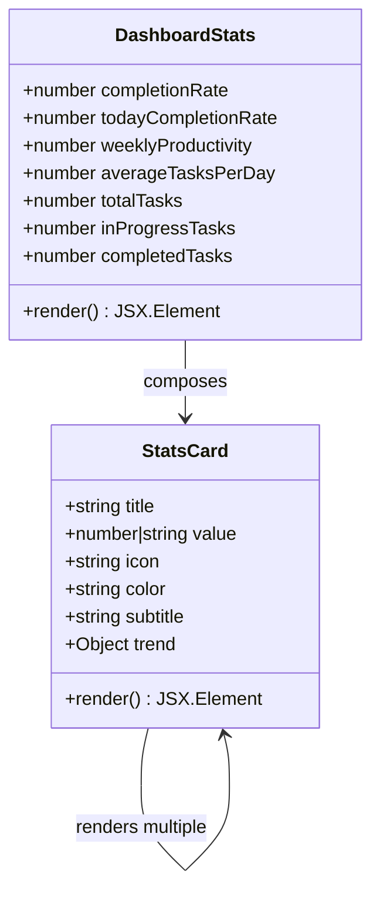
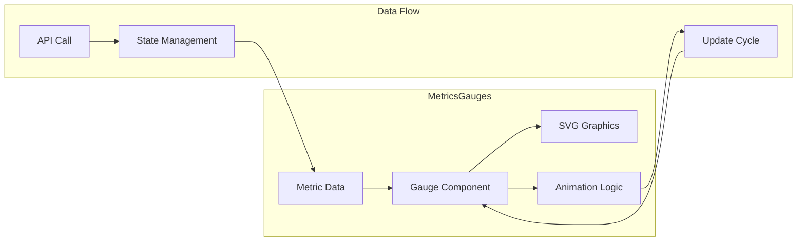
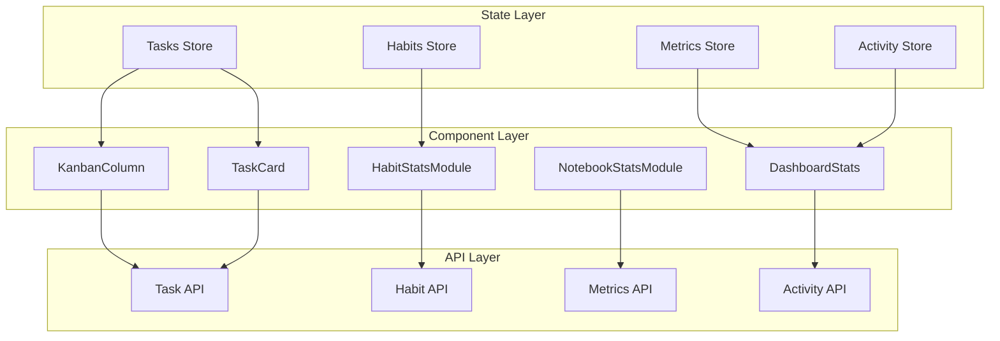

# Component Composition

<cite>
**Referenced Files in This Document**
- [TaskCard.tsx](file://src/renderer/components/TaskCard.tsx)
- [KanbanColumn.tsx](file://src/renderer/components/KanbanColumn.tsx)
- [HabitStatsModule.tsx](file://src/renderer/components/HabitStatsModule.tsx)
- [NotebookStatsModule.tsx](file://src/renderer/components/NotebookStatsModule.tsx)
- [DashboardStats.tsx](file://src/renderer/components/DashboardStats.tsx)
- [MetricsGauges.tsx](file://src/renderer/components/MetricsGauges.tsx)
- [ActivityChart.tsx](file://src/renderer/components/ActivityChart.tsx)
- [ActivityHeatmap.tsx](file://src/renderer/components/ActivityHeatmap.tsx)
- [types.ts](file://src/common/types.ts)
- [tasks.ts](file://src/store/tasks.ts)
- [habits.ts](file://src/store/habits.ts)
- [KanbanPage.tsx](file://src/renderer/pages/KanbanPage.tsx)
- [Dashboard.tsx](file://src/renderer/pages/Dashboard.tsx)
- [constants.ts](file://src/renderer/constants.ts)
</cite>

## Table of Contents
1. [Introduction](#introduction)
2. [Higher-Order Components Architecture](#higher-order-components-architecture)
3. [Drag-and-Drop Task Management](#drag-and-drop-task-management)
4. [Statistics and Analytics Modules](#statistics-and-analytics-modules)
5. [Metrics Visualization Components](#metrics-visualization-components)
6. [Data Flow and State Management](#data-flow-and-state-management)
7. [Performance Optimization Strategies](#performance-optimization-strategies)
8. [Integration Patterns](#integration-patterns)
9. [Best Practices](#best-practices)
10. [Troubleshooting Guide](#troubleshooting-guide)

## Introduction

LifeOS employs a sophisticated component composition architecture that emphasizes reusability, performance, and maintainability. The system leverages React's component model combined with advanced state management patterns to create a cohesive data visualization and interaction ecosystem. This architecture centers around several key design patterns: higher-order components for complex behaviors, modular statistics modules for analytics presentation, and specialized visualization components for performance data.

The component composition strategy focuses on encapsulating complex behaviors while maintaining clean separation of concerns. Each component serves a specific purpose while contributing to the overall user experience through consistent styling, responsive interactions, and efficient data handling.

## Higher-Order Components Architecture

### TaskCard Component Design

The TaskCard component exemplifies the higher-order component pattern by encapsulating complex drag-and-drop functionality through the @dnd-kit/core library. This component demonstrates advanced React patterns including custom hooks, memoization, and dynamic styling.

**Diagram sources**
- [TaskCard.tsx](file://src/renderer/components/TaskCard.tsx#L1-L182)

The TaskCard component implements several advanced patterns:

**Dynamic Styling with Memoization**: The component uses React's `useMemo` hook to optimize style calculations during drag operations. The transform and rotation effects are computed only when necessary, preventing unnecessary re-renders during drag transitions.

**Priority-Based Theming**: The component includes sophisticated priority classification logic that maps Eisenhower Matrix principles to visual indicators. This demonstrates how components can encapsulate business logic while maintaining presentation separation.

**Markdown Rendering**: The description field utilizes ReactMarkdown with custom component mappings, showcasing how components can integrate third-party libraries seamlessly while maintaining consistent styling.

**Section sources**
- [TaskCard.tsx](file://src/renderer/components/TaskCard.tsx#L1-L182)

### KanbanColumn Component Pattern

The KanbanColumn component demonstrates container component patterns with integrated drag-and-drop capabilities. It serves as a columnar container that manages task ordering and provides task creation functionality.

**Diagram sources**
- [KanbanColumn.tsx](file://src/renderer/components/KanbanColumn.tsx#L1-L104)
- [KanbanPage.tsx](file://src/renderer/pages/KanbanPage.tsx#L1-L520)

The KanbanColumn implements several key patterns:

**Container Pattern**: Acts as a stateful container that manages task collections and coordinates with child components. It handles both task display and task manipulation operations.

**Conditional Rendering**: Implements conditional rendering for different column types, particularly showing the task creation form only in the Backlog column.

**Event Propagation**: Demonstrates proper event handling with `stopPropagation()` to prevent event bubbling conflicts in complex UI hierarchies.

**Section sources**
- [KanbanColumn.tsx](file://src/renderer/components/KanbanColumn.tsx#L1-L104)
- [KanbanPage.tsx](file://src/renderer/pages/KanbanPage.tsx#L1-L520)

## Statistics and Analytics Modules

### HabitStatsModule Implementation

The HabitStatsModule showcases a sophisticated statistics component that aggregates data from multiple sources and presents it through a consistent interface. This component demonstrates advanced data aggregation patterns and real-time updates.

**Diagram sources**
- [HabitStatsModule.tsx](file://src/renderer/components/HabitStatsModule.tsx#L1-L170)

The HabitStatsModule implements several advanced patterns:

**Multi-API Aggregation**: The component makes two separate API calls to gather comprehensive statistics, demonstrating how components can orchestrate multiple data sources for rich presentations.

**Real-Time Updates**: Uses `setInterval` for periodic refreshes, ensuring statistics remain current without requiring manual page reloads.

**Progress Indicators**: Implements sophisticated progress visualization with gradient backgrounds and animated transitions, showcasing advanced CSS techniques.

**Fallback States**: Provides comprehensive loading and error states with retry mechanisms, demonstrating robust user experience patterns.

**Section sources**
- [HabitStatsModule.tsx](file://src/renderer/components/HabitStatsModule.tsx#L1-L170)

### NotebookStatsModule Architecture

The NotebookStatsModule follows a similar pattern but focuses on knowledge base analytics, demonstrating how the same architectural principles apply to different data domains.

**Section sources**
- [NotebookStatsModule.tsx](file://src/renderer/components/NotebookStatsModule.tsx#L1-L132)

### DashboardStats Composition

The DashboardStats component demonstrates a composite pattern where individual StatsCard components are orchestrated to create a unified dashboard interface.

**Diagram sources**
- [DashboardStats.tsx](file://src/renderer/components/DashboardStats.tsx#L1-L188)

**Section sources**
- [DashboardStats.tsx](file://src/renderer/components/DashboardStats.tsx#L1-L188)

## Metrics Visualization Components

### MetricsGauges Implementation

The MetricsGauges component represents the pinnacle of visual performance metrics representation, combining SVG graphics with animated transitions to create engaging user experiences.

**Diagram sources**
- [MetricsGauges.tsx](file://src/renderer/components/MetricsGauges.tsx#L1-L275)

The MetricsGauges component implements several advanced visualization patterns:

**SVG Animation**: Utilizes SVG circles with dynamic stroke-dasharray and stroke-dashoffset properties to create smooth progress animations. The animation timing uses cubic-bezier curves for natural motion.

**Status-Based Theming**: Implements intelligent color assignment based on value thresholds, providing immediate visual feedback about performance levels.

**Responsive Design**: Features adaptive layouts that work across different screen sizes while maintaining visual hierarchy and readability.

**Error Handling**: Comprehensive error states with retry functionality demonstrate production-ready component resilience.

**Section sources**
- [MetricsGauges.tsx](file://src/renderer/components/MetricsGauges.tsx#L1-L275)

### Activity Visualization Components

The ActivityChart and ActivityHeatmap components demonstrate complementary approaches to temporal data visualization, each serving different analytical purposes.

**Section sources**
- [ActivityChart.tsx](file://src/renderer/components/ActivityChart.tsx#L1-L230)
- [ActivityHeatmap.tsx](file://src/renderer/components/ActivityHeatmap.tsx#L1-L266)

## Data Flow and State Management

### Zustand Store Integration

LifeOS employs a centralized state management approach using Zustand stores that provide reactive data binding to components. The architecture demonstrates how higher-order components can integrate with global state management systems.

**Diagram sources**
- [tasks.ts](file://src/store/tasks.ts#L1-L133)
- [habits.ts](file://src/store/habits.ts#L1-L161)
- [KanbanPage.tsx](file://src/renderer/pages/KanbanPage.tsx#L1-L520)
- [Dashboard.tsx](file://src/renderer/pages/Dashboard.tsx#L1-L237)

### Reactive Data Patterns

The system implements several reactive data patterns:

**Selector Functions**: Components use selector functions to subscribe to specific state slices, minimizing unnecessary re-renders and optimizing performance.

**Optimistic Updates**: The Kanban system implements optimistic UI updates where the interface immediately reflects user actions while the backend processes occur asynchronously.

**Error Boundaries**: Comprehensive error handling ensures that component failures don't cascade throughout the application.

**Section sources**
- [tasks.ts](file://src/store/tasks.ts#L1-L133)
- [habits.ts](file://src/store/habits.ts#L1-L161)
- [KanbanPage.tsx](file://src/renderer/pages/KanbanPage.tsx#L1-L520)

## Performance Optimization Strategies

### Memoization Patterns

LifeOS implements sophisticated memoization strategies to optimize component performance, particularly for frequently updated components.

**React.memo Usage**: Higher-order components utilize React.memo for shallow comparison optimization, preventing unnecessary re-renders when props remain unchanged.

**useMemo Hooks**: Critical computations are wrapped in useMemo to cache results across render cycles, particularly for expensive calculations like style transformations and data aggregations.

**useCallback Optimization**: Event handlers are memoized to prevent function recreation on every render, reducing memory pressure and improving performance.

### Rendering Optimization

**Virtual Scrolling**: Large lists are handled through virtual scrolling techniques to maintain performance with thousands of items.

**Conditional Rendering**: Components implement strategic conditional rendering to minimize DOM overhead for infrequently accessed features.

**Lazy Loading**: Non-critical components are loaded on-demand to improve initial page load performance.

### Memory Management

**Cleanup Functions**: Effect cleanup functions prevent memory leaks in long-running components, particularly those with timers and event listeners.

**Reference Management**: Careful management of DOM references and callback references prevents memory accumulation over time.

## Integration Patterns

### Parent-Child Communication

Components demonstrate sophisticated communication patterns between parent and child components:

**Prop Drilling Prevention**: Higher-order components implement context-like patterns through prop passing to avoid deep nesting while maintaining data flow.

**Event Callbacks**: Well-defined event callback interfaces enable loose coupling between components while preserving functionality.

**State Synchronization**: Components maintain synchronization through both local state and global store integration, providing flexibility for different use cases.

### Cross-Component Coordination

**Shared Constants**: The system uses shared constants (like KanbanStatus types) to ensure consistency across components without tight coupling.

**Standardized Interfaces**: Consistent prop interfaces across similar components (like StatsCard variants) enable easy substitution and extension.

**Event Bus Patterns**: While not using explicit event buses, components coordinate through shared state and callback patterns.

## Best Practices

### Component Design Principles

**Single Responsibility**: Each component serves a single, well-defined purpose, making them easier to test and maintain.

**Composition Over Inheritance**: Components are composed from smaller, reusable pieces rather than inheriting behavior.

**Type Safety**: Comprehensive TypeScript interfaces ensure compile-time safety and better developer experience.

### Performance Guidelines

**Render Optimization**: Components are designed to minimize render cycles through careful state management and selective re-rendering.

**Bundle Size Awareness**: Import optimization ensures that components only load necessary dependencies.

**Accessibility**: Components include proper ARIA labels and keyboard navigation support.

### Testing Strategies

**Unit Testing**: Components are designed to be easily testable through pure function patterns and minimal external dependencies.

**Integration Testing**: Higher-order components are tested in realistic scenarios to ensure proper integration with the broader system.

**Visual Regression Testing**: Critical components undergo visual regression testing to maintain design consistency.

## Troubleshooting Guide

### Common Issues and Solutions

**Drag-and-Drop Performance**: Slow drag performance typically indicates excessive re-renders in draggable components. Solution: Apply React.memo and optimize style calculations.

**Memory Leaks**: Components holding onto references after unmounting cause memory leaks. Solution: Implement proper cleanup in useEffect return functions.

**State Synchronization**: Components falling out of sync with global state. Solution: Verify selector functions and ensure proper subscription patterns.

**API Integration**: Components failing to receive data updates. Solution: Check API endpoint implementations and error handling patterns.

### Debugging Strategies

**Console Logging**: Strategic console logging helps identify when components are rendering unnecessarily.

**React DevTools**: Component profiling through React DevTools reveals performance bottlenecks and render patterns.

**Network Monitoring**: API call monitoring ensures proper data flow and identifies connectivity issues.

**State Inspection**: Global state inspection helps identify synchronization problems between components.

The Component Composition architecture in LifeOS demonstrates how modern React applications can achieve sophisticated functionality through well-designed, reusable components. By focusing on higher-order components for complex behaviors, modular statistics for analytics, and specialized visualizations for performance data, the system creates a cohesive and maintainable codebase that scales effectively with application growth.