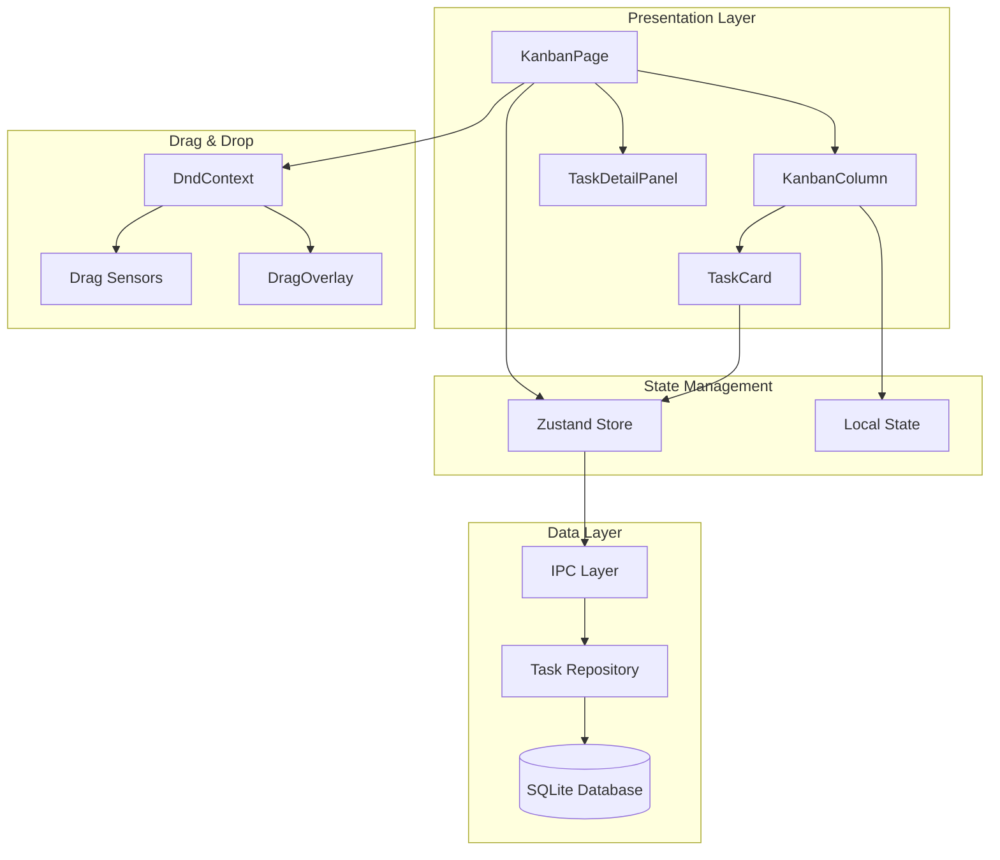
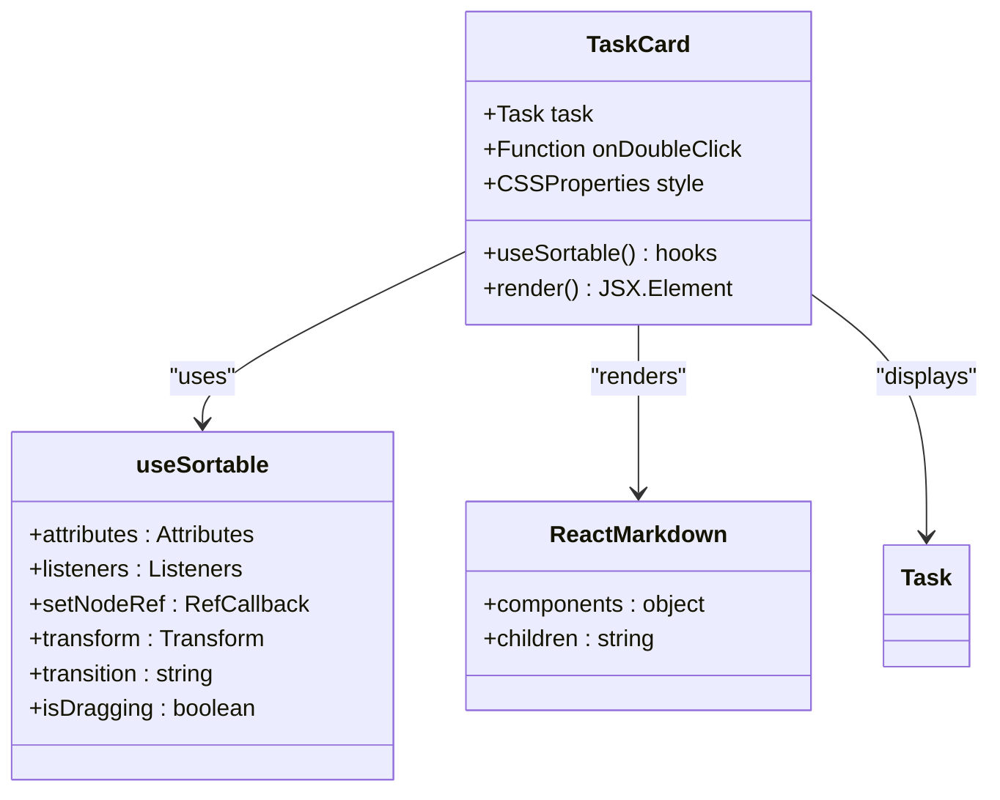
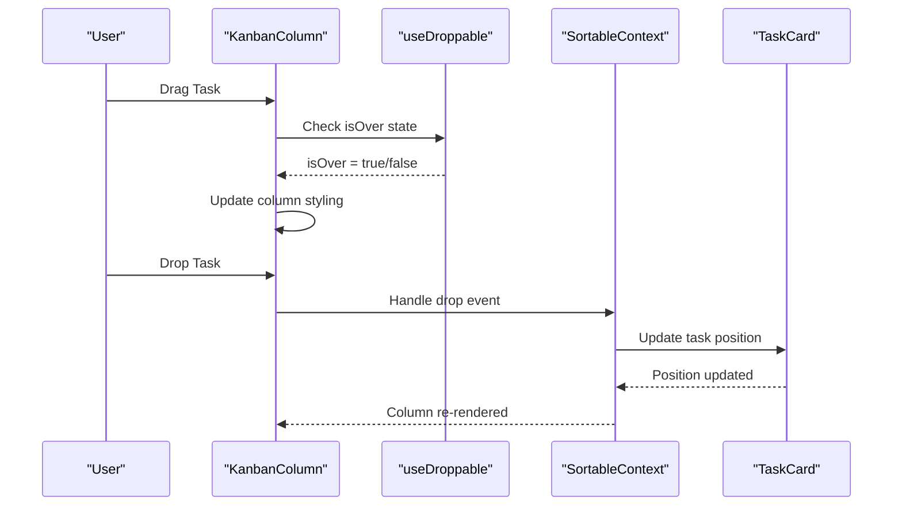
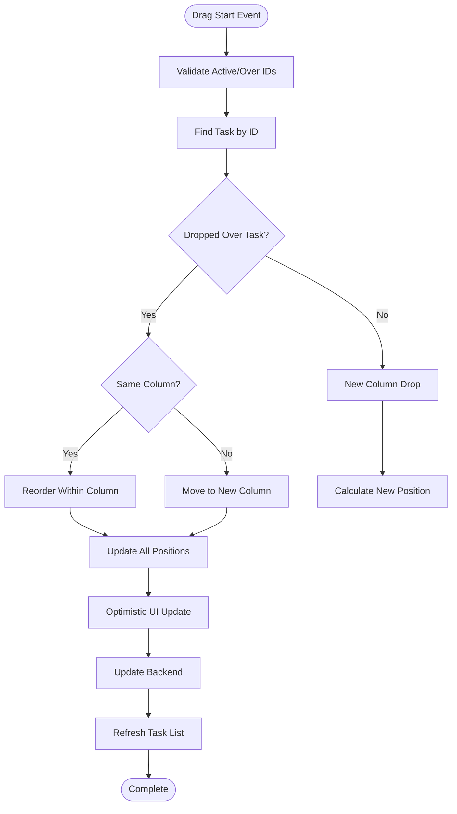
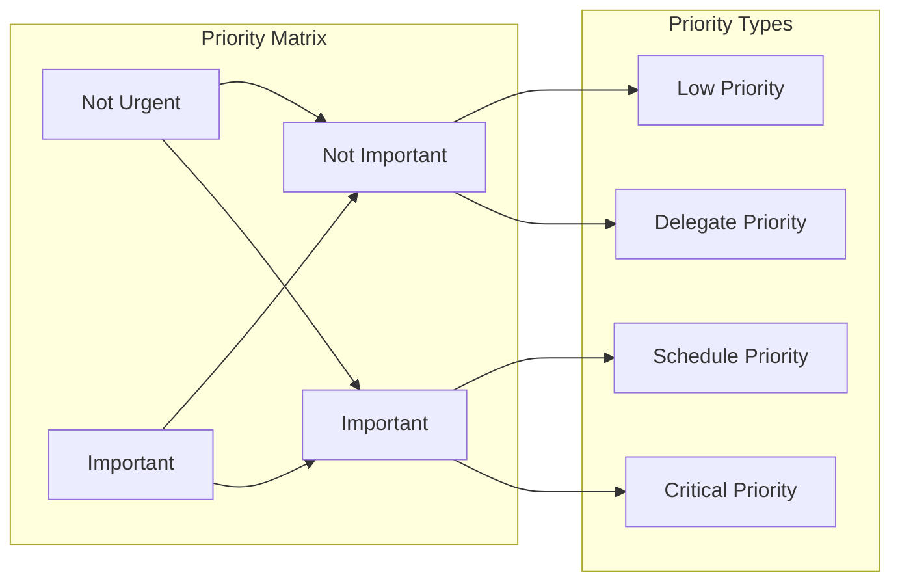
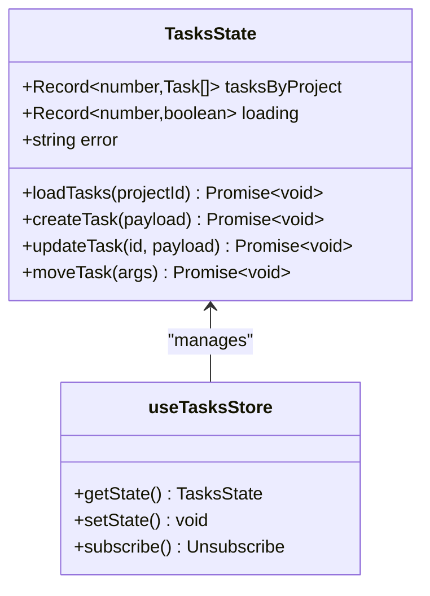

# Interaction Components

<cite>
**Referenced Files in This Document**
- [TaskCard.tsx](file://src/renderer/components/TaskCard.tsx)
- [KanbanColumn.tsx](file://src/renderer/components/KanbanColumn.tsx)
- [KanbanPage.tsx](file://src/renderer/pages/KanbanPage.tsx)
- [TaskDetailPanel.tsx](file://src/renderer/components/TaskDetailPanel.tsx)
- [tasks.ts](file://src/store/tasks.ts)
- [tasksRepo.ts](file://src/database/tasksRepo.ts)
- [tasks.ts](file://src/main/ipc/tasks.ts)
- [types.ts](file://src/common/types.ts)
- [constants.ts](file://src/renderer/constants.ts)
</cite>

## Table of Contents
1. [Introduction](#introduction)
2. [Architecture Overview](#architecture-overview)
3. [TaskCard Component](#taskcard-component)
4. [KanbanColumn Component](#kanbancolumn-component)
5. [KanbanPage Integration](#kanbanpage-integration)
6. [Drag-and-Drop Implementation](#drag-and-drop-implementation)
7. [Task Management Features](#task-management-features)
8. [State Management](#state-management)
9. [Performance Optimization](#performance-optimization)
10. [Accessibility Considerations](#accessibility-considerations)
11. [Integration Patterns](#integration-patterns)
12. [Troubleshooting Guide](#troubleshooting-guide)

## Introduction

LifeOS implements a sophisticated task management system built around a Kanban board interface with advanced drag-and-drop functionality. The system combines React's declarative UI approach with @dnd-kit for smooth, performant drag-and-drop interactions, while leveraging Zustand for state management and Electron's IPC layer for cross-process communication.

The interaction components provide seamless task manipulation capabilities, real-time collaboration features, and intuitive visual feedback during drag operations. The system supports rich text editing through ReactMarkdown, priority-based task organization using the Eisenhower Matrix, and comprehensive task lifecycle management from creation to completion.

## Architecture Overview

The interaction system follows a layered architecture pattern with clear separation of concerns:

**Diagram sources**
- [KanbanPage.tsx](file://src/renderer/pages/KanbanPage.tsx#L1-L520)
- [KanbanColumn.tsx](file://src/renderer/components/KanbanColumn.tsx#L1-L104)
- [TaskCard.tsx](file://src/renderer/components/TaskCard.tsx#L1-L182)
- [tasks.ts](file://src/store/tasks.ts#L1-L133)

## TaskCard Component

The TaskCard component serves as the primary interactive element for individual tasks within the Kanban system. It implements sophisticated drag-and-drop behavior using @dnd-kit's useSortable hook, providing smooth visual feedback and transform animations during drag operations.

### Core Implementation

The TaskCard leverages the useSortable hook to integrate seamlessly with the drag-and-drop system:

**Diagram sources**
- [TaskCard.tsx](file://src/renderer/components/TaskCard.tsx#L10-L30)

### Transform and Transition Styling

The TaskCard implements sophisticated visual feedback during drag operations through carefully crafted CSS transformations:

The component calculates dynamic styles based on drag state, applying smooth transforms only when dragging occurs. The transform calculation includes both translation and rotation effects for enhanced visual feedback:

- **Translation**: Uses CSS.Translate.toString() for precise positioning
- **Rotation**: Adds a subtle 3-degree rotation to indicate drag momentum
- **Opacity Control**: Completely hides the original card during drag to prevent ghost effects
- **Visibility Management**: Sets visibility to hidden during drag operations

### Rich Text Rendering

Task descriptions utilize ReactMarkdown for rich text support with custom component mappings:

The ReactMarkdown implementation provides comprehensive formatting support including:
- **Headers and Paragraphs**: Standard Markdown formatting
- **Emphasis and Strong Text**: Color-coded styling for emphasis
- **Code Blocks**: Monospace font with background highlighting
- **Lists**: Inline formatting for both ordered and unordered lists
- **Links**: Automatic link detection and styling

**Section sources**
- [TaskCard.tsx](file://src/renderer/components/TaskCard.tsx#L1-L182)

## KanbanColumn Component

The KanbanColumn component manages individual columns within the Kanban board, implementing both drag-and-drop functionality and task creation capabilities. It serves as a container that orchestrates task ordering and provides column-specific interaction features.

### Droppable Implementation

The KanbanColumn utilizes @dnd-kit's useDroppable hook to enable task dropping:

**Diagram sources**
- [KanbanColumn.tsx](file://src/renderer/components/KanbanColumn.tsx#L15-L25)

### State Management for Task Creation

The KanbanColumn maintains internal state for task creation forms:

- **Draft Title**: Local state for new task title input
- **Submit State**: Loading state during task creation
- **Conditional Rendering**: Task creation form only appears in the 'Backlog' column

### Task Ordering Integration

The component integrates with SortableContext to enable vertical sorting within columns:

The SortableContext provides:
- **Vertical List Strategy**: Proper sorting behavior for column tasks
- **Item Identification**: Maps task IDs to sortable identifiers
- **Drag Constraints**: Prevents invalid drag operations

**Section sources**
- [KanbanColumn.tsx](file://src/renderer/components/KanbanColumn.tsx#L1-L104)

## KanbanPage Integration

The KanbanPage serves as the main orchestrator for the entire task management system, coordinating drag-and-drop operations, task lifecycle management, and user interactions across the board.

### Drag-and-Drop Coordination

The KanbanPage implements comprehensive drag-and-drop handling through DndContext:

**Diagram sources**
- [KanbanPage.tsx](file://src/renderer/pages/KanbanPage.tsx#L250-L350)

### Task Lifecycle Management

The KanbanPage handles comprehensive task lifecycle operations:

- **Task Creation**: Creates new tasks with automatic positioning
- **Task Updates**: Handles title, description, and metadata changes
- **Task Deletion**: Soft deletion with archive functionality
- **Task Movement**: Cross-column task repositioning
- **Task Restoration**: Brings archived tasks back to active columns

### Project Integration

The page integrates with the ProjectSwitcher to provide project-based task isolation:

- **Active Project Tracking**: Maintains current project context
- **Task Filtering**: Shows only tasks belonging to the active project
- **Cross-Project Navigation**: Seamless switching between projects

**Section sources**
- [KanbanPage.tsx](file://src/renderer/pages/KanbanPage.tsx#L1-L520)

## Drag-and-Drop Implementation

The drag-and-drop system in LifeOS provides smooth, responsive task manipulation with sophisticated visual feedback and performance optimizations.

### Sensor Configuration

The system uses PointerSensor with custom activation constraints:

- **Distance Threshold**: 8 pixels before drag starts to prevent accidental drags
- **Touch Support**: Full touch device compatibility
- **Multi-touch Prevention**: Single-pointer drag operations only

### Collision Detection

The system employs closestCenter collision detection for precise drop target identification:

- **Center-Based Detection**: Drops to nearest center point
- **Smooth Transitions**: Fluid movement between columns
- **Visual Feedback**: Real-time column highlighting during drag

### Drag Overlay Implementation

The DragOverlay component provides enhanced visual feedback:

- **Transform Animation**: 3-degree rotation during drag
- **Shadow Effects**: Subtle shadow for depth perception
- **Cursor Feedback**: Grabbing cursor during drag operations
- **Optimization**: Disabled drop animation for performance

**Section sources**
- [KanbanPage.tsx](file://src/renderer/pages/KanbanPage.tsx#L220-L230)

## Task Management Features

LifeOS provides comprehensive task management capabilities integrated with the drag-and-drop system.

### Priority System Integration

Tasks utilize the Eisenhower Matrix for priority classification:

**Diagram sources**
- [TaskCard.tsx](file://src/renderer/components/TaskCard.tsx#L120-L180)

### Rich Text Editing

Task descriptions support comprehensive Markdown formatting:

- **Header Levels**: H1-H6 with automatic styling
- **Text Formatting**: Bold, italic, strikethrough
- **Code Blocks**: Syntax highlighting support
- **Lists**: Ordered and unordered with proper nesting
- **Links**: Automatic URL detection and styling

### Time Tracking Integration

The system supports comprehensive time tracking:

- **Estimation**: Planned time allocation for tasks
- **Actual Tracking**: Real-time time logging
- **Duration Calculation**: Automatic time difference computation
- **Reporting**: Time-based analytics and insights

**Section sources**
- [TaskDetailPanel.tsx](file://src/renderer/components/TaskDetailPanel.tsx#L1-L606)

## State Management

LifeOS implements a hybrid state management approach combining local React state with global Zustand stores.

### Zustand Store Architecture

The tasks store provides centralized task management:

**Diagram sources**
- [tasks.ts](file://src/store/tasks.ts#L5-L25)

### Optimistic Updates

The system implements optimistic updates for improved user experience:

- **Immediate UI Response**: Visual changes before backend confirmation
- **Rollback Capability**: Automatic reversal on failure
- **Consistency Checks**: Final synchronization with backend
- **Conflict Resolution**: Handles concurrent modifications gracefully

### IPC Layer Integration

The state management integrates with Electron's IPC for cross-process communication:

- **Asynchronous Operations**: Non-blocking backend calls
- **Error Propagation**: Comprehensive error handling
- **Type Safety**: Strongly typed IPC interfaces
- **Performance Monitoring**: Operation timing and metrics

**Section sources**
- [tasks.ts](file://src/store/tasks.ts#L1-L133)
- [tasks.ts](file://src/main/ipc/tasks.ts#L1-L37)

## Performance Optimization

LifeOS implements several performance optimization strategies for smooth drag-and-drop interactions.

### Memoization Strategies

The system employs strategic memoization to prevent unnecessary re-renders:

- **CSS Properties**: useMemo for expensive style calculations
- **Task Sorting**: Memoized sorting operations
- **Priority Calculations**: Cached priority determination
- **Markdown Rendering**: Optimized ReactMarkdown component usage

### Virtual Scrolling

Large task lists benefit from virtual scrolling optimizations:

- **Viewport Awareness**: Only renders visible tasks
- **Dynamic Heights**: Adaptive height calculation
- **Smooth Scrolling**: Hardware-accelerated scrolling
- **Memory Management**: Efficient DOM cleanup

### Debounced Operations

Critical operations use debouncing to prevent excessive API calls:

- **Task Updates**: Debounced save operations
- **Search Filtering**: Delayed search execution
- **Resize Handling**: Throttled layout recalculations
- **Scroll Events**: Optimized scroll event handling

**Section sources**
- [TaskCard.tsx](file://src/renderer/components/TaskCard.tsx#L15-L40)

## Accessibility Considerations

LifeOS prioritizes accessibility in all interaction components.

### Keyboard Navigation

The system supports comprehensive keyboard navigation:

- **Tab Order**: Logical tab sequence through interactive elements
- **Arrow Keys**: Navigate between tasks and columns
- **Enter/Space**: Activate interactive elements
- **Escape**: Cancel operations and close panels

### Screen Reader Support

Components provide full screen reader compatibility:

- **ARIA Labels**: Descriptive labels for all interactive elements
- **Role Attributes**: Proper semantic markup
- **Live Regions**: Dynamic content announcements
- **Focus Management**: Controlled focus movement

### Visual Accessibility

The system accommodates various visual needs:

- **High Contrast**: Enhanced contrast ratios
- **Font Scaling**: Responsive typography
- **Color Independence**: Information conveyed beyond color alone
- **Motion Preferences**: Reduced motion support

**Section sources**
- [TaskDetailPanel.tsx](file://src/renderer/components/TaskDetailPanel.tsx#L150-L200)

## Integration Patterns

LifeOS demonstrates sophisticated integration patterns between components and systems.

### Component Composition

The system uses composition over inheritance for flexible component design:

- **Higher-Order Components**: Reusable functionality wrappers
- **Render Props**: Flexible content rendering
- **Custom Hooks**: Shared logic extraction
- **Provider Pattern**: Context-based data sharing

### Event Handling Patterns

Consistent event handling patterns ensure predictable behavior:

- **Event Propagation**: Controlled event bubbling
- **Error Boundaries**: Graceful error handling
- **Async Operations**: Promise-based operation handling
- **Cancellation**: Abortable operations support

### Data Flow Architecture

The system implements unidirectional data flow principles:

- **Immutable Updates**: Pure state mutations
- **Centralized Stores**: Single source of truth
- **Computed Values**: Derived state management
- **Side Effects**: Controlled external interactions

**Section sources**
- [KanbanPage.tsx](file://src/renderer/pages/KanbanPage.tsx#L400-L500)

## Troubleshooting Guide

Common issues and their solutions in the interaction components.

### Drag-and-Drop Issues

**Problem**: Tasks not responding to drag operations
**Solution**: Verify DndContext wrapping and sensor configuration

**Problem**: Ghost elements appearing during drag
**Solution**: Check transform and visibility CSS properties

**Problem**: Columns not accepting drops
**Solution**: Validate useDroppable configuration and ID matching

### Performance Issues

**Problem**: Slow drag operations
**Solution**: Review memoization usage and optimize expensive calculations

**Problem**: Memory leaks during extended usage
**Solution**: Check event listener cleanup and component unmounting

**Problem**: Stuttering during animations
**Solution**: Verify hardware acceleration and CSS property optimization

### State Synchronization

**Problem**: UI not reflecting backend changes
**Solution**: Implement proper refresh mechanisms and error handling

**Problem**: Concurrent modification conflicts
**Solution**: Use optimistic updates with rollback capabilities

**Problem**: Task ordering inconsistencies
**Solution**: Validate position calculations and database synchronization

**Section sources**
- [KanbanPage.tsx](file://src/renderer/pages/KanbanPage.tsx#L350-L450)
- [tasks.ts](file://src/store/tasks.ts#L80-L133)