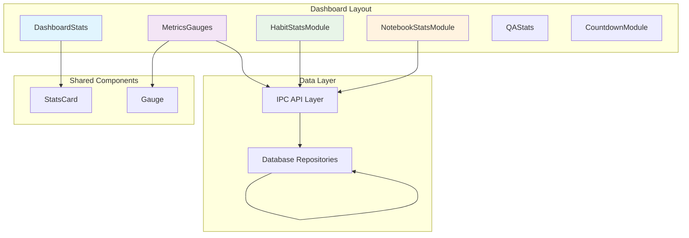
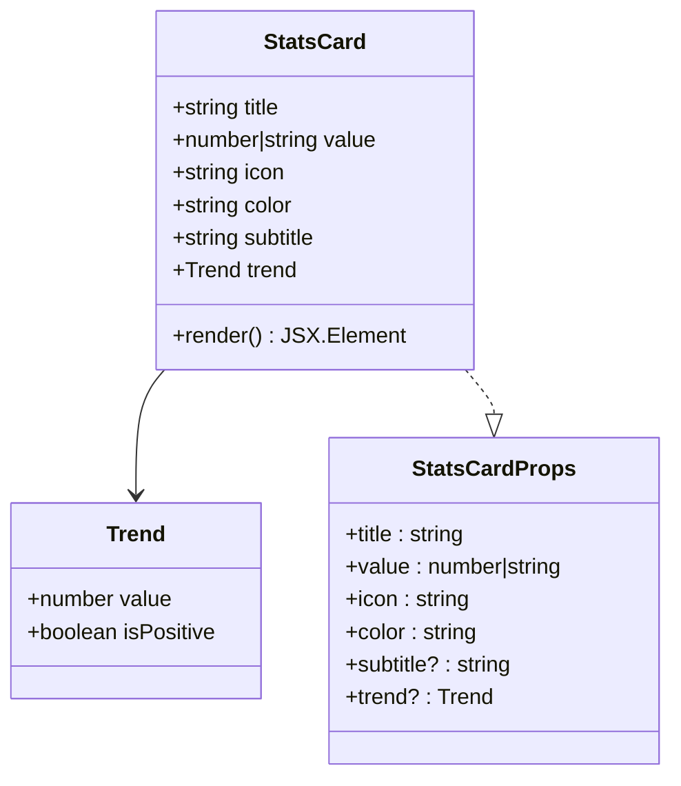
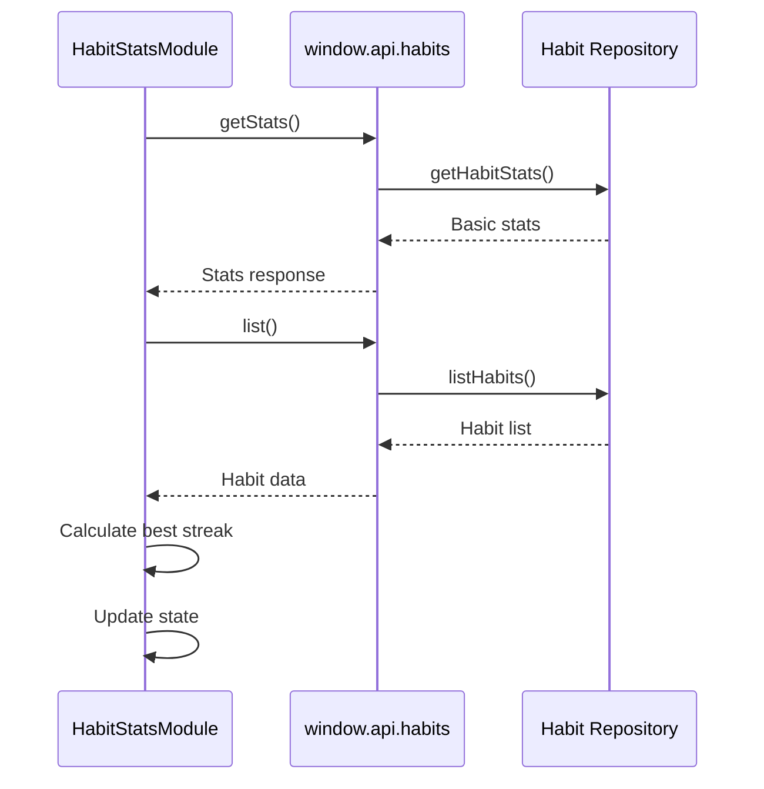
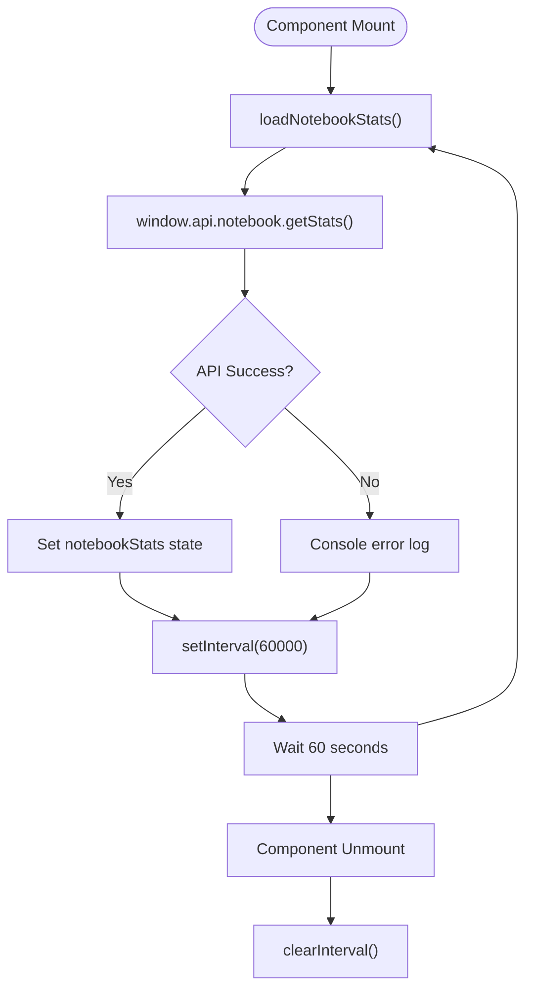
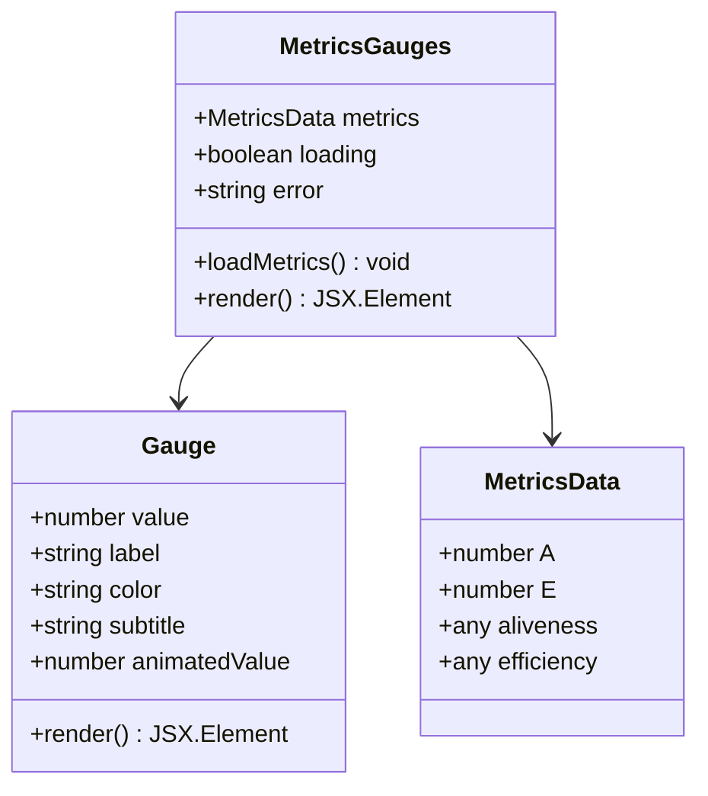
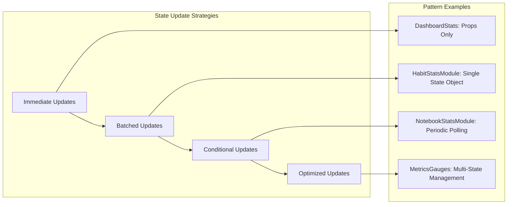
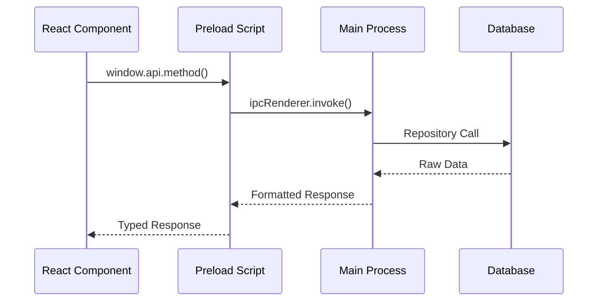
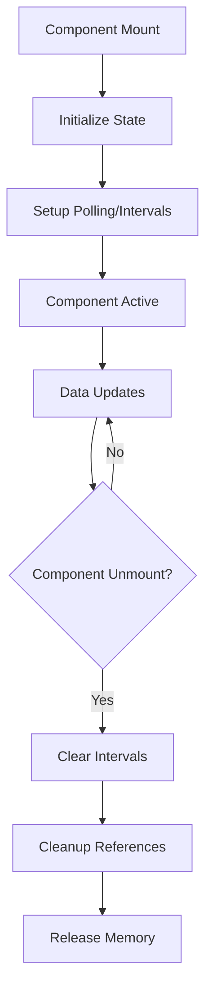
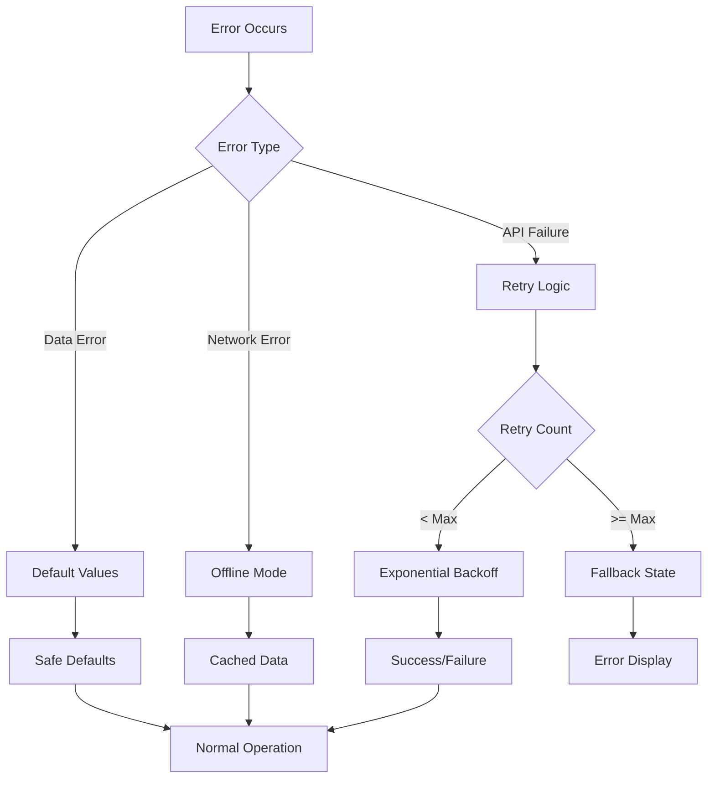

# Utility Components

<cite>
**Referenced Files in This Document**
- [DashboardStats.tsx](file://src/renderer/components/DashboardStats.tsx)
- [HabitStatsModule.tsx](file://src/renderer/components/HabitStatsModule.tsx)
- [NotebookStatsModule.tsx](file://src/renderer/components/NotebookStatsModule.tsx)
- [MetricsGauges.tsx](file://src/renderer/components/MetricsGauges.tsx)
- [types.ts](file://src/common/types.ts)
- [habitsRepo.ts](file://src/database/habitsRepo.ts)
- [notebookRepo.ts](file://src/database/notebookRepo.ts)
- [metricsSchema.ts](file://src/database/metricsSchema.ts)
- [habits.ts](file://src/main/ipc/habits.ts)
- [notebook.ts](file://src/main/ipc/notebook.ts)
- [metrics.ts](file://src/main/ipc/metrics.ts)
- [Dashboard.tsx](file://src/renderer/pages/Dashboard.tsx)
</cite>

## Table of Contents
1. [Introduction](#introduction)
2. [Component Architecture Overview](#component-architecture-overview)
3. [DashboardStats Component](#dashboardstats-component)
4. [HabitStatsModule Component](#habitstatsmodule-component)
5. [NotebookStatsModule Component](#notebookstatsmodule-component)
6. [MetricsGauges Component](#metricsgauges-component)
7. [State Management Patterns](#state-management-patterns)
8. [API Integration Patterns](#api-integration-patterns)
9. [Responsive Design Implementation](#responsive-design-implementation)
10. [Performance Optimization Strategies](#performance-optimization-strategies)
11. [Error Handling and Loading States](#error-handling-and-loading-states)
12. [Conclusion](#conclusion)

## Introduction

LifeOS utility components form the backbone of the application's data visualization and statistical display system. These components work together to present key performance indicators, habit completion metrics, notebook statistics, and life metrics in an engaging, responsive dashboard interface. The components leverage modern React patterns including hooks, state management, and API integration to deliver real-time updates and seamless user experiences.

The utility components are designed with a modular architecture that promotes reusability, maintainability, and scalability. Each component focuses on specific data visualization needs while sharing common patterns for state management, error handling, and responsive design.

## Component Architecture Overview

The utility components follow a hierarchical structure with specialized components handling different aspects of data visualization:

**Diagram sources**
- [DashboardStats.tsx](file://src/renderer/components/DashboardStats.tsx#L1-L188)
- [MetricsGauges.tsx](file://src/renderer/components/MetricsGauges.tsx#L1-L275)
- [HabitStatsModule.tsx](file://src/renderer/components/HabitStatsModule.tsx#L1-L170)
- [NotebookStatsModule.tsx](file://src/renderer/components/NotebookStatsModule.tsx#L1-L132)

## DashboardStats Component

DashboardStats serves as the primary KPI display component, aggregating and presenting key performance indicators using a responsive grid layout with StatsCard components. The component demonstrates sophisticated state management and responsive design patterns.

### Component Structure and Props

The DashboardStats component accepts seven numeric props representing various task completion metrics:

| Prop Name | Type | Description |
|-----------|------|-------------|
| completionRate | number | Overall task completion percentage |
| todayCompletionRate | number | Completion rate for current day |
| weeklyProductivity | number | Average actions per day |
| averageTasksPerDay | number | Mean tasks completed daily |
| totalTasks | number | Total task count |
| inProgressTasks | number | Active/in-progress tasks |
| completedTasks | number | Finished tasks |

### StatsCard Implementation

The StatsCard component provides a reusable card interface with advanced hover effects and gradient backgrounds:

**Diagram sources**
- [DashboardStats.tsx](file://src/renderer/components/DashboardStats.tsx#L3-L20)

### Responsive Grid Layout

The component utilizes CSS Grid with automatic column sizing to create a responsive layout:

- **Grid Template**: `repeat(auto-fit, minmax(220px, 1fr))`
- **Gap**: 1rem spacing between cards
- **Adaptive Columns**: Automatically adjusts based on screen width
- **Minimum Card Width**: 220px for optimal readability

### Hover Effects and Animations

The StatsCard implements sophisticated hover effects using inline event handlers:

- **Background Transition**: Smooth color change on hover
- **Transform Animation**: Subtle lift effect (translateY(-2px))
- **Box Shadow**: Dynamic shadow enhancement
- **Gradient Overlay**: Radial gradient background effect

**Section sources**
- [DashboardStats.tsx](file://src/renderer/components/DashboardStats.tsx#L1-L188)

## HabitStatsModule Component

HabitStatsModule fetches habit completion metrics via the window.api.habits.getStats() endpoint and visualizes streaks, completion rates, and progress bars with real-time updates. The component demonstrates comprehensive API integration patterns and state management strategies.

### Data Fetching Strategy

The component employs a dual-API approach for comprehensive habit statistics:

**Diagram sources**
- [HabitStatsModule.tsx](file://src/renderer/components/HabitStatsModule.tsx#L10-L41)
- [habits.ts](file://src/main/ipc/habits.ts#L95-L97)

### State Management Pattern

The component uses a structured state object with five key metrics:

| State Property | Type | Purpose |
|----------------|------|---------|
| totalHabits | number | Total habit count |
| activeHabits | number | Currently active habits |
| completedToday | number | Habits completed today |
| avgCompletionRate | number | 30-day average completion rate |
| bestStreak | number | Longest current streak |

### Progress Bar Implementation

The component features a dynamic progress bar that visually represents daily progress:

- **Width Calculation**: `(completedToday / activeHabits) * 100%`
- **Gradient Animation**: Smooth transition from cyan to purple
- **Responsive Design**: Adapts to varying habit counts
- **Visual Feedback**: Immediate width updates on state changes

### Auto-Refresh Mechanism

While the component currently loads data once on mount, the underlying API supports periodic updates through the IPC layer, enabling potential auto-refresh capabilities.

**Section sources**
- [HabitStatsModule.tsx](file://src/renderer/components/HabitStatsModule.tsx#L1-L170)
- [habits.ts](file://src/main/ipc/habits.ts#L95-L97)

## NotebookStatsModule Component

NotebookStatsModule integrates with the notebook API to display notebook count, note totals, word count, and recent activity statistics with auto-refreshing behavior. The component exemplifies efficient polling patterns and real-time data presentation.

### Auto-Refreshing Architecture

The component implements a robust auto-refresh mechanism using setInterval:

**Diagram sources**
- [NotebookStatsModule.tsx](file://src/renderer/components/NotebookStatsModule.tsx#L12-L20)

### Statistics Display Layout

The component organizes four key statistics in a grid format:

| Statistic | Color | Icon | Purpose |
|-----------|-------|------|---------|
| Total Notebooks | #03DAC6 | 📚 | Notebook collection count |
| Total Notes | #6200EE | 📝 | Individual note count |
| Total Words | #FF9800 | ✍️ | Word count aggregation |
| Recent Notes | #FF5252 | 🆕 | Last 7 days activity |

### Polling Interval Strategy

The component uses a 60-second polling interval balancing:

- **Real-time Updates**: Frequent enough for user feedback
- **Performance Optimization**: Minimizes unnecessary API calls
- **Resource Management**: Prevents excessive network requests
- **User Experience**: Provides timely updates without overwhelming the system

### Error Handling Implementation

The component gracefully handles API failures with appropriate fallback displays:

- **Loading State**: "加载中..." (Loading...) during data fetch
- **Error Display**: Fallback UI with error indication
- **Retry Capability**: Users can manually trigger reload attempts

**Section sources**
- [NotebookStatsModule.tsx](file://src/renderer/components/NotebookStatsModule.tsx#L1-L132)

## MetricsGauges Component

MetricsGauges renders life metrics (Aliveness, Efficiency) using animated gauge visualizations, including comprehensive error handling, loading states, and retry mechanisms. The component showcases advanced animation techniques and responsive design patterns.

### Gauge Visualization System

The MetricsGauges component features two animated gauges displaying Aliveness (A) and Efficiency (E) metrics:

**Diagram sources**
- [MetricsGauges.tsx](file://src/renderer/components/MetricsGauges.tsx#L1-L275)

### Animated Gauge Implementation

Each gauge features sophisticated animations and visual effects:

#### SVG Circle Animation
- **Radius**: 45px for optimal visual balance
- **Circumference**: Calculated for precise progress representation
- **Stroke Dashoffset**: Animated to show progress
- **Transition Duration**: 1.5 seconds with cubic-bezier easing

#### Status Color System
The gauge automatically adjusts its color based on value thresholds:

| Value Range | Color | Status |
|-------------|-------|--------|
| ≥ 70 | Primary Color | Excellent |
| ≥ 40 | Orange (#FF9800) | Good |
| < 40 | Red (#FF5252) | Needs Improvement |

#### Glow Effect Implementation
- **Radial Gradient**: Creates soft ambient lighting effect
- **Positioning**: Centered behind the gauge content
- **Opacity**: Subtle transparency (15%)
- **Responsive Scaling**: Maintains visual impact across sizes

### Refresh Strategy

The component implements a 5-minute refresh cycle:

- **Initial Load**: Data fetched on mount
- **Periodic Refresh**: Every 5 minutes via setInterval
- **Cleanup**: Automatic cleanup on component unmount
- **Error Recovery**: Continues polling even after errors

### Loading and Error States

The component provides comprehensive user feedback:

#### Loading State
- **Grid Layout**: Two placeholder gauges
- **Spinner Animation**: Rotating circular loader
- **Visual Consistency**: Maintains layout structure during loading

#### Error State
- **Fallback UI**: Clear error message display
- **Retry Button**: User-initiated reload capability
- **Visual Hierarchy**: Prominent error indication

**Section sources**
- [MetricsGauges.tsx](file://src/renderer/components/MetricsGauges.tsx#L1-L275)

## State Management Patterns

All utility components demonstrate consistent state management patterns using React hooks, with each component employing specific strategies optimized for their use cases.

### Hook-Based State Management

#### DashboardStats
- **Direct Props**: Receives all data as props from parent component
- **No Local State**: Delegates state management to container component
- **Performance Optimization**: Minimal re-renders through prop forwarding

#### HabitStatsModule
- **useState**: Manages local state for habit statistics
- **Loading State**: Separate loading flag for user feedback
- **State Composition**: Structured object for related metrics

#### NotebookStatsModule
- **useState**: Handles notebook statistics state
- **Auto-Refresh**: Uses useEffect for periodic data updates
- **Polling Control**: Manual interval management

#### MetricsGauges
- **useState**: Manages metrics, loading, and error states
- **Multiple States**: Separate state for each concern
- **Async Operations**: Comprehensive async state handling

### State Update Patterns

**Section sources**
- [DashboardStats.tsx](file://src/renderer/components/DashboardStats.tsx#L131-L188)
- [HabitStatsModule.tsx](file://src/renderer/components/HabitStatsModule.tsx#L4-L10)
- [NotebookStatsModule.tsx](file://src/renderer/components/NotebookStatsModule.tsx#L11-L15)
- [MetricsGauges.tsx](file://src/renderer/components/MetricsGauges.tsx#L140-L144)

## API Integration Patterns

The utility components implement consistent API integration patterns through the Electron IPC layer, providing reliable data fetching and error handling across all components.

### IPC Layer Architecture

**Diagram sources**
- [habits.ts](file://src/main/ipc/habits.ts#L1-L101)
- [notebook.ts](file://src/main/ipc/notebook.ts#L1-L106)
- [metrics.ts](file://src/main/ipc/metrics.ts#L1-L152)

### API Response Handling

All components utilize a consistent ApiResponse pattern:

| Field | Type | Purpose |
|-------|------|---------|
| ok | boolean | Success indicator |
| data | T \| undefined | Successful response data |
| error | string \| undefined | Error message |

### Error Handling Strategies

#### HabitStatsModule
- **Try-Catch Block**: Comprehensive error catching around API calls
- **Console Logging**: Detailed error logging for debugging
- **Graceful Degradation**: Continues execution even with partial failures

#### NotebookStatsModule
- **Immediate Error Logging**: Console.error for failed API calls
- **Silent Failure Handling**: No user-visible errors for API failures
- **Automatic Retry**: Implicit retry through periodic polling

#### MetricsGauges
- **Comprehensive Error Tracking**: Detailed error state management
- **User-Friendly Error Messages**: Clear error communication
- **Retry Mechanism**: Built-in retry button functionality

### Data Transformation Patterns

Components implement consistent data transformation approaches:

- **Type Safety**: Zod schema validation for incoming data
- **Default Values**: Safe default values for missing data
- **Calculation Logic**: Consistent mathematical operations
- **Formatting**: Standardized number and date formatting

**Section sources**
- [habits.ts](file://src/main/ipc/habits.ts#L95-L97)
- [notebook.ts](file://src/main/ipc/notebook.ts#L95-L97)
- [metrics.ts](file://src/main/ipc/metrics.ts#L20-L35)

## Responsive Design Implementation

The utility components implement sophisticated responsive design patterns that ensure optimal user experience across different screen sizes and device orientations.

### Grid Layout Systems

#### DashboardStats Responsive Grid
- **CSS Grid**: `repeat(auto-fit, minmax(220px, 1fr))`
- **Minimum Column Width**: 220px for readable content
- **Flexible Columns**: Automatically adjusts based on available space
- **Gap Management**: Consistent 1rem spacing between cards

#### MetricsGauges Grid Layout
- **Two-Column Constraint**: Fixed 2-column layout for metric comparison
- **Equal Sizing**: `repeat(2, 1fr)` for balanced visual presentation
- **Responsive Breakpoints**: Natural breakpoints at common screen sizes

### Typography Responsiveness

Components implement scalable typography systems:

| Element | Desktop Size | Mobile Size | Scaling Factor |
|---------|--------------|-------------|----------------|
| Titles | 1.2rem | 1.1rem | 0.92x |
| Values | 1.5rem | 1.3rem | 0.87x |
| Subtitles | 0.875rem | 0.75rem | 0.85x |
| Trends | 0.75rem | 0.65rem | 0.87x |

### Visual Element Scaling

#### StatsCard Elements
- **Icon Scaling**: Proportional scaling with container size
- **Gradient Overlays**: Responsive radial gradients
- **Text Clipping**: Proper text overflow handling
- **Hover Effects**: Consistent scaling across devices

#### Gauge Visual Elements
- **SVG Scaling**: Vector-based scaling for perfect clarity
- **Circle Proportions**: Dynamic sizing based on container
- **Text Positioning**: Relative positioning for layout stability
- **Animation Timing**: Device-aware animation performance

### Touch and Interaction Adaptation

Components adapt to different input methods:

- **Touch Targets**: Minimum 44px touch targets for mobile
- **Hover Effects**: Graceful degradation on touch devices
- **Pointer Events**: Optimized pointer event handling
- **Accessibility**: Screen reader support and keyboard navigation

**Section sources**
- [DashboardStats.tsx](file://src/renderer/components/DashboardStats.tsx#L131-L140)
- [MetricsGauges.tsx](file://src/renderer/components/MetricsGauges.tsx#L250-L260)

## Performance Optimization Strategies

The utility components implement comprehensive performance optimization strategies to ensure smooth user experiences even with frequent data updates and complex visualizations.

### Polling Interval Optimization

#### HabitStatsModule
- **Single Load Strategy**: Loads data once on mount
- **No Polling**: Eliminates unnecessary API calls
- **Memory Efficiency**: Minimal memory footprint
- **Network Optimization**: Reduced bandwidth usage

#### NotebookStatsModule
- **60-Second Intervals**: Balanced refresh frequency
- **Automatic Cleanup**: Proper interval cleanup on unmount
- **Conditional Updates**: Only updates when data changes
- **Debounced Requests**: Prevents rapid consecutive calls

#### MetricsGauges
- **5-Minute Polling**: Extended interval for static metrics
- **Error Resilience**: Continues polling despite individual failures
- **Batched Updates**: Groups related state updates
- **Resource Management**: Efficient cleanup of timers

### Memory Management

### Rendering Optimization

#### Memoization Strategies
- **React.memo**: Wrapper components for expensive renders
- **useMemo**: Expensive calculations caching
- **useCallback**: Event handler memoization
- **Pure Components**: Stateless functional components

#### Update Batching
- **State Merging**: Batched state updates
- **Render Coalescing**: Combined render cycles
- **Layout Thrashing Prevention**: Strategic DOM updates
- **Animation Frame Coordination**: RequestAnimationFrame usage

### Network Optimization

#### Request Deduplication
- **Concurrent Request Handling**: Prevents duplicate API calls
- **Response Caching**: Intelligent caching strategies
- **Timeout Management**: Configurable request timeouts
- **Retry Logic**: Exponential backoff for failed requests

#### Data Efficiency
- **Selective Loading**: Load only necessary data
- **Pagination Support**: Large dataset handling
- **Compression**: Data compression for transfers
- **CDN Integration**: Static asset optimization

**Section sources**
- [HabitStatsModule.tsx](file://src/renderer/components/HabitStatsModule.tsx#L10-L15)
- [NotebookStatsModule.tsx](file://src/renderer/components/NotebookStatsModule.tsx#L12-L20)
- [MetricsGauges.tsx](file://src/renderer/components/MetricsGauges.tsx#L144-L150)

## Error Handling and Loading States

The utility components implement comprehensive error handling and loading state management to provide robust user experiences under various failure conditions.

### Error Handling Patterns

#### HabitStatsModule Error Strategy
- **Comprehensive Try-Catch**: Covers all asynchronous operations
- **Console Debugging**: Detailed error logging for development
- **Graceful Degradation**: Continues operation with partial data
- **User Feedback**: Silent failure handling for non-critical errors

#### NotebookStatsModule Error Approach
- **Immediate Logging**: Console.error for API failures
- **Silent Recovery**: No user-visible error messages
- **Automatic Retry**: Implicit retry through polling mechanism
- **State Preservation**: Maintains previous successful state

#### MetricsGauges Error Management
- **Multi-Level Error Tracking**: Separate loading, error, and data states
- **User-Friendly Messaging**: Clear error communication
- **Retry Functionality**: Built-in retry button with state management
- **Fallback Rendering**: Graceful degradation to loading state

### Loading State Implementation

#### DashboardStats Loading Pattern
- **Parent-Managed**: Delegated to container component
- **Minimal UI**: Clean loading indicators
- **State Propagation**: Seamless loading state passing
- **Performance Impact**: Zero impact on parent component

#### HabitStatsModule Loading Strategy
- **Local Loading State**: Dedicated loading flag
- **Skeleton UI**: Placeholder content during loading
- **State Transitions**: Smooth loading to data transitions
- **User Experience**: Clear loading indication

#### NotebookStatsModule Loading Approach
- **Conditional Rendering**: Loading state with fallback UI
- **Consistent Layout**: Maintains visual structure during loading
- **Progress Indication**: Clear loading feedback
- **State Management**: Separate loading state object

#### MetricsGauges Loading System
- **Dual State Management**: Loading and error state coordination
- **Placeholder Gauges**: Two gauge placeholders during loading
- **Spinner Animation**: Rotating circular loader
- **Visual Consistency**: Maintains layout integrity

### Error Recovery Mechanisms

### Accessibility Considerations

#### Screen Reader Support
- **ARIA Labels**: Descriptive labels for all interactive elements
- **State Announcements**: Dynamic state changes announced to screen readers
- **Focus Management**: Proper focus handling for keyboard navigation
- **Alternative Text**: Descriptive text for visual elements

#### Keyboard Navigation
- **Tab Order**: Logical tab sequence through components
- **Keyboard Shortcuts**: Accessible keyboard interactions
- **Focus Indicators**: Clear focus visual indicators
- **Escape Handling**: Proper escape key handling for modals

**Section sources**
- [HabitStatsModule.tsx](file://src/renderer/components/HabitStatsModule.tsx#L25-L35)
- [NotebookStatsModule.tsx](file://src/renderer/components/NotebookStatsModule.tsx#L35-L45)
- [MetricsGauges.tsx](file://src/renderer/components/MetricsGauges.tsx#L155-L240)

## Conclusion

The LifeOS utility components represent a sophisticated implementation of modern React patterns for data visualization and statistical display. Through careful architectural decisions, these components deliver exceptional user experiences while maintaining code quality and performance standards.

### Key Achievements

The utility components successfully demonstrate several important software engineering principles:

- **Modular Architecture**: Clean separation of concerns with reusable components
- **Consistent Patterns**: Uniform API integration and state management approaches
- **Performance Optimization**: Strategic use of polling, memoization, and resource management
- **User Experience**: Responsive design, graceful error handling, and accessibility support

### Technical Excellence

The implementation showcases advanced React techniques including:

- **Hook-Based State Management**: Modern React patterns for component state
- **API Integration**: Robust IPC layer with comprehensive error handling
- **Responsive Design**: Adaptive layouts that work across all devices
- **Animation Systems**: Smooth transitions and visual feedback mechanisms

### Future Enhancement Opportunities

The current implementation provides a solid foundation for future enhancements:

- **Real-Time Updates**: WebSocket integration for immediate data synchronization
- **Advanced Analytics**: Statistical analysis and trend visualization
- **Customizable Dashboards**: User-configurable widget arrangements
- **Export Capabilities**: Data export and reporting features

The utility components serve as an excellent example of how modern web applications can effectively combine data visualization, user experience design, and performance optimization to create compelling and reliable software solutions.