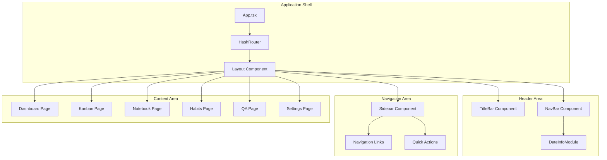
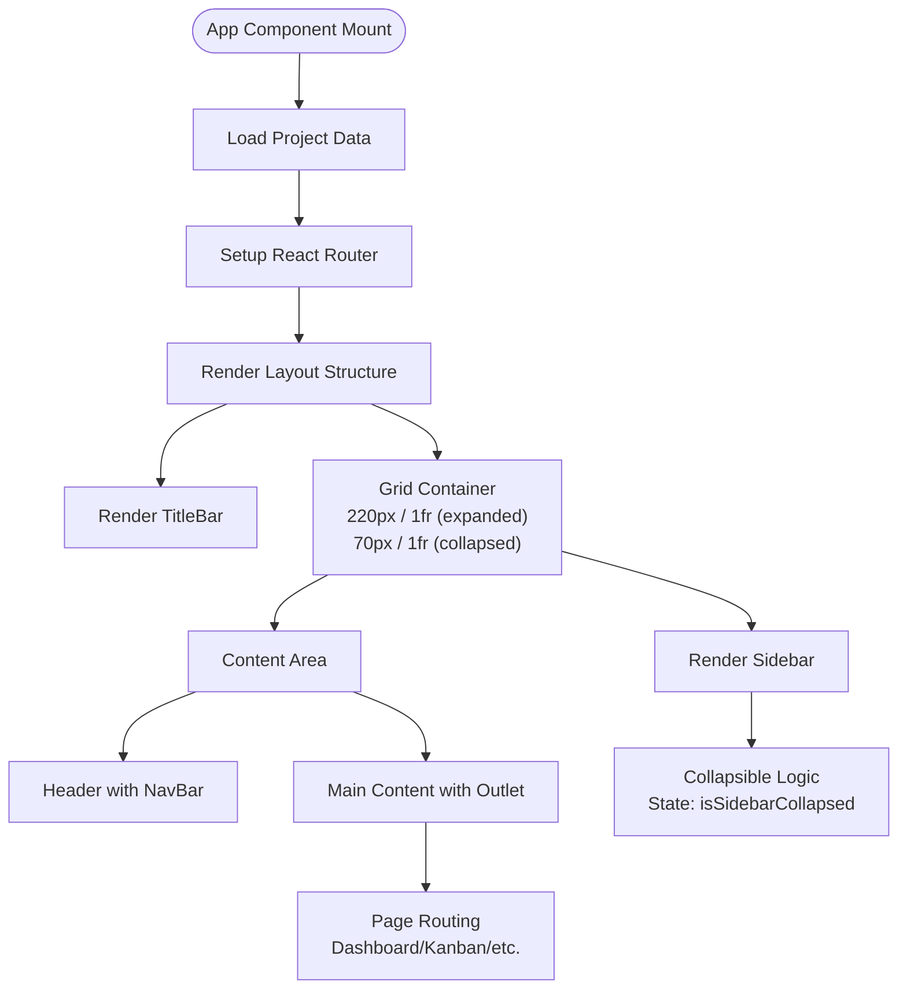
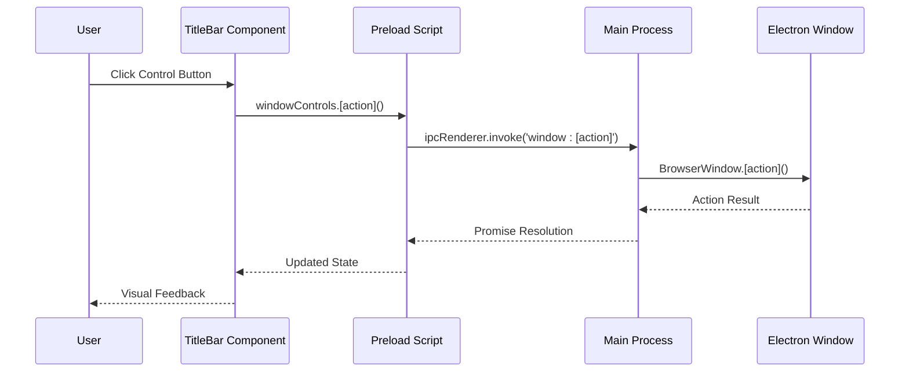
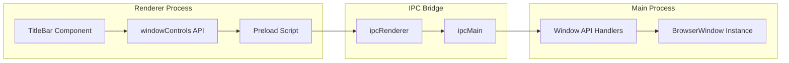
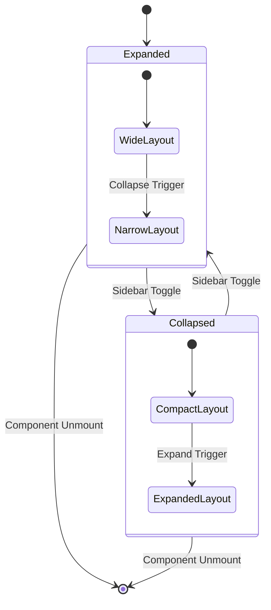
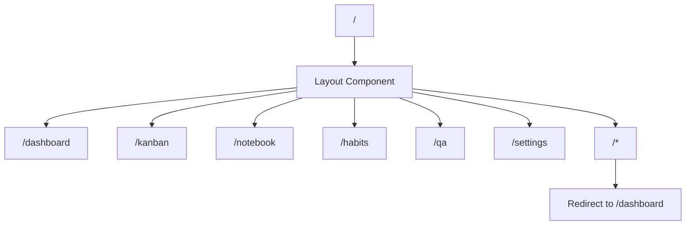
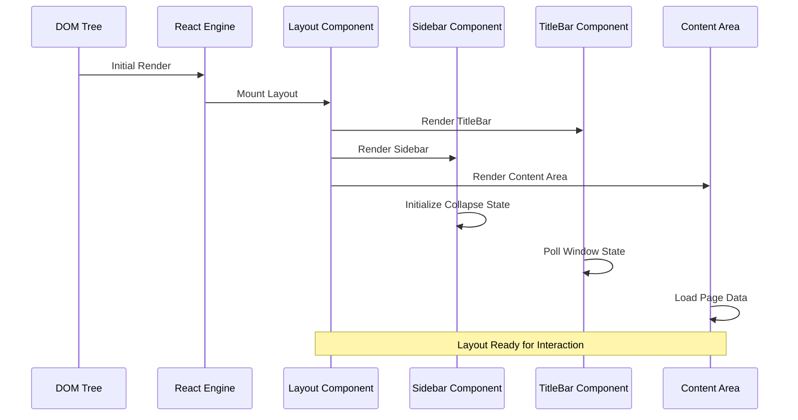

# Layout Structure

<cite>
**Referenced Files in This Document**
- [App.tsx](file://src/renderer/App.tsx)
- [TitleBar.tsx](file://src/renderer/components/TitleBar.tsx)
- [Sidebar.tsx](file://src/renderer/components/Sidebar.tsx)
- [NavBar.tsx](file://src/renderer/components/NavBar.tsx)
- [DateInfoModule.tsx](file://src/renderer/components/DateInfoModule.tsx)
- [styles.css](file://src/renderer/styles.css)
- [main.tsx](file://src/renderer/main.tsx)
- [types.ts](file://src/common/types.ts)
- [theme.ts](file://src/store/theme.ts)
- [window.ts](file://src/main/ipc/window.ts)
- [index.ts](file://src/preload/index.ts)
- [Dashboard.tsx](file://src/renderer/pages/Dashboard.tsx)
</cite>

## Table of Contents
1. [Introduction](#introduction)
2. [Application Architecture](#application-architecture)
3. [Core Layout Components](#core-layout-components)
4. [Electron Window Integration](#electron-window-integration)
5. [State Management](#state-management)
6. [Responsive Design System](#responsive-design-system)
7. [Navigation Structure](#navigation-structure)
8. [Layout Rendering Pipeline](#layout-rendering-pipeline)
9. [Troubleshooting Guide](#troubleshooting-guide)
10. [Best Practices](#best-practices)

## Introduction

LifeOS implements a sophisticated desktop-first layout structure designed specifically for Electron applications. The layout system orchestrates a seamless user experience through carefully crafted components that work together to create a cohesive interface. At its core, the layout structure revolves around the `App.tsx` component, which serves as the central orchestrator for the entire application shell.

The layout architecture emphasizes desktop interaction patterns, proper window management integration, and responsive design principles. It leverages React Router for navigation while maintaining strict separation between Electron window controls and application UI components.

## Application Architecture

The LifeOS layout follows a hierarchical component structure that ensures optimal performance and maintainability:



**Diagram sources**
- [App.tsx](file://src/renderer/App.tsx#L1-L176)
- [TitleBar.tsx](file://src/renderer/components/TitleBar.tsx#L1-L63)
- [Sidebar.tsx](file://src/renderer/components/Sidebar.tsx#L1-L195)
- [NavBar.tsx](file://src/renderer/components/NavBar.tsx#L1-L13)

**Section sources**
- [App.tsx](file://src/renderer/App.tsx#L1-L176)
- [main.tsx](file://src/renderer/main.tsx#L1-L18)

## Core Layout Components

### App.tsx - Central Orchestrator

The `App.tsx` component serves as the primary layout container and state manager for the entire application. It implements a sophisticated grid-based layout system that adapts to user preferences and screen sizes.

Key architectural features:
- **Grid Layout System**: Utilizes CSS Grid for flexible column arrangements
- **State Management**: Manages sidebar collapse state and project data
- **Router Integration**: Implements React Router with nested routing
- **Project Management**: Handles project creation, deletion, and selection

The layout structure employs a two-column grid system where the sidebar width dynamically adjusts based on the collapse state:



**Diagram sources**
- [App.tsx](file://src/renderer/App.tsx#L40-L85)

### TitleBar Component - Electron Window Controls

The TitleBar component provides native-like window controls while maintaining the application's aesthetic identity. It integrates seamlessly with Electron's window management system through IPC communication.

Implementation highlights:
- **Drag Region**: Uses `-webkit-app-region: drag` for window movement
- **Control Buttons**: Minimize, maximize/toggle, and close buttons
- **MCP Status Indicator**: Displays AI service connection status
- **Platform Awareness**: Adapts to different operating systems



**Diagram sources**
- [TitleBar.tsx](file://src/renderer/components/TitleBar.tsx#L15-L45)
- [index.ts](file://src/preload/index.ts#L180-L201)
- [window.ts](file://src/main/ipc/window.ts#L1-L25)

### Sidebar Component - Navigation Hub

The Sidebar component implements a collapsible navigation system with quick action buttons and project management capabilities. It features sophisticated hover effects and responsive design elements.

Key features:
- **Collapsible Design**: Smooth transitions between expanded/collapsed states
- **Navigation Links**: Five main application sections
- **Quick Actions**: Three floating buttons for rapid access
- **Project Management**: Integration with project switching functionality

The sidebar implements a dual-state design pattern:
- **Expanded State**: Full navigation with icons and text labels
- **Collapsed State**: Compact navigation with tooltips

**Section sources**
- [Sidebar.tsx](file://src/renderer/components/Sidebar.tsx#L1-L195)
- [App.tsx](file://src/renderer/App.tsx#L40-L85)

### NavBar Component - In-App Navigation

The NavBar component provides contextual navigation within the application, currently featuring the DateInfoModule for time and weather information display.

Current implementation:
- **Date Information**: Gregorian and lunar calendar dates
- **Time Display**: Real-time clock with second precision
- **Weather Integration**: Local weather and forecast data
- **Calendar Systems**: ISO week, fiscal week, and day-of-year calculations

**Section sources**
- [NavBar.tsx](file://src/renderer/components/NavBar.tsx#L1-L13)
- [DateInfoModule.tsx](file://src/renderer/components/DateInfoModule.tsx#L1-L385)

## Electron Window Integration

### IPC Communication Architecture

LifeOS implements a robust IPC (Inter-Process Communication) system that enables seamless interaction between the renderer process and main Electron process:



**Diagram sources**
- [index.ts](file://src/preload/index.ts#L180-L201)
- [window.ts](file://src/main/ipc/window.ts#L1-L25)

### Window Control Implementation

The window control system provides native-like functionality through a clean abstraction layer:

| Function | Purpose | IPC Handler | Return Type |
|----------|---------|-------------|-------------|
| `minimize()` | Minimize window | `window:minimize` | `Promise<void>` |
| `close()` | Close window | `window:close` | `Promise<void>` |
| `isMaximized()` | Check maximized state | `window:is-maximized` | `Promise<boolean>` |
| `toggleMaximize()` | Toggle maximization | `window:toggle-maximize` | `Promise<void>` |

**Section sources**
- [window.ts](file://src/main/ipc/window.ts#L1-L25)
- [index.ts](file://src/preload/index.ts#L180-L201)

## State Management

### Layout State Architecture

The layout system employs a combination of React state and centralized state management for optimal performance and maintainability:



**Diagram sources**
- [App.tsx](file://src/renderer/App.tsx#L40-L45)

### Project State Management

The application maintains project state through a centralized approach:

- **Active Project Tracking**: Maintains current project selection
- **Project List Management**: Handles CRUD operations for projects
- **Persistence Layer**: Integrates with the database for data persistence

**Section sources**
- [App.tsx](file://src/renderer/App.tsx#L85-L175)

## Responsive Design System

### CSS Grid Layout Implementation

LifeOS utilizes CSS Grid for its responsive layout system, providing precise control over column widths and content arrangement:

```css
/* Grid template columns adjust based on sidebar state */
grid-template-columns: isSidebarCollapsed ? '70px 1fr' : '220px 1fr';
transition: grid-template-columns 0.2s ease;
```

### Breakpoint Strategy

The application implements a mobile-first responsive design with the following breakpoints:

| Breakpoint | Width Range | Target Devices |
|------------|-------------|----------------|
| Mobile | < 768px | Smartphones |
| Tablet | 768px - 1024px | Tablets |
| Desktop | 1024px+ | Desktop computers |

### Flexbox Integration

Components utilize Flexbox for dynamic content alignment and spacing:

```css
/* Example flexbox usage in DateInfoModule */
display: flex;
align-items: center;
gap: 1.5rem;
flex: 1;
```

**Section sources**
- [styles.css](file://src/renderer/styles.css#L1-L72)
- [DateInfoModule.tsx](file://src/renderer/components/DateInfoModule.tsx#L150-L200)

## Navigation Structure

### React Router Integration

The application implements nested routing with the following structure:



**Diagram sources**
- [App.tsx](file://src/renderer/App.tsx#L140-L175)

### Navigation Patterns

The navigation system implements several key patterns:

- **Hash Routing**: Uses hash-based routing for Electron compatibility
- **Nested Routes**: Supports nested route structures within the layout
- **Programmatic Navigation**: Enables programmatic route changes
- **Route Protection**: Future implementation for protected routes

**Section sources**
- [App.tsx](file://src/renderer/App.tsx#L140-L175)

## Layout Rendering Pipeline

### Component Lifecycle

The layout rendering follows a specific lifecycle that ensures optimal performance and user experience:



**Diagram sources**
- [App.tsx](file://src/renderer/App.tsx#L40-L85)
- [TitleBar.tsx](file://src/renderer/components/TitleBar.tsx#L8-L15)

### Performance Optimizations

The layout system implements several performance optimizations:

- **Memoization**: Uses React.memo for expensive components
- **Lazy Loading**: Implements lazy loading for heavy components
- **Efficient Re-renders**: Minimizes unnecessary re-renders through proper state management
- **CSS Transitions**: Leverages hardware-accelerated CSS animations

**Section sources**
- [App.tsx](file://src/renderer/App.tsx#L40-L85)

## Troubleshooting Guide

### Common Layout Issues

#### Sidebar Not Responding to Clicks

**Symptoms**: Sidebar toggle button doesn't change state or collapse/expand

**Causes**:
- Incorrect event handler binding
- State management issues
- CSS z-index conflicts

**Solutions**:
1. Verify `onToggle` prop is properly passed to Sidebar
2. Check state synchronization in App component
3. Ensure proper CSS stacking context

#### TitleBar Window Controls Not Working

**Symptoms**: Minimize/maximize/close buttons don't function

**Causes**:
- IPC communication failure
- Preload script not properly configured
- Electron security restrictions

**Solutions**:
1. Verify preload script exposes windowControls API
2. Check IPC handler registration in main process
3. Review Electron security policies

#### Grid Layout Misalignment

**Symptoms**: Columns not aligning properly or content overflowing

**Causes**:
- CSS grid property conflicts
- Dynamic content causing layout shifts
- Viewport sizing issues

**Solutions**:
1. Verify grid-template-columns property
2. Check for conflicting CSS properties
3. Implement proper viewport meta tags

### Debugging Tools

#### Console Commands for Layout Debugging

```javascript
// Check sidebar state
console.log('Sidebar collapsed:', window.sidebarCollapsed);

// Verify window controls
console.log('Window maximized:', await window.windowControls.isMaximized());

// Monitor layout performance
performance.mark('layout-start');
// ... layout operations
performance.mark('layout-end');
performance.measure('layout-duration', 'layout-start', 'layout-end');
```

#### CSS Inspection Techniques

1. **Flexbox Inspector**: Use browser developer tools to inspect flex properties
2. **Grid Inspector**: Examine grid layout properties in Chrome DevTools
3. **Transition Inspector**: Monitor CSS transition properties during interactions

**Section sources**
- [TitleBar.tsx](file://src/renderer/components/TitleBar.tsx#L15-L45)
- [App.tsx](file://src/renderer/App.tsx#L40-L45)

## Best Practices

### Layout Development Guidelines

#### Component Organization
- **Single Responsibility**: Each layout component should have a clear, singular purpose
- **Prop Drilling**: Minimize prop drilling by using context or state management
- **Composition**: Prefer composition over inheritance for layout components

#### Performance Considerations
- **Avoid Inline Functions**: Define event handlers outside render methods
- **Memoization**: Use React.memo for expensive components
- **Virtual Scrolling**: Implement virtual scrolling for large lists

#### Accessibility Standards
- **Keyboard Navigation**: Ensure all interactive elements are keyboard accessible
- **Screen Reader Support**: Provide proper ARIA labels and roles
- **Focus Management**: Implement proper focus management for modal dialogs

#### Cross-Platform Compatibility
- **Platform Detection**: Detect and adapt to different operating systems
- **Native Look and Feel**: Maintain native application appearance
- **Touch Support**: Ensure touch-friendly interactions on supported devices

### Maintenance Recommendations

#### Code Organization
- **Separation of Concerns**: Keep layout logic separate from business logic
- **Reusable Components**: Extract reusable layout patterns into shared components
- **Documentation**: Document complex layout interactions and state flows

#### Testing Strategies
- **Visual Regression Testing**: Implement automated visual regression testing
- **Interaction Testing**: Test layout interactions across different screen sizes
- **Performance Testing**: Monitor layout performance under various conditions

**Section sources**
- [styles.css](file://src/renderer/styles.css#L1-L72)
- [theme.ts](file://src/store/theme.ts#L1-L89)