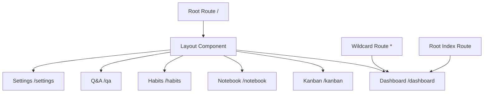
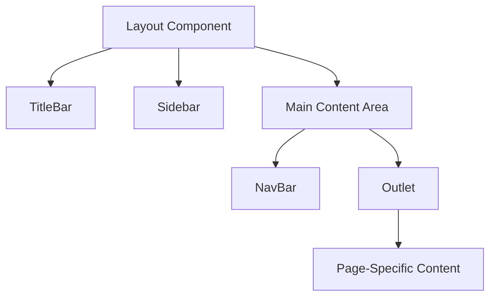
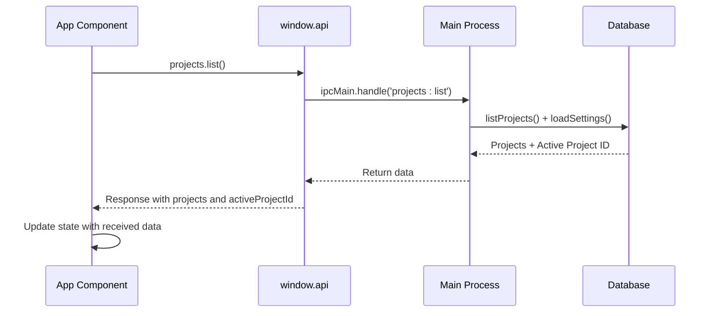
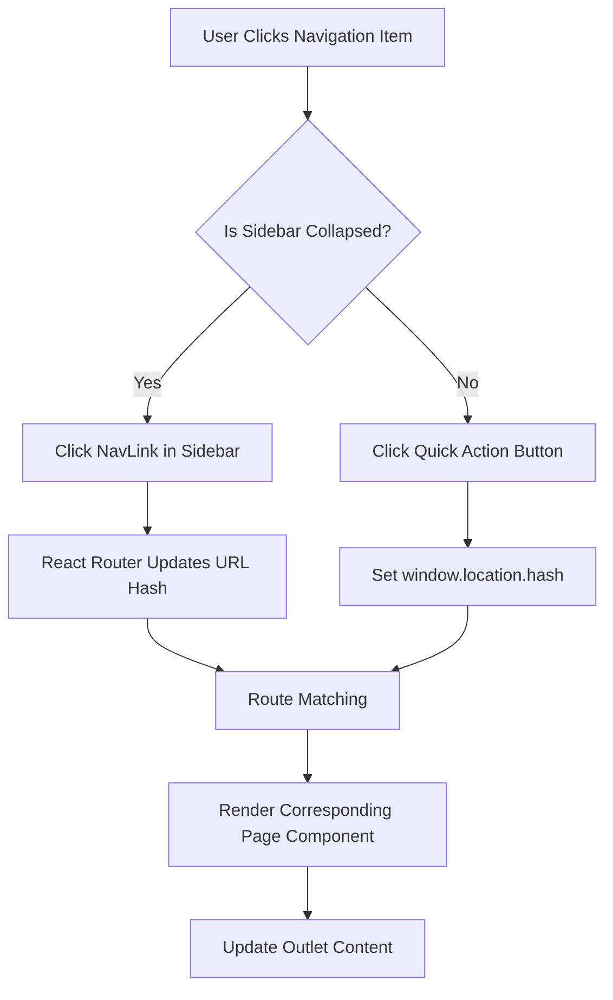
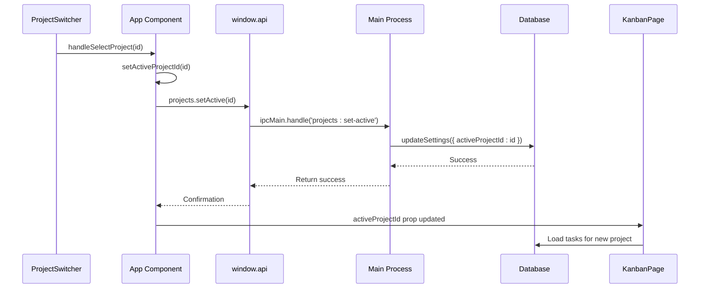
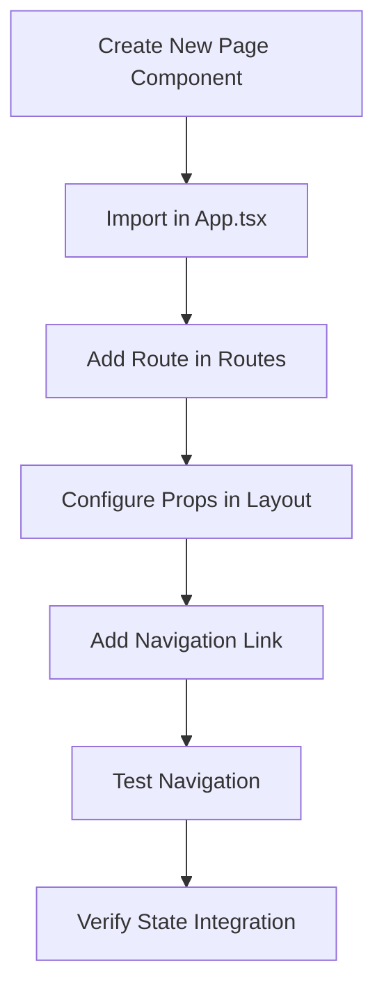
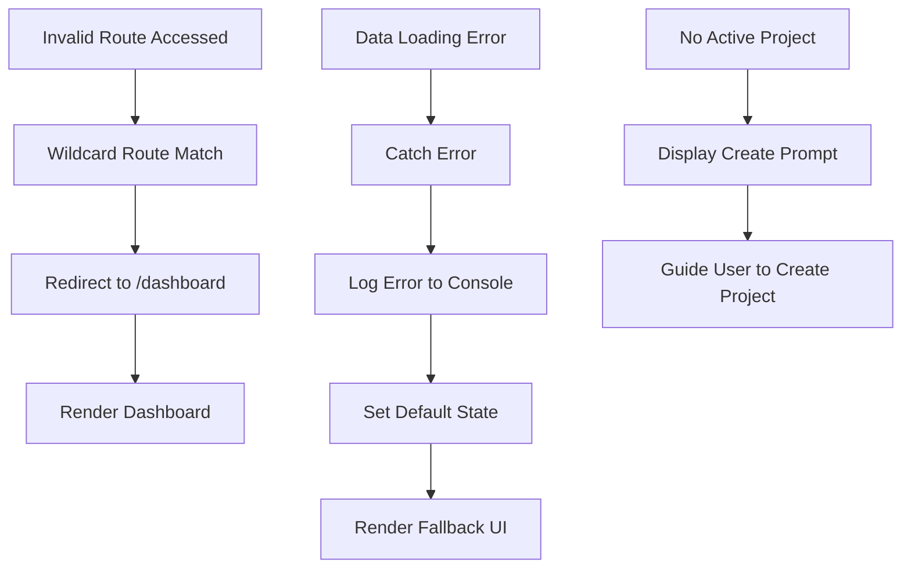
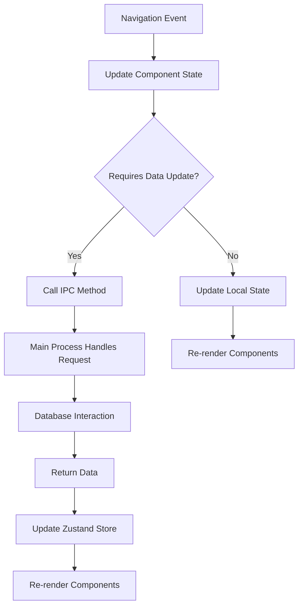

# Navigation System

<cite>
**Referenced Files in This Document**   
- [App.tsx](file://src/renderer/App.tsx)
- [Sidebar.tsx](file://src/renderer/components/Sidebar.tsx)
- [KanbanPage.tsx](file://src/renderer/pages/KanbanPage.tsx)
- [NotebookPage.tsx](file://src/renderer/pages/NotebookPage.tsx)
- [HabitsPage.tsx](file://src/renderer/pages/HabitsPage.tsx)
- [QA.tsx](file://src/renderer/pages/QA.tsx)
- [SettingsPage.tsx](file://src/renderer/pages/SettingsPage.tsx)
- [projects.ts](file://src/main/ipc/projects.ts)
- [projects.ts](file://src/store/projects.ts)
</cite>

## Table of Contents
1. [Introduction](#introduction)
2. [Route Management with HashRouter](#route-management-with-hashrouter)
3. [Layout Component Architecture](#layout-component-architecture)
4. [Data Loading and State Initialization](#data-loading-and-state-initialization)
5. [Navigation Events and User Actions](#navigation-events-and-user-actions)
6. [Active Project State Synchronization](#active-project-state-synchronization)
7. [Adding New Pages and Routes](#adding-new-pages-and-routes)
8. [Error Handling and Route Fallbacks](#error-handling-and-route-fallbacks)
9. [Integration with Zustand and IPC](#integration-with-zustand-and-ipc)

## Introduction
The LifeOS navigation system provides a robust routing framework that enables seamless page transitions and consistent user experience across the Electron application. Built on React Router's HashRouter, the system is specifically designed for Electron compatibility, ensuring reliable navigation without server-side routing requirements. The architecture combines declarative routing with state management integration, allowing for dynamic content loading and synchronized state across components. This document details the implementation of route management, layout structure, data loading patterns, and integration with the application's state management and IPC systems.

## Route Management with HashRouter
LifeOS utilizes HashRouter from React Router to manage navigation, which is particularly well-suited for Electron applications. The HashRouter uses the hash portion of the URL (after the # symbol) to maintain navigation state without requiring server-side routing support. This approach ensures that navigation works reliably in the Electron environment where traditional browser routing might encounter issues.

The routing configuration in App.tsx defines the application's navigation structure with a clear hierarchy of routes that map to specific page components. The root route serves as a container for the Layout component, which provides a consistent interface across all pages, while nested routes correspond to the application's main features: Dashboard, Kanban, Notebook, Habits, Q&A, and Settings.

**Diagram sources**
- [App.tsx](file://src/renderer/App.tsx#L148-L174)

**Section sources**
- [App.tsx](file://src/renderer/App.tsx#L1-L175)

## Layout Component Architecture
The Layout component serves as a consistent container for all pages in LifeOS, providing a unified interface with persistent elements such as the TitleBar, Sidebar, and NavBar. This architectural approach ensures a cohesive user experience while allowing for dynamic content loading through the Outlet component from React Router.

The Layout component receives essential props including the list of projects, active project ID, and callback functions for project management operations. It manages the sidebar collapse state through local component state, enabling users to toggle between compact and expanded views. The layout employs a CSS Grid structure with responsive column sizing that adapts to the sidebar's collapsed state, providing a flexible and user-friendly interface.

The Outlet component is strategically placed within the main content area, serving as a placeholder where nested route components are rendered. This design pattern enables the application to maintain consistent navigation elements while dynamically loading page-specific content based on the current route.

**Diagram sources**
- [App.tsx](file://src/renderer/App.tsx#L25-L100)
- [Sidebar.tsx](file://src/renderer/components/Sidebar.tsx#L25-L194)

**Section sources**
- [App.tsx](file://src/renderer/App.tsx#L25-L100)
- [Sidebar.tsx](file://src/renderer/components/Sidebar.tsx#L25-L194)

## Data Loading and State Initialization
The App component implements a comprehensive data loading strategy that fetches essential application data during initialization. The useEffect hook in the App component triggers the loading of projects and theme configuration when the component mounts, ensuring that critical data is available before rendering the main interface.

The data loading process for projects involves an IPC call to the main process through window.api.projects.list(), which retrieves the list of projects and the currently active project ID. The response is processed to update the component's state, with fallback logic to handle cases where no active project is set or when the project list is empty. This initialization pattern ensures that the application starts with a valid state and provides a seamless user experience.

**Diagram sources**
- [App.tsx](file://src/renderer/App.tsx#L105-L135)
- [projects.ts](file://src/main/ipc/projects.ts#L5-L22)

**Section sources**
- [App.tsx](file://src/renderer/App.tsx#L105-L135)
- [projects.ts](file://src/main/ipc/projects.ts#L5-L22)

## Navigation Events and User Actions
Navigation in LifeOS is driven by user interactions with the Sidebar component, which contains NavLink elements for each main application section. When users click on navigation items, React Router updates the URL hash and renders the corresponding page component through the Outlet in the Layout component.

The Sidebar component implements visual feedback for navigation by styling active links differently from inactive ones. The linkStyle function dynamically applies background color and text color based on the isActive state provided by NavLink, creating a clear visual indication of the current page. Additionally, the Sidebar includes quick action buttons in the expanded view that programmatically trigger navigation by setting window.location.hash, providing alternative navigation methods for frequently accessed features.

**Diagram sources**
- [Sidebar.tsx](file://src/renderer/components/Sidebar.tsx#L50-L150)

**Section sources**
- [Sidebar.tsx](file://src/renderer/components/Sidebar.tsx#L50-L150)

## Active Project State Synchronization
The navigation system maintains synchronization of the active project state across components through a combination of component state and callback functions. When a user selects a different project through the ProjectSwitcher component in the Kanban page, the handleSelectProject function is called, which updates the activeProjectId state in the App component and persists the selection by calling window.api.projects.setActive(id).

This state synchronization pattern ensures that all components have access to the current project context. The active project ID is passed down as a prop to relevant pages like KanbanPage, enabling them to filter and display data specific to the selected project. When the active project changes, components that depend on this state automatically re-render with the updated data, maintaining consistency across the application.

**Diagram sources**
- [App.tsx](file://src/renderer/App.tsx#L137-L145)
- [projects.ts](file://src/main/ipc/projects.ts#L65-L72)
- [KanbanPage.tsx](file://src/renderer/pages/KanbanPage.tsx#L105-L125)

**Section sources**
- [App.tsx](file://src/renderer/App.tsx#L137-L145)
- [projects.ts](file://src/main/ipc/projects.ts#L65-L72)
- [KanbanPage.tsx](file://src/renderer/pages/KanbanPage.tsx#L105-L125)

## Adding New Pages and Routes
To add new pages and routes to the LifeOS application, developers should follow a standardized pattern that maintains consistency with the existing architecture. First, create a new page component in the src/renderer/pages directory, following the naming convention PageName.tsx. The component should be designed to receive necessary props for data access and state management.

Next, import the new page component in App.tsx and add a new Route element within the Routes component, specifying the path and element props. The route should be nested within the root route that contains the Layout component to ensure consistent styling and navigation. For pages that require access to project data or other application state, ensure that the necessary props are passed through the Layout component.

Best practices for adding new routes include using descriptive path names, maintaining a logical hierarchy, and ensuring that new pages follow the same design patterns as existing components. Additionally, consider adding navigation links in the Sidebar component if the new page represents a main application feature.

**Section sources**
- [App.tsx](file://src/renderer/App.tsx#L148-L174)
- [Sidebar.tsx](file://src/renderer/components/Sidebar.tsx#L50-L150)

## Error Handling and Route Fallbacks
The navigation system implements robust error handling and route fallback mechanisms to ensure a smooth user experience even when unexpected conditions occur. The routing configuration includes a wildcard route (*), which redirects users to the dashboard when an invalid URL is accessed. This fallback route prevents broken navigation and maintains application usability.

Error handling is implemented at multiple levels, including network request failures and data loading errors. When fetching projects during initialization, the application includes try-catch blocks that handle potential errors, logging them to the console and setting appropriate default states. This defensive programming approach prevents the application from crashing due to transient issues and provides a graceful degradation path.

For route-specific error handling, components like KanbanPage include conditional rendering based on the activeProjectId state, displaying a helpful message when no project is selected rather than attempting to render content with missing data. This pattern ensures that users always see meaningful content and understand how to proceed.

**Diagram sources**
- [App.tsx](file://src/renderer/App.tsx#L170-L174)
- [KanbanPage.tsx](file://src/renderer/pages/KanbanPage.tsx#L300-L350)

**Section sources**
- [App.tsx](file://src/renderer/App.tsx#L170-L174)
- [KanbanPage.tsx](file://src/renderer/pages/KanbanPage.tsx#L300-L350)

## Integration with Zustand and IPC
The navigation system seamlessly integrates with Zustand state management and Electron's IPC mechanism to create a cohesive application architecture. The App component serves as a bridge between these systems, using IPC calls to retrieve data from the main process and Zustand stores to manage application state.

When the application initializes, it uses IPC to fetch project data from the main process, then updates local component state accordingly. This data is then passed down to child components through props, maintaining a unidirectional data flow. For state that needs to be shared across multiple components or persisted between sessions, Zustand stores are used in conjunction with IPC to synchronize data between the renderer and main processes.

The integration pattern follows a clear separation of concerns: IPC handles communication between processes, Zustand manages application state, and React Router controls navigation. This architecture enables efficient data flow, with navigation events potentially triggering state updates and IPC calls as needed to maintain data consistency across the application.

**Diagram sources**
- [App.tsx](file://src/renderer/App.tsx#L105-L145)
- [projects.ts](file://src/main/ipc/projects.ts#L5-L83)
- [projects.ts](file://src/store/projects.ts#L1-L86)

**Section sources**
- [App.tsx](file://src/renderer/App.tsx#L105-L145)
- [projects.ts](file://src/main/ipc/projects.ts#L5-L83)
- [projects.ts](file://src/store/projects.ts#L1-L86)