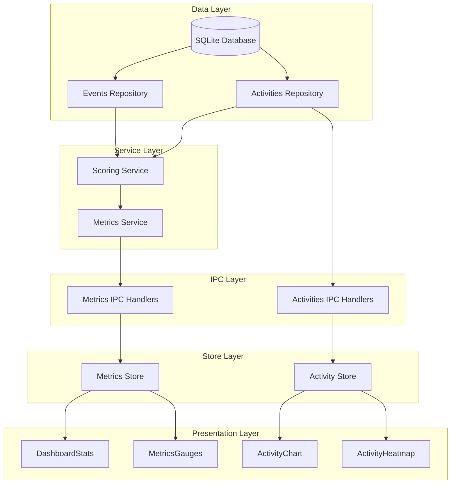
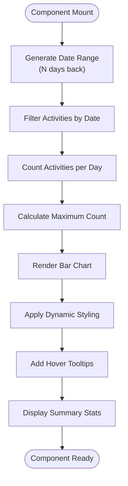
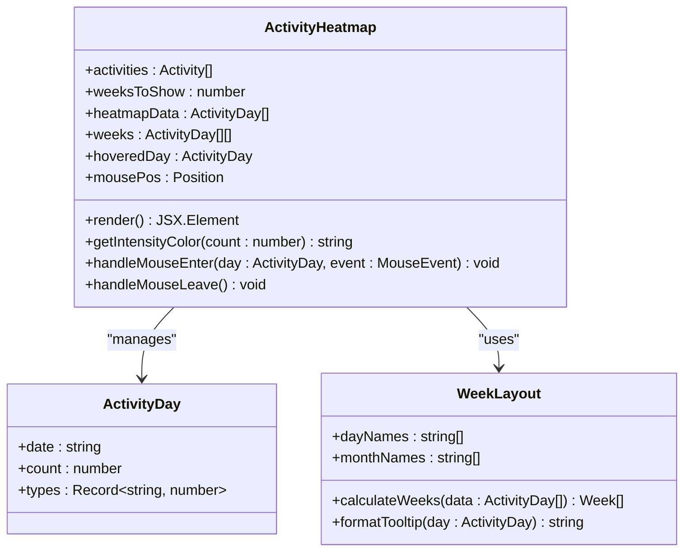
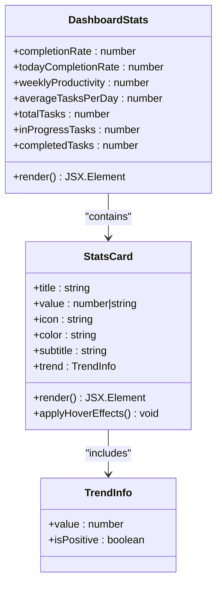
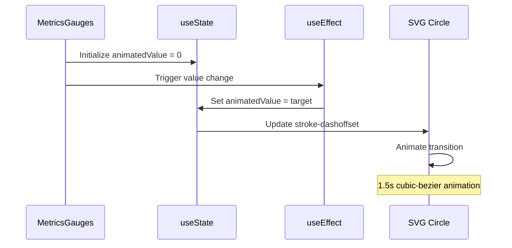
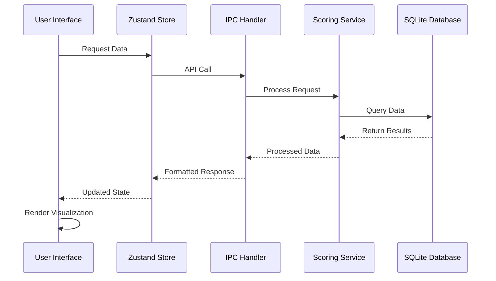
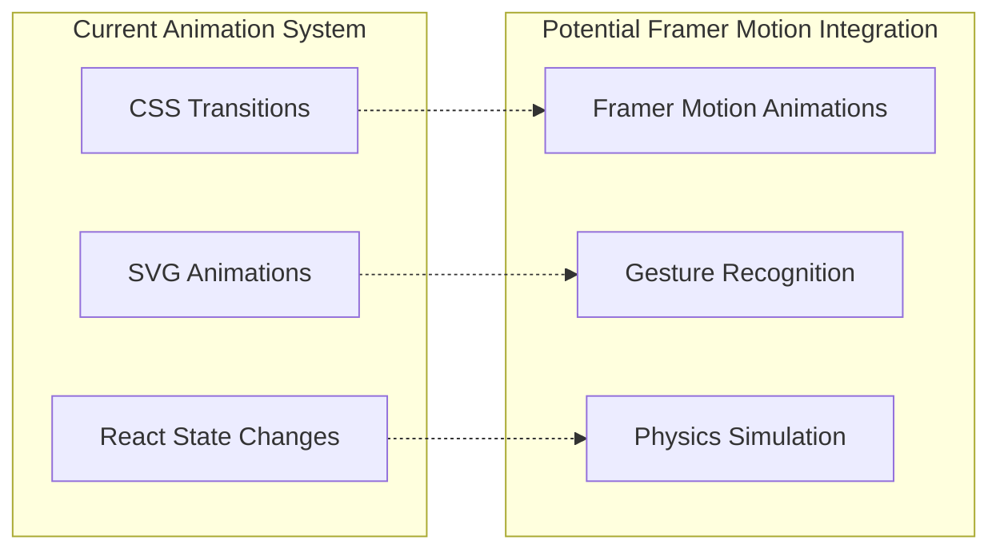

# Data Visualization Components

<cite>
**Referenced Files in This Document**
- [ActivityChart.tsx](file://src/renderer/components/ActivityChart.tsx)
- [ActivityHeatmap.tsx](file://src/renderer/components/ActivityHeatmap.tsx)
- [DashboardStats.tsx](file://src/renderer/components/DashboardStats.tsx)
- [MetricsGauges.tsx](file://src/renderer/components/MetricsGauges.tsx)
- [Dashboard.tsx](file://src/renderer/pages/Dashboard.tsx)
- [activitiesRepo.ts](file://src/database/activitiesRepo.ts)
- [scoring.ts](file://src/services/scoring.ts)
- [metricsSchema.ts](file://src/database/metricsSchema.ts)
- [eventsRepo.ts](file://src/database/eventsRepo.ts)
- [metrics.ts](file://src/main/ipc/metrics.ts)
- [activities.ts](file://src/main/ipc/activities.ts)
- [activity.ts](file://src/store/activity.ts)
</cite>

## Table of Contents
1. [Introduction](#introduction)
2. [Architecture Overview](#architecture-overview)
3. [ActivityChart Component](#activitychart-component)
4. [ActivityHeatmap Component](#activityheatmap-component)
5. [DashboardStats Component](#dashboardstats-component)
6. [MetricsGauges Component](#metricsgauges-component)
7. [Data Flow Architecture](#data-flow-architecture)
8. [Performance Considerations](#performance-considerations)
9. [Animation Strategies](#animation-strategies)
10. [Customization Guidelines](#customization-guidelines)
11. [Extending Visualization Types](#extending-visualization-types)
12. [Troubleshooting Guide](#troubleshooting-guide)

## Introduction

LifeOS features a sophisticated data visualization system designed to transform raw productivity data into intuitive, interactive charts and gauges. The visualization components provide users with comprehensive insights into their activity patterns, productivity metrics, and personal growth over time. These components are built with React and leverage modern web technologies to deliver smooth animations and responsive interactions.

The visualization system encompasses four primary components: ActivityChart for daily activity trends, ActivityHeatmap for calendar-style activity patterns, DashboardStats for key performance indicators, and MetricsGauges for displaying core productivity scores. Together, they form a cohesive dashboard that presents actionable insights derived from the underlying scoring service.

## Architecture Overview

The data visualization architecture follows a layered approach that separates concerns between data acquisition, transformation, and presentation. This design ensures maintainability while enabling efficient rendering of complex visualizations.

**Diagram sources**
- [scoring.ts](file://src/services/scoring.ts#L1-L50)
- [metricsSchema.ts](file://src/database/metricsSchema.ts#L1-L30)
- [activitiesRepo.ts](file://src/database/activitiesRepo.ts#L1-L20)
- [Dashboard.tsx](file://src/renderer/pages/Dashboard.tsx#L1-L50)

## ActivityChart Component

The ActivityChart component provides a visual representation of daily activity patterns over a configurable time period. It transforms raw activity data into a bar chart that highlights productivity trends and identifies peak activity periods.

### Implementation Details

The component generates data for the specified number of days (default 14) and calculates activity counts for each day. It implements intelligent labeling to avoid crowding while maintaining readability.

**Diagram sources**
- [ActivityChart.tsx](file://src/renderer/components/ActivityChart.tsx#L15-L45)

### Data Transformation Process

The ActivityChart performs several key transformations:

1. **Date Generation**: Creates a chronological sequence of dates leading up to the current day
2. **Activity Filtering**: Matches activities to their respective dates using ISO date strings
3. **Count Aggregation**: Calculates the number of activities per day
4. **Normalization**: Determines the maximum count for proportional bar sizing
5. **Styling Assignment**: Applies color gradients and visual effects based on activity levels

### Real-time Data Updates

The component responds to changes in the activities prop through React's useEffect hook. When new activities are added or existing ones are modified, the chart automatically recalculates and updates its display.

**Section sources**
- [ActivityChart.tsx](file://src/renderer/components/ActivityChart.tsx#L1-L230)

## ActivityHeatmap Component

The ActivityHeatmap creates a calendar-style visualization that displays activity intensity across multiple weeks. It provides a comprehensive view of long-term activity patterns and helps users identify seasonal productivity trends.

### Calendar Grid Structure

The heatmap organizes data into weekly columns with day-of-week labels and month markers. Each cell represents a day and is colored according to activity intensity.

**Diagram sources**
- [ActivityHeatmap.tsx](file://src/renderer/components/ActivityHeatmap.tsx#L10-L30)

### Intensity Color Mapping

The heatmap implements adaptive color schemes that adjust based on the current theme mode (light or dark). This ensures optimal visibility across different visual environments.

### Interactive Features

The component provides hover interactions that display detailed information about individual days, including activity counts and type distributions. The tooltip system includes:

- Date and activity count
- Activity type breakdown
- Visual indicators for different activity categories
- Smooth positioning calculations

**Section sources**
- [ActivityHeatmap.tsx](file://src/renderer/components/ActivityHeatmap.tsx#L1-L266)

## DashboardStats Component

The DashboardStats component presents key performance indicators in a card-based layout. Each stat card combines visual elements with numerical data to provide immediate insights into productivity metrics.

### Card Design Pattern

Each StatsCard follows a consistent design pattern with gradient backgrounds, iconography, and trend indicators:

**Diagram sources**
- [DashboardStats.tsx](file://src/renderer/components/DashboardStats.tsx#L5-L25)

### Statistical Calculations

The component calculates various productivity metrics from the underlying task and activity data:

- **Completion Rate**: Percentage of completed tasks out of total tasks
- **Today's Completion Rate**: Current day's completion percentage
- **Weekly Productivity**: Average activities per day over the week
- **Average Tasks Per Day**: Long-term productivity metric

### Responsive Grid Layout

The component uses CSS Grid to create a responsive layout that adapts to different screen sizes while maintaining visual balance and readability.

**Section sources**
- [DashboardStats.tsx](file://src/renderer/components/DashboardStats.tsx#L1-L188)

## MetricsGauges Component

The MetricsGauges component displays the core LifeOS productivity scores (Aliveness and Efficiency) using animated circular gauges. These gauges provide immediate visual feedback about user engagement and task completion quality.

### Gauge Animation System

The component implements sophisticated animation using SVG circles with dynamic stroke offsets:

**Diagram sources**
- [MetricsGauges.tsx](file://src/renderer/components/MetricsGauges.tsx#L20-L40)

### Scoring Integration

The gauges integrate directly with the scoring service to display real-time metrics:

1. **Data Fetching**: Periodic API calls to retrieve current metrics
2. **Error Handling**: Graceful fallback for failed requests
3. **Loading States**: Animated loading indicators during data fetch
4. **Retry Mechanisms**: User-initiated refresh capabilities

### Status Color Coding

The gauges implement intelligent color coding based on score thresholds:
- **Green (≥70)**: Excellent performance
- **Orange (40-69)**: Good performance
- **Red (<40)**: Needs improvement

**Section sources**
- [MetricsGauges.tsx](file://src/renderer/components/MetricsGauges.tsx#L1-L275)

## Data Flow Architecture

The visualization components participate in a sophisticated data flow that ensures consistency and performance across the application.

**Diagram sources**
- [Dashboard.tsx](file://src/renderer/pages/Dashboard.tsx#L20-L50)
- [activity.ts](file://src/store/activity.ts#L10-L30)
- [metrics.ts](file://src/main/ipc/metrics.ts#L15-L35)

### Data Persistence and Caching

The system implements multiple levels of caching to optimize performance:

- **Browser Memory**: Zustand stores keep frequently accessed data
- **IPC Caching**: Electron's IPC layer maintains connection state
- **Database Indexing**: SQLite indices accelerate query performance

### Real-time Synchronization

Visualizations update automatically when underlying data changes, ensuring users always see the most current information without manual refresh.

**Section sources**
- [Dashboard.tsx](file://src/renderer/pages/Dashboard.tsx#L1-L237)
- [activity.ts](file://src/store/activity.ts#L1-L69)

## Performance Considerations

### Large Dataset Rendering

The visualization components are optimized to handle large datasets efficiently:

- **Virtualization**: The ActivityHeatmap implements horizontal scrolling for extensive historical data
- **Lazy Loading**: Components load data progressively to minimize initial render time
- **Memoization**: React.memo and useMemo hooks prevent unnecessary re-renders
- **Debounced Updates**: Frequent data changes trigger batched updates

### Memory Management

The system implements several memory optimization strategies:

- **Component Cleanup**: useEffect cleanup functions prevent memory leaks
- **Event Listener Management**: Proper cleanup of mouse and resize listeners
- **Image Optimization**: SVG graphics minimize memory footprint compared to raster images

### Rendering Performance

Key performance optimizations include:

- **CSS Transitions**: Hardware-accelerated animations for smooth user experience
- **Reduced DOM Manipulation**: Minimal direct DOM manipulation in favor of CSS
- **Efficient State Updates**: Batched state updates reduce re-render cycles

## Animation Strategies

### Framer Motion Integration

While the current implementation uses CSS animations, the architecture supports integration with Framer Motion for enhanced animation capabilities:

### Animation Best Practices

The components implement several animation best practices:

- **Hardware Acceleration**: CSS transforms and opacity changes trigger GPU acceleration
- **Smooth Timing Functions**: Cubic-bezier curves provide natural motion
- **Performance Monitoring**: Animation frame monitoring prevents jank
- **Accessibility Considerations**: Reduced motion preferences are respected

## Customization Guidelines

### Theme Integration

The visualization components are designed to seamlessly integrate with LifeOS's theming system:

- **CSS Variables**: All colors use CSS custom properties for theme flexibility
- **Adaptive Colors**: Components adapt to light/dark theme changes
- **Brand Consistency**: Color schemes align with LifeOS branding guidelines

### Styling Customization

Developers can customize visualizations by:

- **Modifying CSS Variables**: Adjust colors, spacing, and typography
- **Overriding Styles**: Use CSS specificity for targeted modifications
- **Component Props**: Extend components with additional styling props

### Extensibility Patterns

The component architecture supports extension through:

- **Higher-Order Components**: Wrapper components for additional functionality
- **Render Props**: Flexible content rendering through prop functions
- **Composition**: Building complex visualizations from basic components

## Extending Visualization Types

### Adding New Chart Types

To add new visualization types, developers should:

1. **Define Data Requirements**: Specify the data structure needed for the new visualization
2. **Implement Data Transformations**: Create functions to convert raw data into visualization-ready formats
3. **Design Component Structure**: Build the React component with appropriate props and state management
4. **Integrate with Existing Systems**: Ensure compatibility with the scoring service and data stores

### Supporting Additional Metrics

The system can accommodate new productivity metrics by:

- **Extending the Scoring Service**: Adding new calculation methods
- **Updating the Database Schema**: Creating new tables or columns as needed
- **Modifying IPC Handlers**: Adding new API endpoints for metric retrieval
- **Enhancing Visualization Components**: Adapting existing components or creating new ones

### Integration Patterns

Successful extensions follow established patterns:

- **Consistent Data Flow**: Maintaining the layered architecture approach
- **Standardized APIs**: Using the IPC handler pattern for data access
- **Unified Styling**: Leveraging the theming system for visual consistency
- **Performance Optimization**: Implementing lazy loading and memoization where appropriate

## Troubleshooting Guide

### Common Issues and Solutions

#### Chart Not Updating
**Symptoms**: Visualizations don't reflect recent data changes
**Causes**: 
- Missing useEffect dependencies
- Incorrect prop passing
- State synchronization issues

**Solutions**:
- Verify useEffect dependencies include all relevant data
- Check prop drilling from parent components
- Ensure proper state management with Zustand

#### Performance Degradation
**Symptoms**: Slow rendering with large datasets
**Causes**:
- Unoptimized data transformations
- Excessive re-renders
- Memory leaks

**Solutions**:
- Implement data pagination for large datasets
- Use React.memo and useMemo appropriately
- Monitor memory usage and implement cleanup functions

#### Animation Issues
**Symptoms**: Jerky or inconsistent animations
**Causes**:
- CSS transition conflicts
- Hardware acceleration problems
- Frame rate limitations

**Solutions**:
- Verify CSS property compatibility with hardware acceleration
- Test animations across different devices and browsers
- Implement animation frame monitoring

### Debugging Strategies

Effective debugging approaches include:

- **Console Logging**: Strategic placement of console.log statements
- **React DevTools**: Using browser developer tools for component inspection
- **Performance Profiling**: Identifying bottlenecks in data processing and rendering
- **Memory Analysis**: Monitoring memory usage patterns

### Error Recovery

The components implement robust error handling:

- **Graceful Degradation**: Fallback displays when data loading fails
- **User Feedback**: Clear messaging for error states
- **Automatic Retry**: Intelligent retry mechanisms for transient failures
- **Logging Integration**: Comprehensive error logging for debugging

**Section sources**
- [ActivityChart.tsx](file://src/renderer/components/ActivityChart.tsx#L180-L230)
- [ActivityHeatmap.tsx](file://src/renderer/components/ActivityHeatmap.tsx#L200-L266)
- [MetricsGauges.tsx](file://src/renderer/components/MetricsGauges.tsx#L150-L200)