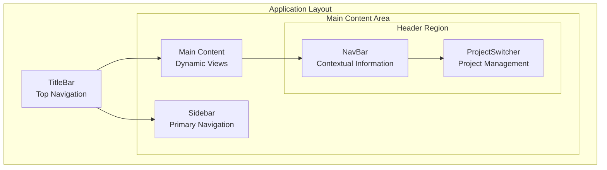
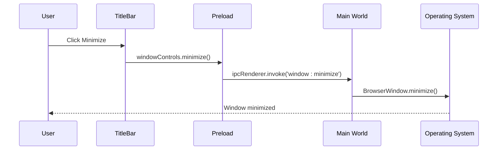
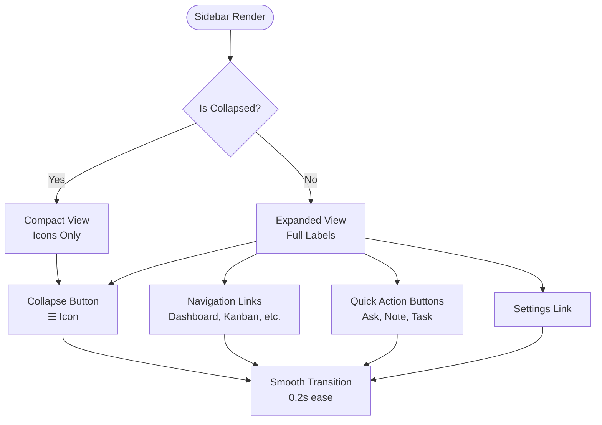
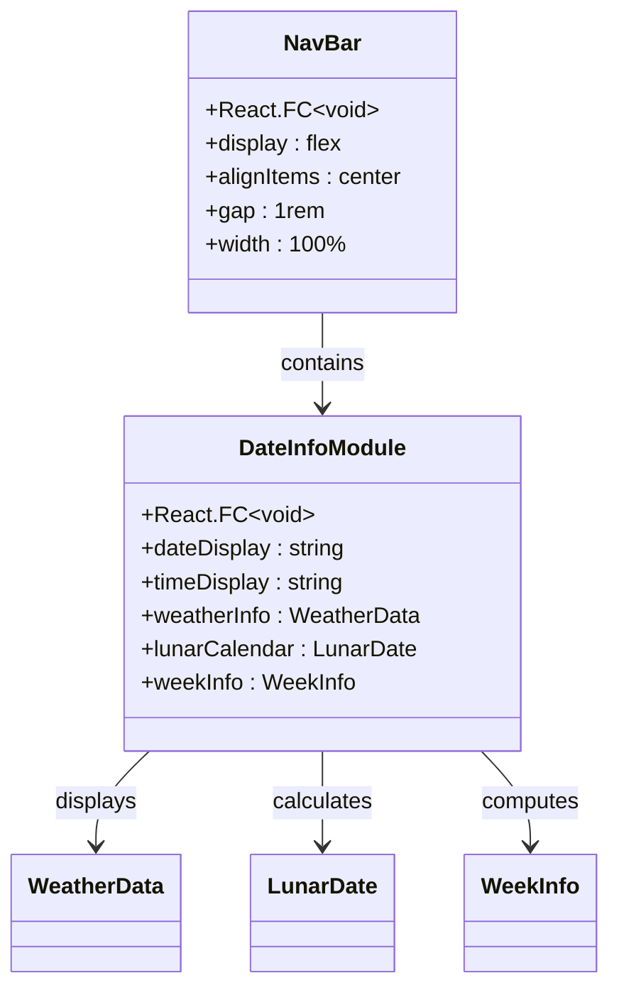
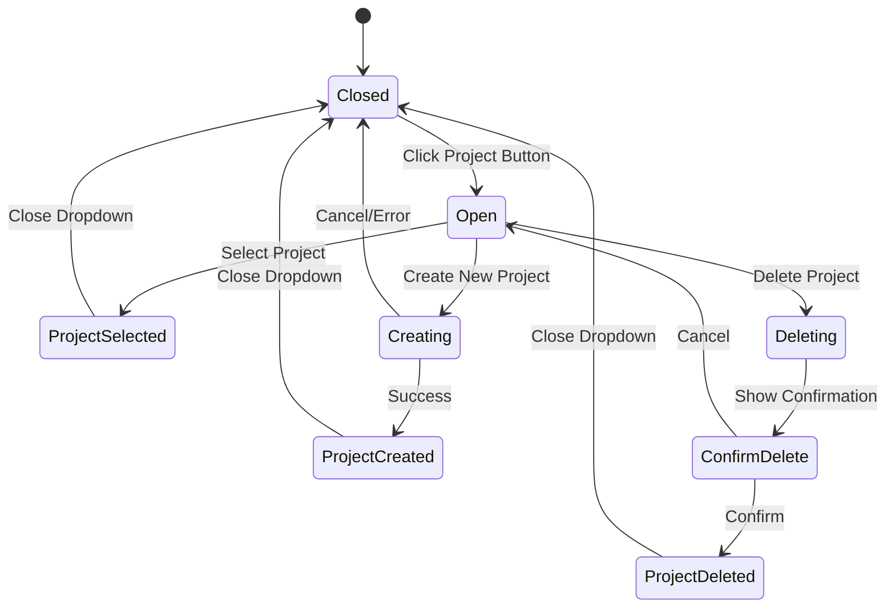
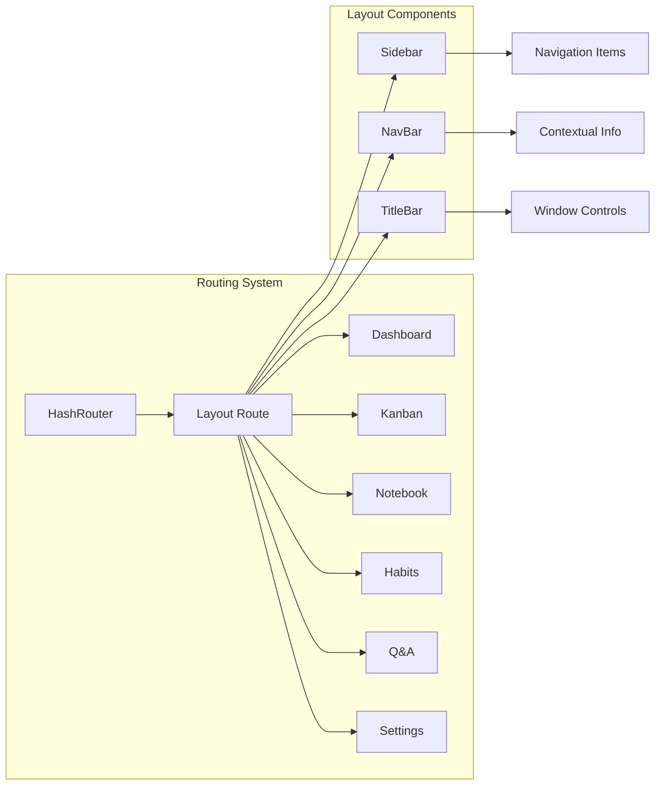

# Layout Components

<cite>
**Referenced Files in This Document**
- [App.tsx](file://src/renderer/App.tsx)
- [Sidebar.tsx](file://src/renderer/components/Sidebar.tsx)
- [NavBar.tsx](file://src/renderer/components/NavBar.tsx)
- [TitleBar.tsx](file://src/renderer/components/TitleBar.tsx)
- [ProjectSwitcher.tsx](file://src/renderer/components/ProjectSwitcher.tsx)
- [DateInfoModule.tsx](file://src/renderer/components/DateInfoModule.tsx)
- [MCPStatusIndicator.tsx](file://src/renderer/components/MCPStatusIndicator.tsx)
- [styles.css](file://src/renderer/styles.css)
- [types.ts](file://src/common/types.ts)
- [main.tsx](file://src/renderer/main.tsx)
- [preload/index.ts](file://src/preload/index.ts)
- [main/ipc/window.ts](file://src/main/ipc/window.ts)
</cite>

## Table of Contents
1. [Introduction](#introduction)
2. [Layout Architecture Overview](#layout-architecture-overview)
3. [TitleBar Component](#titlebar-component)
4. [Sidebar Component](#sidebar-component)
5. [NavBar Component](#navbar-component)
6. [ProjectSwitcher Component](#projectswitcher-component)
7. [Responsive Behavior and Platform Adaptations](#responsive-behavior-and-platform-adaptations)
8. [Navigation and Routing Integration](#navigation-and-routing-integration)
9. [Accessibility Features](#accessibility-features)
10. [Performance Considerations](#performance-considerations)
11. [Troubleshooting Guide](#troubleshooting-guide)
12. [Conclusion](#conclusion)

## Introduction

The LifeOS application employs a sophisticated layout system built around three primary structural UI components: TitleBar, Sidebar, and NavBar. These components work together to create a cohesive, responsive, and accessible desktop application interface that adapts to different screen sizes and platform-specific requirements.

The layout system is designed with modularity and flexibility in mind, allowing for easy customization while maintaining consistent user experience across all application views. Each component serves a specific purpose in the overall navigation and information architecture, with seamless integration between them to provide a unified user interface.

## Layout Architecture Overview

The application's layout follows a hierarchical structure where the TitleBar occupies the topmost position, followed by a main content area divided into sidebar and content sections. This architecture provides clear visual hierarchy and efficient space utilization.

**Diagram sources**
- [App.tsx](file://src/renderer/App.tsx#L25-L50)
- [TitleBar.tsx](file://src/renderer/components/TitleBar.tsx#L1-L63)
- [Sidebar.tsx](file://src/renderer/components/Sidebar.tsx#L1-L195)

The layout system utilizes CSS Grid for the main content area, enabling dynamic column sizing based on sidebar collapse state. This approach ensures optimal space utilization while maintaining responsive behavior across different screen sizes.

**Section sources**
- [App.tsx](file://src/renderer/App.tsx#L25-L50)
- [styles.css](file://src/renderer/styles.css#L1-L72)

## TitleBar Component

The TitleBar component serves as the primary window control interface and application branding element. It provides essential window management functionality while displaying application status indicators and branding information.

### Core Functionality

The TitleBar implements native window control functionality through Electron's IPC communication system. It exposes minimize, maximize/restore, and close buttons that integrate seamlessly with the operating system's window management.

**Diagram sources**
- [TitleBar.tsx](file://src/renderer/components/TitleBar.tsx#L20-L35)
- [preload/index.ts](file://src/preload/index.ts#L190-L195)
- [main/ipc/window.ts](file://src/main/ipc/window.ts#L4-L8)

### Window Control Implementation

The TitleBar component maintains synchronization between the UI state and actual window state through polling mechanisms. It tracks the maximized state of the window and updates the UI accordingly.

Key features include:
- **State Synchronization**: Polls window state on mount and during state changes
- **Visual Feedback**: Dynamic icons representing current window state
- **Accessibility**: Proper ARIA labels for screen reader support
- **Platform Integration**: Native window controls that match OS conventions

### Application Branding and Status

The TitleBar displays application branding ("LifeOS") and integrates the MCP (Model Context Protocol) status indicator, providing users with immediate feedback about the AI assistant's operational status.

**Section sources**
- [TitleBar.tsx](file://src/renderer/components/TitleBar.tsx#L1-L63)
- [MCPStatusIndicator.tsx](file://src/renderer/components/MCPStatusIndicator.tsx#L1-L136)
- [styles.css](file://src/renderer/styles.css#L15-L45)

## Sidebar Component

The Sidebar component provides primary navigation functionality with collapsible sections and quick action buttons. It serves as the main entry point for accessing different application modules and offers contextual information about the current project.

### Collapsible Navigation Structure

The Sidebar implements a sophisticated collapsible design that adapts to available screen space. When collapsed, it presents a compact icon-based navigation menu, while expanding to show full labels and additional functionality.

**Diagram sources**
- [Sidebar.tsx](file://src/renderer/components/Sidebar.tsx#L10-L25)
- [Sidebar.tsx](file://src/renderer/components/Sidebar.tsx#L40-L60)

### Navigation Integration

The Sidebar integrates with React Router's NavLink component to provide active state indication and smooth transitions between different application views. Each navigation item includes:

- **Visual Indicators**: Active state highlighting with color contrast
- **Hover Effects**: Subtle background changes on mouse hover
- **Keyboard Navigation**: Full keyboard accessibility support
- **Responsive Design**: Adaptive spacing and alignment

### Quick Action Buttons

The Sidebar includes floating quick action buttons that provide instant access to frequently used features. These buttons utilize gradient backgrounds and subtle animations to draw attention while maintaining visual harmony.

**Section sources**
- [Sidebar.tsx](file://src/renderer/components/Sidebar.tsx#L1-L195)

## NavBar Component

The NavBar component provides contextual information and secondary navigation elements within the main content area. It adapts dynamically to display relevant information based on the current page context.

### Current Implementation

The current NavBar implementation focuses on simplicity and integration with the DateInfoModule component. It serves as a container for contextual information while maintaining a clean, unobtrusive appearance.

**Diagram sources**
- [NavBar.tsx](file://src/renderer/components/NavBar.tsx#L1-L13)
- [DateInfoModule.tsx](file://src/renderer/components/DateInfoModule.tsx#L1-L385)

### Future Enhancements

The NavBar is designed to be extensible and can accommodate additional contextual information as the application evolves. Potential enhancements include:

- **Project Context**: Current project information and status
- **User Actions**: Quick access to user-related actions
- **Notifications**: Real-time notification indicators
- **Search Functionality**: Global search access

**Section sources**
- [NavBar.tsx](file://src/renderer/components/NavBar.tsx#L1-L13)
- [DateInfoModule.tsx](file://src/renderer/components/DateInfoModule.tsx#L1-L385)

## ProjectSwitcher Component

The ProjectSwitcher component provides comprehensive project management functionality within the navigation interface. It allows users to switch between different projects, view project statistics, and manage project lifecycle operations.

### Project Management Features

The ProjectSwitcher implements a dropdown interface that displays all available projects with detailed statistics and management capabilities.

**Diagram sources**
- [ProjectSwitcher.tsx](file://src/renderer/components/ProjectSwitcher.tsx#L20-L40)
- [ProjectSwitcher.tsx](file://src/renderer/components/ProjectSwitcher.tsx#L120-L150)

### Project Statistics Integration

The component fetches and displays comprehensive project statistics including task counts, completion rates, and progress indicators. This information helps users quickly assess project status and prioritize their work.

Key statistics displayed:
- **Total Tasks**: Complete count of all tasks in the project
- **Completed Tasks**: Number of completed tasks with green highlighting
- **In Progress Tasks**: Active tasks with orange highlighting
- **Task Distribution**: Visual representation of task status distribution

### Accessibility and Interaction

The ProjectSwitcher implements robust accessibility features including:
- **Keyboard Navigation**: Full keyboard support for all interactive elements
- **Screen Reader Support**: Proper ARIA labels and roles
- **Focus Management**: Logical focus flow and visual indicators
- **Error Handling**: Clear feedback for operation failures

**Section sources**
- [ProjectSwitcher.tsx](file://src/renderer/components/ProjectSwitcher.tsx#L1-L326)

## Responsive Behavior and Platform Adaptations

The layout system implements comprehensive responsive behavior and platform-specific adaptations to ensure optimal user experience across different environments.

### Breakpoint Management

The application uses CSS Grid with flexible column sizing to adapt to different screen widths. The sidebar implements a two-state responsive design:

- **Desktop Mode**: 220px wide sidebar with full navigation
- **Mobile Mode**: 70px wide sidebar with icon-only navigation
- **Transition**: Smooth 0.2s ease animations during state changes

### Platform-Specific Adaptations

The layout system accounts for platform differences in window management and user interface conventions:

- **Windows/Linux**: Standard window controls with native appearance
- **macOS**: TitleBar integration with traffic light controls
- **Touch Devices**: Enhanced touch targets and gesture support

### Touch and Gesture Support

While primarily designed for desktop use, the layout system incorporates touch-friendly elements:
- **Enhanced Click Targets**: Minimum 44px touch targets
- **Visual Feedback**: Subtle animations for user interactions
- **Gesture Recognition**: Support for swipe gestures on compatible devices

**Section sources**
- [App.tsx](file://src/renderer/App.tsx#L30-L40)
- [styles.css](file://src/renderer/styles.css#L15-L45)

## Navigation and Routing Integration

The layout components integrate seamlessly with React Router to provide a cohesive navigation experience throughout the application.

### Route Structure Integration

The main App component defines the route structure and passes necessary props to layout components for proper functionality:

**Diagram sources**
- [App.tsx](file://src/renderer/App.tsx#L120-L175)
- [App.tsx](file://src/renderer/App.tsx#L25-L50)

### State Management Integration

The layout components maintain state through React hooks and prop drilling from the main App component. This approach ensures consistent state management across all layout elements.

Key state management features:
- **Project Selection**: Centralized project state management
- **Sidebar Collapse**: Local state for sidebar expansion
- **Navigation Persistence**: URL-based navigation state

**Section sources**
- [App.tsx](file://src/renderer/App.tsx#L120-L175)
- [App.tsx](file://src/renderer/App.tsx#L55-L120)

## Accessibility Features

The layout components implement comprehensive accessibility features to ensure usability for all users, including those using assistive technologies.

### Keyboard Navigation Support

All interactive elements support full keyboard navigation:
- **Tab Order**: Logical tab sequence through all interactive elements
- **Arrow Keys**: Navigation within dropdown menus and lists
- **Enter/Space**: Activation of interactive elements
- **Escape**: Closing dropdowns and dialogs

### Screen Reader Support

The components implement proper ARIA labeling and semantic markup:
- **ARIA Labels**: Descriptive labels for all interactive elements
- **Role Attributes**: Proper semantic roles for complex components
- **Live Regions**: Dynamic content updates announced to screen readers
- **Focus Management**: Clear focus indicators and logical focus flow

### Visual Accessibility

The layout system incorporates visual accessibility features:
- **High Contrast**: Sufficient color contrast ratios
- **Scalable Text**: Responsive typography that works with browser zoom
- **Color Independence**: Information conveyed through multiple modalities
- **Motion Preferences**: Respects user motion preferences

### Alternative Input Methods

The components support alternative input methods:
- **Voice Commands**: Compatible with voice control systems
- **Switch Access**: Support for switch-based input devices
- **Touch Interfaces**: Optimized for touch-based interaction

**Section sources**
- [Sidebar.tsx](file://src/renderer/components/Sidebar.tsx#L45-L55)
- [ProjectSwitcher.tsx](file://src/renderer/components/ProjectSwitcher.tsx#L120-L140)
- [TitleBar.tsx](file://src/renderer/components/TitleBar.tsx#L45-L55)

## Performance Considerations

The layout system is optimized for performance across different scenarios and device capabilities.

### Rendering Optimization

The layout components implement several performance optimization strategies:
- **Memoization**: React.memo for expensive calculations
- **Lazy Loading**: Conditional rendering of non-critical components
- **Virtual Scrolling**: Efficient rendering of large lists
- **Debounced Updates**: Throttled state updates for rapid changes

### Memory Management

The components are designed with memory efficiency in mind:
- **Event Listener Cleanup**: Proper cleanup of event listeners
- **Reference Management**: Efficient component reference handling
- **State Optimization**: Minimal state updates and storage

### Network Performance

The ProjectSwitcher component optimizes network requests:
- **Caching**: Local caching of project statistics
- **Batch Requests**: Combined API calls where possible
- **Error Recovery**: Graceful degradation on network failure
- **Loading States**: Clear indication of asynchronous operations

**Section sources**
- [ProjectSwitcher.tsx](file://src/renderer/components/ProjectSwitcher.tsx#L60-L90)
- [DateInfoModule.tsx](file://src/renderer/components/DateInfoModule.tsx#L80-L120)

## Troubleshooting Guide

Common issues and solutions for layout component functionality:

### Window Control Issues

**Problem**: Window controls not responding
**Solution**: Verify preload script is properly loaded and IPC channels are established

**Problem**: Maximization state incorrect
**Solution**: Check window state polling mechanism and ensure proper state synchronization

### Navigation Problems

**Problem**: Sidebar navigation not working
**Solution**: Verify React Router configuration and NavLink component implementation

**Problem**: Project switching not updating context
**Solution**: Check state propagation from App component to layout components

### Performance Issues

**Problem**: Slow sidebar collapse/expand
**Solution**: Review CSS transition properties and ensure hardware acceleration

**Problem**: Memory leaks in long sessions
**Solution**: Verify proper cleanup of event listeners and timers

### Accessibility Concerns

**Problem**: Keyboard navigation not working
**Solution**: Check focus management and keyboard event handlers

**Problem**: Screen reader not announcing changes
**Solution**: Verify ARIA attributes and live region implementation

**Section sources**
- [TitleBar.tsx](file://src/renderer/components/TitleBar.tsx#L10-L25)
- [Sidebar.tsx](file://src/renderer/components/Sidebar.tsx#L10-L25)
- [ProjectSwitcher.tsx](file://src/renderer/components/ProjectSwitcher.tsx#L25-L45)

## Conclusion

The LifeOS layout components provide a robust foundation for a modern desktop application interface. Through careful integration of responsive design, accessibility features, and performance optimization, these components deliver a seamless user experience across different platforms and usage scenarios.

The modular architecture allows for easy extension and customization while maintaining consistency across the application. The comprehensive accessibility implementation ensures that all users can effectively navigate and interact with the application's functionality.

Future enhancements could include expanded contextual information in the NavBar, additional quick action buttons in the Sidebar, and enhanced mobile responsiveness for tablet devices. The current implementation provides an excellent foundation for these potential improvements while maintaining stability and performance.