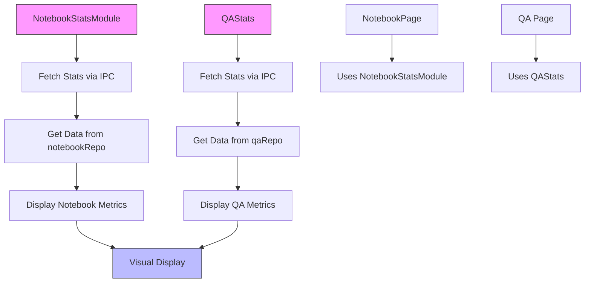
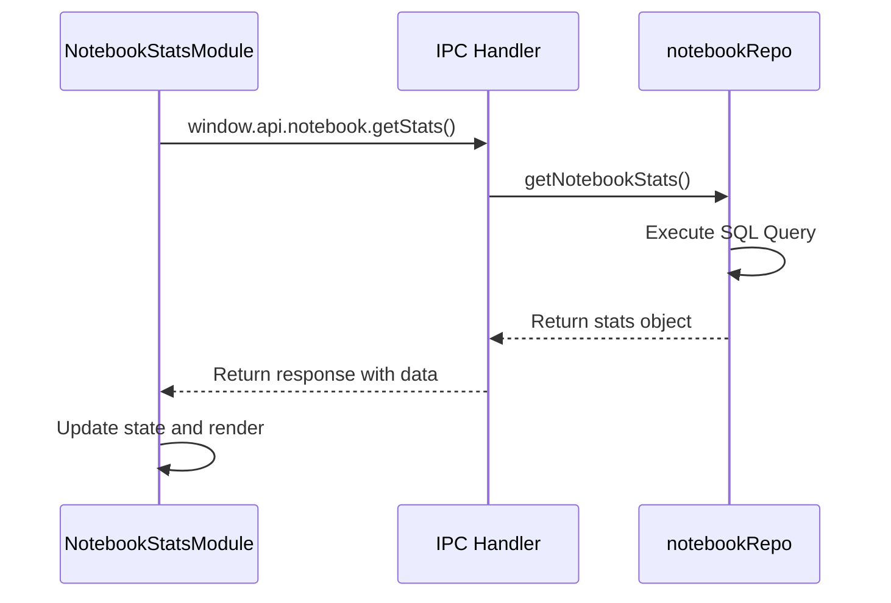
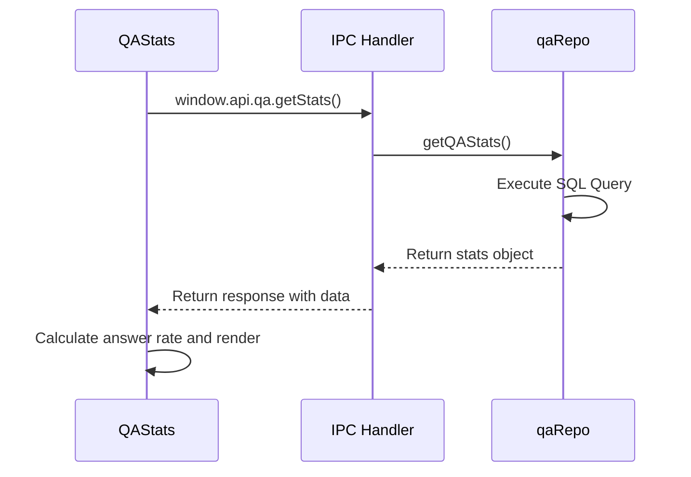
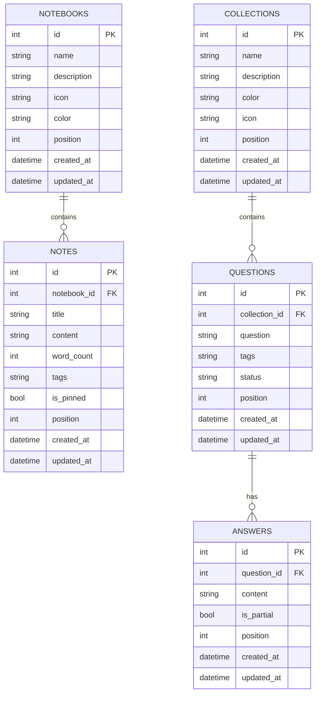
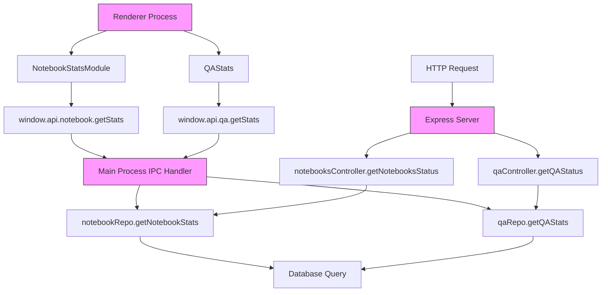
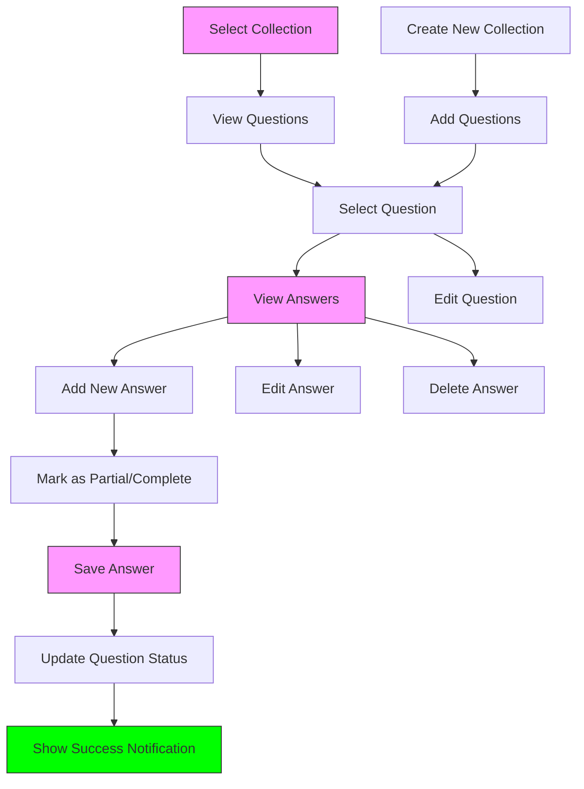
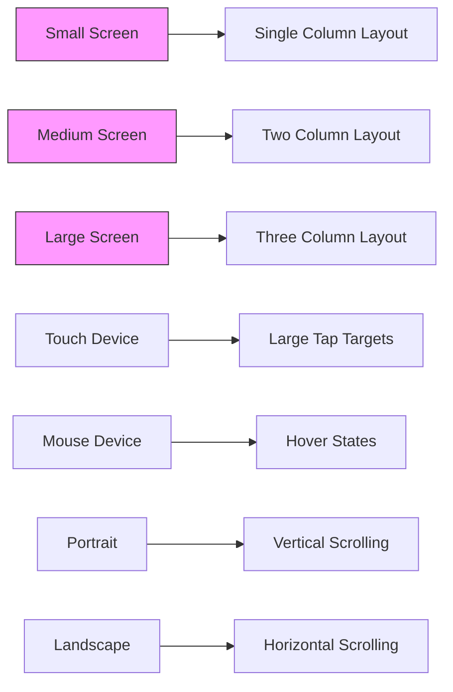
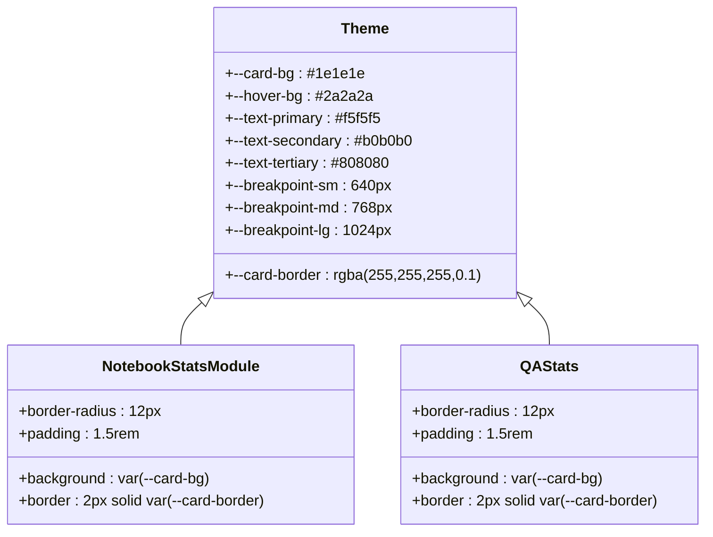

# Notebook and QA Components

<cite>
**Referenced Files in This Document**   
- [NotebookStatsModule.tsx](file://src/renderer/components/NotebookStatsModule.tsx)
- [QAStats.tsx](file://src/renderer/components/QAStats.tsx)
- [notebookRepo.ts](file://src/database/notebookRepo.ts)
- [qaRepo.ts](file://src/database/qaRepo.ts)
- [notebookSchema.ts](file://src/database/notebookSchema.ts)
- [qaSchema.ts](file://src/database/qaSchema.ts)
- [NotebookPage.tsx](file://src/renderer/pages/NotebookPage.tsx)
- [QA.tsx](file://src/renderer/pages/QA.tsx)
- [notebook.ts](file://src/main/ipc/notebook.ts)
- [qa.ts](file://src/main/ipc/qa.ts)
- [notebooksController.ts](file://src/server/controllers/notebooksController.ts)
- [qaController.ts](file://src/server/controllers/qaController.ts)
- [styles.css](file://src/renderer/styles.css)
- [UI-CUSTOMIZATION.md](file://AI/UI-CUSTOMIZATION.md)
</cite>

## Table of Contents
1. [Introduction](#introduction)
2. [Core Components Overview](#core-components-overview)
3. [NotebookStatsModule Implementation](#notebookstatsmodule-implementation)
4. [QAStats Component Implementation](#qastats-component-implementation)
5. [Database Repository Integration](#database-repository-integration)
6. [IPC and API Integration](#ipc-and-api-integration)
7. [UI Patterns for Question-Answer Interaction](#ui-patterns-for-question-answer-interaction)
8. [Responsive Design Considerations](#responsive-design-considerations)
9. [Visual Consistency with Application Theme](#visual-consistency-with-application-theme)
10. [Conclusion](#conclusion)

## Introduction
The Notebook and QA Components in the LifeOS application provide comprehensive knowledge management features that enable users to track their knowledge retention and progress. These components offer detailed statistics modules that display key metrics about user activity and engagement with their knowledge base. The NotebookStatsModule tracks notebook usage and writing activity, while the QAStats component monitors question-answer interactions and knowledge completion rates. Together, these components form a powerful system for users to understand their learning patterns and identify areas for improvement in their knowledge management workflow.

**Section sources**
- [NotebookStatsModule.tsx](file://src/renderer/components/NotebookStatsModule.tsx)
- [QAStats.tsx](file://src/renderer/components/QAStats.tsx)

## Core Components Overview
The knowledge management system consists of two primary statistical components: NotebookStatsModule and QAStats. The NotebookStatsModule provides insights into the user's notebook activity, displaying metrics such as total notebooks, number of notes, total word count, and recent activity. The QAStats component focuses on the question-answer knowledge base, showing statistics on total collections, questions, answer rates, and progress status. Both components follow a similar architectural pattern of fetching data from their respective repositories through IPC handlers and displaying the information in a visually consistent card-based interface that aligns with the application's overall design language.

**Diagram sources**
- [NotebookStatsModule.tsx](file://src/renderer/components/NotebookStatsModule.tsx)
- [QAStats.tsx](file://src/renderer/components/QAStats.tsx)
- [notebookRepo.ts](file://src/database/notebookRepo.ts)
- [qaRepo.ts](file://src/database/qaRepo.ts)

**Section sources**
- [NotebookStatsModule.tsx](file://src/renderer/components/NotebookStatsModule.tsx)
- [QAStats.tsx](file://src/renderer/components/QAStats.tsx)

## NotebookStatsModule Implementation
The NotebookStatsModule component displays key metrics about the user's notebook activity. It fetches statistics through the IPC interface by calling `window.api.notebook.getStats()` and updates the display every minute through a setInterval timer. The component shows four primary metrics: total notebooks, total notes, total word count, and notes created in the last seven days. Each metric is presented in a card format with an icon, label, and value, using distinct colors to differentiate between the different types of data. The component handles loading states and errors gracefully, displaying a "Loading..." message when data is being fetched and logging errors to the console if the fetch operation fails.

**Diagram sources**
- [NotebookStatsModule.tsx](file://src/renderer/components/NotebookStatsModule.tsx)
- [notebook.ts](file://src/main/ipc/notebook.ts)
- [notebookRepo.ts](file://src/database/notebookRepo.ts)

**Section sources**
- [NotebookStatsModule.tsx](file://src/renderer/components/NotebookStatsModule.tsx)

## QAStats Component Implementation
The QAStats component provides a comprehensive overview of the user's question-answer knowledge base. It fetches statistics by calling `window.api.qa.getStats()` through the IPC interface and displays key metrics including total collections, total questions, answer rate, and breakdown of unanswered, in-progress, and answered questions. The component calculates the answer rate as a percentage based on the ratio of answered questions to total questions. The UI presents the data in a clean, card-based layout with a two-column grid for primary metrics and a horizontal badge system for status breakdown. Each status type (unanswered, in-progress, answered) is color-coded for quick visual recognition, and additional metadata about collections and answers is displayed in a subtle footer section.

**Diagram sources**
- [QAStats.tsx](file://src/renderer/components/QAStats.tsx)
- [qa.ts](file://src/main/ipc/qa.ts)
- [qaRepo.ts](file://src/database/qaRepo.ts)

**Section sources**
- [QAStats.tsx](file://src/renderer/components/QAStats.tsx)

## Database Repository Integration
The statistical components integrate with the application's database through dedicated repository modules that handle data access and business logic. The notebookRepo provides the `getNotebookStats()` function, which executes a SQL query to calculate key metrics including total notebooks, total notes, total word count, and recent notes (created within the last seven days). Similarly, the qaRepo offers the `getQAStats()` function that queries the database for statistics on collections, questions, and answers, including breakdowns by status (unanswered, in-progress, answered). Both repositories use SQLite with optimized queries and proper indexing to ensure efficient data retrieval. The schema definitions in notebookSchema.ts and qaSchema.ts establish the database structure with appropriate constraints, foreign keys, and indices for performance.

**Diagram sources**
- [notebookRepo.ts](file://src/database/notebookRepo.ts)
- [qaRepo.ts](file://src/database/qaRepo.ts)
- [notebookSchema.ts](file://src/database/notebookSchema.ts)
- [qaSchema.ts](file://src/database/qaSchema.ts)

**Section sources**
- [notebookRepo.ts](file://src/database/notebookRepo.ts)
- [qaRepo.ts](file://src/database/qaRepo.ts)

## IPC and API Integration
The statistical components communicate with the database through a well-defined IPC (Inter-Process Communication) layer that bridges the renderer process and the main Electron process. The notebook.ts IPC handler exposes the `getStats` method that wraps the `getNotebookStats` function from the notebook repository, while the qa.ts handler provides a similar `getStats` method for the QA statistics. These handlers use the `wrapIpc` utility to standardize response formatting and error handling. Additionally, the components can be accessed through the Express-based server API, with endpoints in notebooksController.ts and qaController.ts that expose the same statistical data for potential external consumption. This multi-layered integration approach ensures that the statistical data is accessible through multiple channels while maintaining consistent data retrieval patterns.

**Diagram sources**
- [notebook.ts](file://src/main/ipc/notebook.ts)
- [qa.ts](file://src/main/ipc/qa.ts)
- [notebooksController.ts](file://src/server/controllers/notebooksController.ts)
- [qaController.ts](file://src/server/controllers/qaController.ts)

**Section sources**
- [notebook.ts](file://src/main/ipc/notebook.ts)
- [qa.ts](file://src/main/ipc/qa.ts)

## UI Patterns for Question-Answer Interaction
The QA component implements a comprehensive user interface for managing question-answer knowledge with a three-panel layout that facilitates efficient interaction. The left panel displays collections, the middle panel shows questions within the selected collection, and the right panel presents answers to the selected question. Users can create new collections and questions through modal dialogs that appear as overlays. When viewing a question, users can add multiple answers, with the ability to mark each answer as partial or complete. Existing answers can be edited or deleted through inline controls that appear on hover. The interface uses color coding to indicate the status of questions (unanswered, in-progress, answered) and provides immediate visual feedback for all user actions through success notifications. The markdown editor allows rich text formatting in both questions and answers, supporting a wide range of formatting options for detailed knowledge capture.

**Diagram sources**
- [QA.tsx](file://src/renderer/pages/QA.tsx)

**Section sources**
- [QA.tsx](file://src/renderer/pages/QA.tsx)

## Responsive Design Considerations
The Notebook and QA components are designed with responsive layouts that adapt to different screen sizes and device types. The components use CSS grid and flexbox layouts with relative units and media queries to ensure proper display across various viewports. On smaller screens, the three-column layout of the QA component may adjust to a more vertical arrangement to accommodate limited horizontal space. The UI components use a consistent spacing system based on rem units, allowing them to scale appropriately with the user's font size preferences. Interactive elements maintain adequate touch targets for mobile devices, and the interface avoids fixed pixel dimensions in favor of fluid, percentage-based layouts. The responsive design principles are documented in the UI-CUSTOMIZATION.md file, which outlines the breakpoint system and responsive layout components used throughout the application.

**Diagram sources**
- [QA.tsx](file://src/renderer/pages/QA.tsx)
- [NotebookPage.tsx](file://src/renderer/pages/NotebookPage.tsx)
- [UI-CUSTOMIZATION.md](file://AI/UI-CUSTOMIZATION.md)

**Section sources**
- [QA.tsx](file://src/renderer/pages/QA.tsx)
- [NotebookPage.tsx](file://src/renderer/pages/NotebookPage.tsx)

## Visual Consistency with Application Theme
The Notebook and QA components maintain visual consistency with the overall application theme through the use of shared CSS variables and design tokens. The components use the application's color palette, with specific colors for different types of data (e.g., teal for notebook metrics, purple for note-related information, orange for recent activity, and red for time-based metrics). The card-based design pattern with rounded corners, borders, and hover effects is consistent across all UI components. Typography follows the application's font stack with appropriate font sizes and line heights for optimal readability. The components use the same spacing system and border radii as other parts of the application, ensuring a cohesive visual language. The dark theme with light text provides excellent contrast for extended reading and writing sessions, while the subtle background variations help distinguish between different content areas.

**Diagram sources**
- [styles.css](file://src/renderer/styles.css)
- [NotebookStatsModule.tsx](file://src/renderer/components/NotebookStatsModule.tsx)
- [QAStats.tsx](file://src/renderer/components/QAStats.tsx)

**Section sources**
- [styles.css](file://src/renderer/styles.css)
- [UI-CUSTOMIZATION.md](file://AI/UI-CUSTOMIZATION.md)

## Conclusion
The Notebook and QA Components provide a robust knowledge management system that enables users to track their learning progress and knowledge retention effectively. The NotebookStatsModule and QAStats components offer valuable insights into user activity through well-designed statistical displays that integrate seamlessly with the application's database and IPC architecture. The components follow consistent design patterns and maintain visual harmony with the overall application theme, while also adapting gracefully to different screen sizes and device types. The integration between the frontend components, IPC handlers, and database repositories demonstrates a well-structured architecture that prioritizes data consistency and user experience. These components serve as excellent examples of how to implement feature-rich, data-driven interfaces that support effective knowledge management and personal growth tracking.