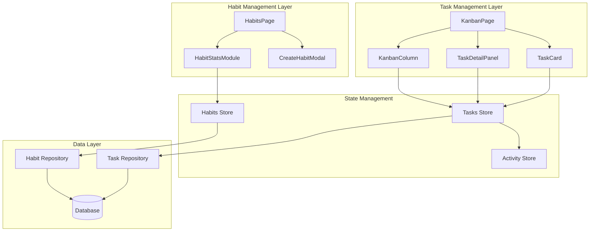
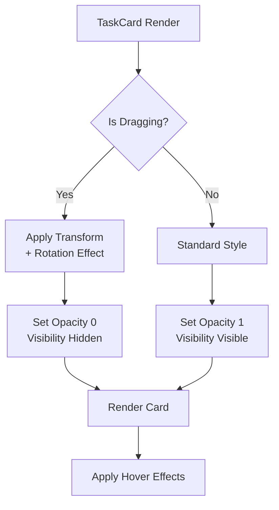
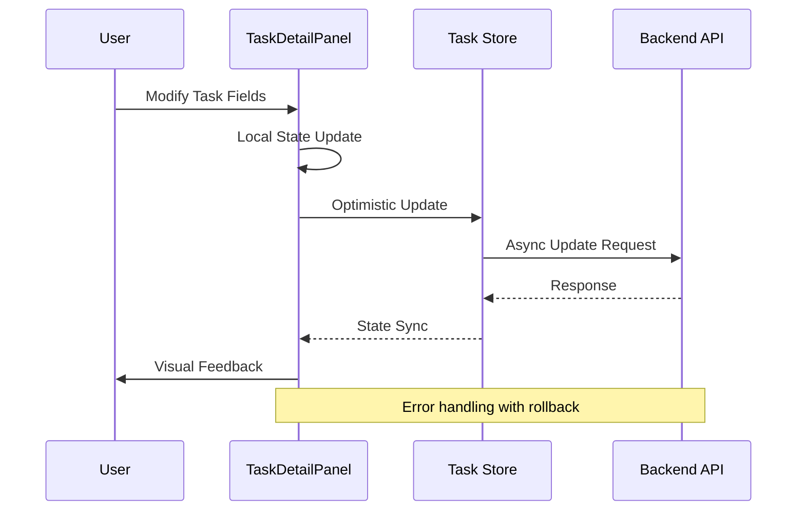
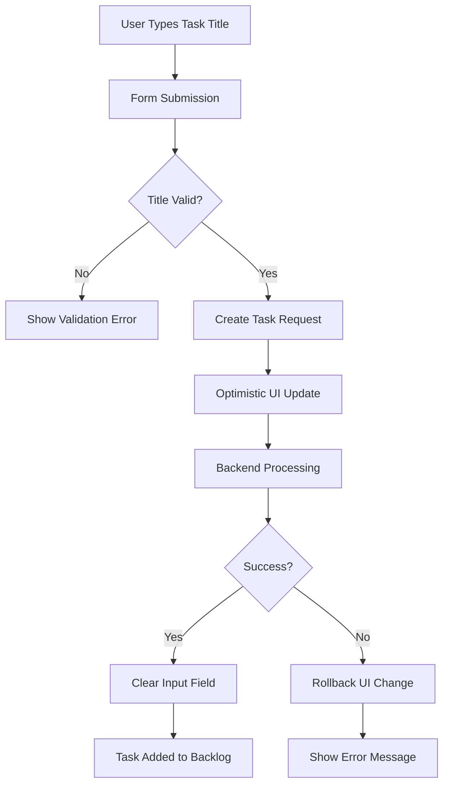
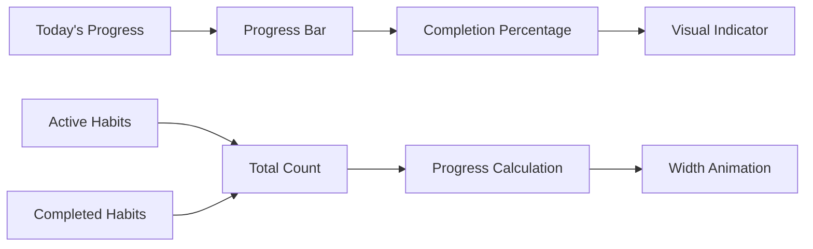
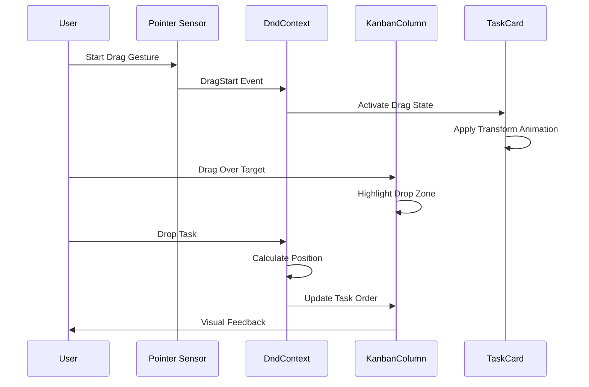
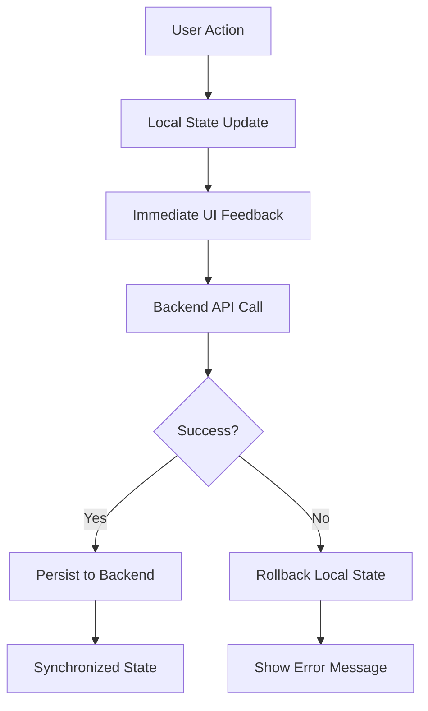

# Task and Habit Management Components

<cite>
**Referenced Files in This Document**
- [TaskCard.tsx](file://src/renderer/components/TaskCard.tsx)
- [TaskDetailPanel.tsx](file://src/renderer/components/TaskDetailPanel.tsx)
- [KanbanColumn.tsx](file://src/renderer/components/KanbanColumn.tsx)
- [HabitStatsModule.tsx](file://src/renderer/components/HabitStatsModule.tsx)
- [KanbanPage.tsx](file://src/renderer/pages/KanbanPage.tsx)
- [HabitsPage.tsx](file://src/renderer/pages/HabitsPage.tsx)
- [constants.ts](file://src/renderer/constants.ts)
- [types.ts](file://src/common/types.ts)
- [tasks.ts](file://src/store/tasks.ts)
- [habits.ts](file://src/store/habits.ts)
- [habitsSchema.ts](file://src/database/habitsSchema.ts)
- [tasksRepo.ts](file://src/database/tasksRepo.ts)
</cite>

## Table of Contents
1. [Introduction](#introduction)
2. [Component Architecture Overview](#component-architecture-overview)
3. [TaskCard Component](#taskcard-component)
4. [TaskDetailPanel Component](#taskdetailpanel-component)
5. [KanbanColumn Component](#kanbancolumn-component)
6. [HabitStatsModule Component](#habitstatsmodule-component)
7. [Drag-and-Drop Implementation](#drag-and-drop-implementation)
8. [State Management Patterns](#state-management-patterns)
9. [Form Controls and Validation](#form-controls-and-validation)
10. [Customization and Theming](#customization-and-theming)
11. [Performance Considerations](#performance-considerations)
12. [Troubleshooting Guide](#troubleshooting-guide)
13. [Conclusion](#conclusion)

## Introduction

The Task and Habit Management Components form the core productivity features of LifeOS, providing users with powerful tools for organizing tasks and tracking habits. These components implement sophisticated drag-and-drop functionality, real-time state management, and customizable interfaces that enable efficient workflow management and habit formation.

The system consists of four primary components: TaskCard for individual task representation, TaskDetailPanel for comprehensive task editing, KanbanColumn for organizing tasks in workflow stages, and HabitStatsModule for tracking habit progress. Together, they create an integrated productivity ecosystem that supports both task management and habit tracking workflows.

## Component Architecture Overview

The Task and Habit Management system follows a modular architecture with clear separation of concerns:



**Diagram sources**
- [TaskCard.tsx](file://src/renderer/components/TaskCard.tsx#L1-L182)
- [TaskDetailPanel.tsx](file://src/renderer/components/TaskDetailPanel.tsx#L1-L606)
- [KanbanColumn.tsx](file://src/renderer/components/KanbanColumn.tsx#L1-L104)
- [HabitStatsModule.tsx](file://src/renderer/components/HabitStatsModule.tsx#L1-L170)
- [KanbanPage.tsx](file://src/renderer/pages/KanbanPage.tsx#L1-L520)
- [HabitsPage.tsx](file://src/renderer/pages/HabitsPage.tsx#L1-L299)

## TaskCard Component

The TaskCard component serves as the primary visual representation of individual tasks within the Kanban system. It implements sophisticated drag-and-drop capabilities using @dnd-kit/core and provides interactive task previews with rich metadata display.

### Core Features

**Drag-and-Drop Integration**: TaskCard integrates seamlessly with the dnd-kit sortable system, providing smooth drag animations and visual feedback during task reordering operations.

**Visual Hierarchy**: The component displays task information in a structured layout with priority indicators, due dates, and tags, creating clear visual cues for task importance and status.

**Interactive Elements**: Users can double-click task cards to open detailed editing panels, while the card itself remains interactive for drag operations.

### Design Implementation

The TaskCard uses a dynamic styling system that responds to drag states:



**Diagram sources**
- [TaskCard.tsx](file://src/renderer/components/TaskCard.tsx#L15-L40)

### Priority System Integration

The TaskCard implements the Eisenhower Matrix priority system, displaying contextual priority labels and colors based on task characteristics:

| Priority Level | Description | Color | Background |
|----------------|-------------|-------|------------|
| Critical | Urgent & Important | `#FF5252` | `rgba(255, 82, 82, 0.15)` |
| Delegate | Urgent & Not Important | `#FF9800` | `rgba(255, 152, 0, 0.15)` |
| Schedule | Not Urgent & Important | `#03DAC6` | `rgba(3, 218, 198, 0.15)` |
| Low | Not Urgent & Not Important | `#9E9E9E` | `rgba(158, 158, 158, 0.15)` |

**Section sources**
- [TaskCard.tsx](file://src/renderer/components/TaskCard.tsx#L1-L182)

## TaskDetailPanel Component

The TaskDetailPanel provides comprehensive task editing capabilities with advanced form controls, validation, and workflow management features. It serves as the primary interface for task modification and deletion operations.

### Form Control Architecture

The TaskDetailPanel implements a sophisticated form system with multiple input types:

**Text Inputs**: Standard title and tag inputs with real-time validation and character limits.
**Rich Text Editor**: Markdown-enabled description editor with live preview functionality.
**Priority Selection**: Interactive priority buttons representing the Eisenhower Matrix framework.
**Date Management**: Flexible due date selection with quick-action buttons for common dates.
**Time Estimation**: Numeric input with preset time intervals and automatic conversion.
**Status Controls**: Workflow status buttons with visual feedback and transition animations.

### State Management Pattern

The component uses local state management with optimistic updates:



**Diagram sources**
- [TaskDetailPanel.tsx](file://src/renderer/components/TaskDetailPanel.tsx#L25-L80)
- [KanbanPage.tsx](file://src/renderer/pages/KanbanPage.tsx#L85-L120)

### Validation and Error Handling

The TaskDetailPanel implements comprehensive validation:

**Required Field Validation**: Ensures task title is provided before submission.
**Type Validation**: Validates numeric inputs for time estimation and handles null values appropriately.
**Format Validation**: Ensures date formats are valid and tags are properly formatted.
**Business Logic Validation**: Prevents invalid status transitions and maintains workflow integrity.

**Section sources**
- [TaskDetailPanel.tsx](file://src/renderer/components/TaskDetailPanel.tsx#L1-L606)

## KanbanColumn Component

The KanbanColumn component organizes tasks into workflow stages and provides the foundation for drag-and-drop task management. It implements column-based task filtering and creation functionality.

### Column Organization

Each KanbanColumn represents a workflow stage with specific characteristics:

**Backlog Column**: Contains unassigned tasks with creation form for adding new tasks.
**To-Do Column**: Tasks ready for assignment with sorting capabilities.
**In Progress Column**: Active tasks with progress tracking.
**Completed Column**: Finished tasks with completion tracking.

### Task Creation Flow

The Backlog column implements a streamlined task creation process:



**Diagram sources**
- [KanbanColumn.tsx](file://src/renderer/components/KanbanColumn.tsx#L15-L35)

### Drop Zone Integration

The KanbanColumn integrates with the dnd-kit droppable system to enable task movement between columns:

**Visual Feedback**: Columns highlight when tasks are dragged over them.
**Drop Validation**: Only valid drop targets accept dragged tasks.
**Position Calculation**: Automatic positioning calculation for dropped tasks.

**Section sources**
- [KanbanColumn.tsx](file://src/renderer/components/KanbanColumn.tsx#L1-L104)

## HabitStatsModule Component

The HabitStatsModule provides real-time habit tracking statistics and progress visualization. It displays key metrics that motivate users and track habit formation progress.

### Statistics Display

The component presents four key habit metrics:

**Total Habits**: Number of active habits in the system.
**Completed Today**: Count of habits completed within the current day.
**Best Streak**: Longest consecutive days of habit completion.
**Completion Rate**: Average completion percentage over the past 30 days.

### Progress Visualization

The HabitStatsModule implements animated progress indicators:



**Diagram sources**
- [HabitStatsModule.tsx](file://src/renderer/components/HabitStatsModule.tsx#L120-L150)

### Dynamic Color Coding

The module uses color-coded indicators for different habit metrics:

| Metric | Color | Purpose |
|--------|-------|---------|
| Total Habits | Purple (`#6200EE`) | Base metric display |
| Completed Today | Teal (`#03DAC6`) | Daily achievement |
| Best Streak | Orange (`#FF9800`) | Long-term consistency |
| Completion Rate | Green (`#4CAF50`) | Overall performance |

**Section sources**
- [HabitStatsModule.tsx](file://src/renderer/components/HabitStatsModule.tsx#L1-L170)

## Drag-and-Drop Implementation

The drag-and-drop system uses @dnd-kit/core for smooth, responsive task manipulation across the Kanban board.

### Core Implementation

The drag-and-drop system operates through several interconnected components:



**Diagram sources**
- [KanbanPage.tsx](file://src/renderer/pages/KanbanPage.tsx#L250-L350)

### Position Management

The system implements sophisticated position management for task ordering:

**Automatic Positioning**: New tasks receive automatic position values based on column order.
**Reordering Logic**: Tasks can be reordered within columns or moved between columns.
**Position Synchronization**: Backend position values are maintained and synchronized with UI changes.

### Collision Detection

The system uses closestCenter collision detection for precise drop target identification:

**Precision Placement**: Tasks snap to exact positions within target columns.
**Multi-column Movement**: Smooth transitions between different workflow stages.
**Visual Feedback**: Real-time highlighting of valid drop zones.

**Section sources**
- [KanbanPage.tsx](file://src/renderer/pages/KanbanPage.tsx#L250-L400)

## State Management Patterns

The Task and Habit Management system employs a layered state management approach combining local component state, global stores, and backend synchronization.

### Store Architecture

**Tasks Store**: Manages task-related state with project-scoped data isolation.
**Habits Store**: Handles habit data with logging and statistics aggregation.
**Activity Store**: Tracks user actions for analytics and audit trails.

### Optimistic Updates

Both task and habit operations implement optimistic updates for improved user experience:



**Diagram sources**
- [tasks.ts](file://src/store/tasks.ts#L40-L80)
- [habits.ts](file://src/store/habits.ts#L50-L90)

### Data Persistence

The system ensures data consistency through multiple mechanisms:

**Automatic Synchronization**: Periodic backend synchronization prevents data loss.
**Conflict Resolution**: Last-write-wins strategy handles concurrent modifications.
**Offline Capability**: Local storage caching enables offline operation.

**Section sources**
- [tasks.ts](file://src/store/tasks.ts#L1-L133)
- [habits.ts](file://src/store/habits.ts#L1-L161)

## Form Controls and Validation

The form control system provides comprehensive input handling with real-time validation and user feedback.

### Input Type Support

**Text Inputs**: Support for plain text with Markdown rendering capabilities.
**Date Pickers**: Native date inputs with quick-action buttons.
**Number Inputs**: Time estimation with preset intervals and validation.
**Checkbox/Toggle**: Status and completion state management.
**Dropdown Selectors**: Priority and frequency selection with predefined options.

### Validation Pipeline

The validation system operates at multiple levels:

**Client-side Validation**: Immediate feedback for user input errors.
**Server-side Validation**: Comprehensive validation against business rules.
**Real-time Validation**: Continuous validation during user interaction.

### Error Handling

The system implements graceful error handling:

**User-friendly Messages**: Clear, actionable error messages for user guidance.
**Recovery Options**: Automatic retry mechanisms for transient failures.
**State Recovery**: Rollback capabilities for failed operations.

**Section sources**
- [TaskDetailPanel.tsx](file://src/renderer/components/TaskDetailPanel.tsx#L25-L100)
- [HabitsPage.tsx](file://src/renderer/pages/HabitsPage.tsx#L20-L80)

## Customization and Theming

The system provides extensive customization options through CSS variables and component props.

### Theme Variables

The theming system uses CSS custom properties for consistent styling:

```css
:root {
  --card-bg: rgba(255, 255, 255, 0.05);
  --card-border: rgba(255, 255, 255, 0.1);
  --text-primary: #f5f5f5;
  --text-secondary: #cccccc;
  --text-tertiary: #999999;
  --hover-bg: rgba(255, 255, 255, 0.1);
}
```

### Component Customization

**TaskCard Customization**: Priority colors, border styles, and shadow effects.
**HabitStatsModule Customization**: Color schemes, animation speeds, and layout options.
**Form Control Customization**: Input styles, button themes, and validation feedback.

### Responsive Design

The components adapt to different screen sizes and orientations:

**Mobile Optimization**: Touch-friendly controls with appropriate spacing.
**Desktop Enhancement**: Keyboard navigation and advanced interaction patterns.
**Accessibility Support**: Screen reader compatibility and keyboard navigation.

**Section sources**
- [styles.css](file://src/renderer/styles.css#L1-L72)

## Performance Considerations

The system implements several performance optimization strategies:

### Virtualization

Large lists are rendered efficiently using virtualization techniques:

**Task Lists**: Only visible tasks are rendered, with lazy loading for off-screen items.
**Habit Grid**: Efficient rendering of habit cards with dynamic sizing.

### Debouncing and Throttling

Input operations are debounced to prevent excessive API calls:

**Search Operations**: Delayed execution for search queries.
**Form Submissions**: Throttled submissions to prevent server overload.

### Memory Management

The system manages memory efficiently:

**Component Cleanup**: Proper cleanup of event listeners and timers.
**State Optimization**: Minimal state updates to reduce re-renders.

## Troubleshooting Guide

Common issues and their solutions:

### Drag-and-Drop Issues

**Problem**: Tasks not dropping in correct positions
**Solution**: Verify position calculations and column boundaries

**Problem**: Drag animations are jerky
**Solution**: Check CSS transform properties and animation timing

### Form Validation Problems

**Problem**: Validation errors not displaying
**Solution**: Verify form field bindings and validation logic

**Problem**: Form submission fails silently
**Solution**: Check network connectivity and server response handling

### Performance Issues

**Problem**: Slow task loading
**Solution**: Optimize database queries and implement pagination

**Problem**: High memory usage
**Solution**: Review component lifecycle and state management patterns

## Conclusion

The Task and Habit Management Components provide a comprehensive productivity solution that combines intuitive drag-and-drop functionality with robust state management and customization options. The modular architecture ensures maintainability while the sophisticated implementation delivers excellent user experience across different devices and usage scenarios.

The system's strength lies in its seamless integration of task management and habit tracking, enabling users to maintain both short-term productivity and long-term habit formation. The extensible design allows for future enhancements while maintaining backward compatibility and performance standards.