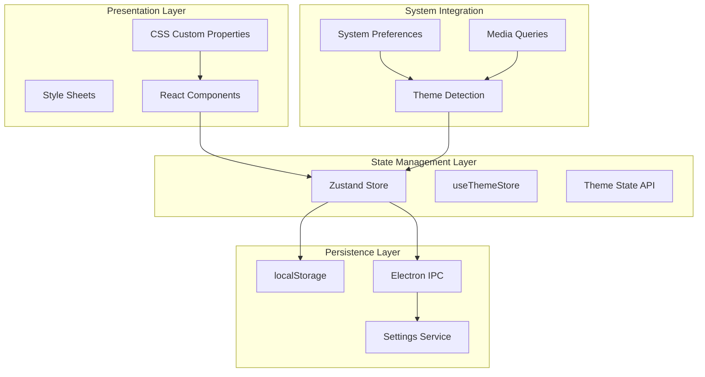
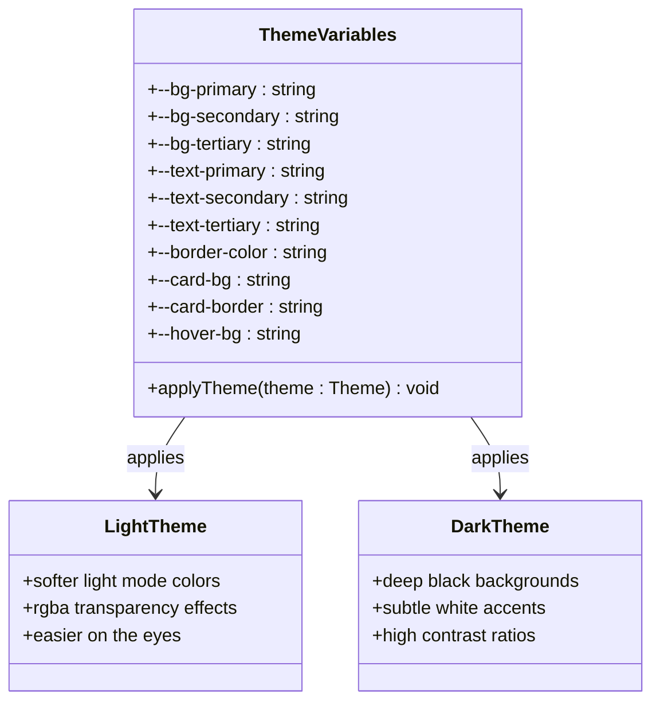
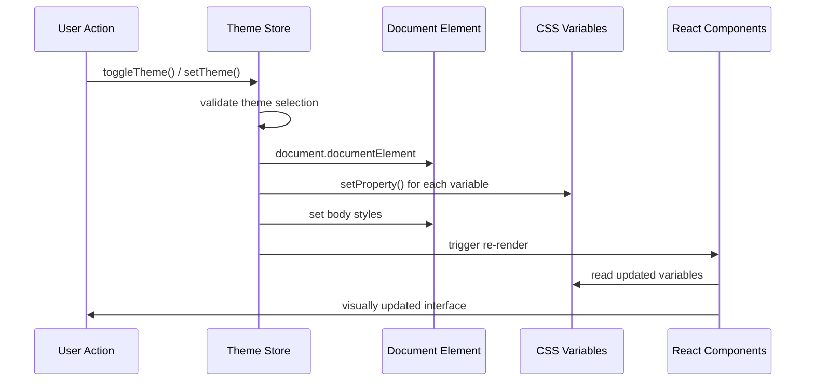
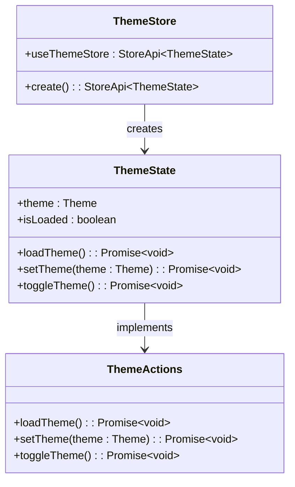
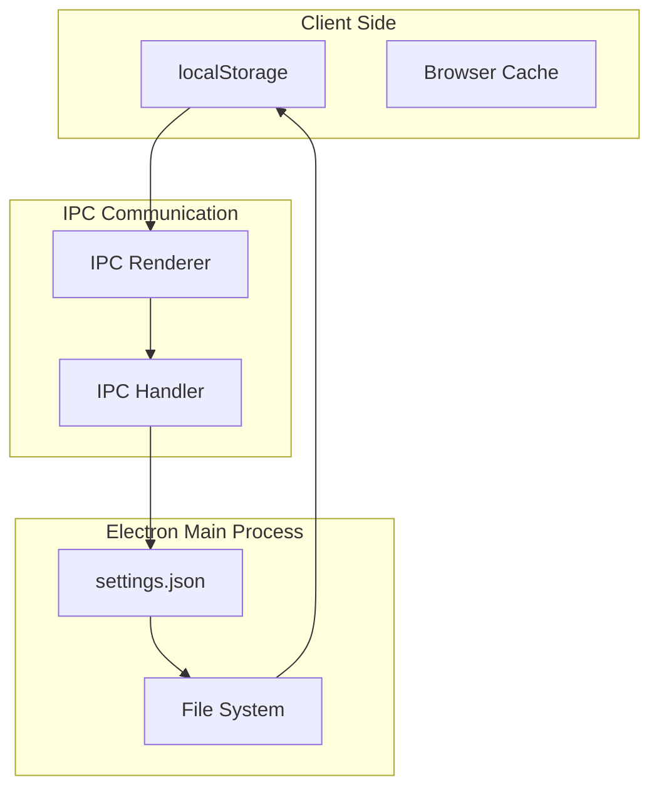
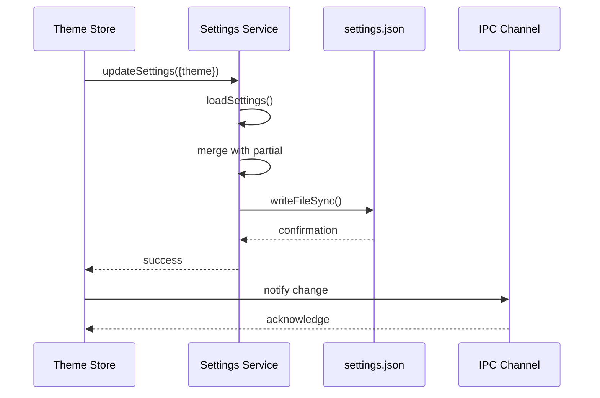
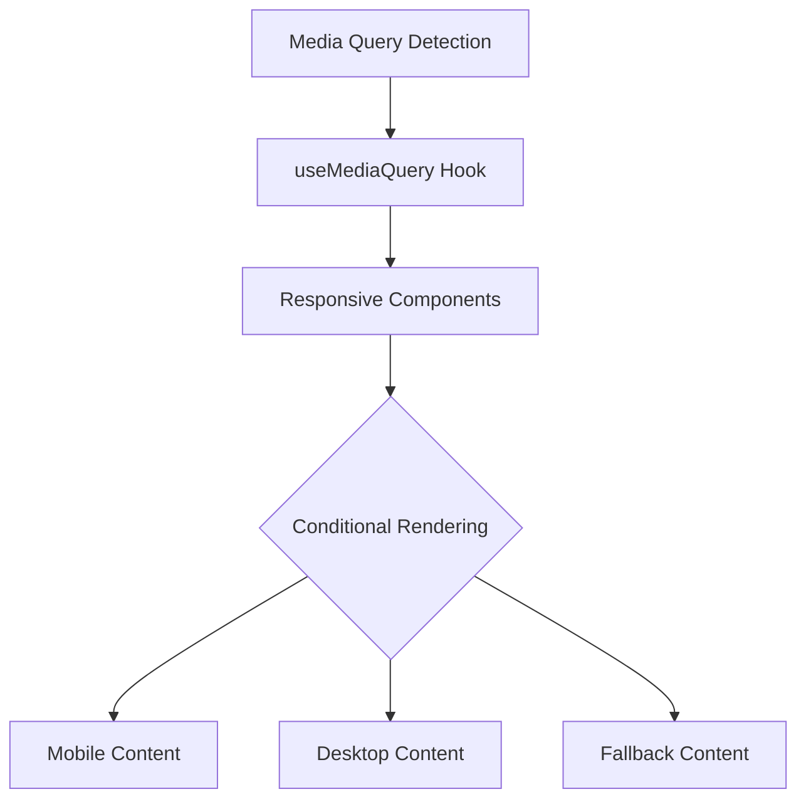

# Theming and Customization

<cite>
**Referenced Files in This Document**
- [src/store/theme.ts](file://src/store/theme.ts)
- [src/renderer/styles.css](file://src/renderer/styles.css)
- [src/renderer/pages/SettingsPage.tsx](file://src/renderer/pages/SettingsPage.tsx)
- [src/services/settings.ts](file://src/services/settings.ts)
- [src/main/ipc/settings.ts](file://src/main/ipc/settings.ts)
- [src/server/controllers/settingsController.ts](file://src/server/controllers/settingsController.ts)
- [configs/vite.config.ts](file://configs/vite.config.ts)
- [AI/UI-CUSTOMIZATION.md](file://AI/UI-CUSTOMIZATION.md)
- [AI/UI-DESIGN.md](file://AI/UI-DESIGN.md)
- [AI/ACCESSIBILITY.md](file://AI/ACCESSIBILITY.md)
</cite>

## Table of Contents
1. [Introduction](#introduction)
2. [Theme System Architecture](#theme-system-architecture)
3. [Dynamic Theme Implementation](#dynamic-theme-implementation)
4. [CSS Custom Properties System](#css-custom-properties-system)
5. [Zustand Store Management](#zustand-store-management)
6. [Persistence and Storage](#persistence-and-storage)
7. [Responsive Design System](#responsive-design-system)
8. [Extending the Theme System](#extending-the-theme-system)
9. [Developer Guidelines](#developer-guidelines)
10. [Troubleshooting](#troubleshooting)

## Introduction

LifeOS implements a sophisticated dynamic theming system that provides seamless light and dark mode experiences with CSS custom properties and state management. The system is built on modern web standards using CSS variables, Zustand for state management, and Electron's IPC for cross-process communication. This comprehensive theming solution ensures consistent visual experiences across all components while maintaining accessibility standards.

The theme system supports runtime switching, automatic system preference detection, and persistent storage through localStorage and Electron's settings service. Developers can easily extend the system with custom colors, typography, and responsive breakpoints while maintaining design consistency.

## Theme System Architecture

The LifeOS theming system follows a layered architecture that separates concerns between presentation, state management, and persistence:



**Diagram sources**
- [src/store/theme.ts](file://src/store/theme.ts#L1-L89)
- [src/services/settings.ts](file://src/services/settings.ts#L1-L46)
- [src/main/ipc/settings.ts](file://src/main/ipc/settings.ts#L1-L28)

**Section sources**
- [src/store/theme.ts](file://src/store/theme.ts#L1-L89)
- [src/services/settings.ts](file://src/services/settings.ts#L1-L46)

## Dynamic Theme Implementation

LifeOS implements a dual-theming approach using CSS custom properties and data attributes for optimal performance and flexibility:

### CSS Custom Property System

The foundation of the theming system uses CSS custom properties (variables) that are dynamically updated based on the selected theme:



**Diagram sources**
- [src/store/theme.ts](file://src/store/theme.ts#L47-L87)

### Theme Application Process

The theme application process involves several steps to ensure consistent styling across the application:



**Diagram sources**
- [src/store/theme.ts](file://src/store/theme.ts#L47-L87)
- [src/renderer/pages/SettingsPage.tsx](file://src/renderer/pages/SettingsPage.tsx#L222-L264)

**Section sources**
- [src/store/theme.ts](file://src/store/theme.ts#L47-L87)
- [src/renderer/pages/SettingsPage.tsx](file://src/renderer/pages/SettingsPage.tsx#L222-L264)

## CSS Custom Properties System

LifeOS implements a comprehensive design token system using CSS custom properties for colors, typography, spacing, and shadows:

### Color System

The color system provides primary and secondary color palettes with semantic variations:

| Color Token | Light Value | Dark Value | Usage |
|-------------|-------------|------------|-------|
| `--bg-primary` | `#f5f5f5` | `#121212` | Main background |
| `--bg-secondary` | `#e8e8e8` | `#1e1e1e` | Card backgrounds |
| `--bg-tertiary` | `#d0d0d0` | `#2a2a2a` | Subtle backgrounds |
| `--text-primary` | `#1a1a1a` | `#ffffff` | Primary text |
| `--text-secondary` | `#4a4a4a` | `#e0e0e0` | Secondary text |
| `--text-tertiary` | `#6a6a6a` | `#b0b0b0` | Tertiary text |

### Typography System

The typography system defines font sizes, line heights, and font families:

| Token | Light Value | Dark Value | Purpose |
|-------|-------------|------------|---------|
| `--text-xs` | `0.75rem` (12px) | Same | Extra small text |
| `--text-sm` | `0.875rem` (14px) | Same | Small text |
| `--text-base` | `1rem` (16px) | Same | Base paragraph |
| `--text-lg` | `1.125rem` (18px) | Same | Large headings |
| `--text-xl` | `1.25rem` (20px) | Same | Extra large headings |

### Spacing System

The spacing system uses a consistent scale for margins, paddings, and gaps:

| Token | Light Value | Dark Value | Pixels |
|-------|-------------|------------|--------|
| `--space-0` | `0` | Same | 0px |
| `--space-1` | `0.25rem` | Same | 4px |
| `--space-2` | `0.5rem` | Same | 8px |
| `--space-4` | `1rem` | Same | 16px |
| `--space-8` | `2rem` | Same | 32px |
| `--space-16` | `4rem` | Same | 64px |

### Shadow System

The shadow system provides depth and hierarchy through carefully crafted drop shadows:

| Token | Light Value | Dark Value | Usage |
|-------|-------------|------------|-------|
| `--shadow-sm` | `0 1px 2px 0 rgb(0 0 0 / 0.05)` | Same | Small cards |
| `--shadow-md` | `0 4px 6px -1px rgb(0 0 0 / 0.1)` | Same | Medium cards |
| `--shadow-lg` | `0 10px 15px -3px rgb(0 0 0 / 0.1)` | Same | Large cards |

**Section sources**
- [AI/UI-CUSTOMIZATION.md](file://AI/UI-CUSTOMIZATION.md#L0-L183)
- [src/store/theme.ts](file://src/store/theme.ts#L47-L87)

## Zustand Store Management

The theme state is managed using Zustand, a minimalistic state management library that provides reactive theme switching capabilities:

### Store Structure



**Diagram sources**
- [src/store/theme.ts](file://src/store/theme.ts#L4-L18)

### State Management Features

The theme store provides several key features for managing theme state:

- **Automatic Loading**: Themes are automatically loaded from persistent storage on application startup
- **Reactive Updates**: Components automatically re-render when the theme changes
- **Error Handling**: Graceful fallback to default themes in case of loading failures
- **Async Operations**: All theme operations are asynchronous to prevent blocking the UI

### Theme Actions

The store exposes three primary actions for theme management:

1. **`loadTheme()`**: Loads the current theme from persistent storage and applies it
2. **`setTheme(theme)`**: Sets a new theme and persists it to storage
3. **`toggleTheme()`**: Switches between light and dark themes

**Section sources**
- [src/store/theme.ts](file://src/store/theme.ts#L1-L89)

## Persistence and Storage

LifeOS implements a multi-layered persistence strategy that combines local storage with Electron's settings service for robust theme persistence:

### Storage Architecture



**Diagram sources**
- [src/services/settings.ts](file://src/services/settings.ts#L1-L46)
- [src/main/ipc/settings.ts](file://src/main/ipc/settings.ts#L1-L28)

### Settings Service Implementation

The settings service provides a clean abstraction for persisting theme preferences:



**Diagram sources**
- [src/services/settings.ts](file://src/services/settings.ts#L35-L46)
- [src/main/ipc/settings.ts](file://src/main/ipc/settings.ts#L15-L27)

### Storage Locations

The theme system stores preferences in multiple locations for reliability:

- **localStorage**: Primary client-side storage for immediate access
- **settings.json**: Persistent storage in Electron's userData directory
- **IPC Channels**: Cross-process communication for real-time updates

**Section sources**
- [src/services/settings.ts](file://src/services/settings.ts#L1-L46)
- [src/main/ipc/settings.ts](file://src/main/ipc/settings.ts#L1-L28)
- [src/server/controllers/settingsController.ts](file://src/server/controllers/settingsController.ts#L1-L52)

## Responsive Design System

LifeOS implements a comprehensive responsive design system with predefined breakpoints and flexible layout components:

### Breakpoint System

The responsive design system uses a mobile-first approach with five breakpoint categories:

| Breakpoint | Width | Usage |
|------------|-------|-------|
| `--breakpoint-sm` | 640px | Small tablets |
| `--breakpoint-md` | 768px | Tablets |
| `--breakpoint-lg` | 1024px | Small desktops |
| `--breakpoint-xl` | 1280px | Large desktops |
| `--breakpoint-2xl` | 1536px | Extra large displays |

### Responsive Utilities

The system provides utility classes and hooks for responsive design:



**Diagram sources**
- [AI/UI-CUSTOMIZATION.md](file://AI/UI-CUSTOMIZATION.md#L524-L604)

### Responsive Patterns

Common responsive design patterns used throughout the application:

- **Mobile-First Approach**: Base styles for mobile, then enhance for larger screens
- **Flexible Grid Systems**: CSS Grid and Flexbox layouts that adapt to screen size
- **Progressive Enhancement**: Basic functionality works everywhere, enhanced features for capable devices
- **Touch-Friendly Interfaces**: Larger touch targets and appropriate spacing for mobile devices

**Section sources**
- [AI/UI-CUSTOMIZATION.md](file://AI/UI-CUSTOMIZATION.md#L524-L604)

## Extending the Theme System

Developers can extend the theme system with custom colors, typography, and design tokens while maintaining consistency:

### Adding Custom Colors

To add custom color tokens:

1. **Define CSS Variables**: Add new color tokens to the root level CSS
2. **Update TypeScript Types**: Extend the ThemeState interface if needed
3. **Provide Fallback Values**: Ensure fallback values for both light and dark themes
4. **Test Accessibility**: Verify contrast ratios meet WCAG guidelines

### Creating Custom Typography

Custom typography can be added by extending the existing font system:

1. **Add Font Sizes**: Define new font size tokens in the CSS
2. **Extend Line Heights**: Add corresponding line height values
3. **Update Typography Scale**: Maintain consistent scaling relationships
4. **Test Readability**: Ensure text remains readable across all themes

### Design Token Guidelines

When extending the theme system, follow these guidelines:

- **Consistent Naming**: Use descriptive, hierarchical naming conventions
- **Semantic Meaning**: Choose names that describe purpose, not appearance
- **Accessibility First**: Always consider color contrast and readability
- **Performance**: Minimize the number of custom properties for optimal rendering
- **Documentation**: Document new tokens and their intended usage

**Section sources**
- [AI/UI-CUSTOMIZATION.md](file://AI/UI-CUSTOMIZATION.md#L0-L183)

## Developer Guidelines

### Best Practices for Theme Development

1. **Use CSS Custom Properties**: Always use CSS variables for themeable properties
2. **Maintain Consistency**: Follow established naming conventions and design patterns
3. **Test Both Themes**: Verify components look good in both light and dark modes
4. **Consider Accessibility**: Ensure sufficient contrast and focus indicators
5. **Optimize Performance**: Minimize theme switching overhead

### Component Integration

When building components with theming:

```typescript
// Example component using theme tokens
const StyledButton = styled.button`
  background: var(--bg-primary);
  color: var(--text-primary);
  border: 1px solid var(--border-color);
  padding: var(--space-2) var(--space-4);
  
  &:hover {
    background: var(--hover-bg);
  }
`;
```

### Theme-aware Hooks

Create custom hooks for theme-dependent functionality:

```typescript
export const useThemeAwareColor = (lightColor: string, darkColor: string) => {
  const theme = useThemeStore(state => state.theme);
  return theme === 'light' ? lightColor : darkColor;
};
```

**Section sources**
- [src/renderer/pages/SettingsPage.tsx](file://src/renderer/pages/SettingsPage.tsx#L222-L264)

## Troubleshooting

### Common Issues and Solutions

#### Theme Not Persisting
- **Cause**: Settings service failing to write to disk
- **Solution**: Check file permissions and userData directory availability
- **Debug**: Verify settings.json file creation in Electron's userData folder

#### Theme Switching Performance
- **Cause**: Excessive DOM manipulation during theme changes
- **Solution**: Use CSS custom properties instead of inline styles
- **Debug**: Profile theme switching performance using browser developer tools

#### Inconsistent Theme Application
- **Cause**: Race conditions between store loading and component rendering
- **Solution**: Implement proper loading states and fallback mechanisms
- **Debug**: Add logging to track theme loading and application timing

#### Accessibility Issues
- **Cause**: Insufficient color contrast in custom themes
- **Solution**: Use accessibility testing tools to verify contrast ratios
- **Debug**: Test with screen readers and color blindness simulators

### Debugging Tools

1. **Browser DevTools**: Inspect CSS custom properties and their values
2. **Electron DevTools**: Debug IPC communication and settings persistence
3. **Console Logging**: Add logging to track theme state changes
4. **Accessibility Audit**: Use automated tools to check theme compliance

**Section sources**
- [src/store/theme.ts](file://src/store/theme.ts#L15-L30)
- [src/services/settings.ts](file://src/services/settings.ts#L25-L35)