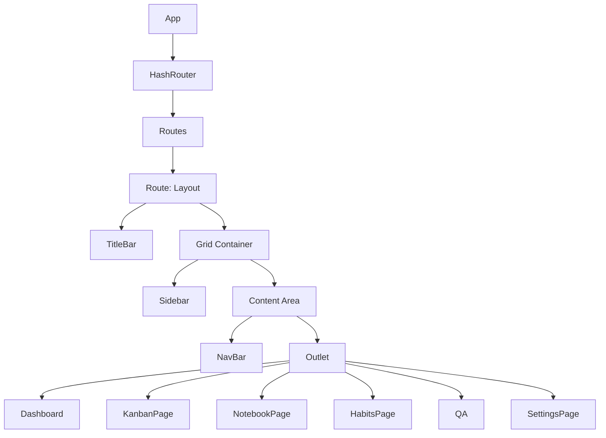
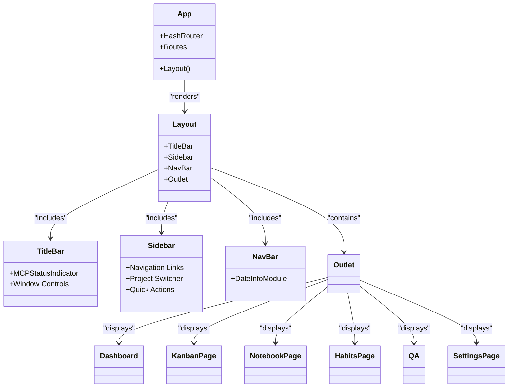
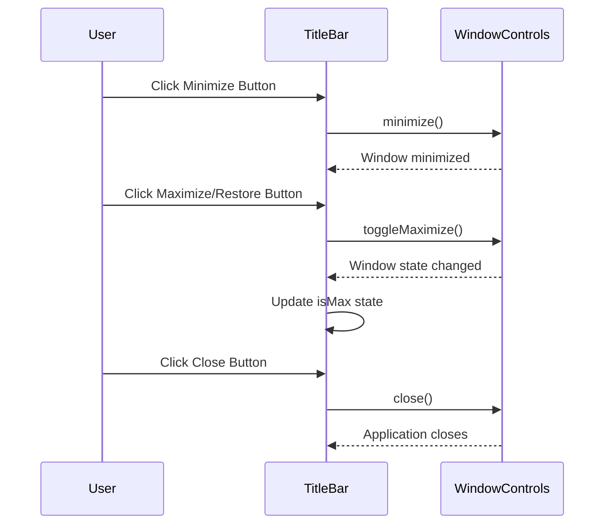
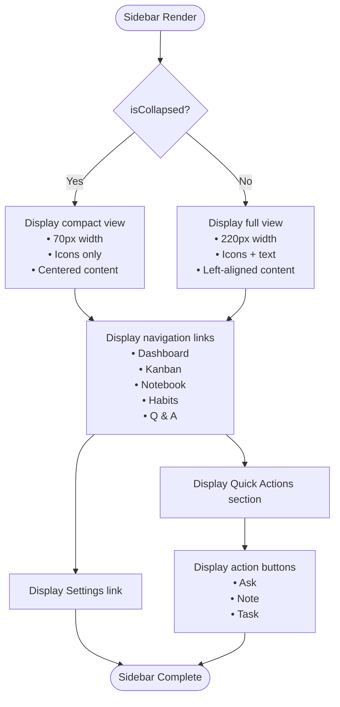
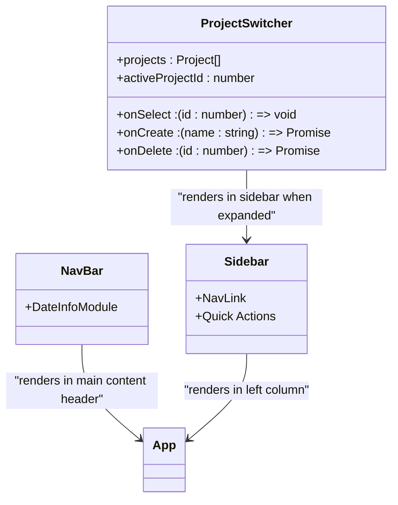
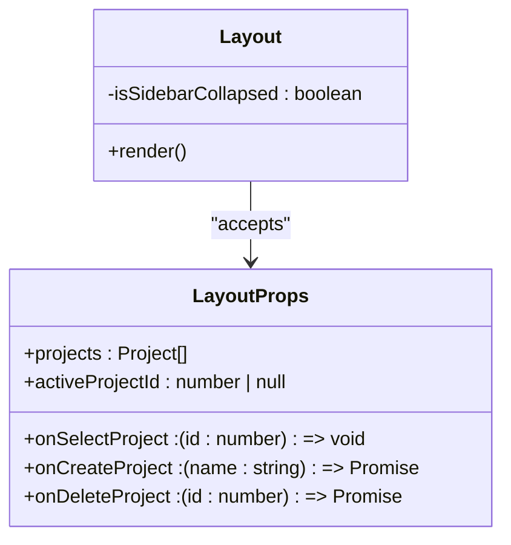
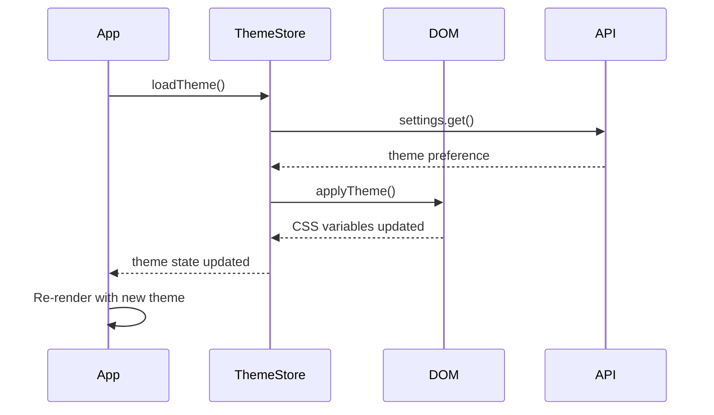
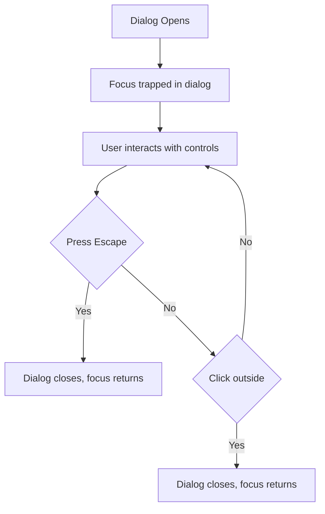
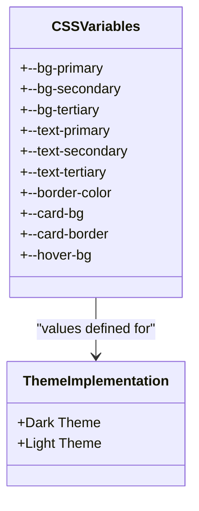
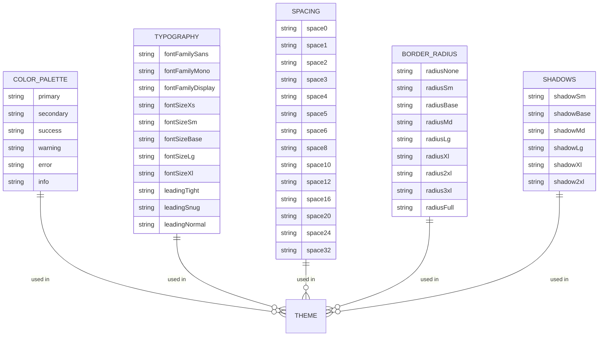

# User Interface

<cite>
**Referenced Files in This Document**   
- [App.tsx](file://src/renderer/App.tsx)
- [TitleBar.tsx](file://src/renderer/components/TitleBar.tsx)
- [Sidebar.tsx](file://src/renderer/components/Sidebar.tsx)
- [NavBar.tsx](file://src/renderer/components/NavBar.tsx)
- [styles.css](file://src/renderer/styles.css)
- [theme.ts](file://src/store/theme.ts)
- [UI-CUSTOMIZATION.md](file://AI/UI-CUSTOMIZATION.md)
- [ACCESSIBILITY.md](file://AI/ACCESSIBILITY.md)
- [TaskCard.tsx](file://src/renderer/components/TaskCard.tsx)
- [TaskDetailPanel.tsx](file://src/renderer/components/TaskDetailPanel.tsx)
- [ConfirmDialog.tsx](file://src/renderer/components/ConfirmDialog.tsx)
- [KanbanPage.tsx](file://src/renderer/pages/KanbanPage.tsx)
- [ProjectSwitcher.tsx](file://src/renderer/components/ProjectSwitcher.tsx)
</cite>

## Table of Contents
1. [Introduction](#introduction)
2. [Component Hierarchy](#component-hierarchy)
3. [Core UI Components](#core-ui-components)
4. [State Management and Props System](#state-management-and-props-system)
5. [Responsive Design and Accessibility](#responsive-design-and-accessibility)
6. [Theming and CSS Variables](#theming-and-css-variables)
7. [Component Usage and Customization](#component-usage-and-customization)
8. [Conclusion](#conclusion)

## Introduction
The LifeOS user interface is built with React and follows a component-based architecture that emphasizes modularity, reusability, and maintainability. The UI system implements a comprehensive design system with consistent styling, responsive layouts, and accessibility features. This document provides a detailed analysis of the React component architecture, focusing on the component hierarchy, props system, state management patterns, and implementation of key UI elements such as the custom titlebar, sidebar, and navigation components.

The application follows a modern Electron-based desktop application structure with React for the frontend, leveraging React Router for navigation and Zustand for state management. The UI components are designed with a focus on user experience, with attention to visual hierarchy, interaction patterns, and performance optimization.

**Section sources**
- [App.tsx](file://src/renderer/App.tsx#L1-L175)

## Component Hierarchy

The LifeOS application follows a well-structured component hierarchy that organizes UI elements from the top-level application container down to individual interactive components. The root component is `App.tsx`, which serves as the entry point and orchestrates the overall layout and routing.

The component hierarchy can be visualized as follows:



The layout structure implements a three-part division: the custom titlebar at the top, followed by a two-column grid layout with the collapsible sidebar on the left and the main content area on the right. The main content area is further divided into the navigation bar at the top and the page content below.

The sidebar component contains navigation links to different application sections, while the navigation bar displays contextual information and controls specific to the current page. This hierarchical structure ensures consistent navigation and layout across all application views while allowing for page-specific content and functionality.



**Diagram sources**
- [App.tsx](file://src/renderer/App.tsx#L1-L175)
- [TitleBar.tsx](file://src/renderer/components/TitleBar.tsx#L1-L62)
- [Sidebar.tsx](file://src/renderer/components/Sidebar.tsx#L1-L194)
- [NavBar.tsx](file://src/renderer/components/NavBar.tsx#L1-L12)

**Section sources**
- [App.tsx](file://src/renderer/App.tsx#L1-L175)
- [TitleBar.tsx](file://src/renderer/components/TitleBar.tsx#L1-L62)
- [Sidebar.tsx](file://src/renderer/components/Sidebar.tsx#L1-L194)
- [NavBar.tsx](file://src/renderer/components/NavBar.tsx#L1-L12)

## Core UI Components

### TitleBar Component
The `TitleBar` component implements a custom window titlebar that replaces the default operating system titlebar in the Electron application. This component provides window control functionality while maintaining the application's visual identity.



The titlebar includes the application logo ("LifeOS"), an MCP status indicator, and standard window control buttons for minimize, maximize/restore, and close. The maximize button dynamically changes its appearance based on the current window state, which is tracked using React's useState and useEffect hooks. The component uses inline styles with CSS properties to ensure consistent appearance across different platforms.

The titlebar also implements the `-webkit-app-region: drag` CSS property, which allows users to drag the window by clicking and dragging on the titlebar area. Interactive elements within the titlebar have `-webkit-app-region: no-drag` to prevent interference with window dragging.

**Section sources**
- [TitleBar.tsx](file://src/renderer/components/TitleBar.tsx#L1-L62)
- [styles.css](file://src/renderer/styles.css#L25-L71)

### Sidebar Component
The `Sidebar` component provides primary navigation and quick access to key application features. It implements a collapsible design that can be toggled between a compact icon-only view and a full-width view with text labels.



The sidebar contains navigation links to all major application sections, with visual feedback for the currently active page. The component uses React Router's NavLink component with custom styling to highlight the active route. When expanded, the sidebar includes a "Quick Actions" section with floating action buttons for frequently used features.

The sidebar's collapsible behavior is controlled by the `isCollapsed` prop and the `onToggle` callback function. The transition between collapsed and expanded states is animated using CSS transitions on the grid template columns property, providing a smooth user experience.

**Section sources**
- [Sidebar.tsx](file://src/renderer/components/Sidebar.tsx#L1-L194)

### Navigation Components
The navigation system in LifeOS consists of two complementary components: the `NavBar` and contextual navigation elements within specific pages.

The `NavBar` component, located just below the main content header, displays time-sensitive information through the `DateInfoModule` component. This creates a consistent header area across all application views while allowing for page-specific navigation controls in the main content area.

For project-based navigation, the `ProjectSwitcher` component provides a dropdown interface for selecting between different projects. This component displays project statistics including task counts, completion rates, and progress indicators, allowing users to quickly assess project status.



The navigation components use consistent styling patterns, including hover effects, focus states, and visual feedback for user interactions. They also implement accessibility features such as proper ARIA labels and keyboard navigation support.

**Section sources**
- [NavBar.tsx](file://src/renderer/components/NavBar.tsx#L1-L12)
- [ProjectSwitcher.tsx](file://src/renderer/components/ProjectSwitcher.tsx#L1-L325)
- [Sidebar.tsx](file://src/renderer/components/Sidebar.tsx#L1-L194)

## State Management and Props System

### Component Props Architecture
The LifeOS UI components follow a well-defined props system that enables flexible composition and reusability. Components are designed with clear prop interfaces that define their inputs and behaviors.

The `Layout` component serves as a prime example of props-based composition, accepting several callback functions and data props:



This props pattern allows the Layout component to remain decoupled from the specific implementation of project management operations while providing the necessary functionality to its child components. The props are passed down from the App component, which manages the application state and API interactions.

### State Management Patterns
LifeOS implements a hybrid state management approach combining React's built-in state hooks with Zustand for global state management. The App component uses useState hooks to manage local UI state such as the sidebar collapse state, while global application state like theme preferences are managed with Zustand stores.

The theme system is implemented in `theme.ts` using Zustand, providing a clean API for theme management:



The store exposes actions for loading, setting, and toggling the theme, which are used throughout the application to provide a consistent theming experience. When the theme changes, the `applyTheme` function updates CSS variables on the document element, which cascade down to all components.

For page-specific state, components use React's useState and useEffect hooks to manage local state and side effects. For example, the KanbanPage component manages task state, selected task state, and UI preference state (like the hideOldCompleted setting) using separate useState calls.

**Section sources**
- [App.tsx](file://src/renderer/App.tsx#L1-L175)
- [theme.ts](file://src/store/theme.ts#L1-L88)
- [KanbanPage.tsx](file://src/renderer/pages/KanbanPage.tsx#L1-L519)

## Responsive Design and Accessibility

### Responsive Design Considerations
While LifeOS is primarily designed as a desktop application, it incorporates responsive design principles to ensure usability across different screen sizes and window configurations.

The layout system uses CSS Grid with flexible column definitions that adapt to the sidebar state:

```css
gridTemplateColumns: isSidebarCollapsed ? '70px 1fr' : '220px 1fr'
```

This approach ensures that the main content area always takes the remaining horizontal space, regardless of the sidebar's width. The application also uses relative units (rem, %) for sizing and spacing, which helps maintain visual consistency across different display resolutions.

For touch interactions, components include appropriate hit areas and visual feedback. The sidebar's toggle button and navigation links have sufficient padding to accommodate touch input, and interactive elements provide hover and active states to indicate interactivity.

### Accessibility Features
LifeOS implements several accessibility features to ensure the application is usable by people with various disabilities:

1. **Keyboard Navigation**: All interactive elements are accessible via keyboard, with proper focus management and logical tab order.

2. **Screen Reader Support**: Interactive elements include appropriate ARIA labels and roles. For example, window control buttons have aria-label attributes describing their function.

3. **Color Contrast**: The application maintains sufficient color contrast (≥ 4.5:1) for text and interactive elements, ensuring readability for users with visual impairments.

4. **Focus Indicators**: Visible focus rings are provided for all interactive controls, making keyboard navigation easier to track.

5. **Reduced Motion Support**: The application respects the `prefers-reduced-motion` media query, reducing or eliminating animations for users who prefer less motion.

6. **Semantic HTML**: The application uses semantic HTML elements where appropriate, such as buttons for interactive elements and proper heading hierarchy.

The ConfirmDialog component exemplifies accessibility best practices, with proper modal dialog patterns, focus trapping, and keyboard interaction:



**Section sources**
- [ACCESSIBILITY.md](file://AI/ACCESSIBILITY.md#L1-L20)
- [UI-CUSTOMIZATION.md](file://AI/UI-CUSTOMIZATION.md#L524-L668)
- [ConfirmDialog.tsx](file://src/renderer/components/ConfirmDialog.tsx#L1-L183)

## Theming and CSS Variables

### CSS Variables System
LifeOS implements a comprehensive theming system using CSS custom properties (variables) that enable dynamic theme switching and visual consistency across the application.

The theme system defines a set of semantic CSS variables that abstract the visual design:



These variables are defined in the theme store and applied to the document root, allowing them to be used throughout the application via the `var()` CSS function. Components reference these semantic variables rather than hardcoded colors, enabling consistent theming and easy theme switching.

The theme system supports both dark and light modes, with the dark theme being the default. The light theme uses softer colors to reduce eye strain during extended use. Theme preferences are persisted in the application settings and loaded on startup.

### Visual Design System
The UI customization documentation reveals a comprehensive design system with well-defined scales for various visual properties:



This systematic approach to design tokens ensures visual consistency across the application and makes it easier to modify the visual design without introducing inconsistencies. The design system follows modern UI principles with adequate spacing, appropriate typography hierarchy, and meaningful visual feedback for user interactions.

**Section sources**
- [theme.ts](file://src/store/theme.ts#L1-L88)
- [UI-CUSTOMIZATION.md](file://AI/UI-CUSTOMIZATION.md#L0-L183)
- [styles.css](file://src/renderer/styles.css#L0-L71)

## Component Usage and Customization

### Practical Component Examples
The LifeOS UI components are designed for flexibility and reusability. Here are practical examples of component usage patterns:

**TaskCard Component**: This component displays individual tasks with title, description, priority indicators, due dates, and tags. It uses inline styles with CSS variables for theming consistency and implements drag-and-drop functionality for task reordering.

**TaskDetailPanel Component**: This component provides a detailed view and editing interface for tasks. It implements a sliding drawer pattern that appears from the right side of the screen, allowing users to edit task properties without leaving the main view.

**ConfirmDialog Component**: This reusable modal dialog component provides a consistent interface for user confirmation. It supports different types (info, danger, warning) with appropriate visual styling and can include custom content via the children prop.

### Customization Options
The UI system provides several customization options:

1. **Theme Switching**: Users can toggle between light and dark themes via the settings page, with the preference persisted across sessions.

2. **Layout Configuration**: The sidebar can be collapsed or expanded based on user preference, optimizing screen space usage.

3. **UI Preferences**: Users can configure UI behaviors such as hiding old completed tasks in the Kanban view.

4. **Project Customization**: Projects can be created, renamed, and deleted, with visual indicators for active projects.

The component architecture supports customization through props, state management, and CSS variables, allowing for both user-facing customization options and developer-level customization for future enhancements.

**Section sources**
- [TaskCard.tsx](file://src/renderer/components/TaskCard.tsx#L1-L181)
- [TaskDetailPanel.tsx](file://src/renderer/components/TaskDetailPanel.tsx#L1-L605)
- [ConfirmDialog.tsx](file://src/renderer/components/ConfirmDialog.tsx#L1-L183)
- [SettingsPage.tsx](file://src/renderer/pages/SettingsPage.tsx#L222-L264)

## Conclusion
The LifeOS user interface demonstrates a well-architected React component system with clear separation of concerns, consistent design patterns, and attention to user experience details. The component hierarchy follows a logical structure that balances reusability with specific functionality needs.

Key strengths of the UI architecture include:
- A consistent design system with comprehensive CSS variables
- Effective state management using React hooks and Zustand
- Accessibility features that support diverse user needs
- Responsive layout considerations for different window sizes
- Reusable components with clear prop interfaces
- Visual feedback and interaction patterns that enhance usability

The architecture provides a solid foundation for future enhancements while maintaining code maintainability and developer productivity. By following established React patterns and implementing a comprehensive design system, the LifeOS UI delivers a cohesive and intuitive user experience.